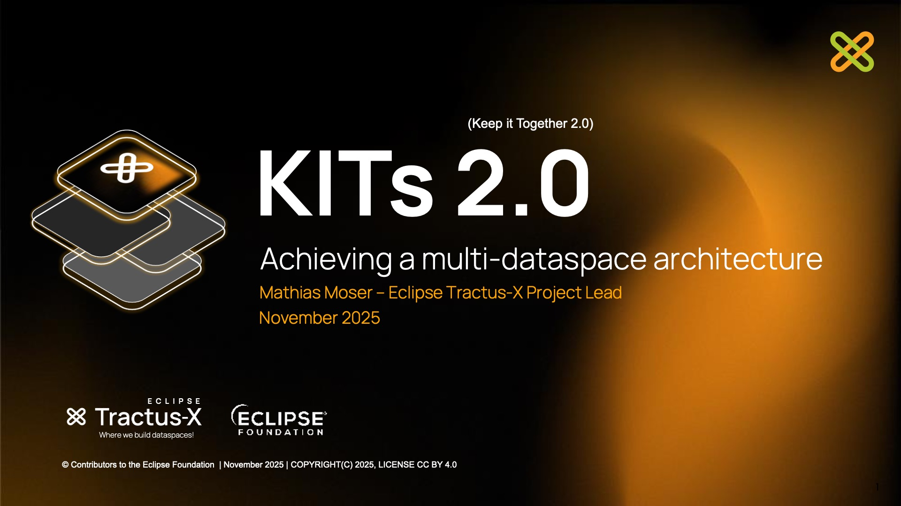

import KitsArchitecture from '@site/src/components/2.0/KitsArchitecture';
import KitArchitectureDiagram from '@site/src/components/2.0/KitArchitectureDiagram';
import { industries } from '@site/data/kitsData.js';
import VpnLockIcon from '@mui/icons-material/VpnLock';
import FoundationIcon from '@mui/icons-material/Foundation';
import PublicIcon from '@mui/icons-material/Public';
import PrecisionManufacturingIcon from '@mui/icons-material/PrecisionManufacturing';
import AllInclusiveIcon from '@mui/icons-material/AllInclusive';
import GradientButton from '@site/src/components/2.0/GradientButton';
import MenuBookIcon from '@mui/icons-material/MenuBook';
import KitVersionComparison from '@site/src/components/2.0/KitVersionComparison';
import AssignmentIcon from '@mui/icons-material/Assignment';
import AssessmentIcon from '@mui/icons-material/Assessment';
import AutorenewIcon from '@mui/icons-material/Autorenew';
import { PieChart, QuarterlyTrends } from '@site/src/components/2.0/KitAnalytics';
import { kitsData } from '@site/data/kitsData.js';
import ThemedImage from '@theme/ThemedImage';
import useBaseUrl from '@docusaurus/useBaseUrl';
import LightbulbIcon from '@mui/icons-material/Lightbulb';
import BuildIcon from '@mui/icons-material/Build';
import SchoolIcon from '@mui/icons-material/School';
import CalendarMonthIcon from '@mui/icons-material/CalendarMonth';
import KitStructureTable from '@site/src/components/2.0/KitComponents/KitStructureTable';
import ArtifactRequirementsTable from '@site/src/components/2.0/ArtifactRequirementsTable';
import { artifactRequirementsData } from '@site/data/kitArtifactRequirementsData';



Hello Tractus-X community,

We are excited to announce the launch of **KIT 2.0 Architecture** - a major redesign of how we visualize and organize our KIT ecosystem. This update brings a fresh perspective to understanding the layered architecture of Eclipse Tractus-X, making it easier than ever to explore and navigate our comprehensive collection of KITs.

## What is a KIT?

<div style={{ textAlign: 'left', margin: '20px 0' }}>
  <ThemedImage
    alt="KIT Framework Overview"
    sources={{
      light: useBaseUrl('/img/kits-2.0/tx-white-kit.svg'),
      dark: useBaseUrl('/img/kits-2.0/tx-black-kit.svg'),
    }}
    style={{ 
      maxWidth: '220px',
      transition: 'transform 0.3s ease',
      cursor: 'pointer'
    }}
    onMouseEnter={(e) => e.currentTarget.style.transform = 'translateY(-10px)'}
    onMouseLeave={(e) => e.currentTarget.style.transform = 'translateY(0)'}
  />
</div>


> **KIT**, short for **Keep It Together**, is an open-source toolbox with comprehensive documentation that enables multiple stakeholders **(Business, Solution Providers, Developers)** to build interoperable applications compatible with the Eclipse Tractus-X dataspace technologies, and support the compliance with industrial standards from standarization organizations (Catena-X e.V., IDTA, ISO/DIN, EDWG, Manufacturing-X, etc.) and in some cases enable regulatory compliance.

A KIT provides everything needed to implement and deploy specific business scenarios within a dataspace environment - from architectural guidance and API specifications to reference implementations and operational procedures. Each KIT serves as a complete, self-contained package that enables developers, operators, and business stakeholders to understand, build, and run solutions that are interoperable across the dataspace network.


## What's New in KIT 2.0 Architecture?

The KIT framework has evolved significantly from version 1.0 to 2.0 to support the growing needs of multiple dataspaces and industries. This transition represents a fundamental shift in how we approach dataspace interoperability - moving from a single-industry focus to enabling multiple industries to leverage the same foundational technologies while maintaining the flexibility to address industry-specific requirements through modular extensions.

<KitVersionComparison />

### Multi Industry Architecture

The new architecture features a beautiful hexagonal layout that visually represents the four main layers of our KIT ecosystem, allowing now KITs to be industry specific:

:::tip 
Click in the architecture components to see a personalized views! Or continue scrolling if you want to know more!
:::

<div style={{ maxWidth: '800px', margin: '0 auto' }}>
  <KitsArchitecture industries={industries} />
</div>

### Modular Reusable Architecture

Here is a detailed explanation of the diagram above, and how this architecture improves reusability:

<KitArchitectureDiagram />

{/* Architecture Layer Descriptions */}

<div style={{ display: 'flex', flexDirection: 'column', gap: '20px', margin: '30px 0' }}>
  <div style={{ display: 'flex', alignItems: 'flex-start', gap: '15px' }}>
    <VpnLockIcon sx={{ fontSize: 40, color: '#404040', marginTop: '5px' }} />
    <div>
      <strong style={{ fontSize: '1.1em', color: '#404040' }}>Dataspace Foundation</strong>
      <div style={{ margin: '8px 0 0 0' }}>
        The network basis for industrial dataspaces, providing core components required for maintaining interoperability. These KITs ensure secure, sovereign data exchange using dataspace technology - exchanging "bytes" without concern for specific data formats.
      </div>
    </div>
  </div>

  <div style={{ display: 'flex', alignItems: 'flex-start', gap: '15px' }}>
    <FoundationIcon sx={{ fontSize: 40, color: '#0070C0', marginTop: '5px' }} />
    <div>
      <strong style={{ fontSize: '1.1em', color: '#0070C0' }}>Industry Core Foundation</strong>
      <div style={{ margin: '8px 0 0 0' }}>
        Common capabilities and standards shared across all use cases within any industry, enabling the new use cases of tomorrow. These KITs define core data models, digital twin concepts, and cross-functional services that enable building multiple use cases while maintaining interoperability and data consistency.
      </div>
    </div>
  </div>

  <div style={{ display: 'flex', alignItems: 'flex-start', gap: '15px' }}>
    <AllInclusiveIcon sx={{ fontSize: 40, color: '#00c853', marginTop: '5px' }} />
    <div>
      <strong style={{ fontSize: '1.1em', color: '#00c853' }}>Cross-Industry Use Cases</strong>
      <div style={{ margin: '8px 0 0 0' }}>
        Business scenarios and challenges applicable across multiple industries. These KITs solve concrete problems related to sustainability, quality, supply chain management, and other horizontal concerns that span industry boundaries.
      </div>
    </div>
  </div>

  <div style={{ display: 'flex', alignItems: 'flex-start', gap: '15px' }}>
    <PrecisionManufacturingIcon sx={{ fontSize: 40, color: '#ff6d00', marginTop: '5px' }} />
    <div>
      <strong style={{ fontSize: '1.1em', color: '#ff6d00' }}>Industry-Specific Use Cases</strong>
      <div style={{ margin: '8px 0 0 0' }}>
        Specialized solutions tailored to unique challenges of particular industries. These include dedicated implementations for Automotive, Shop Floor, Semiconductor, Construction, Chemical, and other vertical domains with industry-specific regulatory requirements and specialized functionality.
      </div>
    </div>
  </div>
</div>

{/* End Architecture Layer Descriptions */}

---

## Standardized KIT Development Process

With KIT 2.0, we've established a comprehensive framework and clear guidelines for creating and maintaining KITs. Our **Tractus-X Release Guidelines (TRGs)** provide a structured approach to KIT development, ensuring consistency, quality, and interoperability across all KITs.

### TRG 10 - Keep it Together (KIT)

The **TRG 10 series** defines the complete lifecycle and requirements for KIT development:

#### Active TRGs (Necessary for the new Webpage Structure)

- **[TRG 10.01 - KIT Architecture](/docs/release/trg-10/trg-10-01)**: Defines the architectural categories and layered classification of KITs within the Eclipse Tractus-X ecosystem
- **[TRG 10.02 - KIT Structure](/docs/release/trg-10/trg-10-02)**: Specifies the required folder structure, documentation organization, and content requirements for each KIT
- **[TRG 10.03 - KIT Lifecycle](/docs/release/trg-10/trg-10-03)**: Outlines the maturity levels (Incubating, Stable, Deprecated) and the progression criteria for KITs

#### Draft TRGs (Coming Soon)

- **[TRG 10.04 - KIT Graduation Process](/docs/release/trg-10/trg-10-04)** *(Draft)*: Details the process for KITs to move from incubating to graduated status
- **[TRG 10.05 - KIT Deprecation Process](/docs/release/trg-10/trg-10-05)** *(Draft)*: Describes the deprecation process for KITs that are no longer maintained or relevant

---

## KIT Master Data - Single Source of Truth

All KIT metadata is centralized in a **single source of truth** - the [KIT Master Data Overview](/documentation/kit-master-data-overview). This comprehensive registry contains:

- **Metadata**: Version numbers, last updated dates, maturity levels, and graduation dates
- **Architecture Classification**: Which layer each KIT belongs to (Dataspace Foundation, Industry Core, etc.)
- **Dataspace Assignments**: Which dataspaces each KIT supports (Catena-X, Manufacturing-X, etc.)
- **Links & Resources**: Routes to documentation, repositories, and related materials
- **Lifecycle Status**: Current state (Incubating, Graduated, Deprecated) and progression history

File Location is at the [`/data`](https://github.com/eclipse-tractusx/eclipse-tractusx.github.io/tree/main/data/kitsData.js) folder:

```
/data/kitsData.js
```

In this way, the development, creation and usage of KITs is streamlined, transparent and easier to maintain.

### KIT Datamodel

There is a metadata datamodel for every KIT defined as follows:

```javascript
{
  id: '<unique-kit-id>',                    // Unique identifier for the KIT
  name: '<KIT NAME IN UPPERCASE>',          // Display name
  logo: <KitLogoComponent>,                 // React SVG component
  logoHeight: <number>,                     // Logo height in pixels
  logoWidth: <number>,                      // Logo width in pixels
  route: '<route-to-kit-adoption-view>',    // Path to KIT documentation
  colors: {
    primary: '<hex-color>',                 // Primary brand color
    gradient: 'linear-gradient(...)'        // CSS gradient definition
  },
  maturity: {
    currentLevel: '<level>',                // 'Sandbox' | 'Incubating' | 'Graduated'
    graduationStatus: '<status>',           // 'draft' | 'in progress' | 'in review' (for Incubating only)
    graduatedAt: '<YYYY-MM-DD>',           // Date when graduated (only if Graduated)
    deprecatedAt: '<YYYY-MM-DD>'           // Date when deprecated (only if deprecated)
  },
  deprecated: <boolean>,                    // true | false
  domain: '<domain-category>',              // e.g., 'Sustainability', 'Engineering', 'Supply Chain'
  industries: ['<industry-id>', ...],       // Array of industry IDs (optional for foundation KITs)
  description: '<kit-description>',         // Short description of the KIT
  metadata: {
    created: '<YYYY-MM-DD>',               // Creation date
    lastUpdated: '<YYYY-MM-DD>',           // Last update date
    latestVersion: '<version>',            // Current version (semantic versioning)
    new: <boolean>                         // true if recently added
  }
}
```

Additionally, there is a Datamodel for Industries and for Dataspaces defined in a similar manner, more information can be found clicking on the button below!

<div style={{ display: 'flex', justifyContent: 'left', gap: '12px', margin: '30px 0', flexWrap: 'wrap' }}>
  <GradientButton 
    href="/documentation/kit-master-data-overview"
    text="View KIT Master Data"
    icon={AssignmentIcon}
    gradient="linear-gradient(135deg, #f093fb 0%, #f5576c 100%)"
    shadowColor="rgba(240, 147, 251, 0.3)"
    shadowColorHover="rgba(240, 147, 251, 0.5)"
  />
</div>


## KIT Statistics - Insights into the KIT Ecosystem

Thanks to the master data, now we can also provide detailed **KIT Statistics** that give insights into the current state of the KIT ecosystem:

### Key Statistics Preview

export const allKits = [
  ...kitsData.dataspaceFoundation,
  ...kitsData.industryCoreFoundation,
  ...kitsData.useCases,
  ...Object.values(kitsData.industryKits).flat()
];
export const totalKits = allKits.length;
export const graduatedKits = allKits.filter(kit => kit.maturity?.currentLevel === 'Graduated' && !kit.deprecated).length;
export const incubatingKits = allKits.filter(kit => kit.maturity?.currentLevel === 'Incubating' && !kit.deprecated).length;
export const sandboxKits = allKits.filter(kit => kit.maturity?.currentLevel === 'Sandbox' && !kit.deprecated).length;
export const deprecatedKits = allKits.filter(kit => kit.deprecated).length;

<div style={{ display: 'grid', gridTemplateColumns: 'repeat(auto-fit, minmax(120px, 1fr))', gap: '16px', margin: '30px 0' }}>
  <div style={{ textAlign: 'center', padding: '20px', backgroundColor: 'var(--ifm-color-emphasis-100)', borderRadius: '12px', border: '1px solid var(--ifm-color-emphasis-300)' }}>
    <div style={{ fontSize: '32px', fontWeight: 'bold', color: '#667eea' }}>{totalKits}</div>
    <div style={{ fontSize: '14px', color: 'var(--ifm-color-content-secondary)', marginTop: '4px' }}>Total KITs</div>
  </div>
  <div style={{ textAlign: 'center', padding: '20px', backgroundColor: 'var(--ifm-color-emphasis-100)', borderRadius: '12px', border: '1px solid var(--ifm-color-emphasis-300)' }}>
    <div style={{ fontSize: '32px', fontWeight: 'bold', color: '#8b5cf6' }}>{graduatedKits}</div>
    <div style={{ fontSize: '14px', color: 'var(--ifm-color-content-secondary)', marginTop: '4px' }}>Graduated</div>
  </div>
  <div style={{ textAlign: 'center', padding: '20px', backgroundColor: 'var(--ifm-color-emphasis-100)', borderRadius: '12px', border: '1px solid var(--ifm-color-emphasis-300)' }}>
    <div style={{ fontSize: '32px', fontWeight: 'bold', color: '#10b981' }}>{incubatingKits}</div>
    <div style={{ fontSize: '14px', color: 'var(--ifm-color-content-secondary)', marginTop: '4px' }}>Incubating</div>
  </div>
  <div style={{ textAlign: 'center', padding: '20px', backgroundColor: 'var(--ifm-color-emphasis-100)', borderRadius: '12px', border: '1px solid var(--ifm-color-emphasis-300)' }}>
    <div style={{ fontSize: '32px', fontWeight: 'bold', color: '#3b82f6' }}>{sandboxKits}</div>
    <div style={{ fontSize: '14px', color: 'var(--ifm-color-content-secondary)', marginTop: '4px' }}>Sandbox</div>
  </div>
  <div style={{ textAlign: 'center', padding: '20px', backgroundColor: 'var(--ifm-color-emphasis-100)', borderRadius: '12px', border: '1px solid var(--ifm-color-emphasis-300)' }}>
    <div style={{ fontSize: '32px', fontWeight: 'bold', color: '#ef4444' }}>{deprecatedKits}</div>
    <div style={{ fontSize: '14px', color: 'var(--ifm-color-content-secondary)', marginTop: '4px' }}>Deprecated</div>
  </div>
</div>


### Architecture Distribution & Growth Trends

export const architectureData = [
  { label: 'Dataspace Foundation', value: kitsData.dataspaceFoundation.length, color: '#404040' },
  { label: 'Industry Core', value: kitsData.industryCoreFoundation.length, color: '#0070C0' },
  { label: 'Cross-Industry', value: kitsData.useCases.length, color: '#00c853' },
  { label: 'Industry-Specific', value: Object.values(kitsData.industryKits).flat().length, color: '#ff6d00' }
];

<div style={{ 
  display: 'grid', 
  gridTemplateColumns: 'repeat(auto-fit, minmax(300px, 1fr))', 
  gap: '20px', 
  margin: '30px 0' 
}}>
  <PieChart data={architectureData} title="KITs by Architecture Layer" />
</div>
 <QuarterlyTrends />

Thanks to this we can now monitor the growth and evolution of the KIT ecosystem over time, providing valuable insights into adoption trends and areas of focus. And knowing how is the state of life from the KITs evolving during each release.

<div style={{ display: 'flex', justifyContent: 'left', gap: '12px', margin: '30px 0', flexWrap: 'wrap' }}>
  <GradientButton 
    href="/documentation/kit-statistics"
    text="View Full Statistics"
    icon={AssessmentIcon}
    gradient="linear-gradient(135deg, #667eea 0%, #764ba2 100%)"
    shadowColor="rgba(102, 126, 234, 0.3)"
    shadowColorHover="rgba(102, 126, 234, 0.5)"
  />
</div>

---

## KIT 2.0 Content Structure and Artifacts

Now it is defined a clear structure for the content and the views

<KitStructureTable />
:::info Generic Requirements for All KITs
In addition to the view-specific content above, every KIT must include:
- **Copyright Notice** - Mandatory CC-BY-4.0 licensing information and contributor copyright statements at every file
- **Changelog** - Version history file following [semantic versioning](https://semver.org/)
::: 
And depending from what is available a KIT will position itself in one or another lifecycle level:

## KIT Lifecycle

Understanding the KIT lifecycle is crucial for contributors and users alike. Each KIT in the Tractus-X ecosystem follows a structured maturity progression that ensures quality, completeness, and real-world validation before reaching production readiness.

<div style={{ textAlign: 'center', margin: '40px 0' }}>
  <ThemedImage
    alt="KIT Lifecycle Diagram"
    sources={{
      light: useBaseUrl('/img/kits-2.0/tx-kit-lifecycle-white.svg'),
      dark: useBaseUrl('/img/kits-2.0/tx-kit-lifecycle.svg'),
    }}
    style={{
      width: '100%',
      maxWidth: '600px',
      height: 'auto'
    }}
  />
</div>

### The Three Maturity Levels

KITs progress through three distinct lifecycle stages, each with specific requirements and validation criteria:

{/* Maturity Level Cards */}

<div style={{ display: 'flex', alignItems: 'flex-start', gap: '15px', margin: '30px 0' }}>
  <LightbulbIcon sx={{ fontSize: 40, color: '#f59e0b', marginTop: '5px' }} />
  <div>
    <h4 style={{ margin: '0 0 8px 0', color: '#f59e0b' }}>Sandbox Level</h4>
    <div style={{ margin: '8px 0' }}>
      The <strong>Sandbox</strong> level is the entry point for new KIT ideas. At this stage, the focus is on establishing a clear vision, mission, and business value proposition. This level serves as a preview of potential business innovation and allows for community feedback and validation.
    </div>
    <div style={{ margin: '8px 0', fontSize: '14px' }}><strong>Key Characteristics:</strong></div>
    <ul style={{ margin: '4px 0', paddingLeft: '20px', fontSize: '14px' }}>
      <li>Conceptual phase with defined vision and scope</li>
      <li>Community interest validation</li>
      <li>Basic problem definition and domain identification</li>
      <li>Foundation for future development</li>
      <li>No strict standards mandatory, just a clear business vision</li>
    </ul>
  </div>
</div>

<div style={{ display: 'flex', alignItems: 'flex-start', gap: '15px', margin: '30px 0' }}>
  <BuildIcon sx={{ fontSize: 40, color: '#10b981', marginTop: '5px' }} />
  <div>
    <h4 style={{ margin: '0 0 8px 0', color: '#10b981' }}>Incubating Level</h4>
    <div style={{ margin: '8px 0' }}>
      <strong>Incubating</strong> represents the active development phase where KITs evolve from concept to functional implementation. This level includes <strong>three distinct sub-states</strong> that provide clear progression milestones:
    </div>
    <ul style={{ margin: '8px 0', paddingLeft: '20px', fontSize: '14px' }}>
      <li><strong>Draft</strong>: Initial development and structure setup, basic artifact creation</li>
      <li><strong>In Progress</strong>: Active implementation, full artifact development, and testing</li>
      <li><strong>In Review</strong>: Quality assurance, peer review, and compliance checking</li>
    </ul>
    <div style={{ margin: '8px 0', fontSize: '14px' }}>
      During incubation, KITs must complete all mandatory artifacts, including comprehensive documentation, API specifications, reference implementations, and test cases.
    </div>
  </div>
</div>

<div style={{ display: 'flex', alignItems: 'flex-start', gap: '15px', margin: '30px 0' }}>
  <SchoolIcon sx={{ fontSize: 40, color: '#8b5cf6', marginTop: '5px' }} />
  <div>
    <h4 style={{ margin: '0 0 8px 0', color: '#8b5cf6' }}>Graduated Level</h4>
    <div style={{ margin: '8px 0' }}>
      <strong>Graduated</strong> is the highest maturity level, indicating that the KIT has passed comprehensive testing, expert validation, and real-world case studies. These KITs are production-ready and have demonstrated business value through community adoption.
    </div>
    <div style={{ margin: '8px 0', fontSize: '14px' }}><strong>Requirements for Graduation:</strong></div>
    <ul style={{ margin: '4px 0', paddingLeft: '20px', fontSize: '14px' }}>
      <li>All mandatory artifacts completed and validated</li>
      <li>Successful case study with community partner</li>
      <li>Expert testing and approval completed</li>
      <li>Proven business value and clear technical implementation</li>
      <li>Assigned code owner for ongoing maintenance</li>
    </ul>
  </div>
</div>

{/* End Maturity Level Cards */}

### Lifecycle Management

All lifecycle transitions are tracked in the [KIT Master Data](/documentation/kit-master-data-overview) and validated according to the [TRG 10.03 - KIT Lifecycle](/docs/release/trg-10/trg-10-03) guidelines. This ensures transparency and consistency across the entire KIT ecosystem.

### Artifact Requirements by Maturity Level

Each maturity level has specific artifact requirements that must be fulfilled for a KIT to progress. The table below shows the comprehensive list of required artifacts for each lifecycle stage:

<ArtifactRequirementsTable data={artifactRequirementsData} />

<div style={{ display: 'flex', justifyContent: 'left', gap: '12px', margin: '30px 0', flexWrap: 'wrap' }}>
  <GradientButton 
    href="/documentation/kit-lifecycle"
    text="Explore KIT Lifecycle Details"
    icon={AutorenewIcon}
    gradient="linear-gradient(135deg, #f093fb 0%, #f5576c 100%)"
    shadowColor="rgba(240, 147, 251, 0.3)"
    shadowColorHover="rgba(240, 147, 251, 0.5)"
  />
</div>


## KIT Template

<div style={{ textAlign: 'left', margin: '20px 0' }}>
  <ThemedImage
    alt="KIT Framework Overview"
    sources={{
      light: useBaseUrl('/img/kits-2.0/tx-assembly-kit.svg'),
      dark: useBaseUrl('/img/kits-2.0/tx-assembly-kit.svg'),
    }}
    style={{ 
      maxWidth: '200px',
      transition: 'transform 0.3s ease',
      cursor: 'pointer'
    }}
    onMouseEnter={(e) => e.currentTarget.style.transform = 'translateY(-10px)'}
    onMouseLeave={(e) => e.currentTarget.style.transform = 'translateY(0)'}
  />
</div>

Follow the KIT template to have an example of folder structure that can be followed following the [KIT Framework Guide](/documentation/kit-framework) and the needed content for each view in order to achieve all requirements from the [KIT Lifecycle](/documentation/kit-lifecycle).

<div style={{ display: 'flex', gap: '12px', justifyContent: 'left', marginTop: '20px', marginBottom: '20px', flexWrap: 'wrap' }}>
  <GradientButton 
    href="https://github.com/eclipse-tractusx/eclipse-tractusx.github.io/tree/main/docs-kits/kit-template"
    text="View KIT Template"
    icon={MenuBookIcon}
    gradient="linear-gradient(135deg, #667eea 0%, #764ba2 100%)"
    shadowColor="rgba(102, 126, 234, 0.3)"
    shadowColorHover="rgba(102, 126, 234, 0.4)"
    external={true}
  />
</div>

---

## KIT Office Hours - Get Expert Support

Need help developing your KIT or have questions about the KIT framework? Join our **KIT Office Hours** - a dedicated time for the community to get direct support from the KIT development team.

### What are KIT Office Hours?

KIT Office Hours are regular community sessions where you can:

- **Get guidance** on KIT development and lifecycle progression
- **Ask questions** about TRG compliance and best practices
- **Discuss** your KIT architecture and implementation approach
- **Receive feedback** on your KIT graduation readiness
- **Connect** with other KIT developers and maintainers

### How to Participate

Office hours are held regularly and open to all community members. Whether you're just starting with KIT development or preparing for graduation review, the team is here to help.

:::tip Join the Conversation
Every Thursday from 09:30 - 10:00 GMT+1

Check the Eclipse Tractus-X Community Calendar for upcoming KIT Office Hours sessions and join us!
:::

<div style={{ display: 'flex', justifyContent: 'left', gap: '12px', margin: '20px 0', flexWrap: 'wrap' }}>
  <GradientButton 
    href="https://eclipse-tractusx.github.io/community/open-meetings/#Eclipse%20Tractus-X%20KITs%20Community%20Office%20Hour"
    text="Join the Communnity KIT Office Hours"
    icon={CalendarMonthIcon}
    gradient="linear-gradient(135deg, #4facfe 0%, #0061feff 100%)"
    shadowColor="rgba(79, 172, 254, 0.3)"
    shadowColorHover="rgba(79, 172, 254, 0.5)"
    external={true}
  />
</div>

---

## Learn More

Want to dive deeper into the KIT framework? Explore our comprehensive documentation to understand the complete structure, artifacts, and requirements for building your own KITs.

<div style={{ display: 'flex', justifyContent: 'left', margin: '30px 0' }}>
  <GradientButton 
    href="/documentation/kit-framework"
    text="Explore KIT Framework Documentation"
    icon={MenuBookIcon}
    gradient="linear-gradient(135deg, #667eea 0%, #764ba2 100%)"
    shadowColor="rgba(102, 126, 234, 0.3)"
    shadowColorHover="rgba(102, 126, 234, 0.5)"
  />
</div>

---

*All KITs are licensed under the non-code [CC-BY-4.0](https://github.com/eclipse-tractusx/eclipse-tractusx.github.io/blob/main/LICENSE_non-code) License.*

*All industry logos and trademarks are property of their respective organizations.*
