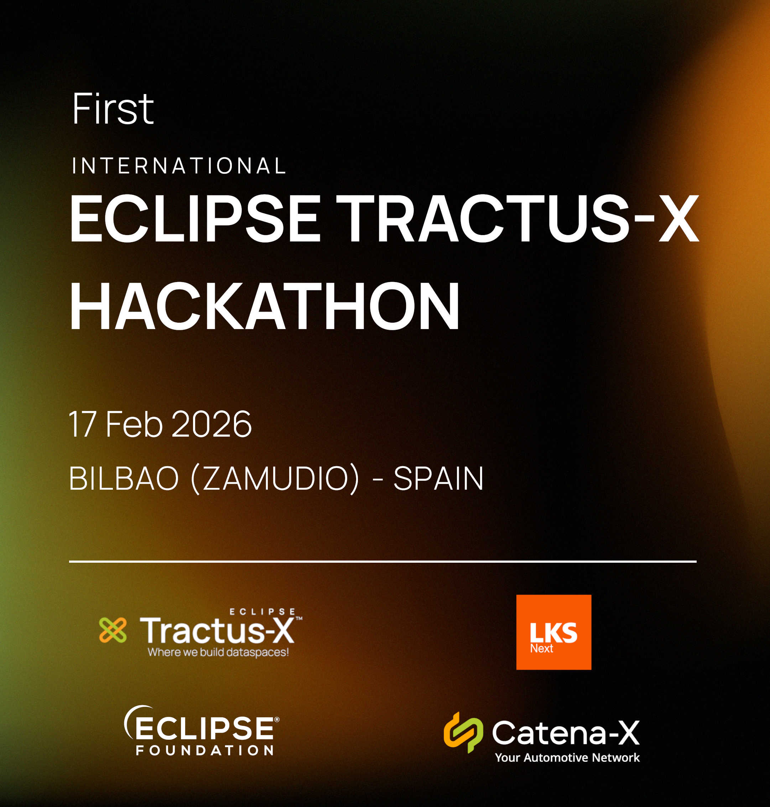
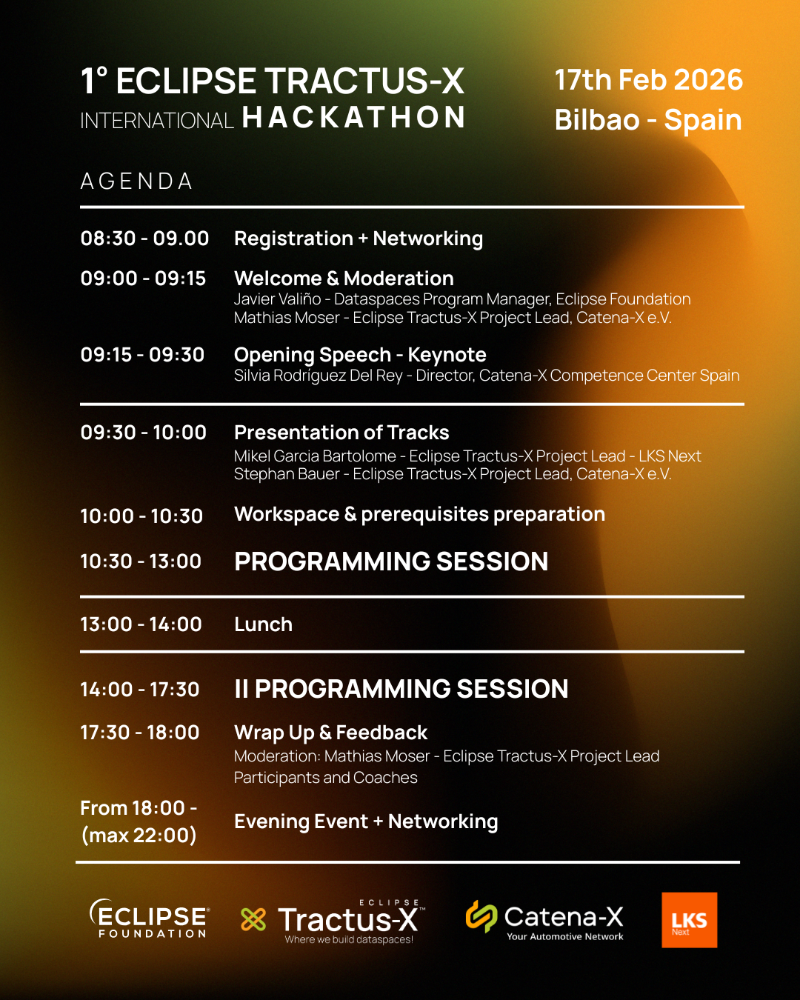

Hi Everyone 👋,

Let's have the **first international Open Source Hackathon of Eclipse Tractus-X ever!** 🌍🚀 And in Spain! 🇪🇸

<!--truncate-->

## Event Details

- **💸 Cost:** FREE 🆓
- **📅 Date:** 17th of February 2026
- **📍 Location:** Bilbao/Zamudio (near the airport) - Spain
  *[Hotel Seminario Aeropuerto Bilbao](https://maps.app.goo.gl/Mq8neBWmYzSy8Qsg8)*
- **⏰ Duration:** Full Day Event

## 🔗 Registration

**[Register Here](https://forms.office.com/e/LkYbasfXJA)** 📋✍🏻

## 📅 Agenda

### ‼️ IMPORTANT

- **Please reserve this date if you're willing to come!** 🗓️
- **Already look for hotels** (suggestions below)
- This is a **"WORKING/DEVELOPING" hands-on event** — send this to your developers!
- It is meant to be **technical** and we will be solving two challenges together
- This is **NOT a "business oriented"** event
- **SO BRING YOUR LAPTOPS!** 💻 And lots of motivation to code and learn! You can use your favorite IDE (we recommend visual studio code!)

## 📢 Official Communications

An official agenda and formal communication will be shared soon via:

- 📧 [Tractus-X Mailing List](https://accounts.eclipse.org/mailing-list/tractusx-dev)
- 🔗 [Eclipse Foundation LinkedIn](https://es.linkedin.com/company/eclipse-foundation)
- 📰 [TX News Blog](https://eclipse-tractusx.github.io/blog)

Keep tuned for the latest updates!

## 🧩 Hackathon Challenges

We will be offering challenges to support our community goals for the next Tractus-X release in March (26.03).

### 🔐 Main Challenge: Tractus-X Identity Hub Wallet

Further develop the Tractus-X Identity Hub Wallet and integrate it into the TX Umbrella.

**This will allow us to:**

- ✅ Eliminate the need for a mocked wallet in the umbrella (by having a real open-source wallet)
- 🔄 Offer an end-to-end exchange scenario for developing better applications
- 🌐 Enhance decentralization within the Tractus-X open-source dataspace technologies

**🔗 Repositories:**

- [Identity Hub](https://github.com/eclipse-tractusx/tractusx-identityhub)
- [Umbrella](https://github.com/eclipse-tractusx/tractus-x-umbrella)

### 🏭 Secondary Challenge: Industry Core Hub Add-On

*(If time permits or with many participants)*

Integrate the PCF use case (or another add-on) into the Industry Core Hub.

**🎯 Goal:**
Enable another add-on in the Industry Core Hub and learn:

- How the IC-Hub can serve as a base for multiple use cases
- How to develop your own add-on module

**🔗 Repository:**

- [Industry Core Hub](https://github.com/eclipse-tractusx/industry-core-hub)

## 🏨 Hotel Suggestions

The location is next to the airport, near Bilbao at a "Technological Center". Depending on whether you want to visit Bilbao or not, you can choose from different accommodations.

### Next to the Event Area (near the airport)

- [Hotel Seminario Aeropuerto Bilbao](https://maps.app.goo.gl/Mq8neBWmYzSy8Qsg8) -> The event will be there
- [Hotel Aretxarte](https://maps.app.goo.gl/bWenpcMTfDZQNAfD9)

### In Bilbao

- **Recommended:** [NH Collection Villa de Bilbao](https://maps.app.goo.gl/w4tiZVnzGZCfSCoj9)
  *(Some of us will be accommodated there and we could organize to go together from there to the event area)*

**Other good hotels in Bilbao** (depending on your budget):

- Hotel Meliá Bilbao
- Hotel Catalonia Gran Via de Bilbao
- Hotel ILUNION Bilbao

## 📥 Event Resources

Download resources from the hackathon event:

**[Hackathon Resources](https://github.com/eclipse-tractusx/eclipse-tractusx.github.io.largefiles/tree/main/events/hackathons/2026/feb-17)** 📂

## 🤝 Hosting & Support

Our new Project Lead **Mikel Garcia** (from LKS Next) has volunteered to host the event at their offices in the Bilbao area 🏢.

We at the **Catena-X Association** are very happy to see the Eclipse Tractus-X community growing worldwide 🌎 and will be there to support these technical challenges.

And also we as project leads are happy to support and bring our community forward globally! As our main goal for 2026 as announced at our last community days in December!

---

**Let's build dataspaces!** 🚀
