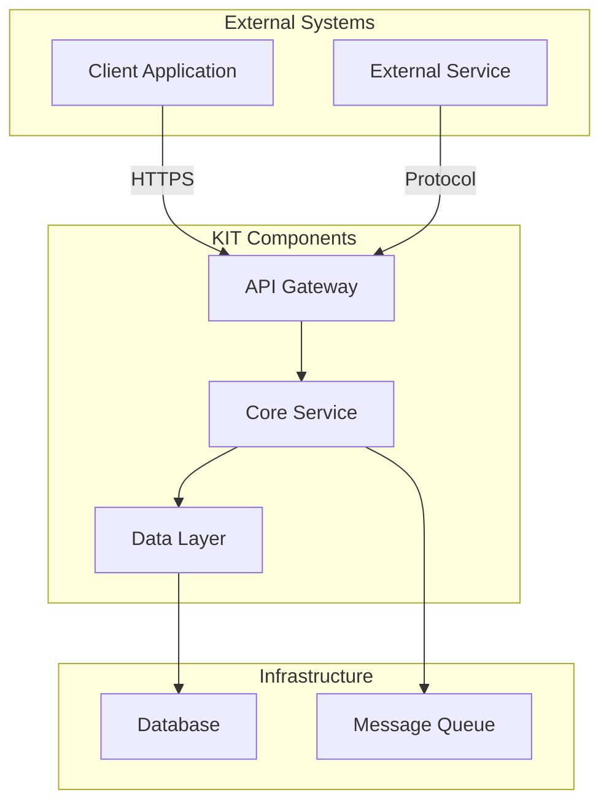

<!--
 ********************************************************************************* 
 * Copyright (c) 2025 Contributors to the Eclipse Foundation
 * 
 * See the NOTICE file(s) distributed with this work for additional
 * information regarding copyright ownership.
 * 
 * This program and the accompanying materials are made available under the
 * terms of the Apache License, Version 2.0 which is available at
 * https://www.apache.org/licenses/LICENSE-2.0.
 * 
 * Unless required by applicable law or agreed to in writing, software
 * distributed under the License is distributed on an "AS IS" BASIS, WITHOUT
 * WARRANTIES OR CONDITIONS OF ANY KIND, either express or implied. See the
 * License for the specific language governing permissions and limitations
 * under the License.
 * 
 * SPDX-License-Identifier: Apache-2.0
 ********************************************************************************/
-->

## Architecture View

## Architecture Overview

### System Architecture

[High-level architecture diagram and explanation]

### Architecture Principles

1. **Modularity**: Loosely coupled components
2. **Scalability**: Horizontal scaling support
3. **Security**: End-to-end encryption
4. **Interoperability**: Standards-based APIs
5. **Observability**: Built-in monitoring and logging

## NOTICE

This work is licensed under the [CC-BY-4.0](https://creativecommons.org/licenses/by/4.0/legalcode).

- SPDX-License-Identifier: CC-BY-4.0
- SPDX-FileCopyrightText: [YYYY] [YOUR_COMPANY]
- SPDX-FileCopyrightText: [YYYY] Contributors to the Eclipse Foundation
- Source URL: [https://github.com/eclipse-tractusx/eclipse-tractusx.github.io](https://github.com/eclipse-tractusx/eclipse-tractusx.github.io)