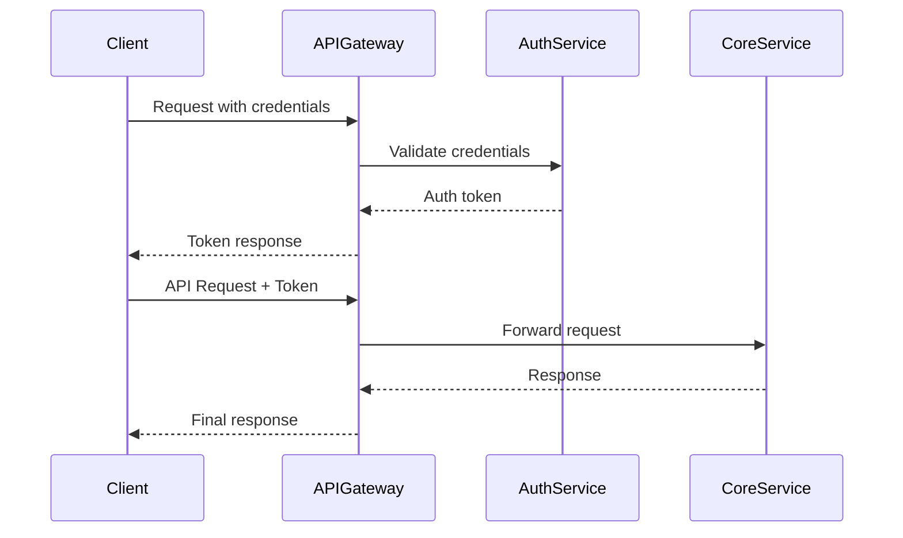
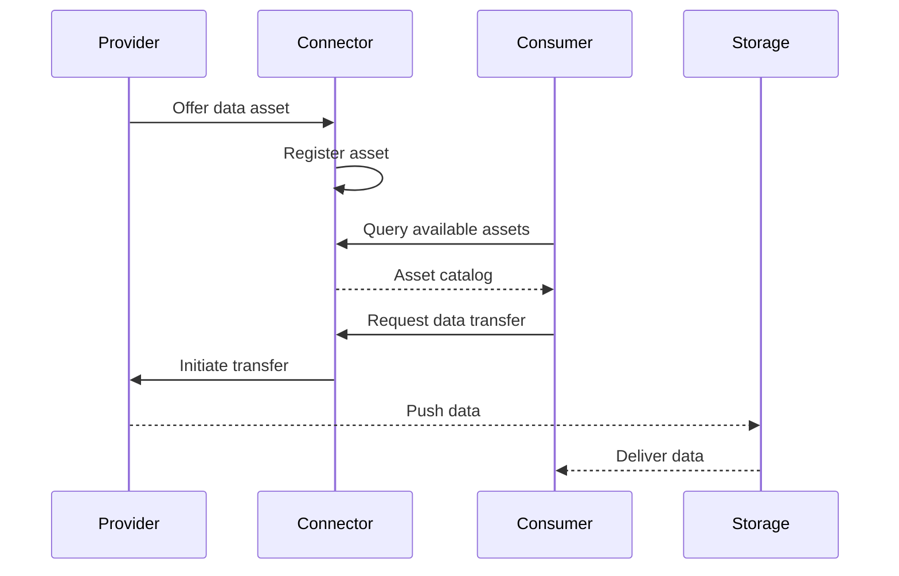

<!--
 ********************************************************************************* 
 * Copyright (c) 2025 Contributors to the Eclipse Foundation
 * 
 * See the NOTICE file(s) distributed with this work for additional
 * information regarding copyright ownership.
 * 
 * This program and the accompanying materials are made available under the
 * terms of the Apache License, Version 2.0 which is available at
 * https://www.apache.org/licenses/LICENSE-2.0.
 * 
 * Unless required by applicable law or agreed to in writing, software
 * distributed under the License is distributed on an "AS IS" BASIS, WITHOUT
 * WARRANTIES OR CONDITIONS OF ANY KIND, either express or implied. See the
 * License for the specific language governing permissions and limitations
 * under the License.
 * 
 * SPDX-License-Identifier: Apache-2.0
 ********************************************************************************/
-->

## Development View


Technical documentation for developers, architects, and implementers.

:::info Target Audience
Software Developers, Solution Architects, Technical Leads, API Developers, Integration Engineers.
:::

---

### More Guides

[LINK TO THE OTHER FILES IN THIS VIEW IN CASE THERE ARE MORE]

- [Architecture Overview](architecture.md)

### Core Components

#### Component 1: [Component Name]

**Purpose**: [Component description]

**Technology Stack**: [Programming language, framework, key dependencies]

**Interfaces**: [Input, output, protocols]

#### Component 2: [Component Name]

[Same structure as Component 1]

---

## Sequence Diagrams

### Authentication Flow



[Brief flow description]

### Data Exchange Flow



[Brief flow description]

---

## API Specifications

### API Overview

[List of main APIs with purpose]

### Base URL

```
https://api.example.com/v1
```

### Authentication

[Authentication method: OAuth 2.0 | API Keys | JWT]

```http
Authorization: Bearer <your-access-token>
```

### API Endpoints

#### GET /resources

**Description**: Retrieve resources

**Request**:

```http
GET /v1/resources HTTP/1.1
Host: api.example.com
Authorization: Bearer <token>
```

**Response** (200 OK):

```json
{
  "resources": [
    {
      "id": "resource-1",
      "name": "Example Resource",
      "type": "data-asset"
    }
  ]
}
```

#### POST /resources

**Description**: Create a resource

**Request**:

```http
POST /v1/resources HTTP/1.1
Host: api.example.com
Authorization: Bearer <token>
Content-Type: application/json

{
  "name": "New Resource",
  "type": "data-asset"
}
```

**Response** (201 Created):

```json
{
  "id": "resource-123",
  "name": "New Resource",
  "type": "data-asset"
}
```

### OpenAPI Specification

[Link to OpenAPI specification and Swagger UI]

---

## Standards Compliance

| Standard | Version | Compliance | Description |
|----------|---------|------------|-------------|
| [Standard 1] | X.Y | Mandatory | [Description] |
| [Standard 2] | X.Y | Optional | [Description] |

### Standard Details

#### [Standard Name]

**Compliance Level**: [Mandatory | Optional | Recommended]

**Implementation**: [Brief description]

**Reference**: [Link]

---

## Logic & Schema

### Business Logic

[Core business logic description]

#### Logic Flow: [Process Name]

**Input**: [Required data]

**Processing Steps**: [Brief description of steps]

**Output**: [Produced data]

### Data Schema

#### Schema: [Schema Name]

**Purpose**: [Schema description]

```json
{
  "$schema": "http://json-schema.org/draft-07/schema#",
  "type": "object",
  "properties": {
    "id": {
      "type": "string",
      "description": "Unique identifier"
    },
    "name": {
      "type": "string",
      "description": "Resource name"
    }
  },
  "required": ["id", "name"]
}
```

**Example**:

```json
{
  "id": "res-001",
  "name": "Example Resource"
}
```

---

## Semantic Models

### Model: [Model Name]

**Version**: X.Y.Z

**Namespace**: `urn:samm:org.eclipse.tractusx.[domain]:[version]#`

**Description**: [Model description]

**Key Properties**:

| Property | Type | Required | Description |
|----------|------|----------|-------------|
| `property1` | string | Yes | [Description] |
| `property2` | integer | No | [Description] |

**Example**:

```json
{
  "@context": {
    "@vocab": "urn:samm:org.eclipse.tractusx.[domain]:[version]#"
  },
  "property1": "value1",
  "property2": 42
}
```

**Reference**: [Link to SAMM specification]

---

## Test Cases

### Test Strategy

- **Unit Tests**: Component-level testing
- **Integration Tests**: API integration testing
- **End-to-End Tests**: Complete workflow testing

### Test Case: [Test Name]

**Objective**: [Test validation purpose]

**Preconditions**: [Required setup]

**Test Steps**: [Brief description]

**Expected Outcome**: [Expected result]

---

## Sample Data

### Sample Dataset: [Dataset Name]

**Purpose**: [Sample purpose]

**Format**: JSON

**Download**: [Link]

**Example**:

```json
{
  "sampleData": [
    {
      "id": "sample-001",
      "field1": "value1"
    }
  ]
}
```

---

## Developer Tutorials

### Quick Start

**Prerequisites**: [List prerequisites]

**Steps**:

1. Clone repository:

```bash
git clone https://github.com/eclipse-tractusx/[repository-name].git
```

2. Configure `application.properties`:

```properties
server.port=8080
api.base-url=https://api.example.com
```

3. Build and run:

```bash
mvn clean install
mvn spring-boot:run
```

4. Verify:

```bash
curl http://localhost:8080/health
```

---

## Integration Examples

### Integration with [System Name]

**Java Example**:

```java
public class KitIntegration {
    private final KitClient client;
    
    public KitIntegration(String apiUrl, String apiKey) {
        this.client = new KitClient(apiUrl, apiKey);
    }
    
    public Resource getResource(String resourceId) {
        return client.resources().get(resourceId);
    }
}
```

**Python Example**:

```python
from kit_sdk import KitClient

client = KitClient(api_url="https://api.example.com", api_key="your-key")
resource = client.resources.get("resource-id")
```

---

## Additional Resources

### Reference Implementations

- [Implementation 1]: [Link]
- [Implementation 2]: [Link]

### SDKs and Libraries

| Language | SDK | Link |
|----------|-----|------|
| Java | [SDK Name] | [Link] |
| Python | [SDK Name] | [Link] |

### Developer Tools

- [Postman Collection](https://github.com/eclipse-tractusx/eclipse-tractusx.github.io/tree/main/docs-kits/kit-template/resources/postman-collection.json)
- [OpenAPI Generator](https://openapi-generator.tech/)

---


## NOTICE

This work is licensed under the [CC-BY-4.0](https://creativecommons.org/licenses/by/4.0/legalcode).

- SPDX-License-Identifier: CC-BY-4.0
- SPDX-FileCopyrightText: [YYYY] [YOUR_COMPANY]
- SPDX-FileCopyrightText: [YYYY] Contributors to the Eclipse Foundation
- Source URL: [https://github.com/eclipse-tractusx/eclipse-tractusx.github.io](https://github.com/eclipse-tractusx/eclipse-tractusx.github.io)
