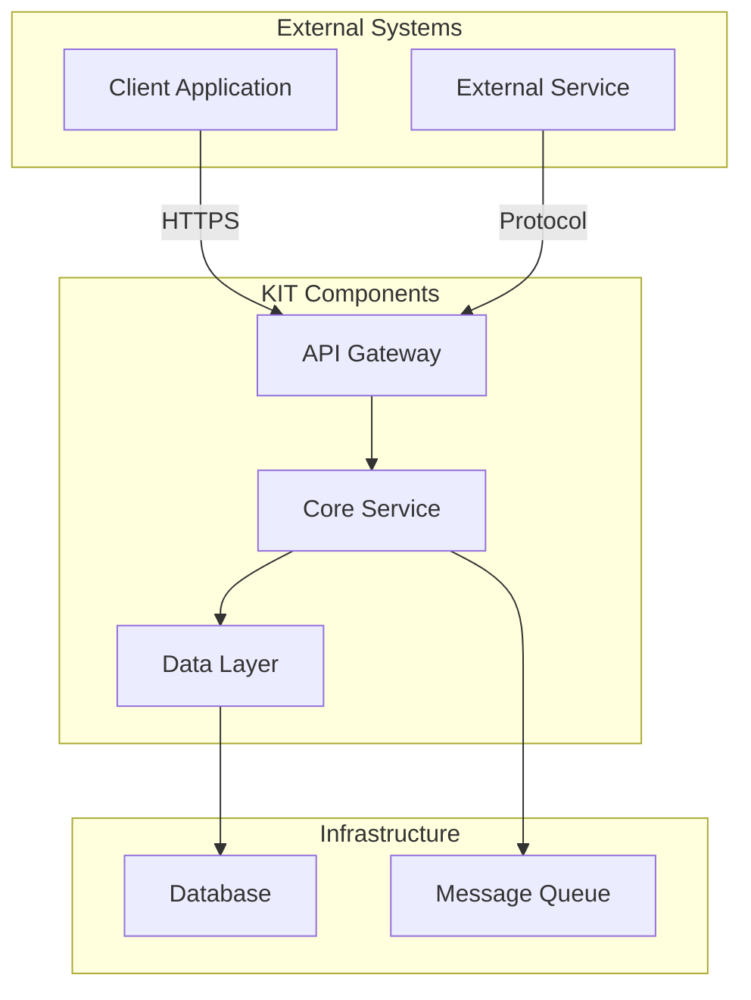

<!--
Copyright(c) 2026 Contributors to the Eclipse Foundation

See the NOTICE file(s) distributed with this work for additional
information regarding copyright ownership.

This work is made available under the terms of the
Creative Commons Attribution 4.0 International (CC-BY-4.0) license,
which is available at
https://creativecommons.org/licenses/by/4.0/legalcode.

SPDX-License-Identifier: CC-BY-4.0
-->

<!-- 
KIT LOGO START - Generated automatically from the configuration done in Kit Master Data
Replace <kit-id> with the id from your kit referenced in `data/kitsData.js`.
Do not remove!
This logo is only visible when compiled with Docusarus (final version of the hosted KIT)
-->

import Kit3DLogo from '@site/src/components/2.0/Kit3DLogo';

<Kit3DLogo kitId="<kit-id>" />

<!--
KIT LOGO END
-->

## Architecture View

## Architecture Overview

### System Architecture

[High-level architecture diagram and explanation]

### Architecture Principles

1. **Modularity**: Loosely coupled components
2. **Scalability**: Horizontal scaling support
3. **Security**: End-to-end encryption
4. **Interoperability**: Standards-based APIs
5. **Observability**: Built-in monitoring and logging

## NOTICE

This work is licensed under the [CC-BY-4.0](https://creativecommons.org/licenses/by/4.0/legalcode).

- SPDX-License-Identifier: CC-BY-4.0
- SPDX-FileCopyrightText: [YYYY] [YOUR_COMPANY]
- SPDX-FileCopyrightText: [YYYY] Contributors to the Eclipse Foundation
- Source URL: [https://github.com/eclipse-tractusx/eclipse-tractusx.github.io](https://github.com/eclipse-tractusx/eclipse-tractusx.github.io)