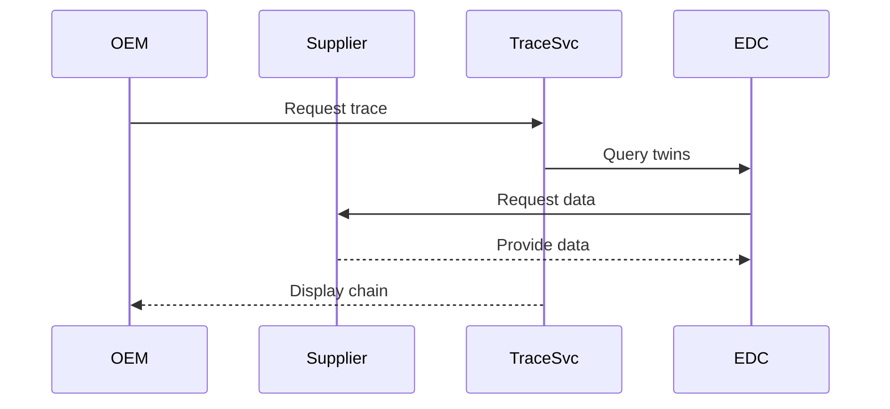

<!--
 ********************************************************************************* 
 * Copyright (c) 2025 Contributors to the Eclipse Foundation
 * 
 * See the NOTICE file(s) distributed with this work for additional
 * information regarding copyright ownership.
 * 
 * This program and the accompanying materials are made available under the
 * terms of the Apache License, Version 2.0 which is available at
 * https://www.apache.org/licenses/LICENSE-2.0.
 * 
 * Unless required by applicable law or agreed to in writing, software
 * distributed under the License is distributed on an "AS IS" BASIS, WITHOUT
 * WARRANTIES OR CONDITIONS OF ANY KIND, either express or implied. See the
 * License for the specific language governing permissions and limitations
 * under the License.
 * 
 * SPDX-License-Identifier: Apache-2.0
 ********************************************************************************/
-->

## Shop-Floor Industry Extension


## Overview

This extension adapts the **[KIT_NAME] KIT** for shop-floor operations and manufacturing environments.

:::info Extension Purpose
Adds: Manufacturing-X standards, shop-floor semantic models, MES processes, and real-time data exchange.
:::

---

## Manufacturing-X Standards

| Standard | Version | Description | Compliance |
|----------|---------|-------------|------------|
| OPC UA | Part 1-23 | Industrial Automation | Mandatory |
| MQTT | 5.0 | Messaging Protocol | Recommended |
| AAS | 3.0 | Asset Digital Twins | Mandatory |
| SAMM | 2.1.0 | Semantic Meta Model | Mandatory |
| Manufacturing-X | 1.0 | Dataspace Connectivity | Mandatory |

[OPC Foundation](https://opcfoundation.org/) | [IDTA](https://industrialdigitaltwin.org/)

---

## Semantic Models

### Production Order

**Version**: 1.0.0

**Aspect Model**: `urn:samm:io.manufacturingx.production_order:1.0.0#ProductionOrder`

**Key Attributes**: `orderId`, `orderType`, `productIdentifier`, `quantity`, `scheduledTime`, `status`, `assignedResources`

**Example**:

```json
{
  "orderId": "PO-2025-11-21-001234",
  "orderType": "STANDARD",
  "productIdentifier": {
    "productId": "PART-A-12345",
    "productName": "Gear Housing Assembly"
  },
  "quantity": {
    "planned": 500,
    "produced": 342,
    "unit": "pieces"
  },
  "status": "IN_PROGRESS",
  "assignedResources": [
    {"resourceType": "MACHINE", "resourceId": "CNC-MILL-03"}
  ]
}
```

### Machine State

**Version**: 1.0.0

**Aspect Model**: `urn:samm:io.manufacturingx.machine_state:1.0.0#MachineState`

**Key Attributes**: `machineId`, `machineType`, `operationalStatus`, `performance`, `alarms`, `maintenance`, `timestamp`

**Example**:

```json
{
  "machineId": "CNC-MILL-03",
  "machineType": "5-Axis CNC Milling Center",
  "operationalStatus": "PRODUCING",
  "performance": {
    "oee": 78.5,
    "availability": 92.3,
    "quality": 95.5
  },
  "alarms": [
    {"severity": "WARNING", "type": "TOOL_WEAR", "message": "Tool #5 approaching wear limit"}
  ],
  "timestamp": "2025-11-21T12:00:00Z"
}
```

---

## Business Processes

### Production Traceability

**Purpose**: End-to-end traceability of manufactured parts

**Actors**: OEM, Suppliers, Traceability Service

**Process Flow**:



---

## Access & Usage Policies

### Manufacturing-X Framework Policy

```json
{
  "@context": {"odrl": "http://www.w3.org/ns/odrl/2/"},
  "@type": "PolicyDefinitionRequestDto",
  "@id": "mx-policy",
  "policy": {
    "@type": "Policy",
    "odrl:permission": [{
      "odrl:action": "USE",
      "odrl:constraint": {
        "odrl:leftOperand": "DataspaceParticipant",
        "odrl:operator": {"@id": "odrl:eq"},
        "odrl:rightOperand": "did:web:example.com"
      }
    }]
  }
}
```

---

## Use Cases

### Quality Alert Distribution

**Description**: Rapidly distribute quality alerts

**Actors**: Alert Issuer, Supply Chain Partners, Manufacturing-X Services

**Process**: Detection → Alert creation → Query → Distribution → Acknowledgment

**Benefits**: Faster response, reduced costs, improved safety

---

## Compliance

| Regulation | Region | Relevance |
|------------|--------|----------|
| GDPR | EU | Data protection |
| ISO 9001 | Global | Quality management |

**Certifications**: ISO/TS 16949, VDA 6.3

---

## Getting Started

1. Review [Core KIT Adoption View](../../adoption-view/adoption-view.md)
2. Study [Manufacturing-X Standards](https://manufacturing-x.com/)
3. Implement semantic models
4. Follow [Operations View](../../operations-view/operations-view.md)
5. Join Manufacturing-X Community

---

## Resources

- [Manufacturing-X](https://manufacturing-x.com/)
- [Tractus-X Open Source](https://eclipse-tractusx.github.io/)

## NOTICE

This work is licensed under the [CC-BY-4.0](https://creativecommons.org/licenses/by/4.0/legalcode).

- SPDX-License-Identifier: CC-BY-4.0
- SPDX-FileCopyrightText: [YYYY] [YOUR_COMPANY]
- SPDX-FileCopyrightText: [YYYY] Contributors to the Eclipse Foundation
- Source URL: [https://github.com/eclipse-tractusx/eclipse-tractusx.github.io](https://github.com/eclipse-tractusx/eclipse-tractusx.github.io)
