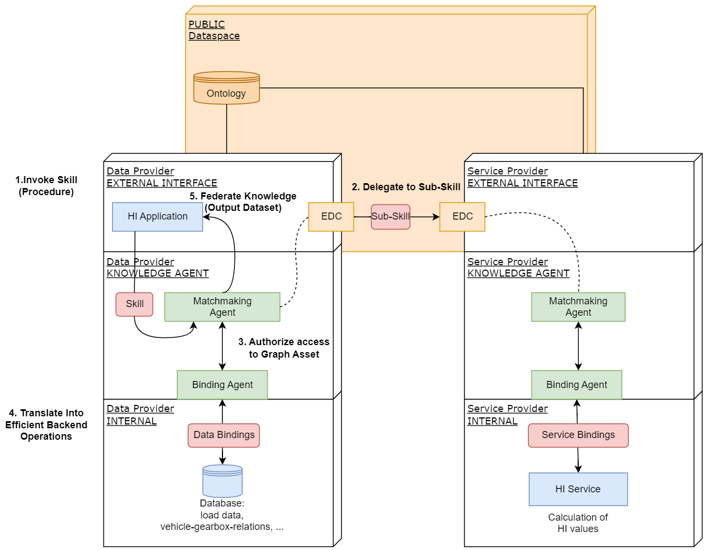
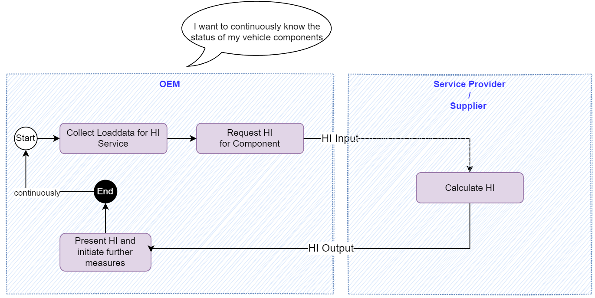

### Health Indicator Kit
<!--
Adoption View of the Kit.
-->

## Vision & Mission

### Vision

Health monitoring of products and components is highly attractive. It offers significant added value for OEMs and suppliers and is already often part of the product range or product inquiry.

The Behaviour *Health Indicator* Kit (BT HI Kit) efficiently supports the planning, design, construction, use and operation of product-related services for health monitoring as part of quality management.

Based on the calculation of health indicators, the performance and condition of products and components in the field can be continuously monitored, recorded and transmitted along the supply chain. During the usage phase, abnormalities, possible defects or failures are reliably and identified early on, so that measures can be taken in good time.

### Mission

The Behaviour *Health Indicator* Kit (BT HI Kit)  comes with the necessary Catena-X standards for health indicators and HI statements. Interoperable solutions are created on their basis. The Kit includes tools for easy implementation of component-specific health indicators and for their determination based on dynamic input data. All components are easily adaptable to specific applications and simplify the journey to the finished service.

### Customer Journey

With the *Health Indicator* Kit, we support the Catena-X customer journey for our adopters and solutions providers.

## Business Value

Through the standardized specifications described in the BT HI Kit  – for example the semantic models and APIs – OEMs and TIER-X as data and service provider can reduce investment and implementation costs. Catena-X infrastructure and technology offers easy scalability regarding vehicle components and supply chain.

## Use Case

- OEM, TIER-X: During the usage phase, health indicators provide a continuous and comprehensive view of the condition of products in the field. Abnormalities, possible defects or failures can be detected reliably and early on. This provides the time advantage to initiate countermeasures in good time.
During development phase, health indicators can be used to bring more mature products into series production.

- Tier-X: The overall product range becomes more attractive in the offer phase, when the definition of health indicators as a product-related service is included.

- Workshops: In case of failure analysis and repair, workshops benefit from an extended range of data on vehicle condition and its components. In return, service providers can standardize and facilitate access to the OEM.

### Status Quo

Within company boundaries, the calculation of health indicators based on internally available data and models is already state of the art. However, across company boundaries, there are only individual, complex and not generally available options for component-specific transfer or monitoring of health indicators.

### Today’s challenge

For successful implementation, the following challenges must be addressed:

- the correct allocation of health indicators to the respective component
- recording and providing the necessary input variables
- easy to interpret results
- secure data transfer along the supply chain
- easy scalability across company boundaries

### Benefits

**OEMs and big suppliers** benefit from an increase in quality and shorter response times to anomalies in the field. The decisive hub is created by the standardized provision of health indicators across company boundaries — always in compliance with IP and data protection.

## Logic & Schema

### Building Block View

The architecture image describes the interaction between the HI Service and the Knowledge Agent components.

### HI Components

|Subsystem| Description                                                                                                                                                                                         |
|---------|-----------------------------------------------------------------------------------------------------------------------------------------------------------------------------------------------------|
|HI Application| This component is the app that is hosted at the Consumer/Data Provider. The data provider can select multiple vehicle identifier numbers (VIN) and gets back calculated HI values.                  |
|Loading Data | A data source at the Data Provider that provides the loading data and other vehicle data that are needed for the HI calculation.   It can be accessed by the knowledge agent via data bindings. |
|HI Service| A HI calculation service at the Service Provider. It accepts input data from the Data Provider, calculates the HI value and returns it.                                                             |

### Knowledge Agent components

|Subsystem| Description                                                                                                                                                                                                                                                                                                                                                                                                                                                                                                                                                                                     |
|---------|-------------------------------------------------------------------------------------------------------------------------------------------------------------------------------------------------------------------------------------------------------------------------------------------------------------------------------------------------------------------------------------------------------------------------------------------------------------------------------------------------------------------------------------------------------------------------------------------------|
|Matchmaking Agent| This component supports SparQL to traverse the federated data space as a large data structure. It interacts with the EDC. <UL><LI>The provider's Matchmaking Agent will be activated by its EDC. Therefore, the EDC must offer a Graph Asset (variant of ordinary data assets in the Catena-X EDC standard).</LI><LI> The consumer's Matchmaking Agent interacts with its EDC to negotiate and perform the transfer of Sub-Skills to other dataspace participants.</LI></UL> The Matchmaking Agents are matching the (sub)graphs and negotiate appropriated graph assets with the partner EDCs. |
|Binding Agent| The Binding Agent is a restricted version of the Matchmaking Agent (subset of OWL/SparQL, e.g., without federation) which is just focused on translating Sub-Skills of a particular business domain (Bill-Of-Material, Chemical Materials, Production Sites, etc.)  into proper SQL- or REST based backend system calls.   Implementation details: For data bindings, OnTop is used. For service bindings, RDF4J is used.                                                                                                                                                                  |
|Ontology| The ontology is a formal representation of knowledge that captures concepts, relationships, and properties. It allows a shared understanding and reasoning about the respective domain.   It must be hosted in a way that all participants can access it. Currently, the ontology is hosted at GitHub.                                                                                                                                                                                                                                                                                      |
|Skill/Sub-Skill| The Skill describes, what to do (which data have to be connected, transferred and so on).                                                                                                                                                                                                                                                                                                                                                                                                                                                                                                      |

### Catena-X Core Services (except Knowledge Agent components)

|Subsystem|Description|
|---------|-----------|
|Eclipse Dataspace Components (EDC)|The Connector of the Eclipse Dataspace Components provides a framework for sovereign, inter-organizational data exchange. It implements the International Data Spaces standard (IDS) as well as relevant protocols associated with GAIA-X. The connector is designed in an extensible way in order to support alternative protocols and integrate in various ecosystems.|

## Business Process

|Role|Description|
|---------|-----------|
|User @ OEM|Wants to continuously monitor the status of several vehicle's component.|
|OEM|Needs to collect or generate load/input data for the HI calculation from vehicle or backend.|
|Supplier|Acts here as a service provider and uses the input data to estimate HI values and send it back to OEM.|

## Access and Usage Policies

To enable data sovereignty, access and usage policies are important to protect the data assets of a data provider in the EDC, described in the following.

### Access Policies

To decide which company has access to the data assets, access policy should be used. It is maybe possible to skip access policies, but this will made all data assets public available in the Catena-X network and is not recommended. Therefore, every asset should be protected and only be made available for specific companies, identified through their business partner number (BPN). In the near future, other access policies will be introduced like a company role and attribute based policy. Further details can be found in this page of the [EDC](https://github.com/eclipse-tractusx/tractusx-edc/tree/main/edc-extensions/business-partner-validation).

### Usage policies

Use case specific credentials exist and will be mandatory. Their documentation will be available after SSI release.
A Behaviour Twin  "Use Case Rahmenbedingung" which covers the business process of the app will be available after SSI release.
This Rahmenbedingung document can be referenced in the usage policies, and therefore limit Data & Service access to Behaviour Twin participants.

<!-- !Mandatory! -->
<!-- ## Semantic Models & Standards -->
## Standards

Our relevant standards can be downloaded from the official [Catena-X Standard Library](https://catena-x.net/de/standard-library).

## NOTICE

This work is licensed under the [CC-BY-4.0](https://creativecommons.org/licenses/by/4.0/legalcode).

- SPDX-License-Identifier: CC-BY-4.0
- SPDX-FileCopyrightText: 2022,2023 Allgemeine Deutsche Automobil-Club (ADAC) e.V
- SPDX-FileCopyrightText: 2022,2023 Bayerische Motoren Werke Aktiengesellschaft (BMW AG)
- SPDX-FileCopyrightText: 2022,2023 ZF Friedrichshafen AG
- SPDX-FileCopyrightText: 2022,2023 Contributors to the Eclipse Foundation
<!-- - Source URL: https://github.com/eclipse-tractusx/XXXXX -->