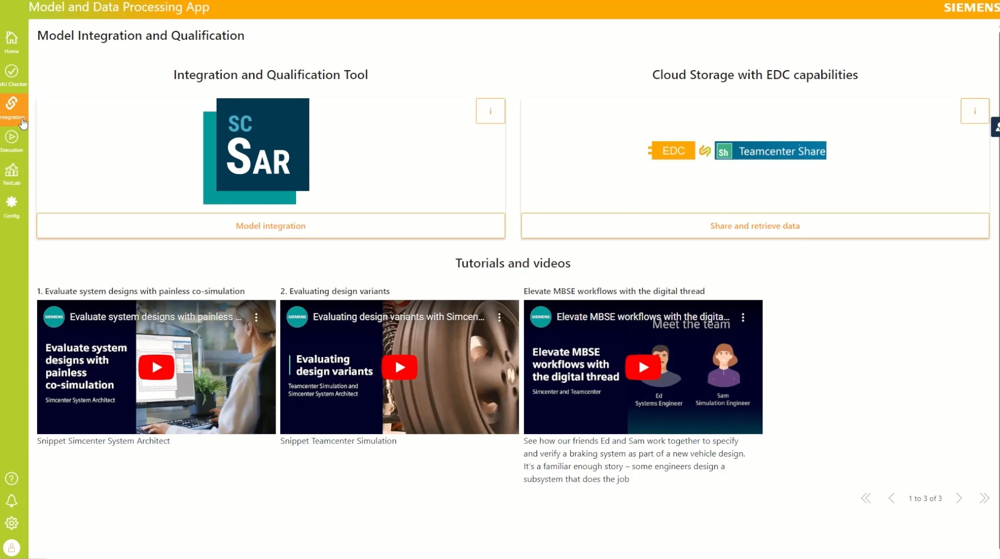
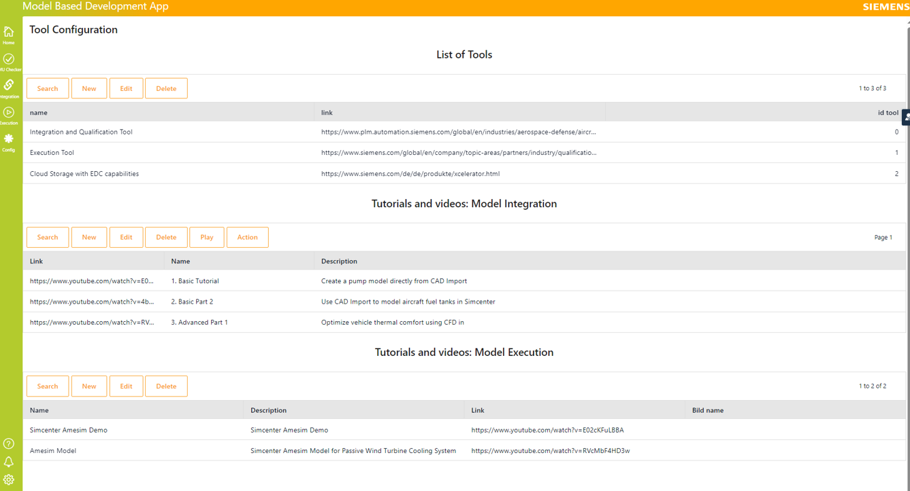

### Behavior Twin MDP Application Success Story
<!--
Adoption View of the Kit.
-->

## Introduction to the Use Case

The Behavior Twin MDP (Model and Data Processing) Application stands as a enables development within the framework of the Catena-X initiative, aimed at colaborative  utilization of behavioral digital twins are the automotive industry. This innovative application is poised to define the workflow and the tool chain for the  model-based system development and data processing, leveraging Catena-X technology and collaborative principles. The mission of the Behavior Twin MDP Application is to provide a comprehensive framework for the selection o, integration, and utilization of behavioral digital twins. Through adherence to Catena-X standards and principles, we strive to ensure secure data exchange, interoperability, and compatibility, laying the foundation for seamless collaboration and innovation.

Enhance model based design using models coming from component suppliers(for example: the OEM gets the models of the gear box, the brakes and the battery from the respective Tier1) . Facilitate model exchange between Tier1s and OEM or between Tier2s and Tier1. This is done using the industry standard FMU (which is a black box model so the intellectual property is protected) and performing the exchange over EDC. Our Use case then provides the tools to combine the models and perform parametric studies. 

## General Information Display: Behavior Twin MDP Application

The General Information Display the description of the Behavior Twin MDP (Model and Data Processing) Application offers users a user-friendly interface to visualize essential information about behavioral digital twins and their components. Whether users are analyzing the behavior of a component within a vehicle or maintaining a system, this feature provides easy access to valuable insights.

A technical expert from OEM has to build a design of a new car. The simulation expert will collect the necessary models from the Tier1 and combine them in a vehicle models to evaluate different designs. The models are exchanged between Catena-X partners using EDC and using the FMU format (black box model)

Once the models are available the workflow proceeds in three steps:
Verify that the FMUs are valid (conform to the industry standard). Get informations about the model input/outputs to make sure that you got the right models
Get the model in Simcenter System Architect over Xcelerator Share (which is being connected to EDC). The models are composed in a larger model (called Architecture)
Get the architecture in Simcenter HEEDs and run and compare parametric studies to evaluate the design.

## FMU Checker
FMU checker: to check the model and gain insights (for example what are the input and outputs)
### FMU Checker - Projects overview

The Projects Overview page serves as a hub for managing and monitoring all projects involving FMUs. It offers a centralized view of project statuses, progress, and key metrics, empowering users to stay organized and informed throughout the project lifecycle.

### FMU Checker - Results of Comliance Check

The FMU Checker - Results of Compliance Check page is a vital component of the application, providing users with detailed insights into the compliance status of Functional Mock-up Units (FMUs). This page serves as a comprehensive tool for ensuring adherence to standards and regulations, enabling users to verify the compliance of FMUs with ease and efficiency

<!---->

### FMU Checker - Results of Smoke Test

This page serves as a crucial tool for ensuring the functionality and reliability of FMUs, providing users with valuable information to assess their performance.
It provides the detailed test Results: Access detailed reports on the outcomes of smoke tests conducted on FMUs, including information on test cases executed, pass/fail statuses, and the results of the FMU calculation based on the users input.

## Integration: Simcenter Architect
Model Integration (using Simcenter System Architect): to combine several FMU models (connecting inputs and output) in an architecture.

The Integration: Simcenter Architect page is a pivotal component of the application, offering seamless integration with Simcenter Architect software. This integration empowers users to leverage the advanced capabilities of Simcenter Architect within the application environment, enhancing their modeling and simulation workflows and driving innovation in system design and development.

## Execution: HEEDS
Model Execution (using Simcenter HEEDs): to perform parametric studies and compare different designs.
The Execution: HEEDS page stands as a cornerstone within the application, facilitating seamless execution of optimization tasks using HEEDS software. This integration empowers users to harness the advanced optimization capabilities of HEEDS directly within the application environment, enhancing their design exploration and decision-making processes

## Behavior Twin MDP Application - Configuration

The Behavior Twin MDP (Model and Data Processing) Application - Configuration page serves as a central hub for users to configure and customize various aspects of the application according to their specific needs and preferences. This page offers a range of tools and settings that empower users to tailor the application to suit their unique requirements, ensuring optimal functionality and performance.

