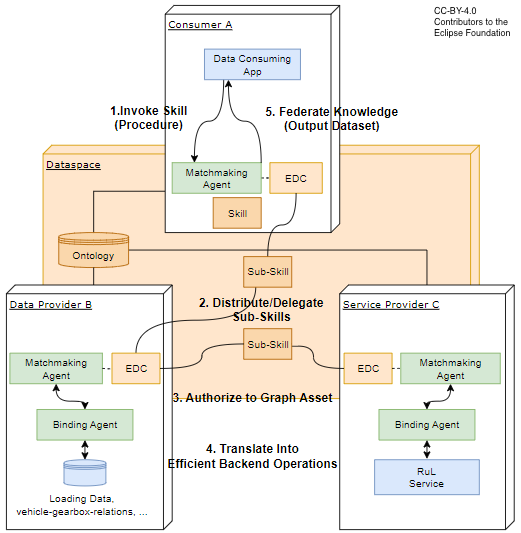
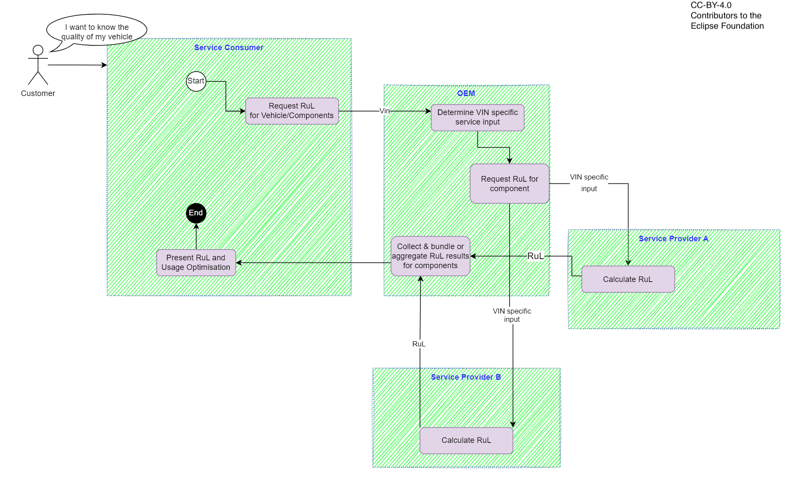
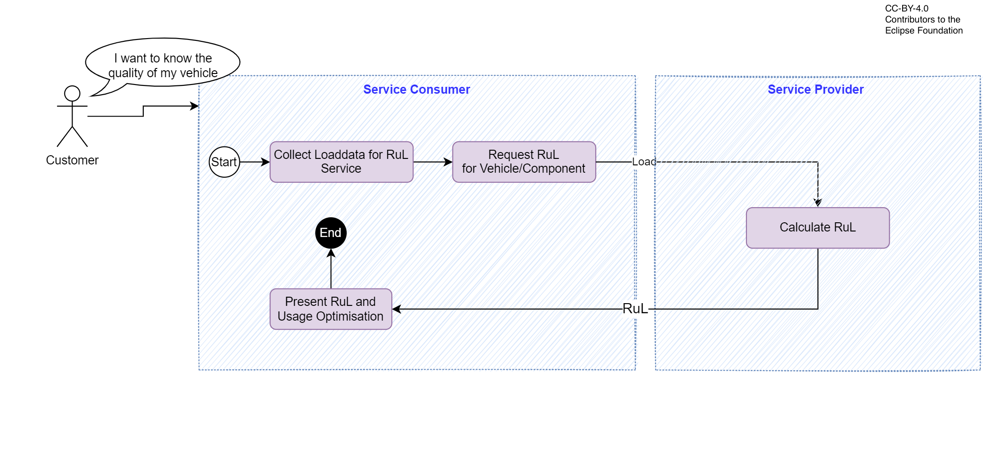

### Remaining Useful Life Kit
<!--
Adoption View of the Kit.
-->

## Vision & Mission

### Vision

Calculating Remaining Useful Life is a business.

The *Remaining Useful Life* Kit aims at novel business models based on the calculation of *Remaining Useful Life*. The wide range of possible applications starts with product development and finally extends to recycling: the entire product life cycle offers potential. The *Remaining Useful Life* Kit provides efficient support in planning, designing, building, using and operating *Remaining Useful Life* Services and applications based on them.

### Mission

The *Remaining Useful Life* Kit comes with the necessary Catena-X standards for damage models and remaining useful life statements. On this basis, interoperable solutions are created. The KIT includes tools for the simple implementation of component-specific damage models and for linking the damage models with dynamic input data. All components are easily adaptable to specific applications and simplify the journey to the finished service.

### Customer Journey

With the *Remaining Useful Life* Kit, we support the Catena-X customer journey for our adopters and solutions providers.

<!---->

## Business Value

Through the standardized specifications described in the *Remaining Useful Life* Kit  – for example the semantic models and APIs – application and service providers can reduce investment and implementation costs to integrate new Catena-X services. Furthermore, application, data, model and service providers can enter potential new markets within the entire product life cycle.

## Use Case

- OEM, TIER-X: In the early development phase, components can be designed using digital prototypes based on component-specific damage calculation. The load data required for this comes from simulation or measurement in the digital twin.

- Tier-X: The overall product range becomes more attractive in the offer phase when model-based damage calculation is included as a product-related service.

- During the usage phase, OEMs, car dealers and automotive clubs can further interpret the *Remaining Useful Life* calculation for a vehicle evaluation and offer it as vehicle-related services for their end customers and fleet operators.

- Even during the usage phase, but particularly during the recycling phase, OEMs, Tier-X, automotive clubs, car dealers, insurers, fleet operators and recyclers benefit from precise residual value analyses of the entire vehicle and its components on the basis of component-specific damage calculation.

### Status Quo

Within company limits, the calculation of component damage based on internally available data and models is already state of the art. However, across company boundaries, there are only individual, complex and not generally available options for calculating component-specific damage.

### Today’s challenge

For successful implementation, the following challenges must be addressed:

- the correct allocation of the appropriate damage calculation to the respective component
- recording and providing the necessary input variables
- an easy-to-interpret preparation of results
- easy scalability across company boundaries

### Benefits

**OEMs and big suppliers** benefit from cost savings, improved quality and shorter development times through customer-data-based, precise design of individual components and the entire system. The decisive hub is created by using load data and damage models across company boundaries — always in compliance with IP and data protection.

It will be easier for **SMEs** to use product-related *Remaining Useful Life* services, for example for design and recycling.

Generating added value by providing *Remaining Useful Life* services offers new areas of business for **solution providers**. These can be the suppliers themselves, pure service providers or so-called value-added resellers (VAR).

## Logic & Schema

### Building Block View

The architecture image describes the interaction between the RuL Service and the Knowledge Agent components.

The Consumer A is only allowed to communicate via the Data Provider B.
The indirect communication ensures data sovereignty for Data Provider B (as B might not want to advertise its providers). Thus, the communication of the RuL result is to Data Provider B and is not allowed to deliver the result directly to A.

### RuL Components

|Subsystem|Description|
|---------|-----------|
|Data Consuming App| This component is the app that is hosted at the Consumer and provides the end user interface. The end user can enter a vehicle identifier number (VIN) and gets back a calculated RuL value.   The returned value from the calculation services is SAMM specified. The app can provide another representation.|
|Loading Data | A data source at the Data Provider that provides the loading data and other vehicle data that are needed for the RuL calculation.   It can be accessed by the knowledge agent via data bindings.|
|RuL Service| A RuL calculation service at the Service Provider. It accepts input data from the Data Provider, calculates the RuL value and returns it.|

### Knowledge Agent components

|Subsystem|Description|
|---------|-----------|
|Matchmaking Agent|This component supports SparQL to traverse the federated data space as a large data structure. It interacts with the EDC. <UL><LI>The provider's Matchmaking Agent will be activated by its EDC. Therefore, the EDC must offer a Graph Asset (variant of ordinary data assets in the Catena-X EDC standard).</LI><LI> The consumer's Matchmaking Agent interacts with its EDC to negotiate and perform the transfer of Sub-Skills to other dataspace participants.</LI></UL> The Matchmaking Agents are matching the (sub)graphs and negotiate appropriated graph assets with the partner EDCs.|
|Binding Agent| The Binding Agent is a restricted version of the Matchmaking Agent (subset of OWL/SparQL, e.g., without federation) which is just focused on translating Sub-Skills of a particular business domain (Bill-Of-Material, Chemical Materials, Production Sites, etc.)  into proper SQL- or REST based backend system calls.   Implementation details: For data bindings, OnTop is used. For service bindings, RDF4J is used.|
|Ontology|The ontology is a formal representation of knowledge that captures concepts, relationships, and properties. It allows a shared understanding and reasoning about the respective domain.   It must be hosted in a way that all participants can access it. Currently, the ontology is hosted at GitHub.|
|Skill/Sub-Skill| The Skill describes, what to do (which data have to be connected, transferred and so on).|

### Catena-X Core Services (except Knowledge Agent components)

|Subsystem|Description|
|---------|-----------|
|Eclipse Dataspace Components (EDC)|The Connector of the Eclipse Dataspace Components provides a framework for sovereign, inter-organizational data exchange. It implements the International Data Spaces standard (IDS) as well as relevant protocols associated with GAIA-X. The connector is designed in an extensible way in order to support alternative protocols and integrate in various ecosystems.|

## Business Process

Two different cases need to be specified.

### Service Consumer does not have input data for RuL Service available; RuL calculation based on vin

- Service Consumer provides Vin to OEM

- OEM procures vin specific service inputs from vehicle

- OEM forwards input to service providers

- Service providers calculate RuL values

- RuL results are provided to the Service consumer via the OEM

### Service Consumer has input data for RuL Service available

- Service consumer needs to collect or generate load/input for RuL calculation, e.g. through driver questionnaire.
- Service provider uses the input to estimate RuL and send it back to Service Consumer

### Access Policies

To decide which company has access to the data assets, access policy should be used. It is maybe possible to skip access policies, but this will made all data assets public available in the Catena-X network and is not recommended. Therefore, every asset should be protected and only be made available for specific companies, identified through their business partner number (BPN). In the near future, other access policies will be introduced like a company role and attribute based policy. Further details can be found in this page of the [EDC](https://github.com/eclipse-tractusx/tractusx-edc/tree/main/edc-extensions/business-partner-validation).

### Usage policies

Use case specific credentials exist and will be mandatory. Their documentation will be available after SSI release.
A Behaviour Twin  "Use Case Rahmenbedingung" which covers the business process of the app will be available after SSI release.
This Rahmenbedingung document can be referenced in the usage policies, and therefore limit Data & Service access to Behaviour Twin participants.

<!-- !Mandatory! -->
## Semantic Models & Standards

Our relevant standards can be downloaded from the official [Catena-X Standard Library](https://catena-x.net/de/standard-library).

- [CX - 0056 Semantic Model: ClassifiedLoadSpectrum:](https://catena-x.net/fileadmin/user_upload/Standard-Bibliothek/Archiv/Update_Juli_23_R_3.2/CX-0056-SemanticModelClassifiedLoadSpectrum.pdf)

  *The data model “ClassifiedLoadSpectrum” represents the load data of a vehicle component. The load spectrum is a data set that represents the aggregated loading of a component. Any kind of loading is covered: loading can be force or torque or revolutions or temperature or event or similar. The load data is classified and counted with specific counting methods. This standard defines the format for the counted load data, so that the exchange of load data between different partners is possible.*

- [CX - 0057 Semantic Model: RemainingUsefulLife:](https://catena-x.net/fileadmin/user_upload/Standard-Bibliothek/Archiv/Update_Juli_23_R_3.2/CX-0057-SemanticModelRemainingUsefulLife.pdf)

  *The data model Remaining Useful Life contains the two relevant values to describe the expected remaining life of a vehicle, remaining running distance and remaining operating hours. The data model is used for vehicle parts and vehicle components which cannot be visually assessed but need the loading information combined with a damage model to estimate the health of the component.*

- [CX - 0058 API: Endurance Predictor:](https://catena-x.net/fileadmin/user_upload/Standard-Bibliothek/Archiv/Update_Juli_23_R_3.2/CX-0058-APIEndurancePredictor.pdf)

  *This documentation describes the technical specification to enable the request of standardized "Remaining Useful Life (RUL)" data at component level of a concrete vehicle instance ("as built") and its integration into the Eclipse Dataspace connector (EDC). It sets the standards for the API for the usage of services which calculate a so-called "remaining useful life value" (RUL-value, see CX-0057). This standard covers exclusively the definition of the specific API endpoint.*

- [CX - 0059 Triangle Behavioral Twin Endurance Predictor:](https://catena-x.net/fileadmin/user_upload/Standard-Bibliothek/Update_September23/CX-0059-TriangleBehavioralTwinEndurancePredictorService-v.1.1.0.pdf)

  *This triangle document acts as a bracket for single standards required to request "Remaining Useful Life (RUL)" data as well as providing a service for its calculation at a component level.Included are APIs to be provided by the service provider and the service requestor, as well as aspect models for the respective payloads being exchanged in an asynchronous pattern leveraging those APIs.*

- [CX - 0088 Aspect Model User Estimated Loading:](https://catena-x.net/fileadmin/user_upload/Standard-Bibliothek/Update_September23/CX-0088-AspectModel_UserEstimatedLoading_v1.0.0.pdf)

  *The semantic model for "User Estimated Loading" is the structured input for the Endurance Estimator Service. This Service should be used by normal customer without special knowledge of technical details of the car or access to ECU data. The input is basic data about the vehicle and information about the usage, previous usage as well as future usage.*

- [CX - 0089 Triangle BehaviourTwin EnduranceEstimator:](https://catena-x.net/fileadmin/user_upload/Standard-Bibliothek/Update_September23/CX-0089-TriangleBehavioralTwinEnduranceEstimator_v.1.0.0.pdf)

  *This triangle document acts as a bracket for single standards  required to request "Remaining Useful Life (RUL)" data as well as providing a service for its estimation. Included are APIs to be provided by the service provider and the service requestor, as well as aspect models for the respective payloads being exchanged in an asynchronous pattern leveraging those APIs.*

- [CX - 0090 API EnduranceEstimator:](https://catena-x.net/fileadmin/user_upload/Standard-Bibliothek/Update_September23/CX-0090-APIEnduranceEstimator_v1.0.0.pdf)
  
  *This documentation describes the technical specification to enable the request of standardized "Remaining Useful Life (RUL)" data for "User Estimated Loading" and its integration into the Eclipse Dataspace connector (EDC). It sets the standards for the API for the usage of services which estimates a so-called "remaining useful life value" (RUL-value, see CX-0057) using estimated load data ("User Estimated Loading", see CX-0088). This standard covers exclusively the illustration of the specific API endpoints.*

<!-- Standard candidates -->
<!--
Some of our relevant standards can **not yet** be downloaded from the official [Catena-X Standard Library](https://catena-x.net/de/standard-library) **as they don't have been published yet**. Here is a preview of our **standard candidates**: -->
