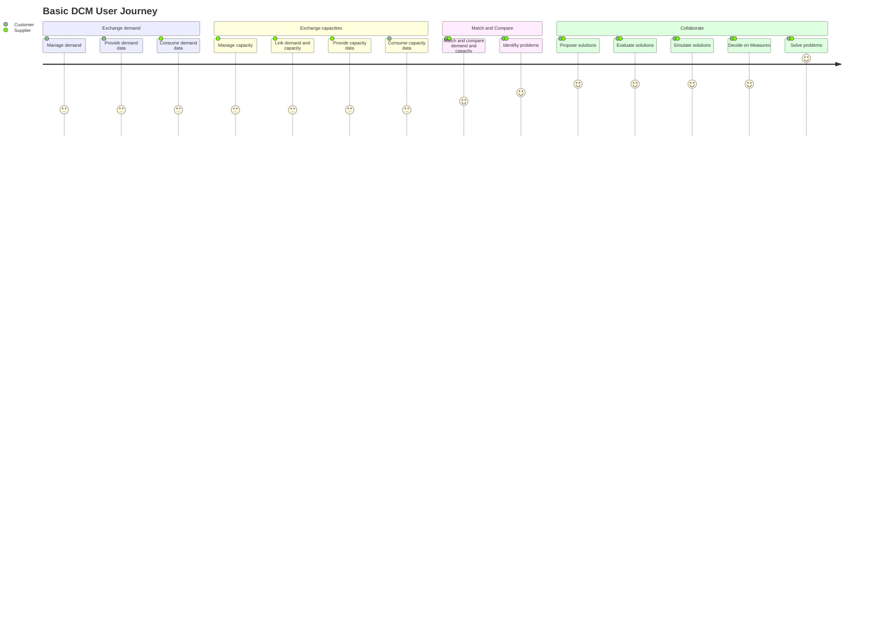

## TABLE OF CONTENTS
- [Business Roles and Functions](#business-roles-and-functions)
- [Material Demand](#material-demand)
- [Capacity Group](#capacity-group)
- [Match and Comparison of Demand and Capacity](#match-and-comparison-of-demand-and-capacity)
- [Collaboration](#collaboration)
- [User Journy](#user-journey)


## Business Roles and Functions

The core DCM business process is executed by two roles and uses two APIs as well as  two aspect models. The customer is responsible for `WeekBasedMaterialDemand`, the supplier for `WeekBasedCapacityGroup`. Within `WeekBasedCapacityGroup` the supplier has to link material demands.

|Function / Role|Customer|Supplier|
|-|-|-|
|Manage demand data|X||
|Inform supplier about demand|X||
|Manage capacity data||X|
|Link demand and capacity||X|
|Inform customer about capacity||X|
|Compare demand to capacity|X|X|
|Collaborate to resolve bottlenecks|X|X|

## Material Demand


<!--
```mermaid
block-beta
columns 4
block:Customer:2
A1[["One-Up (Customer)")
end
block:Supplier:2
A3("One-Down(Supplier)")
end
B1<["Manage"]>(down)
space:2
B4<["Manage"]>(down)
C1("Demand"):1
C2((" ")):1
C3((" ")):1
C4("Capacity"):1
space:4
space:1
E2("Match & Comparison"):2
space:1
space:4
G1((" "))
G2("Collaboration"):2
G4((" "))

##### FIX THE ARROWS BELOW FOR MERMAID DIAGRAM TO WORK and remove this LOC

C1->C2
C2->E2
C3->E2
C4->C3
E2->G2
G1->C1
G2->G1
G2->G4
G4->C4

classDef Demand fill:#FFA600,stroke:#FFFFFF,color:#000000
classDef Capacity fill:#B3CB2D,stroke:#FFFFFF,color:#000000
classDef DemCap fill:#D9B917,stroke:#FFFFFF,color:#000000
classDef Frame fill:#979797,stroke:#EAEAEA,color:#000000
classDef Highlite  stroke:#FF0000,stroke-width:4px
class A1,C1 Demand
class A3,C4 Capacity
class E2,G2 DemCap
class B1,B4,C2,C3,G1,G4 Frame
class C1 Highlite
```

-->

A material demand represents the need for a particular product, part, component or material over a certain time period in a specified quantity. Demand quantities must refer to a time period of one calendar week (weekly buckets).

The customer is responsible for publishing material demands to their supplier for upcoming time periods and it is strongly recommended to:

- Minimize any data gaps to the greatest extent possible by maintaining continuity and establishing consistency.
- Provide material demand data for at least nine months into the future to ensure that DCM participants have sufficient information to work with.
- Implement a rolling demand plan by continuously updating the planning horizon with recent data.
- Refresh the data at a minimum of once every four weeks.
- Align, ideally within a contract, the unit of measure for demand quantities (e.g., pieces, kilograms, metric tons) with the supplier before providing the demand.

The supplier must have the capability to consume the material demand data from the customer.

### Material Demand Structure


<!--


-->

### Visualization Example


<!--
```mermaid
---
   config:
    xyChart:
        width: 1200
        height: 700
        titlePadding: 10
        titleFontSize: 20
        showTitle: true
        plotReservedSpacePercent: 50 
    themeVariables:
        xyChart:
            backgroundColor: "#000000"
            titleColor: "#F4F2F3"
            xAxisLabelColor: "#F4F2F3"
            xAxisTitleColor: "#F4F2F3"
            xAxisTickColor: "#F4F2F3"
            xAxisLineColor: "#F4F2F3"
            yAxisLabelColor: "#F4F2F3"
            yAxisTitleColor: "#F4F2F3"
            yAxisTickColor: "#F4F2F3"
            yAxisLineColor: "#F4F2F3"
            plotColorPalette: "#FFA600,#B3CB2D,#809500,#219dd4"

---
    xychart-beta
    title "Example: Demand Data"
    x-axis [Week 1, Week 2, Week 3, Week 4, Week 5, Week 6, Week 7, Week 8]
 
 ##### FIX THE ARROW BELOW and remove this LOC to get mermaid working   
    
    y-axis 0 -> 6000
    bar [3000, 3000, 3000, 3000, 4000, 4000, 4000, 5000]
```
-->

## Capacity Group


<!--
```mermaid
block-beta
columns 4
block:Customer:2
A1[["One-Up (Customer)")
end
block:Supplier:2
A3("One-Down(Supplier)")
end
B1<["Manage"]>(down)
space:2
B4<["Manage"]>(down)
C1("Demand"):1
C2((" ")):1
C3((" ")):1
C4("Capacity"):1
space:4
space:1
E2("Match & Comparison"):2
space:1
space:4
G1((" "))
G2("Collaboration"):2
G4((" "))

##### FIX THE ARROWS BELOW FOR MERMAID DIAGRAM TO WORK and remove this LOC

C1->C2
C2->E2
C3->E2
C4->C3
E2->G2
G1->C1
G2->G1
G2->G4
G4->C4

classDef Demand fill:#FFA600,stroke:#FFFFFF,color:#000000
classDef Capacity fill:#B3CB2D,stroke:#FFFFFF,color:#000000
classDef DemCap fill:#D9B917,stroke:#FFFFFF,color:#000000
classDef Frame fill:#979797,stroke:#EAEAEA,color:#000000
classDef Highlite  stroke:#FF0000,stroke-width:4px
class A1,C1 Demand
class A3,C4 Capacity
class E2,G2 DemCap
class B1,B4,C2,C3,G1,G4 Frame
class C4 Highlite
```
-->

A capacity groups represents the answer to one ore more material demands. It contains the information on how a supplier intends to fulfill customer needs, by contrasting demands with capacities over a certain time period in a specified quantity. Capacity quantities must refer to a time period of one calendar week (weekly buckets).

The customer is responsible for publishing capacity groups to their customer and it is strongly recommended to:

- Minimize any data gaps to the greatest extent possible by maintaining continuity and establishing consistency.
- Provide capacity data for every calendar week that has associated demand data.
- Refresh the data at a minimum of once every four weeks.
- Align, ideally within a contract, the unit of measure for capacity quantities (e.g., pieces, kilograms, metric tons) with the customer and utilize lead factors as conversion factors, if applicable.

The supplier must provide capacity data to the customer, corresponding to the material demand data previously shared. Thereby, the supplier is acting as a data provider and the customer as a data consumer of the exchanged capacity group.  

The customer must have the capability to consume the capacity group data from the supplier.

### Capacity Group Structure

The Capacity Group is the entity where Material Demand and capacity information are matched and compared for the purpose of a collaborative DCM. Thereby, the Capacity Group builds the common view on the data exchanged between a customer and a supplier.  

The entity Capacity Group may be used, i.e. to combine capacities related to one or more machines, facilities or plants.  

The basic structure of a Capacity Group can be depicted as follows:


<!--


-->

### Example Visualization


<!--
```mermaid
---
   config:
    xyChart:
        width: 1200
        height: 700
        titlePadding: 10
        titleFontSize: 20
        showTitle: true
        plotReservedSpacePercent: 50 
    themeVariables:
        xyChart:
            backgroundColor: "#000000"
            titleColor: "#F4F2F3"
            xAxisLabelColor: "#F4F2F3"
            xAxisTitleColor: "#F4F2F3"
            xAxisTickColor: "#F4F2F3"
            xAxisLineColor: "#F4F2F3"
            yAxisLabelColor: "#F4F2F3"
            yAxisTitleColor: "#F4F2F3"
            yAxisTickColor: "#F4F2F3"
            yAxisLineColor: "#F4F2F3"
            plotColorPalette: "#B3CB2D,#809500,#219dd4"

---
    xychart-beta
    title "Example: Capacity"
    x-axis [Week 1, Week 2, Week 3, Week 4, Week 5, Week 6, Week 7, Week 8]
##### FIX ARROW BELOW AND remove this LOC to get mermaid to work
    y-axis 0 -> 6000
    line Actual Capacity [3000, 3000, 4000, 4000, 3000, 3000, 3000, 3000]
    line Maximum Capacity [3000, 4000, 4000, 5000, 3000, 4000, 5000, 3000]
    line Agreed Capacity [5000, 5000, 5000, 5000, 5000, 5000, 5000, 5000]
```

-->


<!--

-->

### Details

Embedded into the WeekBasedCapacityGroup are

- **actual capacity** as the  planned available capacity of a supplier
- **maximum capacity** as the maximum releasable capacity of a supplier
- **agreed capacity**  as the understanding between customer and supplier, regardless of contractual obligations. It is optional.

In addition the difference between actual capacity and maximum capacity is commonly understood as **flexible capacity**.

A Capacity Group dataset comprises the following basic components:

|Properties|Description|
|-|-|
|Supplier|The Business Partner Number (BPNL) of the party providing materials to a customer|
|Customer|The Business Partner Number (BPNL) of the party requesting material from a supplier|
|Capacity Group ID|The Capacity Group ID uniquely identifies the capacity group within the business relationship between a supplier and its customer|
|Changed At|Point in time when the content (any property according to the data model) of the capacity group was changed, at the supplier, either by a human user or an automated process|
|Capacity Group Name|Name of the capacity group.|
|Inactive Flag|Indicates that this capacity group is currently not in use/maintained by the supplier|
|Unit of Measure|Unit of Measurement (UoM) for capacity quantities|
|Linked Demand Series|Set of demand series assigned tio this capacity group.|
|Capacities|A time series with week-based granularity along a given time period containing the capacity values|
|Unit of Measure is Omitted|Explicit indicator of whether the unit of measure is left out of the payload intentionally. If “true” it means the sending application sends the demand values without unit of measure intentionally and the unit of measure must not be contained in the payload. If “false” a unit of measure must be supplied|

Further properties are added at lower level below the “Capacities” property. A capacity time series contains the following components.

|Properties|Description|
|-|-|
|Actual Capacity|The actual capacity is the realistically planned output per calendar week and material for a specific customer in a specific unit of measure, considering all positive or negative impacts on this capacity|
|Agreed Capacity|The agreed capacity of a supplier for a specific customer material(s) within a capacity group. The agreed capacity must not constitute a legal obligation to deliver.|
|Maximum Capacity|The supplier's maximum capacity is the maximal available output per calendar week and material for a specific customer in a specific unit of measure. The maximum capacity thereby restricts the flexible capacity, as the flexible capacity is obtained from the difference of a supplier maximum capacity minus actual capacity|
|Point in Time|ISO Calendar Week of the given time series entry. UstIt must be given as a date of the Monday in the week.|

For a functional Capacity Group, the supplier must link either directly or indirectly Material Demand:

- **Direct linking** means that the Capacity Group links at least one Material Demand  
- **Indirect linking** means that the Capacity Group links to another Capacity Group which links at least one Material Demand (this way of linking Capacity Groups to Material Demand is considered as "**Nesting**" of Capacity Groups). For more details see chapter “nesting”

**Capacity Group direct linking**


<!--


-->
For the technical representation of a CapacityGroup the aspect model WeekBasedCapacityGroup is utilized.  

The aspect model WeekBasedCapacityGroup must be used by a supplier to provide capacity information to the customer.  

For further details refer to the semantic model in Chapter 3.2 and to the APIs in Chapter 4.2.  

A partner acting as a supplier sends a Capacity Group to its customer. In order to link demand series in the Capacity Group between customer and supplier, the following properties must be filled-in:  

- supplier
- customer
- materialNumberCustomer  
- customerLocation  
- demandCategory  

If there’s no complete match between supplier and customer data, it’s recommended to initiate collaboration (i.e. see chapter “Comments”)

The supplier has the option to mark a WeekBasedCapacityGroup as inactive (i.e. the capacity is obsolete), in this case the capacity will not be considered in the demand-capacity matching. However, the WeekBasedCapacityGroup can be reactivated again.

#### Building the n-tier chain via capacity groups

Building supply chain via capacity groups is crucial to improve resiliency, transparency and efficiency along the value chain. Using the individual one-to-one capacity groups between one-ups and one-downs step by step builds the whole supply network. This enables all partners to really collaborate along the whole value chain and navigate through complex and dynamic market conditions.  

In the following, building the n-tier chain via capacity groups is illustrated for example materials:  


Example N-Tier Linking via Capacity Groups


business-process_nTierLinking_Legend.svg
<!--

-->
## Match and Comparison of Demand and Capacity


<!--
```mermaid
block-beta
columns 4
block:Customer:2
A1[["One-Up (Customer)")
end
block:Supplier:2
A3("One-Down(Supplier)")
end
B1<["Manage"]>(down)
space:2
B4<["Manage"]>(down)
C1("Demand"):1
C2((" ")):1
C3((" ")):1
C4("Capacity"):1
space:4
space:1
E2("Match & Comparison"):2
space:1
space:4
G1((" "))
G2("Collaboration"):2
G4((" "))

##### FIX THE ARROWS BELOW FOR MERMAID DIAGRAM TO WORK and remove this LOC

C1->C2
C2->E2
C3->E2
C4->C3
E2->G2
G1->C1
G2->G1
G2->G4
G4->C4

classDef Demand fill:#FFA600,stroke:#FFFFFF,color:#000000
classDef Capacity fill:#B3CB2D,stroke:#FFFFFF,color:#000000
classDef DemCap fill:#D9B917,stroke:#FFFFFF,color:#000000
classDef Frame fill:#979797,stroke:#EAEAEA,color:#000000
classDef Highlite  stroke:#FF0000,stroke-width:4px
class A1,C1 Demand
class A3,C4 Capacity
class E2,G2 DemCap
class B1,B4,C2,C3,G1,G4 Frame
class E2 Highlite
```

-->

### Matching Results and Resolution

Based on the WeekBasedCapacityGroup and WeekBasedMaterialDemand aspect models, each supplier and customer know what data to share. When they compare the demand with the corresponding capacity values they must apply the same logic to ensure that the matching results are interpreted in the same way.  

For a better understanding, the table below describes all comparison scenarios that may apply in a business context focused on one single week. Comparison over a longer period (i.e. several weeks) is currently not covered in the standard or in this KIT and may be defined individually by each partner as in-app solution.

Business application provider, data provider or data consumer must enable their DCM system to recognize the matching situation based on the table below and must be able to interpret the matching result accordingly. The DCM system may visualize the matching result in a respective color as well, based on the illustration below.

|Scenario and Week|Matching situation (must)|Matching result (must)|Color (may)|Hex Code (may)|
|-|-|-|-|-|
|1|Demand = actual capacity = maximum capacity|Zero deviation|Green|#809500|
|2|Demand = actual capacity < maximum capacity|Zero deviation|Green|#809500|
|3|Demand < actual capacity = maximum capacity|Surplus|Green|#809500|
|4|Demand < actual capacity < maximum capacity|Surplus|Green|#809500|
|5|Demand > actual capacity = maximum capacity|Bottleneck|Red|#D91E18|
|6|Actual capacity < demand = maximum capacity|Bottleneck|Orange|#FFA600|
|7|Actual capacity < demand < maximum capacity|Bottleneck|Orange|#FFA600|
|8|Actual capacity < maximum capacity < demand|Bottleneck|Red|#D91E18|

**Note:**

- If Supplier Flexible Capacity is not available (i.e. actual and maximum capacity are equal values), there is only RED or GREEN bars and no YELLOW.
- As per its definition in the DCM standard context, the agreed capacity is a value agreed by business partners and to be used optionally. Therefore, it is not considered for comparison purposes and has no influence on the recognition of bottleneck situations.
- Inactive WeekBasedMaterialDemand data and its related demandSeries data must not be considered when comparing the demand with the corresponding capacity values.
- Inactive WeekBasedCapacityGroup data must not be considered at all for comparison purposes.

The figure below provides an example for a better understanding of how the matching situations described in the table above can be displayed in a DCM system:


<!--
```mermaid
---
   config:
    xyChart:
        width: 1200
        height: 700
        titlePadding: 10
        titleFontSize: 20
        showTitle: true
        plotReservedSpacePercent: 50
    themeVariables:
        xyChart:
            backgroundColor: "#000000"
            titleColor: "#F4F2F3"
            xAxisLabelColor: "#F4F2F3"
            xAxisTitleColor: "#F4F2F3"
            xAxisTickColor: "#F4F2F3"
            xAxisLineColor: "#F4F2F3"
            yAxisLabelColor: "#F4F2F3"
            yAxisTitleColor: "#F4F2F3"
            yAxisTickColor: "#F4F2F3"
            yAxisLineColor: "#F4F2F3"
            plotColorPalette: "#FFA600,#d91e18,#809500,#ffffff,#046b99,#219dd4"
---
    xychart-beta
    title "Example: Demand and Capacity Data Matching and Comparison within Capacity Group"
    x-axis [Week 1, Week 2, Week 3, Week 4, Week 5, Week 6, Week 7, Week 8]
    y-axis "." 0 -> 6000
    bar [3000, 3000, 3000, 3000, 4000, 4000, 4000, 5000]
    bar [0,0,0,0,4000,0,0,5000]
    bar [3000,3000,3000,3000,0,0,0,0]
    line Actual Capacity [3000, 3000, 4000, 4000, 3000, 3000, 3000, 3000]
    line Maximum Capacity [3000, 4000, 4000, 5000, 3000, 4000, 5000, 3000]
    line Agreed Capacity [5000, 5000, 5000, 5000, 5000, 5000, 5000, 5000]

```

-->


<!--

-->

*Visualized example of Demand and Capacity Data Matching and Comparison*

In case a bottleneck or surplus is identified, a DCM collaborative alignment between customer and supplier is highly recommended. For a detailed process description, please refer to the illustrations in ANNEXES of the CX-0128 DCM Standard document (link to be included).  

In an alignment situation the exchange of comments is a key collaborative feature, enabling a dialogue between customers and suppliers. For more information, refer to Chapter 5.9 within the CX-0128 DCM Standard document (link to be included) or to the relevant section in this KIT (link to be included).

## Collaboration


<!--

```mermaid
block-beta
columns 4
block:Customer:2
A1[["One-Up (Customer)")
end
block:Supplier:2
A3("One-Down(Supplier)")
end
B1<["Manage"]>(down)
space:2
B4<["Manage"]>(down)
C1("Demand"):1
C2((" ")):1
C3((" ")):1
C4("Capacity"):1
space:4
space:1
E2("Match & Comparison"):2
space:1
space:4
G1((" "))
G2("Collaboration"):2
G4((" "))

##### FIX THE ARROWS BELOW FOR MERMAID DIAGRAM TO WORK and remove this LOC

C1->C2
C2->E2
C3->E2
C4->C3
E2->G2
G1->C1
G2->G1
G2->G4
G4->C4

classDef Demand fill:#FFA600,stroke:#FFFFFF,color:#000000
classDef Capacity fill:#B3CB2D,stroke:#FFFFFF,color:#000000
classDef DemCap fill:#D9B917,stroke:#FFFFFF,color:#000000
classDef Frame fill:#979797,stroke:#EAEAEA,color:#000000
classDef Highlite  stroke:#FF0000,stroke-width:4px
class A1,C1 Demand
class A3,C4 Capacity
class E2,G2 DemCap
class B1,B4,C2,C3,G1,G4 Frame
class G2 Highlite
```
-->

## User Journey



### Personas

The user journey considers two general personas: The so called ‚DCM Customer user‘ and ‚DCM Supplier user‘. Both users might have different role titles, depending on their respective organizational structures. However, both have specific responsibilities and requirements which drives for them the value of the DCM App:

#### DCM Customer user

DCM Customer is a representative of a business partner that provides a demand forecast to and receives goods from his supplier. As such the persona "DCM Customer" is responsible for:

- safeguarding sufficient capacity of his suppliers for required materials and prevent bottleneck situations
- allocation of production capacity on customer side
- production rough cut planning
- material allocation
- communication to a supplier business partner with regard to material demands in a mid to long term horizon
- potentially: communication to a customer business partner with regard to capacity figures in a mid to long term horizon

#### DCM Supplier user

DCM Supplier is a representative of a business partner that supplies goods to his customer. As such the persona "DCM Supplier" is responsible for:

- allocation of production capacity
- production rough cut planning
- material allocation
- communication to a customer business partner regarding capacity figures in a mid to long term horizon
- resolving bottleneck situations

### User Journey Description

As a starting point of the user journey within any Catena-X based DCM App, the users need to provide either their demand data (on the side of the ‘DCM customer user’) or capacity data (on the side of the ‘DCM supplier user’).  A pre-requisite is that a customer-supplier business partner relationship is established in the Catena-X platform.  

The ‚ DCM customer user‘ creates or uploads and publishes a planned demand in weekly buckets for the next up to 24 months, starting from week+2.

To do so, the ‚DCM customer user either logs into any Catena-X based DCM App and creates a demand for a material, or creates the demand via a system integration from an external system. The creation within a DCM App can be done manually.

Subsequently, the user maintains the demands through a manual input or via a system integration from an external system.

The ‚DCM supplier user‘ logs into a DCM app and views the material demands received from the customers. In case of a new demand which is not yet linked to a capacity group, the ‚DCM supplier user‘ either assigns the demand to an existing capacity group, or has to create a new capacity group and maps the relevant demand series to this new capacity group. As a result, the weekly demands of all demand series related to a capacity group are automatically accumulated and displayed. The capacity group can also be created via an external system integration.

For the capacity groups the ‚DCM supplier user‘ maintains the weekly capacities accordingly via integration of an external system or manually within a DCM App.

A key motivation for users to use the DCM app is for the ‚DCM customer user‘  to check, whether his/her demand plan might result in bottleneck situations on the capacity side. After logging into a DCM app or via an external system integration the ‚DCM customer user‘ can identify demand/capacity imbalances and is able to view relevant related details.

A visualization capturing in weekly buckets the capacity provided by the supplier and the related demand for a material allows the user to quickly analyze imbalances.  

Upon the collaboration being triggered outside any DCM app the ‚DCM supplier user‘ can log-into a DCM app to review the capacity group. In order to solve ana bottleneck or surplus situation the ‚DCM supplier user‘ evaluates different options in the supporting local systems and outside any Catena-X based DCM app. Any decision the ‚DCM supplier user‘ takes has to consider in turn the impact on the own material demands, i.e. whether an adjusted capacity plan results in a feasible demand plan towards the next level supplier. Where required the ‚DCM supplier user‘ might trigger a collaboration with his/her own material suppliers. By adapting to the situation, the ‘DCM supplier user’ changes and releases the relevant weekly capacity values.

Another key motivation for users to utilize the DCM App is the collaboration triggered from the supplier side to inform his/her customer about changes to the capacity which results in a bottleneck or surplus situation. The ‚DCM supplier user‘ updates the capacity after logging-into any Catena-X based DCM App or via an integrated local system.  

After analyzing the situation of the capacity group the DCM customer user evaluates -supported by local systems and outside any Catena-X based DCM App- possible options and decides on the action to solve or mitigate any imbalance. Based on the decision the ‚DCM customer user‘ can update the demand in a DCM App. If this does not resolve the situation the ‘DCM customer user‘ might initiate a collaboration process with the supplier.

### Additional recommended non-standard feature

The following description is not covered by the DCM standard. However, it describes a value adding in-app feature that was discussed within the DCM working group and was found to be useful for adoption. It is therefore shared within the KIT:
The demand and capacity data will be first kept internal within the organization of the business partner, visible just for the responsible user (i.e. the visibility status is "internal private"). It can be shared with colleagues within the business partner organization (i.e. visibility status is “internal”). Eventually, it can follow the main path of collaborative demand and capacity management which means, the demand or capacity data can be set to "shared". With the status set at "shared" both partners of a collaboration, the supplier and customer respectively, can see the demand or capacity data.

For further details, please refer to [CX-0128 Demand and Capacity Management Data Exchange][StandardLibrary].

[StandardLibrary]: https://catena-x.net/de/standard-library
