## Business Roles and Functions

Comments use their own aspect model and API. Comments are provided and consumed by both customer and supplier.

|Function / Role|Customer|Supplier|
|-|-|-|
|Comment on demand or capacity data|X|X|
|Inform business partner about comment|X|X|

## Sequence Diagram

```mermaid

sequenceDiagram
Participant c as Customer
Participant s as Supplier
rect rgb(4,107,153)
s->>c: The demand in weeks 23 and 24 seems extraordinarely high. Can you please have a look at it. 
end
rect rgb(4,107,153) 
c->>s: This is not an error. My demand actually is that high.
end
rect rgb(4,107,153) 
c->>s: Could you try meeting my demand by going into pre-production for week 10 to 20? 
end
rect rgb(64,74,0) 
s->>c: Provide WeekBasedCapacityGroup containing pre production for weeks 10 to 20 
end
rect rgb(4,107,153) 
s->>c: I updated the capacity data to include pre production, lets discuss this in an online meeting. 
end
```

## Details

The collaboration aspect is a fundamental component for Demand and Capacity Management. By the exchange of comments, a capability is provided supporting the alignment and collaboration between customer and supplier in their individual one-up and one-down business relationship.  

A comment is a kind of message or text which refers to a data object exchanged between the two business partners, i.e. either to a Material Demand or a Capacity Group. The referred object is thereby identified via an "ObjectID", which corresponds either to the UUID of a WeekBasedMaterialDemand or to the UUID of a WeekBasedCapacityGroup.  

A comment can be uniquely identified within a business relationship by a CommentID, therefore the formal term of a comment is IdBasedComment.

With this feature users benefit by having all data - even the communication with their business partners - embedded in the core process enabling a common point of truth within the DCM process and more efficient decision making. In addition, a comment can refer to specific period in times of the exchanged time series data to make the collaboration more precise.  

Please note that in this KIT only the sovereign and interoperable exchange of comments is described.  additional descriptions for instance regarding the visualization of comments within a user interface, the creation and deletion process and respective authorizations or internal visibility modes etc. can be used as ideas or examples for the development of  in-app functionalities.

A comment is based on an exchange of text information. No documents or attachments will be exchanged.

A comment must follow the standardized data format according to the valid Catena-X standards and must be processed via the described API accordingly.  

Both business partners, a customer as well as a supplier, must be able to send and must be able to receive a comment for the object of a capacity group. The exchange of comments to the object of a material demand is a highly recommended component for collaborative Demand and Capacity Management. Therefore, it is highly recommended that both business partners, a customer as well as a supplier, should be able to send and to receive comments also for the object of a material demand.  

For a better interpretation of a received comment, a comment type must be provided during the creation process of a comment. Each comment must refer to one of the comment types defined in the standard. It is the responsibility of the comment receiver, which actions are triggered according to the comment type.  

The creator of a comment writes a message in a free text field without predefined texts, as described in the corresponding data model. The result of editing of comments (e.g. change in content, date and/or time) does not change the commentID.

In a comment a reference to specific calendar weeks of the time series data can be provided.  

## Major aspects of defined comment use case types

In general, every comment should contain following information automatically:

- Comment creator, i.e. first/last name or email address or BPNL
  - Note:
    - consider personal data protection (e.g. what happens with comments and user data after his or his company withdrawal) à Follow GDPR regulations and/or decisions aligned by partner companies
    - the comment creator must have the option to create a comment as anonymous (therefore the option to use only the BPNL)
    - apply the need-to-know principle
    - applications must follow Catena-X policies in terms of on-/off-boarding
    - see also handover topic for participants
- Date of creation
- Time of creation

In general, changes to an existing comment shall be allowed only by the creator of the comment (besides general admin role which is not defined yet and outside of this context).  

**Level of comments**  

In general, it shall be possible to create comments as follows:

- For one specific capacity group
  - without time period relation (general comment)
  - with relation to one or multiple time periods
- For a specific material demand  

Preferably all comments can be reviewed within a dedicated area of the UI (general and time period related ones), and the time period related comments are also visible/accessible from the individual time period(s) they refer to.  

For further details, please refer to [CX-0128 Demand and Capacity Management Data Exchange][StandardLibrary].

[StandardLibrary]: https://catena-x.net/de/standard-library
