## Business Roles and Functions

Delta production data is embedded into the WeekBasedCapacityGroup aspect model. This means that only suppliers provide delta production related data and customers consume it.

|Function / Role|Customer|Supplier|
|-|-|-|
|Solve bottleneck via pre production||X|
|Solve bottleneck via post production||X|
|Inform customer||X|
|Acknowledge that bottleneck has been solved|X||

## Sequence Diagram

```mermaid
sequenceDiagram
Participant c as Customer
Participant s as Supplier
rect rgb(157,93,00) 
c->>s: Provide WeekBasedMaterialDemand
end
s->>s: Manage Capacities
s->>s: There is a bottleneck in week 50
s->>s: It is solvable via pre-production in weeks 48 and 49  

rect rgb(64,74,00)
s->>c: Provide WeekBasedCapacityGroup
end

```

For further details, please refer to [CX-0128 Demand and Capacity Management Data Exchange][StandardLibrary].

[StandardLibrary]: https://catena-x.net/de/standard-library
