## Business Roles and Functions

Demand volatility data is embedded into the WeekBasedCapacityGroup aspect model. This means that only suppliers provide demand volatility related data and customers consume it.

|Function / Role|Customer|Supplier|
|-|-|-|
|Define parameters for calculating volatility||X|
|Calculate volatility||X|
|Inform business partner about parameters for calculating volatility||X|
|Inform business partner about calculated volatility||X|
|Acknowledge volatility calculation|X||
|Reproduce demand volatility calculation|X||

## Sequence Diagram

```mermaid
sequenceDiagram
Participant c as Customer
Participant s as Supplier
rect rgb(157,93,00) 
c->>s: I need 100 red toys in week 44
end
c->>c: Wait 1 week
rect rgb(157,93,00) 
c->>s: I need 1000 red toys in week 44
end
c->>c: Wait 1 week
rect rgb(157,93,00) 
c->>s: I need 10 red toys in week 44
end
s->>s: I should really start measuring the volatility of my customers demands
rect rgb(64,74,00)
s->>c: I will begin measuring demand volatility, using the following parameters:
s-->>c: Increase limited to 5%
s-->>c: Decrease limited to 100 units
s-->>c: Measurement starts in week 5, using subhorizons of length (4,8,16,32) 
end

```

For further details, please refer to [CX-0128 Demand and Capacity Management Data Exchange][StandardLibrary].

[StandardLibrary]: https://catena-x.net/de/standard-library
