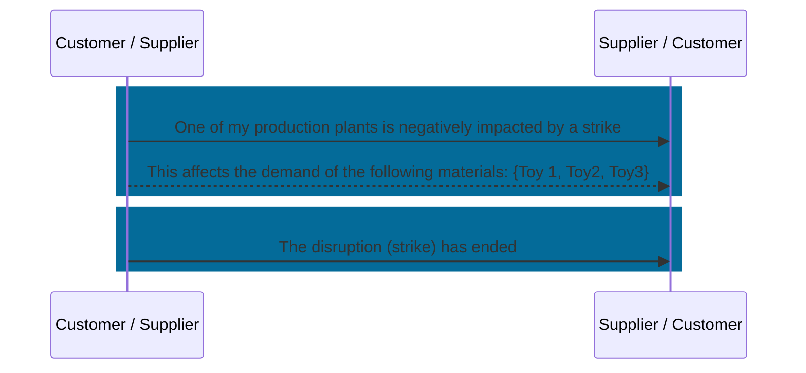

## Business Roles and Functions

Supply chain disruption notifications  use their own aspect model and API. Supply chain disruption notifications are provided and consumed by both customer and supplier.

|Function / Role|Customer|Supplier|
|-|-|-|
|Inform business partner about disruption|X|X|
|Detail pre-existing disruption notification|X|X|
|Resolve disruption|X|X|

## Sequence Diagram

For further details, please refer to [CX-0128 Demand and Capacity Management Data Exchange][StandardLibrary].

[StandardLibrary]: https://catena-x.net/de/standard-library
