## Business Roles and Functions

Load factor data is embedded into the WeekBasedCapacityGroup aspect model. This means that only suppliers provide load factor related data and customers consume it.

|Function / Role|Customer|Supplier|
|-|-|-|
|Define load factors for materials||X|
|Define conversion factor for unit of measure||X|
|Inform business partners about factors||X|
|Acknowledge factors|X||
|Recalculate demands in user interface, based on factors |X|X|

## Sequence Diagram

```mermaid
sequenceDiagram
Participant c as Customer
Participant s as Supplier
rect rgb(157,93,00) 
c->>s: I need 100 red and 100 chrome toys
end
s->>s: Chrome toys strain my capacities twice as much as red toys
rect rgb(64,74,00)
s-->>c: Your demand and my capacities need to be expressed as production cycles.
s-->>c: Red toys are loaded with factor 1
s-->>c: Chrome toys are loaded with factor 2
s->>c: My overall capacity is 250 cycles
end
c->>c: My demands are 100 red cycles plus 200 chrome cycles equals 300 cycles
c->>c: Their capacity for both toys is 250 cycles
```

For further details, please refer to [CX-0128 Demand and Capacity Management Data Exchange][StandardLibrary].

[StandardLibrary]: https://catena-x.net/de/standard-library
