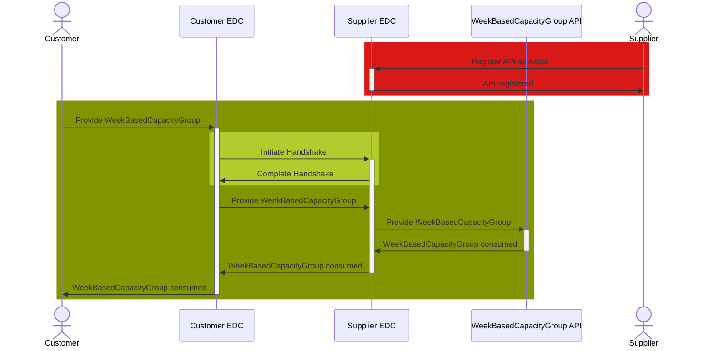

## WeekBasedCapacityGroup API

The WeekBasedCapacityGroup API is owned and registered as an EDC asset by the supplier. The customer provides capacity group data to the API via POST request.

### Roles and Functions

|Role / Function|API Owner|POST to API|
|-|-|-|
|Customer||X|
|Supplier|X||

### Data Exchange

### Open API documentation

|API|Link|
|-|-|
|WeekBasedCapacityGroup|<https://fill.me>|

For further details, please refer to [CX-0128 Demand and Capacity Management Data Exchange][StandardLibrary].

[StandardLibrary]: https://catena-x.net/de/standard-library
