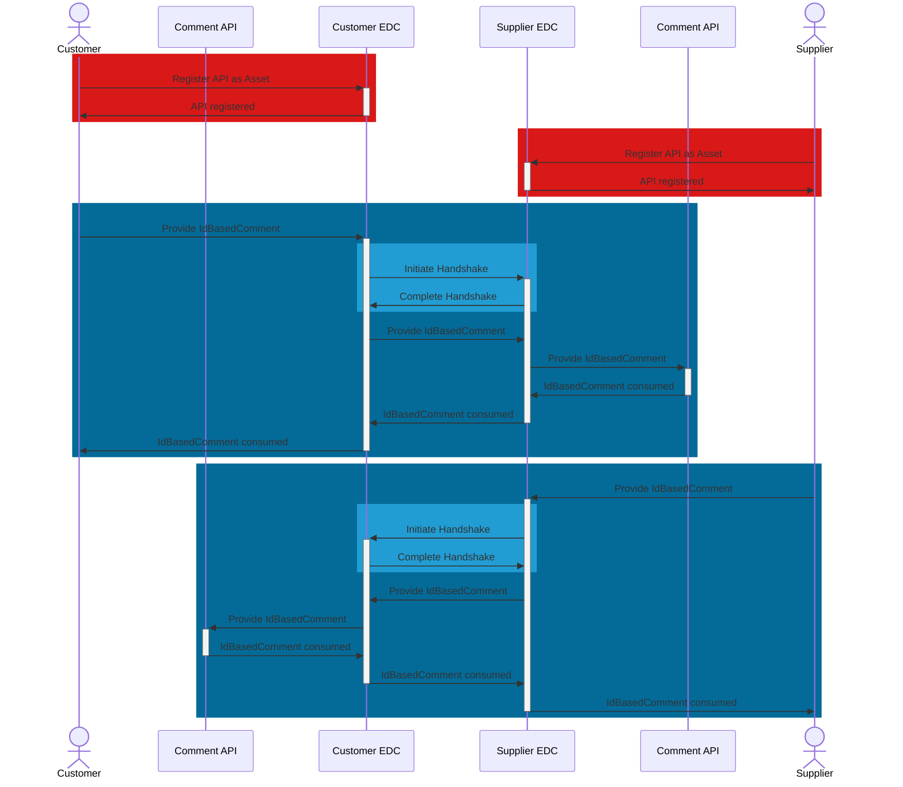

## IdBasedComment API

The IdBasedComment API is owned and registered as an EDC asset by both customer and supplier. The corresponding business partner (supplier and customer) provides comment data to the API via POST request.

### Roles and Functions

|Role / Function|API Owner|POST to API|
|-|-|-|
|Customer|X|X|
|Supplier|X|X|

### Data Exchanges

### Open API documentation

|API|Link|
|-|-|
|IdBasedComment|<https://fill.me>|

For further details, please refer to [CX-0128 Demand and Capacity Management Data Exchange][StandardLibrary].

[StandardLibrary]: https://catena-x.net/de/standard-library