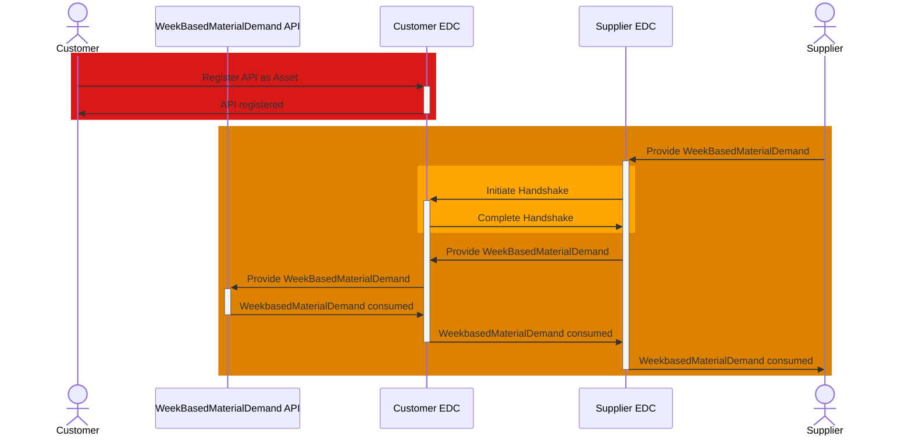

## WeekBasedMaterialDemand API

The WeekBasedMaterialDemand API is owned and registered as an EDC asset by the customer. The supplier provides material demand data to the API via POST request.

### Roles and Functions

|Role / Function|API Owner|POST to API|
|-|-|-|
|Customer|X||
|Supplier||X|

### Data Exchange

### Open API documentation

|API|Link|
|-|-|
|WeekBasedMaterialDemand|<https://fill.me>|

For further details, please refer to [CX-0128 Demand and Capacity Management Data Exchange][StandardLibrary].

[StandardLibrary]: https://catena-x.net/de/standard-library
