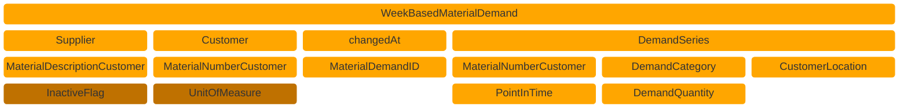
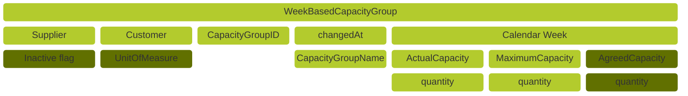
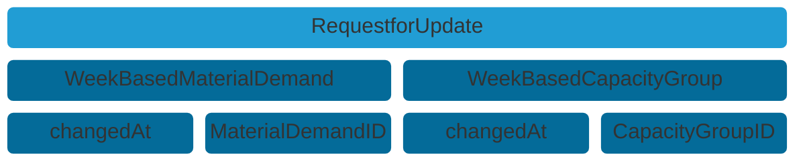
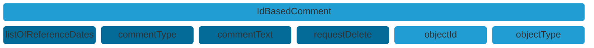
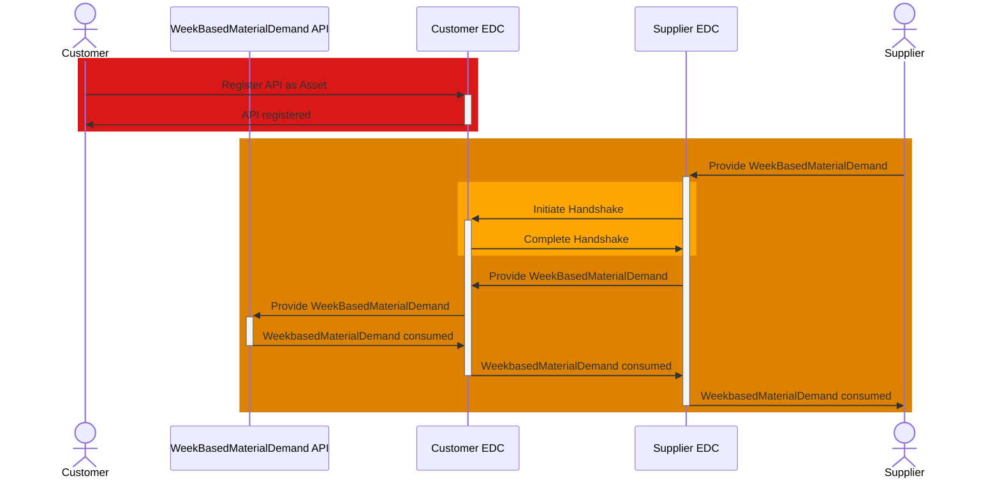
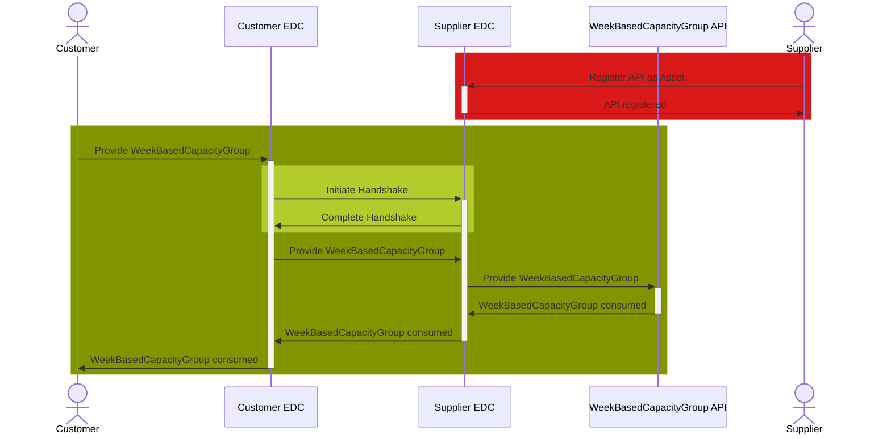
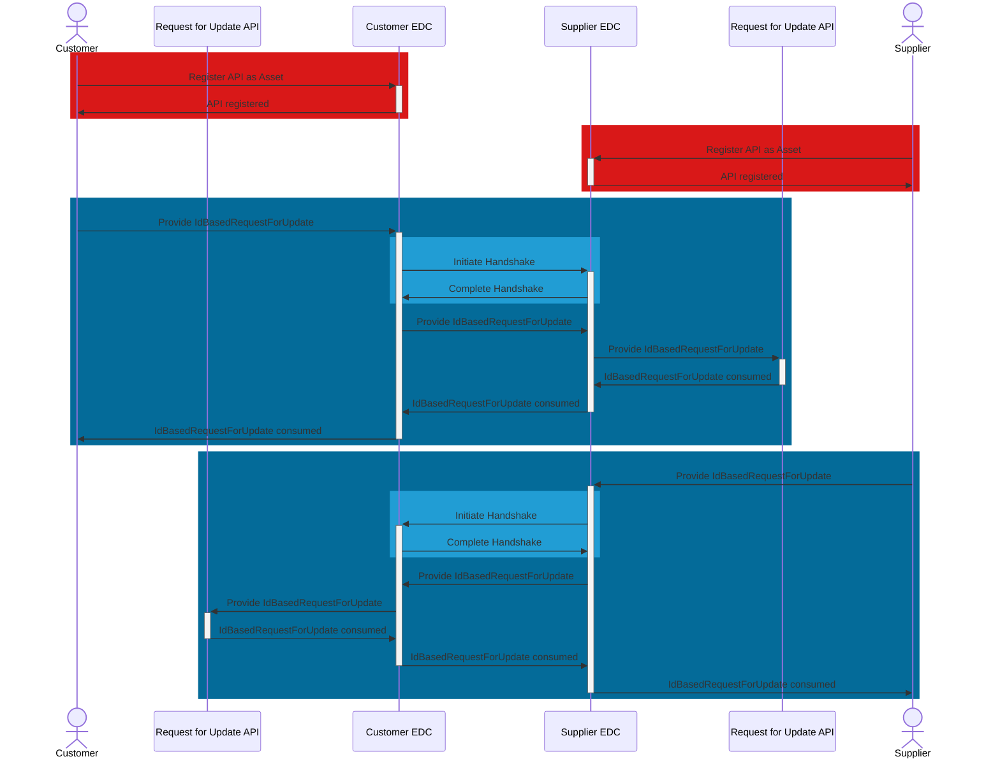
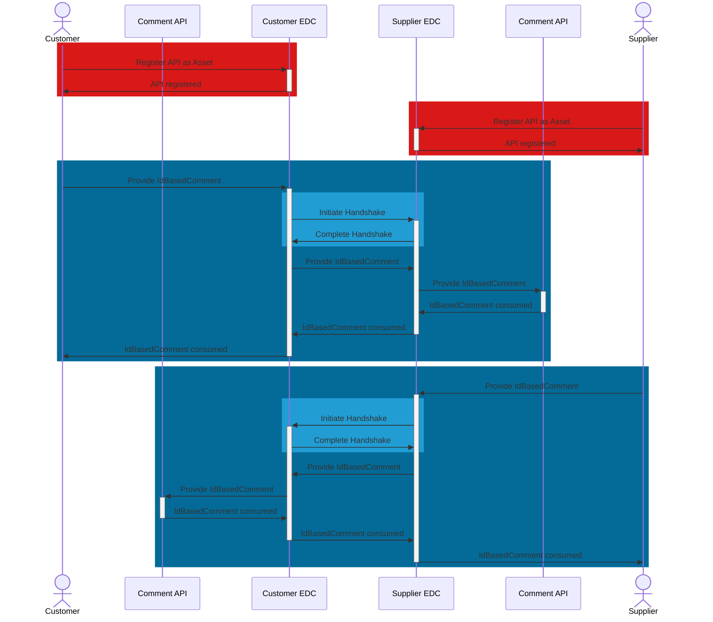

This page describes the most important parts for the software implementation of the DCM standards. For the full
technical specification, please refer to the
standard [CX-0128 Demand and Capacity Management Data Exchange][StandardLibrary].

## Introduction

This document provides developers with ressources to accelerate the development of apps and services.

## Capabilities of a DCM application
[CX-0128 Demand and Capacity Management Data Exchange][StandardLibrary] describes the following capabilities:

|Capability|Category|Related Aspect Models|Related APIs|
|-|-|-|-|
|Providing and consuming demand data|Core|WeekBasedMaterialDemand|WeekBasedMaterialDemand API|
|Providing and consuming capacity data|Core|WeekBasedCapacityGroup|WeekBasedCapacityGroup API|
|Comparing demand and capacity data|Core|WeekBasedMaterialDemand<br>WeekBasedCapacityGroup|N/A|
|Demand volatility metrics|Outer Core|WeekBasedCapacityGroup|WeekBasedCapacityGroup API|
|Simulated delta production|Outer Core|WeekBasedCapacityGroup|WeekBasedCapacityGroup API|
|Load factors|Outer Core|WeekBasedCapacityGroup|WeekBasedCapacityGroup API|
|Digital twins|Extended|WeekBasedMaterialDemand<br>WeekBasedCapacity Group|DCM Asset Administration Shell API|
|Request for update|Extended|IdBasedRequestForUpdate|IdBasedRequestForUpdate AP|
|Comments|Extended|IdBasedComment|IdBasedComment API|
|Supply chain disruption notifications|Extended|demandAndCapacityNotification|DemandAndCapacityNotification API|

- Core capabilities are mandatory within the standard.
- Outer core capabilities share APIs and aspect models with core capabilities, but are optional.
- Extended capabilities introduce aspect models or APIs beyond the core and are optional.

A MVP approach can be followed when developing software, implementing CX-0128, by taking care of core capabilities first, followed by outer core and finishing with extended capabilities.

## Roles and rights of a DCM application

[CX-0128 Demand and Capacity Management Data Exchange][StandardLibrary] describes the business roles customer and supplier. In addition an admin role might be a sensible addition to any application. Most companies within a supply chain will have need of both business roles. Individual users within a company might need access to both business roles.

|Role|Capabilities|
|-|-|
|Customer|Modify WeekBasedMaterialDemand<br>Compare WeekBasedMaterialDemand to WeekBasedCapacityGroup<br>Utilize comments<br>Utilize supply chain disruption notification|
|Supplier|Modify WeekBasedCapacityGroup<br>Compare WeekBasedMaterialDemand to WeekBasedCapacityGroup<br>Link WeekBasedMaterialDemand to WeekBasedCapacityGroup<br>Utilize comments<br>Utilize supply chain disruption notification|
|Admin|Configure Request for update|

## Aspect models utilized by a DCM application

### Aspect Model "WeekBasedMaterialDemand"

Customer provide suppliers demand data as `WeekBasedMaterialDemand` aspect models.

#### Roles and Rights

|Role / Right|Create|Change|Read|
|-|-|-|-|
|Customer|X|X|X
|Supplier|||X|

#### Structure of a WeekBasedMaterialDemand




#### Example data

```json
{
  "unitOfMeasureIsOmitted" : false,
  "unitOfMeasure" : "unit:piece",
  "materialDescriptionCustomer" : "Spark Plug",
  "materialGlobalAssetId" : "urn:uuid:48878d48-6f1d-47f5-8ded-a441d0d879df",
  "materialDemandId" : "0157ba42-d2a8-4e28-8565-7b07830c1110",
  "materialNumberSupplier" : "MNR-8101-ID146955.001",
  "supplier" : "{{CATENAX-SUPPLIER-BPNL}}",
  "changedAt" : "2023-11-05T08:15:30.123-05:00",
  "demandSeries" : [ {
    "expectedSupplierLocation" : "{{CATENAX-SUPPLIER-BPNS}}",
    "demands" : [ {
      "demand" : 1000,
      "pointInTime" : "2023-10-09"
    } ],
    "customerLocation" : "{{CATENAX-CUSTOMER-BPNS}}",
    "demandCategory" : {
      "demandCategoryCode" : "0001"
    }
  } ],
  "materialDemandIsInactive" : true,
  "materialNumberCustomer" : "MNR-7307-AU340474.002",
  "customer" : "{{CATENAX-CUSTOMER-BPNL}}"
}
```

All file formats and serializations are derived from a RDF turtle file. It is the source for the Semantic Aspect Meta Model. You can access the RDF turtle file at the following URL:

```text
https://github.com/eclipse-tractusx/sldt-semantic-models/blob/main/io.catenax.week_based_material_demand/3.0.0/WeekBasedMaterialDemand.ttl
```

For further details, please refer to [CX-0128 Demand and Capacity Management Data Exchange][StandardLibrary].


### Aspect Model "WeekBasedCapacityGroup"

Suppliers provide customers capacity data as `WeekBasedCapacityGroup` aspect models. Suppliers also link demand data to `WeekBasedCapacityGroup` aspect models.

#### Roles and Rights

|Role / Right|Create|Change|Read|
|-|-|-|-|
|Customer|||X|
|Supplier|X|X|X|

#### Structure of a WeekBasedCapacityGroup




#### Example data

```json
{
  "unitOfMeasure" : "unit:piece",
  "linkedDemandSeries" : [ {
    "loadFactor" : 3.5,
    "materialNumberCustomer" : "MNR-7307-AU340474.002",
    "materialNumberSupplier" : "MNR-8101-ID146955.001",
    "customerLocation" : "{{CATENAX-CUSTOMER-BPNS}}",
    "demandCategory" : {
      "demandCategoryCode" : "0001"
    }
  } ],
  "linkedCapacityGroups" : [ "be4d8470-2de6-43d2-b5f8-2e5d3eebf3fd" ],
  "unitOfMeasureIsOmitted" : false,
  "capacityGroupIsInactive" : true,
  "demandVolatilityParameters" : {
    "rollingHorizonAlertThresholds" : [ {
      "sequenceNumber" : 1,
      "absoluteNegativeDeviation" : 100.0,
      "subhorizonLength" : 4,
      "relativeNegativeDeviation" : 0.3,
      "absolutePositiveDeviation" : 100.0,
      "relativePositiveDeviation" : 0.2
    } ],
    "measurementInterval" : 4,
    "startReferenceDateTime" : "2024-01-10T12:00:00.320Z"
  },
  "supplier" : "{{CATENAX-SUPPLIER-BPNL}}",
  "name" : "Spark Plugs on drilling machine for car model XYZ",
  "supplierLocations" : [ "{{CATENAX-SUPPLIER-BPNS}}" ],
  "capacities" : [ {
    "pointInTime" : "2022-08-01",
    "agreedCapacity" : 1800,
    "actualCapacity" : 1000,
    "maximumCapacity" : 2000,
    "deltaProductionResult" : 400
  } ],
  "changedAt" : "2023-03-10T12:27:11.320Z",
  "capacityGroupId" : "0157ba42-d2a8-4e28-8565-7b07830c1110",
  "customer" : "{{CATENAX-CUSTOMER-BPNL}}"
}
```

All file formats and serializations are derived from a RDF turtle file. It is the source for the Semantic Aspect Meta Model. You can access the RDF turtle file at the following URL:

```text
https://github.com/eclipse-tractusx/sldt-semantic-models/blob/main/io.catenax.week_based_capacity_group/3.0.0/WeekBasedCapacityGroup.ttl
```

For further details, please refer to [CX-0128 Demand and Capacity Management Data Exchange][StandardLibrary].

### Aspect Model "IdBasedRequestForUpdate"

Customer and suppliers provide each other `IdBasedRequestForUpdate` aspect models to facilitate and ensure data synchronicity. They only contain transitive information, meaning it is not required to store them, after a `IdBasedRequestForUpdate` has been correctly reacted to.

#### Roles and Rights

|Role / Right|Create|Change|Read|
|-|-|-|-|
|Customer|X||X|
|Supplier|X||X|

#### Structure of a IdBasedRequestForUpdate




#### Example data

```json
{
  "weekBasedMaterialDemand" : [ {
    "materialDemandId" : "0157ba42-d2a8-4e28-8565-7b07830c3456",
    "changedAt" : "2023-03-10T12:27:11.320Z"
  } ],
  "weekBasedCapacityGroup" : [ {
    "capacityGroupId" : "0157ba42-d2a8-4e28-8565-7b07830c1110",
    "changedAt" : "2023-03-10T12:27:11.320Z"
  } ]
}
```

All file formats and serializations are derived from a RDF turtle file. It is the source for the Semantic Aspect Meta Model. You can access the RDF turtle file at the following URL:

```text
https://github.com/eclipse-tractusx/sldt-semantic-models/blob/main/io.catenax.id_based_request_for_update/3.0.0/IdBasedRequestForUpdate.ttl
```

For further details, please refer to [CX-0128 Demand and Capacity Management Data Exchange][StandardLibrary].


### Aspect Model "IdBasedComment"

Customer and suppliers provide each other `IdBasedComment` aspect models in order to exchange additional information on `WeekBasedCapacityGroup` and `WeekBasedMaterialDemand`.


#### Roles and Rights

|Role / Right|Create|Change|Read|
|-|-|-|-|
|Customer|X|X|X
|Supplier|X|X|X|

#### Structure of a IdBasedComment




#### Example data

```json
{
  "postedAt" : "2023-03-10T12:27:11.320Z",
  "listOfReferenceDates" : [ "2023-11-05" ],
  "author" : "someone@company.com",
  "supplier" : "{{CATENAX-SUPPLIER-BPNL}}",
  "commentType" : "information",
  "commentId" : "f5c151e4-30b5-4456-94fd-2a7b559b6121",
  "changedAt" : "2023-03-10T12:27:11.320Z",
  "commentText" : "Hello, this is a comment!",
  "requestDelete" : true,
  "objectId" : "dfeb1334-497e-4dab-97c1-4e6f4e1c0320",
  "objectType" : "urn:samm:io.catenax.week_based_capacity_group",
  "customer" : "{{CATENAX-CUSTOMER-BPNL}}"
}
```

All formats and serializations are derived from a RDF turtle file. It is the source for the Semantic Aspect Meta Model. You can access the RDF turtle file at the following URL:

```text
https://github.com/eclipse-tractusx/sldt-semantic-models/blob/main/io.catenax.id_based_comment/1.0.0/IdBasedComment.ttl
```

## Application Programming Interfaces

### APIs as data assets

The data consumer registers one data-asset per API with his own EDC. Those data-assets need a `dataAddress` with a `baseURL` pointing to the URI of the API endpoint. The same `dataAddress` needs to be setup to use the consumers EDC as a proxy, utilizing the different proxy related properties within the `dataAddress` object.

#### Asset example
```
	{
		"@id": "capacitygroup-prod",
		"@type": "Asset",
		"properties": {
			"http://purl.org/dc/terms/type": {
				"@id": "https://w3id.org/catenax/taxonomy#DcmWeekBasedCapacityGroup"
			},
			"https://w3id.org/catenax/ontology/common#version": "2.0",
			"id": "capacitygroup-prod"
		},
		"dataAddress": {
			"@type": "DataAddress",
			"proxyPath": "false",
			"oauth2:clientId": {{clientID}},
			"oauth2:tokenUrl": {{tokenUrl}},
			"type": "HttpData",
			"proxyMethod": "true",
			"oauth2:clientSecretKey": "dcm-api-client-secret",
			"oauth2:scope": "roles",
			"proxyQueryParams": "true",
			"proxyBody": "true",
			"baseUrl": "https://myDCMapp.mycompany.com/catx/apis/weekbasedcapacitygroup"
		},
```

### Data exchange

The data provider is required to use HTTP POST to call the API in order to transfer the data. The POST request has to contain a messageHeader and can contain multiple information objects, with information objects being the different aspect models. Because one API is dedicated to one aspect models mixing different aspect models into the same payload as information objects will result in a malformed payload.

#### Payload structure

```json
{
  "messageHeader":
      <messageHeaderObject>,
 
  "content":{
      "informationObject":[
        <informationObject>,
        <informationObject>
      ]
  }
}
```

This format ensures that the header, which contains metadata about the message, is kept separate from the content, which includes the actual data being exchanged. The content section can hold multiple `informationObject` entries. These objects can be one of the following types: `WeekBasedMaterialDemand`, `WeekBasedCapacityGroup`, `IdBasedComment`, or `IdBasedRequestForUpdate`.

The master reference for generating additional file formats and serializations is the RDF turtle file, which is an instance of the Semantic Aspect Meta Model. The RDF turtle file for the `messageHeaderObject` is defined in a centralized shared aspect model and can be accessed at the following URL:

```text
https://github.com/eclipse-tractusx/sldt-semantic-models/blob/main/io.catenax.shared.message_header/3.0.0/MessageHeaderAspect.ttl
```

Within the RDF turtle file, you will find detailed descriptions for how to use the message header.

For further information on the APIs and how to use them in order to facilitate data exchange, please refer to [CX-0128 Demand and Capacity Management Data Exchange][StandardLibrary] and [CX-0018 Dataspace Connectivity][StandardLibrary]

### WeekBasedMaterialDemand API
The WeekBasedMaterialDemand API is owned and registered as an EDC asset by the customer. The supplier provides material demand data to the API via POST request.

#### Data Exchange



#### Roles and Functions

|Role / Function|API Owner|POST to API|
|-|-|-|
|Customer|X||
|Supplier||X|

### WeekBasedCapacityGroup API

The WeekBasedCapacityGroup API is owned and registered as an EDC asset by the supplier. The customer provides capacity group data to the API via POST request.

#### Data Exchange



#### Roles and Functions

|Role / Function|API Owner|POST to API|
|-|-|-|
|Customer||X|
|Supplier|X||

### RequestForUpdate API

The RequestForUpdate API is owned and registered as an EDC asset by both customer and supplier. The corresponding business partner (supplier and customer) provides request for update data to the API via POST request.

#### Data Exchange


#### Roles and Functions

|Role / Function|API Owner|POST to API|
|-|-|-|
|Customer|X|X|
|Supplier|X|X|

### IdBasedComment API

The IdBasedComment API is owned and registered as an EDC asset by both customer and supplier. The corresponding business partner (supplier and customer) provides comment data to the API via POST request.

#### Roles and Functions

|Role / Function|API Owner|POST to API|
|-|-|-|
|Customer|X|X|
|Supplier|X|X|

#### Data Exchanges



### DCM Asset Administration Shell API (AAS API)

#### Roles and Functions

|Role / Function|API Owner|POST to API|
|-|-|-|
|Customer|X|X|
|Supplier|X|X|