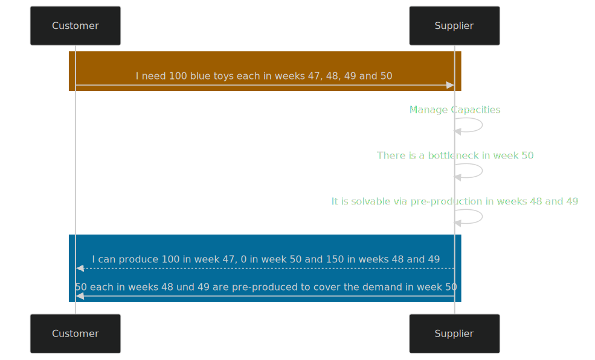
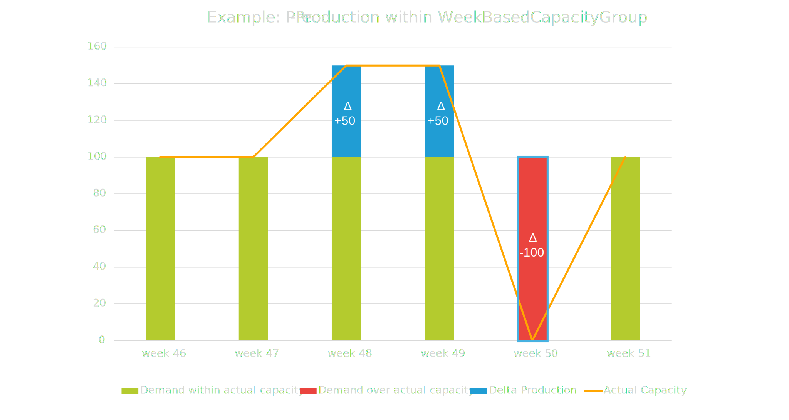

## Business Roles and Functions

Delta production data is embedded into the WeekBasedCapacityGroup aspect model. This means that only suppliers provide delta production related data and customers consume it.

|Function / Role|Customer|Supplier|
|-|-|-|
|Solve bottleneck via pre-/post production||X|
|Solve bottleneck via post production||X|
|Inform customer||X|
|Acknowledge that bottleneck has been solved|X||

## Business value
Simulated Delta-Production is a feature that helps suppliers to manage their production capacity more effectively. It allows them to address and balance capacity shortages without having to increase their actual or maximum capacity. Suppliers can choose to use this feature, but it is not mandatory. 

The main advantage of using simulated Delta-Production is that it gives suppliers a way to manage small capacity shortfalls. This can be done manually or automatically, which saves time and effort that would otherwise be spent on frequent capacity adjustments, particularly when demand is unpredictable.

**Advantages**

- Solve minor bottlenecks via pre production
- Optimize utilization
- Smoothen demand and capacity peaks
- No frequent alerting for minor bottlenecks which can be solved by the supplier (within its actual capacity)

Simulated Delta-Production enables suppliers to add extra detail to their capacity information. This helps illustrate solutions for capacity issues or times when production resources might be offline. Only the end results of simulated Delta-Production are shared with the customer. Suppliers may input a simulated Delta-Production value for each week as needed, which shows an increase or decrease in planned demand without actually changing the real figures.

## Functional description


Figure: *Capacity group structure with linked material demand including delta production result*

Simulated delta-production may be used within a Capacity Group to indicate how production can be adjusted to meet demand. It helps cover potential shortfalls by showing where goods could be produced earlier or later than currently demanded. Therefore Simulated Delta-Production covers both simulated pre-production and post-production activities.

Suppliers can provide these simulated values on a weekly basis alongside their regular capacity data via parameter
```json
"deltaProductionResult"
```
| Main Parameters | Mandatory? | Description | Example |
|-|-|-|-|
| deltaProductionResult | no | Delta related to the aggregated material demand after pre-/post production calculation the supplier wants to send to the customer. Can be positive and negative.| Decimal value (e.g. "400"). |

There's no need to give details about the duration of these adjustments, as this can be inferred from the number of weeks for which the simulated data is provided.
When comparing demand and capacity data, the simulated values are considered without altering the actual data. If a simulated Delta-Production value is provided, it must be included in the weekly demand and capacity comparison. A positive value indicates a virtual increase in planned demand, while a negative value indicates a virtual decrease.

**Considerations**

- The standard does not provide individual calculation logic for delta production, only the results may be transferred
- Calculation automation and smoothing logic is subject to suppliers individual planning requirements and tools
- Consideration of e.g. stock levels, storage capacity, transport capacity, product or part versioning, perishability, storing or handling requirements is subject to suppliers individual planning and product requirements

Simulated Delta-Production must not change the material demand. It's strictly a simulation feature.
Suppliers can use comments to provide customers with additional information about the simulated Delta-Production. For more details on this communication feature, see Chapter 5.9 in the CX-0128 DCM Standard document.

## Example
#### Sequence Diagram

Figure: *Sequence Diagram for Delta-Production*


Figure: *Visualized example of results of simulated Delta-Production (with pre-production)*

#### Sample Data

```json
{
  "unitOfMeasureIsOmitted" : false,
  "unitOfMeasure" : "unit:piece",
  "linkedDemandSeries" : [ {
    "loadFactor" : 3.5,
    "materialNumberCustomer" : "MNR-7307-AU340474.002",
    "materialNumberSupplier" : "MNR-8101-ID146955.001",
    "customerLocation" : "BPNS8888888888XX",
    "demandCategory" : {
      "demandCategoryCode" : "0001"
    }
  } ],
  "supplier" : "BPNL6666666666YY",
  "linkedCapacityGroups" : [ "be4d8470-2de6-43d2-b5f8-2e5d3eebf3fd" ],
  "name" : "Spark Plugs on drilling machine for car model XYZ",
  "supplierLocations" : [ "BPNS8888888888XX" ],
  "capacities" : [ {
    "pointInTime" : "2022-08-01",
    "actualCapacity" : 1000,
    "maximumCapacity" : 2000,

    "deltaProductionResult" : 400

  } ],
  "changedAt" : "2023-03-10T12:27:11.320Z",
  "capacityGroupId" : "0157ba42-d2a8-4e28-8565-7b07830c1110",
  "customer" : "BPNL8888888888XX"
}
```

For further details, please refer to [CX-0128 Demand and Capacity Management Data Exchange][StandardLibrary].

## Notice

This work is licensed under the [CC-BY-4.0](https://creativecommons.org/licenses/by/4.0/legalcode)

- SPDX-License-Identifier: CC-BY-4.0
- SPDX-FileCopyrightText: 2023,2024 ZF Friedrichshafen AG
- SPDX-FileCopyrightText: 2023,2024 Bayerische Motoren Werke Aktiengesellschaft (BMW AG)
- SPDX-FileCopyrightText: 2023,2024 SAP SE
- SPDX-FileCopyrightText: 2023,2024 Volkswagen AG
- SPDX-FileCopyrightText: 2023,2024 Mercedes Benz Group AG
- SPDX-FileCopyrightText: 2023,2024 BASF SE
- SPDX-FileCopyrightText: 2023,2024 SupplyOn AG
- SPDX-FileCopyrightText: 2023,2024 Henkel AG & Co.KGaA
- SPDX-FileCopyrightText: 2023,2024 Fraunhofer-Gesellschaft zur Förderung der angewandten Forschung e.V (Fraunhofer)
- SPDX-FileCopyrightText: 2023,2024 Capgemini Deutschland GmbH
- SPDX-FileCopyrightText: 2023,2024 Contributors to the Eclipse Foundation

[StandardLibrary]: https://catenax-ev.github.io/docs/next/standards/CX-0128-DemandandCapacityManagementDataExchange
