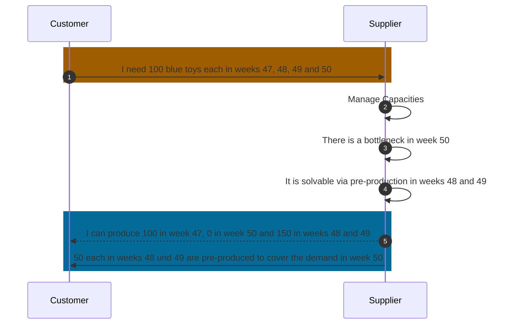
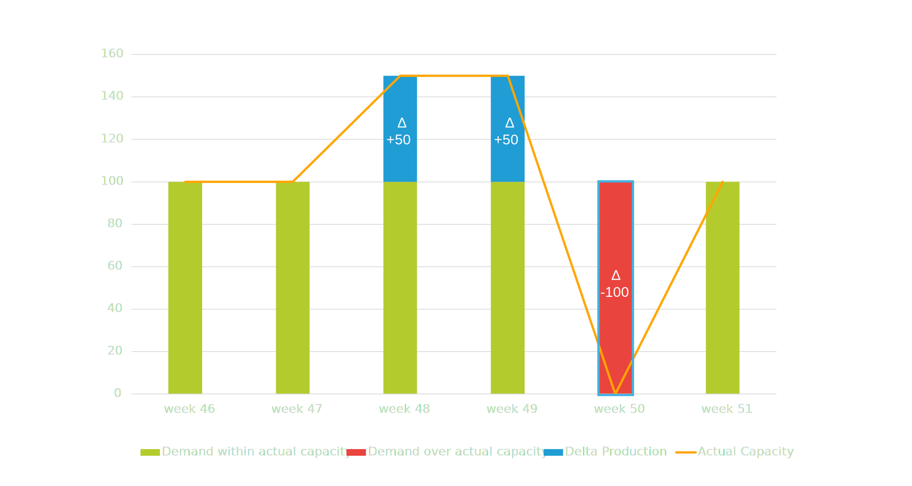

## Business Roles and Functions

Delta-Production data is embedded into the WeekBasedCapacityGroup aspect model. This means that only suppliers provide Delta-Production related data and customers consume it.

|Function / Role|Customer|Supplier|
|-|-|-|
|Solve bottleneck via pre-/post production||X|
|Inform customer||X|
|Acknowledge that bottleneck has been solved|X||

## Business value

Simulated Delta-Production is a feature that helps suppliers to manage their production capacity more effectively. It allows them to address and balance capacity shortages without having to increase their actual or maximum capacity. Suppliers can choose to use this feature, but it is not mandatory.

The main advantage of using simulated Delta-Production is that it gives suppliers a way to manage small capacity shortfalls. This can be done manually or automatically, which saves time and effort that would otherwise be spent on frequent capacity adjustments, particularly when demand is unpredictable.

### Advantages

- Solve minor bottlenecks via pre-production/post-production
- Optimize utilization
- Smoothen demand and capacity peaks
- No frequent alerting for minor bottlenecks which can be solved by the supplier (within its actual or maximum capacity)

Simulated Delta-Production enables suppliers to add extra detail to their capacity information. This helps illustrate solutions for capacity issues or times when production resources might be offline. Only the end results of simulated Delta-Production are shared with the customer. Suppliers may input a simulated Delta-Production value for each week as needed, which shows an increase or decrease in planned demand without actually changing the real figures.

## Functional description

Figure: *Capacity group structure with linked material demand including simulated Delta-Production Result*

<!--
block-beta
columns 10
A1("WeekBasedCapacityGroup"):10
B1("Supplier")
B2("Customer")
B3("CapacityGroupID")
B4("changedAt")
B5("Calendar Week"):3
B8("DemandSeries"):3
C1("Inactive flag")
C2("UnitOfMeasure")
space
C4("CapacityGroupName")
C5("ActualCapacity")
C6("MaximumCapacity")
C7("AgreedCapacity")
C8("MaterialNumberCustomer")
C9("DemandCategory")
C10("CustomerLocation")
space:4
D5("DeltaProductionResult")
space:2
D8("PointInTime")
D9("Quantity")

classDef Demand_must fill:#FFA600,stroke:#FFFFFF,color:#000000
classDef Capacity_must fill:#B3CB2D,stroke:#FFFFFF,color:#000000
classDef Demand_optional fill:#BF7100,stroke:#FFFFFF,color:#000000
classDef Capacity_optional fill:#617000,stroke:#FFFFFF,color:#000000
classDef Highlite fill:#617000,stroke:#FF0000,color:#000000
class A1,B1,B2,B3,B4,B5,C4,C5,C6,C7,D6,D7 Capacity_must
class B8,C8,C9,C10,D8,D9 Demand_must
class D5 Highlite
class C1,C2,C7,D7 Capacity_optional
-->
<!--
block-beta
A["Demand data (MUST)"] style A fill:#FFA600,color:#F4F2F3
B["Demand data (optional)"] style B fill:#BF7100,color:#F4F2F3
C["Capacity data (MUST)"] style C fill:#B3CB2D,color:#F4F2F3
D["Capacity data (optional)"] style D fill:#617000,color:#F4F2F3
-->

Simulated Delta-Production may be used within a capacity group to indicate how production can be adjusted to meet demand. It helps cover potential shortfalls by showing where goods could be produced earlier or later than currently demanded. Therefore simulated Delta-Production covers both pre-production and post-production activities.

Suppliers can provide these values on a weekly basis alongside their regular capacity data via parameter:

| Main Parameters | Required? | Description | Example |
|-|-|-|-|
| Delta Production Result | No | Delta related to the aggregated material demand after pre-/post production calculation the supplier wants to send to the customer. Can be positive and negative.| Decimal value (e.g. "400"). A value of 400 means that in the respective week 400 units of the material will be pre-produced.|

There's no need to give details about the duration of these adjustments, as this can be inferred from the number of weeks for which the simulated data is provided.
When comparing demand and capacity data, the simulated values are considered without altering the actual data. If a simulated Delta-Production value is provided, it must be included in the weekly demand and capacity comparison. A positive value indicates a virtual increase in planned demand, while a negative value indicates a virtual decrease.

### Considerations

- The standard does not define individual calculation logic for simulated Delta-Production, only the results may be submitted
- Suppliers should apply appropriate smoothing algorithms, depending on their planning requirements and toolchains
- Consideration of e.g. stock levels, storage capacity, transport capacity, product or part versioning, perishability, storing or handling requirements is subject to suppliers individual planning and product requirements

Simulated Delta-Production must not change the material demand. It's strictly a simulation feature.
Suppliers can use comments to provide customers with additional information about the simulated Delta-Production. For more details on this communication feature, see Chapter 5.9 of [CX-0128 Demand and Capacity Management Data Exchange][StandardLibrary].

## Example

### Sequence Diagram

Figure: *Utilizing simulated delta-production to solve a production problem*

Figure: *Visualized example of results of simulated Delta-Production (with pre-production)*

For further details, please refer to [CX-0128 Demand and Capacity Management Data Exchange][StandardLibrary].

### Sample Data

For sample data please refer to [Aspect Model - WeekBasedCapacityGroup](../../development-view/model-capacity-group.md).

## Notice

This work is licensed under the [CC-BY-4.0](https://creativecommons.org/licenses/by/4.0/legalcode)

- SPDX-License-Identifier: CC-BY-4.0
- SPDX-FileCopyrightText: 2023 BASF SE
- SPDX-FileCopyrightText: 2023 Bayerische Motoren Werke Aktiengesellschaft (BMW AG)
- SPDX-FileCopyrightText: 2024 Capgemini SE
- SPDX-FileCopyrightText: 2023 Fraunhofer-Gesellschaft zur Förderung der angewandten Forschung e.V (Fraunhofer)
- SPDX-FileCopyrightText: 2023 Henkel AG & Co.KGaA
- SPDX-FileCopyrightText: 2023 Mercedes Benz Group AG
- SPDX-FileCopyrightText: 2023 SAP SE
- SPDX-FileCopyrightText: 2023 SupplyOn AG
- SPDX-FileCopyrightText: 2023 Volkswagen AG
- SPDX-FileCopyrightText: 2023 ZF Friedrichshafen AG
- SPDX-FileCopyrightText: 2023 Contributors to the Eclipse Foundation

[StandardLibrary]: https://catenax-ev.github.io/docs/next/standards/CX-0128-DemandandCapacityManagementDataExchange
