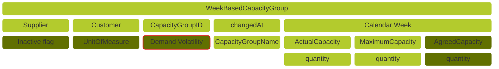

## Business Roles and Functions

Demand Volatility data is embedded into the WeekBasedCapacityGroup aspect model. This means that only suppliers provide Demand Volatility related data and customers consume it.

|Function / Role|Customer|Supplier|
|-|-|-|
|Define parameters for calculating Demand Volatility||X|
|Calculate Demand Volatility||X|
|Inform business partner about parameters for calculating Demand Volatility||X|
|Inform business partner about calculated Demand Volatility||X|
|Acknowledge Demand Volatility calculation|X||
|Reproduce Demand Volatility calculation|X||

## Business Value

Demand Volatility metrics help suppliers to identify and measure volatility in demands. It allows them to address Demand Volatility directly to their customers, increasing transparency for a more effective collaborative capacity planning. Demand Deviation is the first metric for measuring Demand Volatility in the [CX-0128 Demand and Capacity Management Data Exchange][StandardLibrary] (see chapter 5.11 Demand Volatility Metrics).

The exchange of measurements of the demand deviation metric between business partners in the automotive supply chain leads to the following advantages:

- stabilize supply chain by introducing Demand Volatility measures
- making fluctuations in customer demands transparent
- facilitating collaboration between business partners regarding demand patterns
- taking action to stabilize demand levels in the supply chain over time
- improving the balance between demands and capacity
- reducing the costs of supply chain operations

## Functional Description Demand Volatility

Supply chains in the automotive industry are characterized by a dynamic operating environment that manifests itself in regular changes in delivery and production requirements. This leads to varying degrees of Demand Volatility that customers communicate to their suppliers, in short term as well as long term planning horizons.

Empirical analyses prove that high levels of Demand Volatility lead to high levels of unplanned supply chain efforts and costs mostly linked to readjustments of supply chain plans and to increased inventories across all tiers of the automotive supply chain.

An effective approach to address the negative consequences of Demand Volatility is to systematically measure them and thus make them transparent. This facilitates collaborative alignments between supply chain partners in order to reduce Demand Volatility and increase the stability of supply plans. Therefore, the [CX-0128 Demand and Capacity Management Data Exchange][StandardLibrary] includes a simple Demand Volatility metric: “Demand Deviation”. Figure 1 shows that the parameters and metrics that are processed for Demand Deviation form part of the dataset of the capacity group, which is also handled by suppliers. The metric is generally based on the comparison of the current aggregated demand measured for a defined capacity group with a previous aggregated demand. It is recommended to measure Demand Deviation on a monthly basis. Hence, a 4-week offset between measurements of current and previous demands is recommended.

<!--

-->

Figure: *Demand Volatility within capacity group*

Feature Demand Volatility is to be used optional but if it is used certain parameters are required to be filled.

__Parameters of the Demand Volatility metric are as follows:__

| Main Parameters | Required? | Description | Example |
|-|-|-|-|
| Start Reference Date Time | Yes | Point in time when the measurement is initiated on suppliers side. It needs to be a point in time after receiving the active flag. It also marks the beginning of the first reporting interval/subhorizon| A value of 2024-08-01 indicates the measurement will start as of August 1st 2024. |
| Measurement Interval | Yes | Indicates the length in weeks between two measurements. First interval start with the *Start Reference Date Time*. Second interval starts the mentioned weeks after this date and so on | A value of 4 indicates a measurement will be taken each 4 weeks, starting with the *Start Reference Date Time*. |
| Sequence Number | Yes | Sequence Number of the respective subhorizon. The time frame can be divided into any positive number of individual subhorizons | A value of 2 indicates that this specific subhorizon is subhorizon number 2.|
| Subhorizon Lengths | Yes | Length of an individual subhorizon. Minimum length is always one week per individual subhorizon due to the DCM granularity | In the example having a *Sequence Number* set as 2, a value of 6 indicates that subhorizon 2 has a length of 6 weeks. |
| Absolute Negative Deviation | No | Absolute negative deviation threshold which triggers an alert | E.g. -100 units (value 100) means an alert is triggered if the absolute negative deviation between two measurement intervals for a respective calendar week decrease by 100 or more units. |
| Absolute Positive Deviation | No | Absolute positive deviation threshold which triggers an alert | E.g. 100 units (value 100) means an alert is triggered if the absolute positive deviation between two measurement intervals for a respective calendar week increases by 100 or more units. |
| Relative Negative Deviation | No | Relative negative deviation threshold which triggers an alert | E.g. -30% (value 0,3) means an alert is triggered if the relative negative deviation between two measurement intervals for a respective calendar week decrease by 30% or more. Value can be set between 0 and 1. |
| Relative Positive Deviation | No | Absolute negative deviation threshold which triggers an alert | E.g. 20% (value 0,2) means an alert is triggered if the relative positive deviation between two measurement intervals for a respective calendar week increase by 20% or more. Value can be set between 0 and 1. |

For further details please refer to [Aspect Model WeekBasedCapacityGroup](../../development-view/model-capacity-group.md).

## Example of Demand Volatility Measurements

```mermaid
sequenceDiagram
autonumber
Participant c as Customer
Participant s as Supplier
rect rgb(157,93,00) 
    c->>s: I need 1000 red toys in week 19
end
c->>c: Wait 4 weeks
rect rgb(157,93,00) 
    c->>s: I need 100 red toys in week 19
end
s->>s: I should really start measuring the volatility of my customers demands
c->>c: Wait 4 weeks
rect rgb(157,93,00) 
    c->>s: I need 75 red toys in week 19
end
s->>s: I start transferring the volatility of my customers demands
rect rgb(64,74,00)
    s->>c: I started measuring Demand Deviation, using the following parameters:
    autonumber off
    s-->>c: Measurement Interval is set to 4 weeks
    s-->>c: Increase limited to max. 20% in subhorizon 3
    s-->>c: Decrease limited to max. -20% in subhorizon 3
    s-->>c: Measurement starts in week 0, using 4 subhorizons of length (2,11,39,52) 
end
```

Figure: *Utilizing demand volatility metrics to address data consistency issues*

For further details, please refer to [CX-0128 Demand and Capacity Management Data Exchange][StandardLibrary].

## Notice

This work is licensed under the [CC-BY-4.0](https://creativecommons.org/licenses/by/4.0/legalcode)

- SPDX-License-Identifier: CC-BY-4.0
- SPDX-FileCopyrightText: 2023 BASF SE
- SPDX-FileCopyrightText: 2023 Bayerische Motoren Werke Aktiengesellschaft (BMW AG)
- SPDX-FileCopyrightText: 2023 Fraunhofer-Gesellschaft zur Förderung der angewandten Forschung e.V (Fraunhofer)
- SPDX-FileCopyrightText: 2023 Henkel AG & Co.KGaA
- SPDX-FileCopyrightText: 2023 Mercedes Benz Group AG
- SPDX-FileCopyrightText: 2023 SAP SE
- SPDX-FileCopyrightText: 2023 SupplyOn AG
- SPDX-FileCopyrightText: 2023 Volkswagen AG
- SPDX-FileCopyrightText: 2023 ZF Friedrichshafen AG
- SPDX-FileCopyrightText: 2023 Contributors to the Eclipse Foundation

[StandardLibrary]: https://catenax-ev.github.io/docs/next/standards/CX-0128-DemandandCapacityManagementDataExchange
