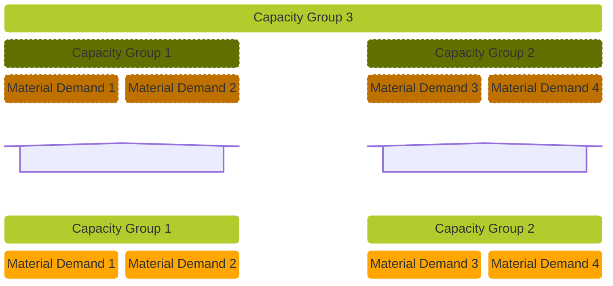
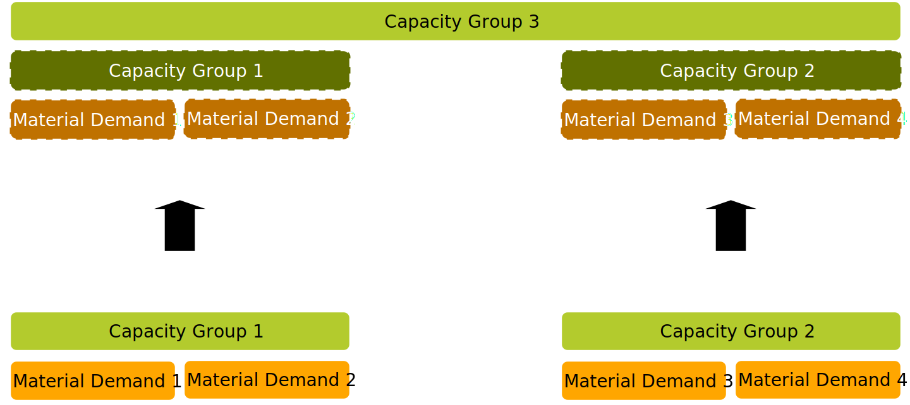
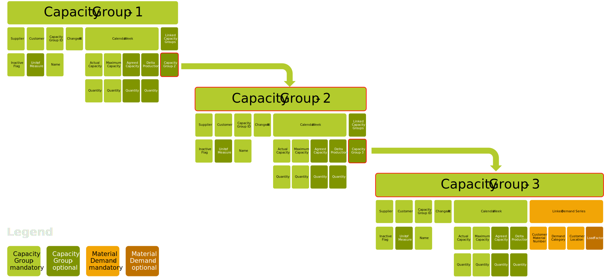
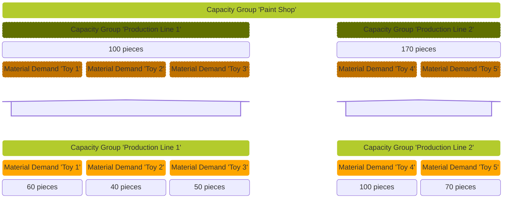

## Business Roles and Functions

Nesting is a feature defined in the DCM standard [CX-0128 Demand and Capacity Management Data Exchange][StandardLibrary] and includes an advanced property of the Capacity Group structure and therefore may be used optionally by suppliers. The Nesting feature is embedded into the WeekBasedCapacityGroup aspect model. This means that only suppliers may apply Nesting and customers consume it.

|Function / Role|Customer|Supplier|
|-|-|-|
|Define Nesting in a Capacity Group||X|
|Inform business partners about Nesting via data transfer||X|
|Receive Nesting information|X||

## Business Value

Nesting may be used by suppliers for the following purposes (but not limited to):

- To simplify the maintenance of Capacity Groups
- To enable the bundling of several smaller Capacity Groups to reflect a (virtual, internal) company structure

### Advantages

- Avoid increased maintenance efforts if same Material Demands may be required for another Capacity Group
- Allows to provide additional transparency to customers

## Functional Description

Nesting is an indirect linking of Material Demand information to a Capacity Group done by a supplier. It involves connecting the WeekBasedCapacityGroup to another WeekBasedCapacityGroup that is already linked to a WeekBasedMaterialDemand.
Suppliers may apply Nesting within WeekBasedCapacityGroup aspect model via the parameter `linkedCapacityGroups`.

For more transparent collaboration, a supplier may also aggregate two or more Capacity Groups and share this aggregated Capacity Group with its customer, if all aggregated Capacity Groups refer to the same customer (BPNL).
Nesting helps suppliers for example to map the internal production sequence in the Capacity Groups, e.g. the combination of two production lines into one final assembly line can be mapped by linking the two Capacity Groups of the preceding lines into another Capacity Group (see [Example](#example)).
The same applies to multiple production plants representing a customer's total allocated capacity for materials.

The supplier is able to put the desired Capacity Groups with their respective demands and capacities together and then share it with the customer.

Consolidation is performed only on the demand and not on the capacity side when Nesting is used: all related capacity information is fully independent, i.e. the capacity data in the Capacity Group must be maintained individually. If a Capacity Group contains linked Capacity Groups, then the Material Demands of these linked Capacity Groups are summed up and used as aggregated demand. The supplier must either link individual Material Demands or link existing Capacity Groups in the Capacity Group.

The following figure shows that:  

- Capacity Group 1 and 2 are linked to Capacity Group 3 (i.e. Nesting or indirect linking).  
- Material Demand 1 and 2 are linked to Capacity Group 1 (i.e. direct linking).
- Material Demand 3 and 4 are linked to Capacity Group 2 (i.e. direct linking).
- Capacity Group 3 considers the Material Demands 1, 2, 3 and 4 because they are indirectly linked via the nested Capacity Group.

<!--

-->

<!--

-->

Figure: *Capacity Group with directly linked Material Demands or nested Capacity Groups (indirectly linked Material Demands)*

Capacity Group 3 is the result of the indirect way of linking Material Demand, therefore it must not contain any additional directly linked Material Demands.

If a linked Capacity Group contains further linked Capacity Groups (dark green in figure below), the Nesting is recurrent and must go further until referenced Capacity Groups contain only linked demand series (orange in figure below) ("domino effect").

Figure: *Recurrent nested Capacity Groups*

### Considerations

- It must not be possible to have a combination of directly linked Material Demand series and linked Capacity Groups (Nesting) within the same Capacity Group.
- Suppliers can use comments to provide customers with additional information about the Nesting. For more details on this communication feature, see chapter 5.9 in [CX-0128 Demand and Capacity Management Data Exchange][StandardLibrary] or [Comments](comments.md) page in DCM Kit of Tractus-X.
- Suppliers should be carefully applying recurring linked Capacity Groups ("domino effect"), because of the complexity of keeping track on changes and in maintenance. It is more difficult to identify and understand demand changes and where they are originating from (e.g. which part).

Feature Nesting is to be used optional but if it is used certain parameters are required to be filled.

**Parameters of the Nesting are as follows:**

| Main Parameters | Required? | Description | Example |
|-|-|-|-|
| linkedCapacityGroups | No | UUID of the linked Capacity Group | 0157ba42-d2a8-4e28-8565-7b07830c1110 |

For further details please refer to [Aspect Model - WeekBasedCapacityGroup](../../development-view/model-capacity-group.md).

## Sequence Diagram

```mermaid
sequenceDiagram
autonumber
Participant c as Customer
Participant s as Supplier
rect rgb(191,113,00) 
    c->>s: I need 60 pieces of toy 1, 40 pieces of toy 2 and 50 pieces of toy 3
    c->>s: I need 100 pieces of toy 4 and 70 pieces of toy 5
end
s->>s: Toys 1, 2 and 3 are produced on line 1, toys 4 and 5 on line 2 and all toys have to pass through paint shop
rect rgb(64,74,00)
    autonumber off
    s-->>c: Your demand and my capacities need to be assigned to 3 different capacity groups.
    autonumber 4
    s->>c: Toys 1, 2 and 3 are part of capacity group "Production Line 1"
    s->>c: Toys 4 and 5 are part of capacity group "Production Line 2"
    autonumber off
    s-->>c: All toys have to be colored in the paint shop
    autonumber 6
    s->>c: Nesting "Production Line 1" and "Production Line 2" in "Paint Shop" instead of linking each Material Demand separately again
end
c->>c: My demands for all 5 toys are interlinked and transparent that they affect same capacity together
```

Figure: *Utilizing nesting to structure demand and capacity data*

For further details, please refer to [CX-0128 Demand and Capacity Management Data Exchange][StandardLibrary].

## Example

The supplier produces five different toys on two different production lines for the customer. Afterwards the produced toys of both production lines are colored in the same paint shop.
All five toys pass through the same paint shop within the coloring process.

- Production line 1 is used to produce toys 1, 2 and 3 for the customer.
- Production line 2 is used to produce toys 4 and 5 for the customer.
- The supplier has created a Capacity Group "Production Line 1" with the directly linked Material Demands of toys 1, 2 and 3.
- The supplier has also created a Capacity Group "Production Line 2" with the directly linked Material Demands of toys 4 and 5.
- For the paint shop the supplier has created another Capacity Group "Paint Shop", but without directly linked Material Demands. Instead, the supplier linked the Capacity Groups "Production Line 1" and "Production Line 2".
- The customer requires 60 pieces of toy 1, 40 pieces of toy 2 and 50 pieces of toy 3 in the respective week. Therefore the Capacity Group "Production Line 1" has an aggregated Material Demand of 150 pieces per week.
- Of toy 4, the customer wants 100 pieces and of toy 5 70 pieces in the respective week. Accordingly the related Capacity Group "Production Line 2" shows an aggregated Material Demand of 170 pieces per week.

With the Nesting, the supplier achieves that the latest Material Demands that are linked to "Production Line 1" and "Production Line 2" are automatically available and considered in his Capacity Group "Paint Shop" without any further activities. Also in case a new toy 6 would be requested by same customer and produced on e.g. "Production Line 2", the supplier would only need to add it to that Capacity Group and automatically its Material Demand would also be considered in the Capacity Group "Paint Shop", thus also avoiding time-consuming additional maintenance on the demand side for "Paint Shop" Capacity Group.

<!--

-->

<!--

-->

Figure: *Example for application of Nesting*

For further details, please refer to [CX-0128 Demand and Capacity Management Data Exchange][StandardLibrary].

## Notice

This work is licensed under the [CC-BY-4.0](https://creativecommons.org/licenses/by/4.0/legalcode)

- SPDX-License-Identifier: CC-BY-4.0
- SPDX-FileCopyrightText: 2024 BearingPoint Holding B.V
- SPDX-FileCopyrightText: 2024 SAP SE
- SPDX-FileCopyrightText: 2024 Volvo Car Corporation
- SPDX-FileCopyrightText: 2024 Contributors to the Eclipse Foundation

[StandardLibrary]: https://catenax-ev.github.io/docs/next/standards/CX-0128-DemandandCapacityManagementDataExchange
