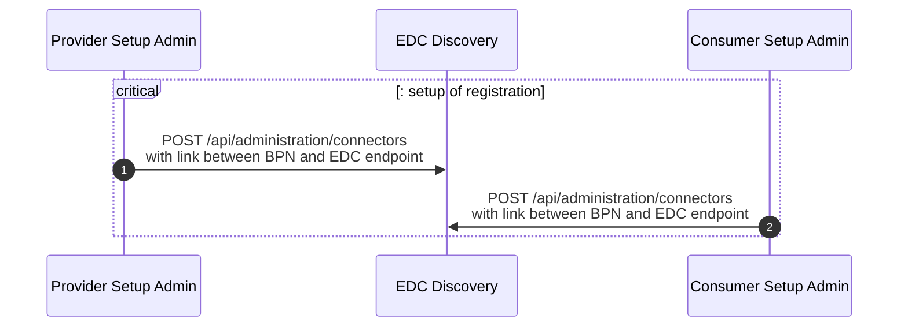
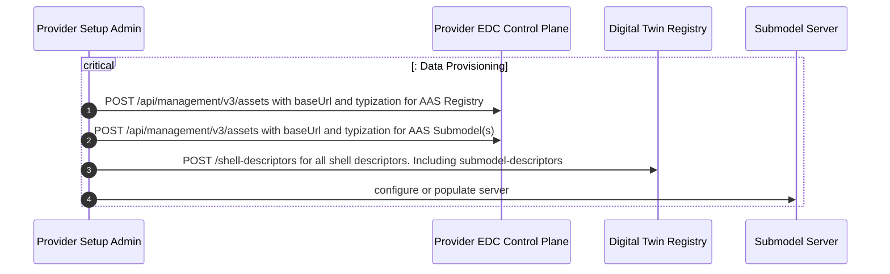
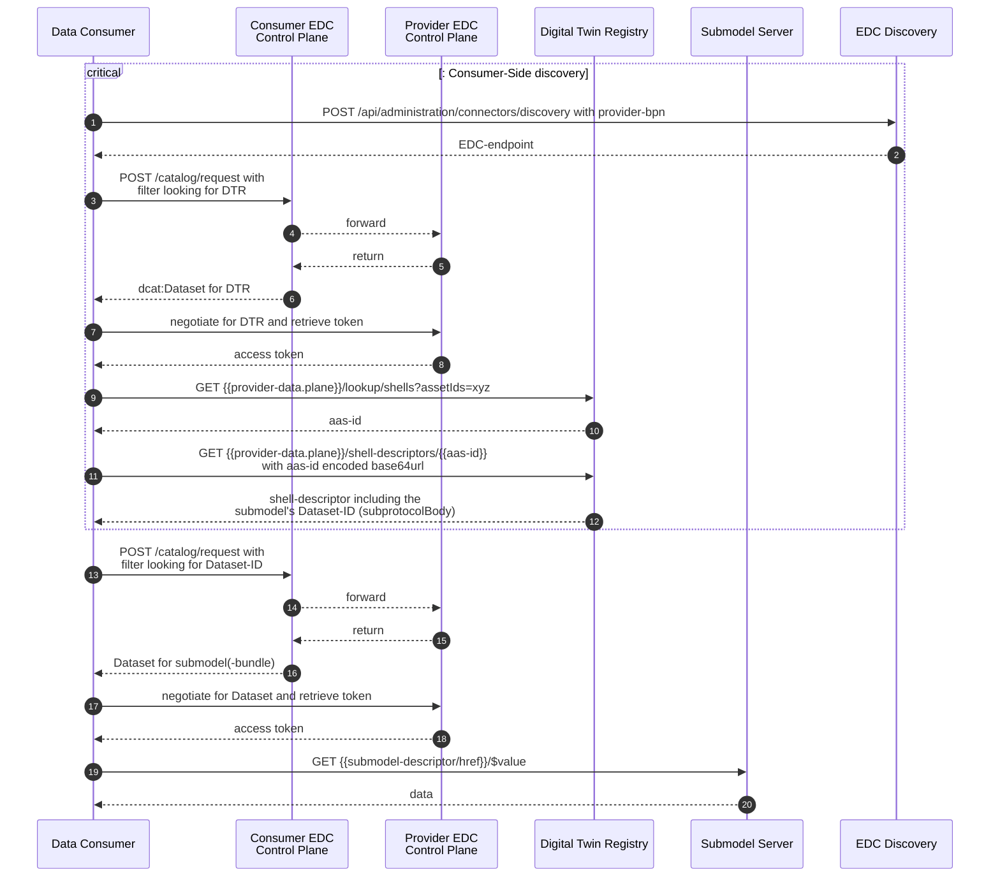
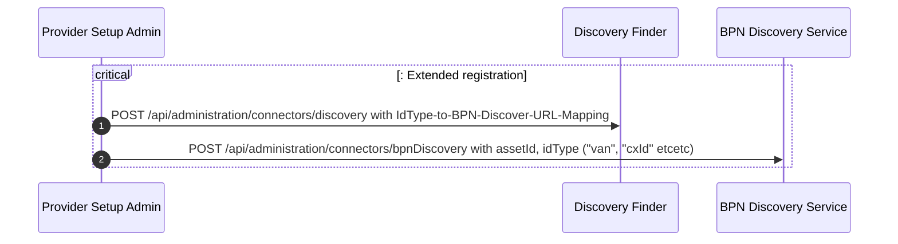
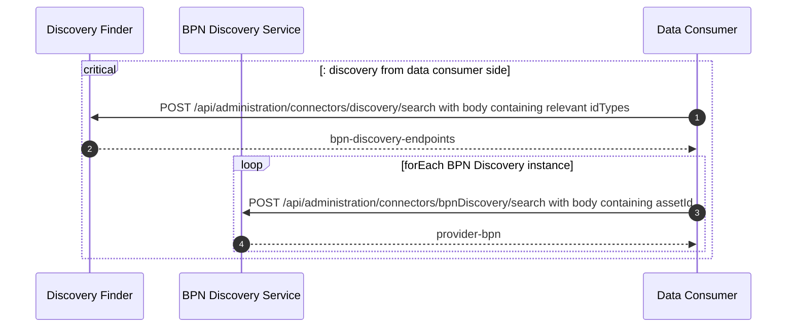
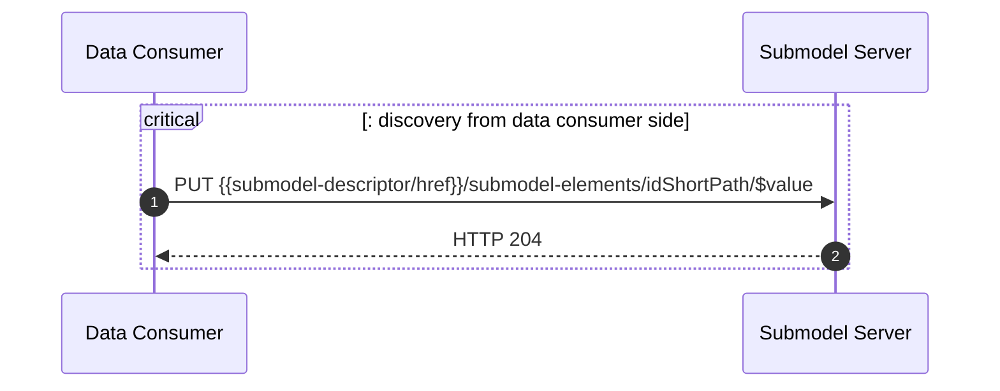

## Interaction Patterns for Distributed Digital Twins

The Catena-X standard CX-0002 (Digital Twins in Catena-X) defines a subset of the AAS-standard that is relevant for
Catena-X. However, it is concerned only with the network-facing APIs which in some cases may have to be augmented to
cover use-case requirements. For example, resolving `specificAssetIds` against a Shell's `id` is standardized since
Consumers rely on a well-defined API here. However, how the Provider ingests the relevant data into the DTR usually
isn't
relevant for cross-dataspace interoperability and thus, the call isn't standardized.

While the assumptions are explicitly listed, all patterns assume that both partners involved are properly onboarded to
the Catena-X dataspace and thus have their connectors registered with the EDC Discovery Service like so:

This happens usually when onboarding a company to the network.

> Note: While this Kit explicitly uses the APIs of the EDC (Eclipse Dataspace Connector), provisioning data with
> any other implementation of
> the [Dataspace Protocol](https://docs.internationaldataspaces.org/ids-knowledgebase/v/dataspace-protocol/overview/readme)
(DSP) is also permitted. The flows to integrate DTRs and Submodel endpoints will differ with each implementation.

### 1. Fetching a supplier's Twin

| Scenario                                                                    | Participants                                           | Assumptions                                                                 | Links to Use-Cases                                                                                                                                                     |
|-----------------------------------------------------------------------------|--------------------------------------------------------|-----------------------------------------------------------------------------|------------------------------------------------------------------------------------------------------------------------------------------------------------------------|
| The supplier has data required by the OEM. For instance a Product Passport. | - Data Provider (Supplier)   - Data Consumer (OEM) | 1. Consumer knows Supplier's BPN   2. Consumer knows an id of the asset | - [Industry Core](../../Industry%20Core%20Kit/Software%20Development%20View/page_digital-twins.mdx)   - [Product Carbon Footprint Kit](../../PCF%20Exchange%20Kit) |

The most common integration pattern with Digital Twins aims to offer asset-related data in expectable ways along the
supply chain. It defines conventions that allow locating data in the network. This most basic scenario assumes that the
supplier offers data about an asset that was sold to an OEM further up the chain. Supplier and OEM have agreed on
contractual terms on which to share data about said asset. Possible examples may include Bills of Material, carbon
footprints, technical specifications or regulatory documents. An OEM - or really any interested and privileged third
party - can assume that a part's supplier offers a Digital Twin if the data-exchange is based on the Digital Twin Kit
(and by proxy CX-0002). The data provider deploys at least:

- Digital Twin Registry (DTR)
  - registered in a DSP-conformant connector offering the DTR to the Dataspace.
  - registers Digital Twins (AssetAdministrationShell-descriptors - or AAS descriptor - in AAS vocabulary) with assetIds
    including at least one that's known at both, the supplier and customer.
- Submodels
  - registered in a DSP-conformant connector to the Dataspace.
  - registered to the correct AAS-descriptor in the DTR.
  - Serving payloads from the `/$value` endpoint, in accordance with their semantic definition.

The Data Provider's setup is explained here:

The Data Consumer's only responsibility is to deploy a connector, negotiate for access and terms of usage and finally
fetch the data from the right offers. The flow is specified here:

If the `data` is a Bill of
Material ([like this one](https://github.com/eclipse-tractusx/sldt-semantic-models/blob/main/io.catenax.single_level_bom_as_built/2.0.0/gen/SingleLevelBomAsBuilt.json))
it returns a list of `childItems` that hold for each subcomponent the information that's assumed to be present
for the start of this very scenario (see Assumptions 1, 2). Thus, BoM and the DT deployment in combination
enable recursive browsing of the parts-tree, collecting data along the way - given the data owners grant access.

### 2. Adding a new Twin for a given Asset

| Scenario                                                                                                      | Participants                                                   | Assumptions                             | Links to Use-Cases    |
|---------------------------------------------------------------------------------------------------------------|----------------------------------------------------------------|-----------------------------------------|-----------------------|
| A party (who is not the supplier of an part) publishes data about a previously uncovered aspect of the asset. | - Data Provider (Supplier)   - Data Provider (Third Party) | 1. Third Party knows an id of the asset | - PURIS (coming soon) |

Let's suppose, a car has reached it end-of-life. The object is sold to a dismantler who disassembles the vehicle and
wants
to publish that exact information. As the Digital Twin is owned by the OEM of the vehicle, it will not be accessible,
even less writable, to everyone in the network. Thus, the dismantler must publish the data themselves, by deploying:

- Digital Twin Registry (DTR)
  - registered in a DSP-conformant connector offering the DTR to the Dataspace.
  - registers Digital Twins (AAS-descriptors in AAS vocabulary) with assetIds including at least one that's
    equivalent to one attached to the OEM's twin.
- Submodel (like [_Certificate of
  Destruction_](https://github.com/eclipse-tractusx/sldt-semantic-models/blob/4889d8482fc6b233eb0f56f3ac94c5ea4004bc05/io.catenax.certificate_of_destruction/1.0.1/gen/CertificateOfDestruction.json))
  - registered in a DSP-conformant connector to the Dataspace.
  - registered to the correct AAS-descriptor in the DTR.
  - Serving arbitrary but well-specified json via `GET` requests from the `/$value` endpoint.

#### 2.1. Discovery by Convention

In certain use-cases, participants can agree on conventions where a specific Submodel may be expected.
This information can only be provided by the buyer of a certain part who creates a new Twin for the part with identical
`assetIds`. Such conventions about how to locate certain types of Submodels should be explicitly mentioned in the
Standards and Kits for a use-case as the default hypothesis is always that a supplier holds the relevant data.

For discovery of digital twins for parts, it might be useful to standardize the specific asset IDs the supplier should
attach to its part twin. Via these `specificAssetIds` the corresponding digital twin of the part can be found by the
OEM. If the `globalAssetId` is known to the OEM it is not necessary to defined additional specific asset IDs. Both serve
similar purposes and are defined in the [AAS-Specification](https://aas-core-works.github.io/aas-core-meta/v3/AssetInformation.html#properties).

If multiple parties publish data on the same asset, each follows the Data Provisioning flow
from [the default case](#1-fetching-a-suppliers-twin)

#### 2.2. Discovery by Registration

If no heuristic is precise enough to expect a Submodel's location, the dismantler must signal in
a [BPN-Discovery-Service](../page_software-operation-view.md)
that they indeed have data on said vehicle. This is the registration process:

It is followed by the regular Provisioning Process from [the default case](#1-fetching-a-suppliers-twin). That way, any
interested Data Consumer can not only find data with the part's manufacturer but
also all third parties returned by the BPN Discovery Service who have registered there and interacted with the part
sometime during its lifecycle. The Consumer's workflow to retrieve the registered data is (like the registration)
extended
as this scenario does not make the assumption that the Consumer knows the BPN of the data they're interested in. This is
healed by querying the previously populated discovery services to retrieve the BPN.

After that, [the default consumption process](#1-fetching-a-suppliers-twin) is executed.

### 3. Updating an existing Submodel

| Scenario                                                                                           | Participants                                                   | Assumptions                             | Links to Use-Cases      |
|----------------------------------------------------------------------------------------------------|----------------------------------------------------------------|-----------------------------------------|-------------------------|
| A party (who is not the supplier of an part) updates data already covered by an existing Submodel. | - Data Provider (Supplier)   - Data Provider (Third Party) | 1. Third Party knows an id of the asset | - DCM-AAS (coming soon) |

There may be a scenario where a Supplier deploys a Digital Twin that holds data that will have to be updated during the
lifecycle. A potential use-case would be the update of a particular vehicle's BoM - for instance if the engine is
replaced.
This could be represented in a Submodel "SingleLevelBomAsMaintained".
Currently, updating remote Submodels is a hypothetical example but, with the right tools, a pattern that can be executed
in the Catena-X dataspace. Again, the Supplier registers the twin:

- Digital Twin Registry (DTR)
  - registered in a DSP-conformant connector offering the DTR to the Dataspace.
  - registers Digital Twins (AAS-descriptors in AAS vocabulary) with specificAssetIds including at least one that's
    equivalent to one attached to the OEM's twin.
- Submodel (like [_Certificate of
  Destruction_](https://github.com/eclipse-tractusx/sldt-semantic-models/blob/4889d8482fc6b233eb0f56f3ac94c5ea4004bc05/io.catenax.certificate_of_destruction/1.0.1/gen/CertificateOfDestruction.json))
  - registered in a DSP-conformant connector to the Dataspace.
  - registered to the correct AAS-descriptor in the DTR.
  - Serving arbitrary but well-specified json via GET-requests from the `/$value` endpoint.
  - Allowing Changes to data via the PUT `submodel/submodel-elements/{{idShortPath}}` endpoint.

So, different from the [default case](#1-fetching-a-suppliers-twin), the Data Provider invites network participants
to provide data themselves. The PUT and POST APIs of the AAS specification are not mandatory in Catena-X. However, they
can be deployed and exposed to cover scenarios like this one. Steps 19 and 20 are then replaced by this:

Serving the last call is tricky. It requires a very differentiated access control concept on the Supplier's side,
differentiating WHO is allowed to write into WHAT part of the Submodel. Several approaches to implementation can be
taken:

#### 3.1. Access Control at the connector

Connectors can prevent certain network participants from accessing the Submodel in the Supplier's backend. The EDC for
example can intercept or rewrite components of an HTTP-request like headers, methods/verbs, bodies. Only extending a
data offer after preliminary checks is another option, implemented for instance in the EDC's Access Policy checks. A
combination of the two approaches can lead to fairly complete access control but may require fine-grained data-offers
in the provider's catalog (i.e. very restricted EDC-Assets with a lot of proxy-parameters set `"false"`).

#### 3.2. Access Control in the backend

Depending on the backend's capabilities to fine-tune access control, it may be more beneficial to let the backend (like
a Submodel Repository) decide if data will certain API-operations will be allowed. In this example, it would be possible
to let a user update certain properties in a Submodel but only read others. This differentiation can't be made by the
connector as a connector will usually be oblivious to the data model and API structure of backend systems like a DTR or
Submodel Repository.

### 4. Updating an existing Twin

| Scenario                                                                  | Participants                                                   | Assumptions                             | Links to Use-Cases |
|---------------------------------------------------------------------------|----------------------------------------------------------------|-----------------------------------------|--------------------|
| A new customer wants their customerPartId as specificAssetId on the twin. | - Data Provider (Supplier)   - Data Provider (Third Party) | 1. Third Party knows an id of the asset | None yet           |

An update to a twin is any change to the AAS-descriptor via the APIs of the AssetAdministrationShellServiceSpecification
or DiscoveryServiceSpecification of AAS Part 2. While the relevant write-APIs are not mandatory in Catena-X, Data
Providers
can implement and expose them to the dataspace. This obviously bears risks: not only can improper implementation and
configuration lead to unauthorized access to data like in the simple read access (
see [scenario 1](#1-fetching-a-suppliers-twin), [scenario 2](#2-adding-a-new-twin-for-a-given-asset)).
In this case, data could be manipulated and overwritten endangering the processes that build on it. That's why
fine-grained access control for components like the DTR is a fundamental requirement to operate.

The same holds true for use-case-defined APIs that trigger automatic updates/creation of a remote Digital Twin.

## Notice

This work is licensed under the [CC-BY-4.0](https://creativecommons.org/licenses/by/4.0/legalcode).

- SPDX-License-Identifier: CC-BY-4.0
- SPDX-FileCopyrightText: 2023 Contributors of the Eclipse Foundation
- Source URL: [https://github.com/eclipse-tractusx/tractusx-edc](https://github.com/eclipse-tractusx/tractusx-edc)
