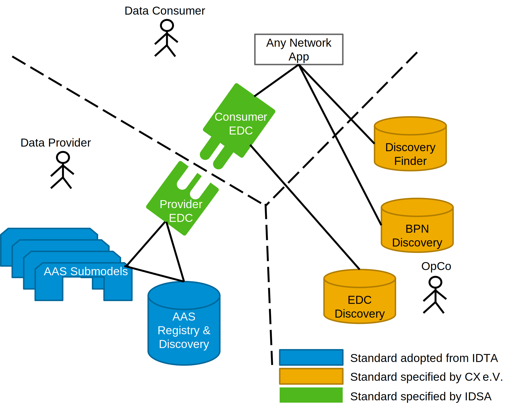

### Digital Twin KIT

<!--
Documentation of the kit.
-->

Based on the information provided in this kit, it is possible to run and program against an infrastructure of
Digital Twins the Catena-X-way. This infrastructure empowers Data Consumers to consume the network's data as agreed with
each Data Provider and facilitated by an Operating Company. They run central and decentral services that allow them to
discover each other, exchange information and contextualize it according to a standardized semantics.

The APIs for digital twins are based on the specifications of the Asset Administration Shell (AAS) as defined in
CX-0002.

## Deployment

| Service Name          | Description                                                                                                                                                                                      | Reference Implementation                                                                                                                                                                                        | [Standardized in](https://catena-x.net/de/standard-library) |
|-----------------------|--------------------------------------------------------------------------------------------------------------------------------------------------------------------------------------------------|-----------------------------------------------------------------------------------------------------------------------------------------------------------------------------------------------------------------|-------------------------------------------------------------|
| Discovery Finder      | A microservice resolving a type of specific asset identifiers, e.g. manufactuerPartId against a set of BPN-, and EDC-Discovery Servers hosted at Catena-X operating companies                    | [Tractus-X Discovery Finder](https://github.com/eclipse-tractusx/sldt-discovery-finder)                                                                                                                         | CX - 0053                                                   |
| BPN Discovery         | A microservice resolving a particular specific asset identifier against the registered [Business Partner Number](../Business%20Partner%20Kit/page_adoption-view.md#business-value) of its owner. | [Tractus-X BPN Discovery](https://github.com/eclipse-tractusx/sldt-bpn-discovery)                                                                                                                               | CX - 0053                                                   |
| EDC Discovery         | A microservice that resolves a BPN against an EDC endpoint.                                                                                                                                      | [Tractus-X Portal including EDC Discovery API](https://github.com/eclipse-tractusx/portal-backend)                                                                                                              | CX - 0001                                                   |
| Digital Twin Registry | A registry for digital twins, each digital twin providing the endpoints of its submodels.   The registry is adhering to the AAS Registry API.                                                | [Tractus-X Digital Twin Registry](https://github.com/eclipse-tractusx/sldt-digital-twin-registry)                                                                                                               | CX - 0002                                                   |
| Submodel Server       | The data source adhering to a subset of the Submodel API as defined in AAS Part-2 3.0.                                                                                                           | [FA³ST-Framework](https://github.com/FraunhoferIOSB/FAAAST-Service),   [Eclipse Basyx](https://github.com/eclipse-basyx/basyx-java-sdk),   [AASX Server](https://github.com/admin-shell-io/aasx-server) | CX - 0002                                                   |

- IDSA: [International Data Spaces Association](https://internationaldataspaces.org/)
- IDTA: [Industrial Digital Twin Association](https://industrialdigitaltwin.org/)
- OpCo: Operating Company. Also called Core Service Provider A in
  the [CX Operating Model](https://catena-x.net/fileadmin/_online_media_/CX_Operating_Modelv2.1_final.pdf).

## Setup Guide

Detailed guidance on setup of the abovementioned components can be found in the repositories of their linked reference
implementations.

## Notice

This work is licensed under the [CC-BY-4.0](https://creativecommons.org/licenses/by/4.0/legalcode).

- SPDX-License-Identifier: CC-BY-4.0
- SPDX-FileCopyrightText: 2023 Contributors of the Eclipse Foundation
- Source URL: [https://github.com/eclipse-tractusx/tractusx-edc](https://github.com/eclipse-tractusx/tractusx-edc)
