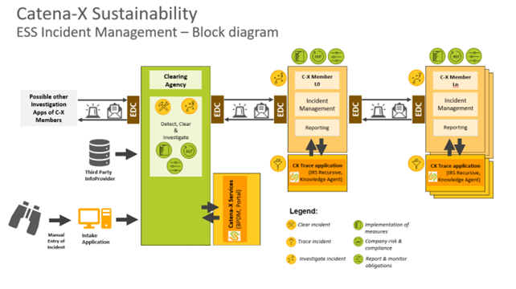

## Vision & Mission

### Introduction

The German Supply Chain Due Diligence Act came into force on January 1^st^, 2023. This law regulates corporate responsibility for compliance with human rights in global supply chains. These include, for example, protection against child labour, the right to fair wages and the protection of the environment. This legislation can be added to a long list of existing and future legislations that regulate our global supply chains, like the EU Corporate Sustainability Due Diligence Directive (CSDDD), the EU Ecodesign for Sustainable Products Regulation (ESPR), EU Corporate Sustainability Reporting Directive (CRSD), or the International Bill of Human Rights.

Catena-X aims to support supply chain due diligence obligations in a market environment that misses full up- and downstream transparency. This is argued to be relevant for Environmental and Social Standards (ESS) incident tracking, without compromising GAIA-X and Catena-X principles like data sovereignty, interoperability, standardization, and use of federated services.

### Vision

As companies governed by environment and social standards (ESS), we would like to determine, if we are affected by an incident reported in the global supply network. Consequently, we could prove to be fully compliant with legal requirements, including but not limited to the German Supply Chain Due Diligence Act.

### Mission

The automotive supply network is described as highly complex and globally interwoven. It operates in a heterogeneous political and environmental context with many different ambitions. The current challenges for cross-company ESS incident management are described by:

- High manual effort of a small set of experts that work in their own silos and focus on company-centric investigation. A problem accentuated at the level of small and medium enterprises (SME),
- Low network collaboration and by that long processing time amongst business partners,
- Lack of trust to share data, amongst many intermediates,
- Varying quality of information and sources.

Our mission is to streamline the handling of incidents reported to the Catena-X network. The ESS KIT supports cross-company ESS incident management with appropriate processes. This radical change from our organization-centred model would mitigate the challenges listed above. The ESS KIT consists of the following building blocks:

- Standards to guarantee data sovereignty and data security, like the Connector KIT (EDC), Business Partner KIT and Agents KIT, as well as our standards,
- Standardized data model accompanied with a defined tracing process to reduce processing time for an incident.

### Business value

If Catena-X members want to minimize their ESG risk and bring transparency into their supply chains, there is a strong need to collect knowledge and reliable information. Arguably, the primary added value of the ESS KIT is our simplified cross-company communication coupled with the clearing agency concept.

With the Clearing agency in place, business partners subscribing to the ESS KIT, can with confidence collect incidents from multiple actors and a broad range of sources (*e.g.* receiving incidents from company's internal incident management systems or from public news reports and automated information gathering). The clearing agency, as an independent body will among other activities reduce fraudulent cases and consolidate information of potential incidents.

The processes of the ESS KIT will transfer information in the respective supply chains to efficiently zero-in on the relevant business partners. So, with the ESS KIT, the members of the Catena-X network are enabled to act quickly due to collaboration and standardization.

Furthermore, the ESS KIT allows for quick adaptation to new national and internal laws and helps ensure legal compliance through enhanced supply chain transparency and verification.

Thus, the ESS incident KIT offers a uniform and cross-sectoral grievance mechanism for managing incidents related to specific occasions, filling a gap that currently exists.

## Use Case

### Prerequisites

The scope of our business is the prompt handling of incidents reported to the Catena-X network. The following prerequisites are necessary for the ESS KIT:

- High number of Catena-X members need to be onboarded to cover our supply chains and increase the success rate of the tracing of incidents,
- Catena-X members agree to a code of conduct,
- The member needs to follow the onboarding process.

### Customer Journey: Occasion-related tracking of ESS-related incidents

This customer journey describes the process when an incident is reported to the Catena-X network. From the determination that needs to be made regarding its relevance to the business partners and further processing.

This KIT support **the detection of incidents** from different sources (manual or automated), before being categorized by incident types / sub-types. The unstructured information (text and/or pictures) about each incident will be collected along with country-, company-, material-related data if available (note: no BoM data collected). The quality of the incident data is not guaranteed at this stage and for some cases, the investigation may be challenging due to insufficient information about the supply network.

The Clearing Agency is prompted to **clear incidents.** This independent body has the tasks among others, to improve quality of data and reduce fraud or fakes. This includes but is not limited to, manual search and input from expert, consolidation of reports of the same incident and finally accept or archive incidents. Once the Clearing Agency found that the incident\'s originator is a Catena-X member, the Clearing Agency can use Catena-X Services find out the BPN-L, BPN-S and the EDC endpoints of the incident originator. Then the ESS incident is transferred to the incident originator via the Catena-X network. In case no Catena-X member can be identified as incident originator, the clearing agency will maintain the corresponding status "no member found".

The **investigation of the ESS-related incident** is used to determine the cause of the reported incident. All business partners involved work to identify and confirm the origin of the incident. Once the source is identified and confirmed, a decision is made by the business partners whether to accept or reject the ESS-related incident.

**The trace of an incident** is operated through the decentral Catena-X supply network. The process moves from business partner to business partner in their supply chain with the incident originator as the starting point. The use case ESS believes that the most promising way to solve an ESS incident will be a bottom - up approach.

This means that the transfer of information is initiated by L0 who identifies its impacted customers (L1) using the bottom-up search logic (for example Knowledge Agent). The impacted customers (L1) can then push the information up the supply chain (*i.e.* their impacted customers or L2) and so on until it arrives at the end of the chain (*i.e.* OEM).

The trace of an incident follows previously mentioned principles along any obligations enforced by law. For any business partner in the supply chain, its access to the status/information related to a specific incident will depend on its degree of relationship with the impacted company:

- **Level 0 (L~0~):** the incident report is targeting the company directly. At that level, the incident manager of the L~0~ can consult all the relevant information and will manage the status and response.

- **Level 1 (L~1~):** those business partners have a direct relationship with the L~0~. As already supported in existing legislations, L~1~ business partners will have access to the status of the incident and the full information of the potential incident at the L~0~.

- **Level n (L~n~)**: those business partners have an indirect relationship with the potential incident originator (L~0~). They will receive from the previous business partner (L~n-1~) the anonymized incident information (anonymized title & description, category, status, etc.) along with the degree of relationship (*i.e.* their distance to the L~0~). The incident originator's identity (L~0~) and the path from L~0~ to L~n~ in the impacted supply chain will not be communicated, nor documented.

- **Clearing Agency:** these users can see the status and the original intake of information of all incidents. The clearing agency will only be able to identify the targeted business partner (L~0~) who is handling the incident. Finally, if the incident can be closed by the L0, the clearing agency will receive a status update.

### ESS Incidents personas

+-------+------------------------------+-------------------------------+
| **Pe  | **Short Description **       | **Task / Responsibilities **  |
| rsona |                              |                               |
| Tit   |                              |                               |
| le ** |                              |                               |
+=======+==============================+===============================+
| Inc   | -   Issuer can be any person | -   Raise ESS-related         |
| ident |     or institution           |     incident in a structured  |
| Is    |                              |     or unstructured manner    |
| suer  | -   Not necessarily an ESS   |                               |
|       |     expert                   | -   Ambition to make          |
|       |                              |     ESS-related issue         |
|       | -   Can be either internal   |     transparent and visible   |
|       |     (*e.g.* auditor or       |     with as much information  |
|       |     employee) or external    |     as possible               |
|       |     (*e.g.* business         |                               |
|       |     partner, individual,     | -   Committed to provide      |
|       |     NGO,                     |     relevant information to   |
|       |     automatic-detection)     |     properly address the      |
|       |                              |     ESS-related incident to   |
|       | -   Uses either formal       |     the right business        |
|       |     contact point (Catena-X  |     partner/ organizational   |
|       |     Incident App, Catena-X   |     unit                      |
|       |     Webpage, Company         |                               |
|       |     Webpage) or any kind of  |                               |
|       |     (social) media to issue  |                               |
|       |     ESS-related incident     |                               |
|       |                              |                               |
|       | -   Potential contact to     |                               |
|       |     incident manager (ESS),  |                               |
|       |     human rights officer/    |                               |
|       |     risk management          |                               |
|       |     specialist               |                               |
+-------+------------------------------+-------------------------------+
| Inc   | -   Operational internal     | -   Recording of ESS-related  |
| ident |     role/ central function   |     incidents                 |
| Man   |     that covers incidents as |                               |
| ager  |     primary responsibility   | -   Assignment of the         |
|       |                              |     ESS-related incident to   |
|       | -   Follows statutory        |     the correct category with |
|       |     requirements and         |     as much information as    |
|       |     incidents through each   |     possible. Categories are: |
|       |     process step until       |     Violation of              |
|       |     closure                  |     environmental and/ or     |
|       |                              |     social standards          |
|       | -   First contact and        |                               |
|       |     dispatcher for           | -   Rejection or acceptance   |
|       |     ESS-related incidents    |     of ESS-related incident   |
|       |     and incident status      |                               |
|       |                              | -   Assignment of             |
|       | -   Incident-Manager to get  |     ESS-incident to internal  |
|       |     in contact with (e.g.    |     business partner          |
|       |     sustainability@\...)     |                               |
|       |                              | -   Collaboration &           |
|       | -   SME/ Business Partner    |     cooperation with business |
|       |     for human rights         |     partners and internal     |
|       |     officer, sustainability  |     units                     |
|       |     manager product/         |                               |
|       |     corporate, audit         | -   Agreement of binding      |
|       |     (internal, external)     |     measures with relevant    |
|       |                              |     SMEs/ Business Partners   |
|       | -   Potential contact to     |                               |
|       |     incident issuer (ESS)    |                               |
+-------+------------------------------+-------------------------------+
| Cle   | -   Operational internal     | -   Receives incident from    |
| aring |     role/ central function   |     various sources           |
| agent |     that covers incidents as |                               |
| ESS   |     primary responsibility   | -   Reduce fraud / identify   |
|       |                              |     fake incidents            |
|       | -   First contact and        |                               |
|       |     dispatcher for           | -   Consolidate incidents (no |
|       |     ESS-related incidents    |     multiples)                |
|       |     and incident status      |                               |
|       |                              | -   Set / maintain central    |
|       |                              |     incident status and       |
|       |                              |     anonymized information    |
|       |                              |     (respect:                 |
|       |                              |     one-up/one-down,          |
|       |                              |     decentral,                |
|       |                              |     data-sovereign, "flag" to |
|       |                              |     allow sharing)            |
|       |                              |                               |
|       |                              | -   Forward information to L0 |
|       |                              |     of cleared ESS incident   |
|       |                              |     or archive of ESS         |
|       |                              |     incident                  |
|       |                              |                               |
|       |                              | -   Transfer ESS incidents to |
|       |                              |     archive                   |
+-------+------------------------------+-------------------------------+

### Semantic models

Catena-X offers various semantic models depending on the specific application and KIT. They establish a fundamental understanding of the data and its connections, facilitating compatibility between different data sets. The data models of Catena-X prioritize principles such as clarity, standardization, distinction, verifiability, and comprehensiveness.

The data model follows the Catena-X Standard CX-0113 (<https://catena-x.net/de/standard-library>) and is modelled following the CX-0003 Standard (<https://catena-x.net/de/standard-library>). Below, you can find an excerpt of the full data set:

+--------------+------------------------+------------------------------+
| **Attribute  | **Description **       | **Example **                 |
| Name **      |                        |                              |
+==============+========================+==============================+
| ESS Incident |                        |                              |
| Information  |                        |                              |
+--------------+------------------------+------------------------------+
| Category and | Environmental and      | Environmental (ex: usage of  |
| s            | social standards       | mercury, usage of harmful    |
| ub-category  | related incident       | chemicals) \| Social (ex:    |
|              | category according to  | child labour, work safety,   |
|              | Supply Chain Due       | discrimination)              |
|              | Diligence Act          |                              |
+--------------+------------------------+------------------------------+
| Subject and  | Title of an incident   | Child labour in country      |
| description  | in the context of ESS  | x for product y reported.    |
|              | (Environmental and     | Small children under the age |
|              | Social Standards) with | of 15 clean barrels with     |
|              | its description        | bare hands and under dubious |
|              |                        | working and payment          |
|              |                        | conditions.                  |
+--------------+------------------------+------------------------------+
| At           | Picture(s) about the   | Upload picture about child   |
| tachment(s)  | reported incident in   | work in country x for        |
|              | the context of ESS     | product y or upload other    |
|              | (Environmental and     | additional                   |
|              | Social Standards)      | documents/reports#           |
+--------------+------------------------+------------------------------+
| Date         | Date and time          | 2022-08-31T00:00:00Z         |
|              | information when an    |                              |
|              | incident occurred      |                              |
+--------------+------------------------+------------------------------+
| Product      |                        |                              |
| Information  |                        |                              |
+--------------+------------------------+------------------------------+
| Description  | Description of product | Natural Rubber               |
|              | or component affected  |                              |
|              | by an incident in the  |                              |
|              | context of ESS         |                              |
|              | (Environmental and     |                              |
|              | Social Standards)      |                              |
+--------------+------------------------+------------------------------+
| Raw          | Raw material that      | Mercury \| Cobalt \| Natural |
| material     | causes an incident in  | Rubber                       |
|              | the context of ESS     |                              |
|              | (Environmental and     |                              |
|              | Social Standards)      |                              |
+--------------+------------------------+------------------------------+
| Company      |                        |                              |
| information  |                        |                              |
+--------------+------------------------+------------------------------+
| Country      | Region within a        | Sao Paolo                    |
| subdivision  | country to which an    |                              |
|              | incident in the        |                              |
|              | context of ESS         |                              |
|              | (Environmental and     |                              |
|              | Social Standards)      |                              |
|              | belongs                |                              |
+--------------+------------------------+------------------------------+
| Coordinates  | Exact geographic       | Longitude and Latitude (will |
|              | position of an         | be entered automatically)    |
|              | incident in the        |                              |
|              | context of ESS         |                              |
|              | (Environmental and     |                              |
|              | Social Standards)      |                              |
+--------------+------------------------+------------------------------+
| Company      | Name of a company / an | ABC company                  |
| name         | organisation that is   |                              |
|              | the originator of an   |                              |
|              | incident in the        |                              |
|              | context of ESS         |                              |
|              | (Environmental and     |                              |
|              | Social Standards)      |                              |
+--------------+------------------------+------------------------------+
| Address      | Address of ESS         | Mainroad 1                   |
|              | originator (street,    |                              |
|              | zip code, city\...)    | 73230 Model City             |
+--------------+------------------------+------------------------------+
| BpnL / BpnS  | BPN-L/S/A of the       | Rubbery Ltd. (BPN-L)         |
| / BpnA       | company that causes    |                              |
|              | the incident           | Site in Dingolfing (BPN-S)   |
|              |                        |                              |
|              |                        | Dingolfing Werksstrasse 1,   |
|              |                        | Tor 2.1 (BPN-A)              |
+--------------+------------------------+------------------------------+
| Contact      |                        |                              |
| Information  |                        |                              |
+--------------+------------------------+------------------------------+
| First and    | Contact name of ESS    | Camille Mustermensch         |
| last Name    | incident issuer        |                              |
+--------------+------------------------+------------------------------+
| E-Mail       | E-Mail address of ESS  | xyz.abc@xxx.com              |
| Address      | incident issuer        |                              |
+--------------+------------------------+------------------------------+
| Phone        | Phone number of ESS    | +49 89 123456789             |
| number       | incident issuer        |                              |
+--------------+------------------------+------------------------------+
| Address      | Address of ESS         | XYZ-Road                     |
|              | incident issuer        |                              |
|              |                        | 73230 Kirchheim              |
+--------------+------------------------+------------------------------+
| Anonymous    | Flag that Incident     | Checkbox: ticked / not       |
|              | issuer wants to be     | ticked                       |
|              | anonymous              |                              |
+--------------+------------------------+------------------------------+

## Business process

### Business architecture

### Access & Usage Policies / Code of conduct

In the Catena-X Use Case Sustainability / Environmental and Social Standards, principles are established with the aim to establish transparent and trustworthy practices within the Catena-X network. These principles are based on legal regulations such as the German Supply Chain Due Diligence Act (or LkSG) and the European Union\'s Supply Chain Due Diligence Act, as well as internationally recognized standards such as the International Bill of Human Rights, the UN Guiding Principles on Business and Human Rights, the OECD Guidelines for Multinational Enterprises, the ILO Core Labour Standards, and the principles of the UN Global Compact.

A code of conduct defines the minimum requirements and clear expectations for the corporate due diligence of the Catena-X members. It should be adopted by every company participating in the Catena-X Use Case Sustainability / Environmental and Social Standards.

We believe that we can only enhance the sustainability performance of companies through continuous development. Given the complexity and dynamics of the n-tier network, we rely on joint activities with all our members to identify environmental and social standard risks, create more transparency, and achieve greater effectiveness.

## Standards

### List of standards

To participate in the ESS Incident Management use-case, the following single standards must be fulfilled and can be consulted in the [Catena-X Standard Library](https://catena-x.net/de/standard-library):

- CX-0001 EDC Discovery API
- CX-0006 Registration and initial on Boarding
- CX-0013 Identity of Member Companies
- CX-0014 Employees and Technical Users
- CX-0015 IAM & Access Control Paradigm
- CX-0016 Company Attribute Verification
- CX-0017 Company Role by the Connector
- CX-0018 Sovereign Data Exchange
- CX-0049 DID Document Schema
- CX-0050 Framework Agreement Credential

### ESS incidents Data model (CX-0113)

References:

<https://github.com/catenax-eV/product-standardization-prod/tree/CX-0113-AspectModelESSDatamodel-v1.0.0/standards/CX-0113-AspectModelESSDatamodel>

### List of all other standards used

The following standards were used in the creation of this code of conduct and serve as an additional source of information:

- ILO Code of Practice in Safety and Health
- ILO International Labor Standards
- ISO 14001
- OECD Due Diligence Guidance for Responsible Supply Chains of Minerals from Conflict-Affected and High-Risk Areas
- OECD Guidelines for Multinational Enterprises
- Universal Declaration of Human Rights
- United Nations Convention Against Corruption
- United Nations Convention on the Rights of the Child
- United Nations Convention on the Elimination of All Forms of Discrimination Against Women
- United Nations Global Compact
- High Conservation Value Resource Network (HCV)
- High Carbon Stock Approach (HCSA)
- Initiative for Responsible Mining Assurance (IRMA)
- Responsible Business Alliance (RBA)
- Drive Sustainability Guiding Principles
- Farm Animal Welfare Committee (FAWC)
- Terrestrial Animal Health Code
- Act on Corporate Due Diligence Obligations in Supply Chains
- Handreichung zur Umsetzung einer Risikoanalyse nach den Vorgaben des Lieferkettensorgfaltspflichtengesetzes (BAFA)
