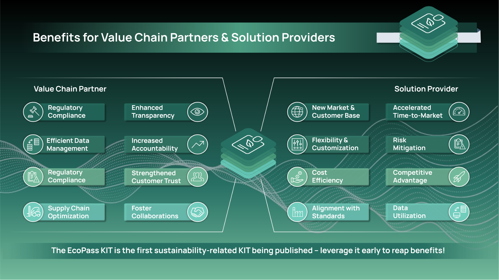
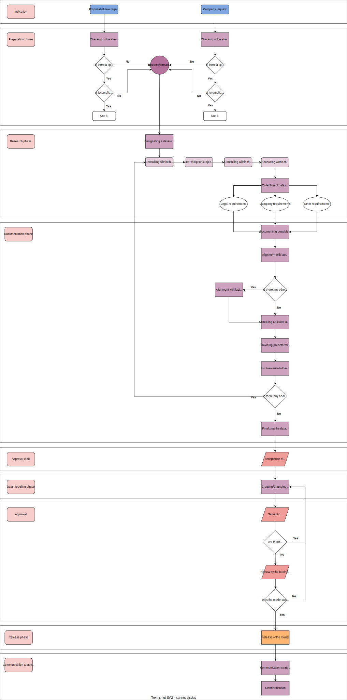

## Introduction

The EcoPass KIT will be the key enabler for various stakeholders to use digital product passports, which represent a digital collection of specific information about a physical product in a standardized exchange format. This data is governed by agreed-upon ownership and access rights, which are conveyed through the Eclipse Data Space Connector (EDC). The primary purpose of the product passport is to enable the electronic registration, processing and sharing of product-related details among various entities in the supply chain, including several businesses and authorities. The demand for interoperable product passports exists worldwide, driven by the need to establish sustainable and transparent supply chains across different types of products, for which the adoption of standards will become crucial.
In this context, Catena-X offers a decentralized ecosystem supported by standards and principles like data sovereignty, which can effectively implement such a product passport system. The objective of the EcoPass KIT is therefore to:

- Provide a comprehensive overview of the business context and benefits of product passports.
- Offer guidelines for industry stakeholders.
- Provide a detailed description and offer tools to implement product passports.

## Vision & Mission

### Vision: Empowering Sustainability – One Product at a Time

The EcoPass KIT envisions a future where sustainability is at the core of every product's lifecycle, from design and manufacturing to usage and end-of-life. By fostering transparency, traceability and informed decision-making, we aim to inspire solution and service providers to create innovative, eco-friendly products that reduce environmental impact and drive the global economy towards a circular model.

### Mission: Unleashing Circularity Potential

The EcoPass KIT enables the scalable usage of digital product passports in order to address the pressing issue of inefficient resource usage and lack of product transparency. With growing concerns over environmental impact, limited resources and waste generation, there is an urgent need for a comprehensive solution to drive sustainable practices across the value chain. The KIT offers unified data models, a reference application for passport utilization as well as the required API. Low entry barriers will allow you to adapt digital product passports rapidly and pay your contribution to a fully circular value chain without the necessity of vast expertise or resources. Designed for multiple products, the KIT offers scalability, high-quality product information and a set of tools for regulatory compliance. Our mission is to unlock the circular potential of every component and material, fostering a culture of sustainability, innovation, and shared responsibility among all stakeholders.

All described specifications in the KIT are based on [Catena-X standards](https://catena-x.net/de/standard-library) such as the Asset Administration Shell, SSI and decentral Digital Twin Registry. They refer to other Catena-X KITs like the [Connector KIT](https://eclipse-tractusx.github.io/docs-kits/kits/tractusx-edc/docs/kit/adoption-view/Adoption%20View) (EDC), [Data Chain KIT](https://eclipse-tractusx.github.io/docs-kits/category/data-chain-kit/) (Item Relationship Service = IRS) and [Business Partner KIT](https://eclipse-tractusx.github.io/docs-kits/category/business-partner-kit/) to ensure interoperability and data sovereignty according to IDSA and Gaia-X principles.

## Business Value

Following this mission, the EcoPass KIT serves as an instrumental tool promoting sustainable and circular value chains. The improved transparency, traceability and accountability offered with digital product passports will facilitate informed decision-making for various stakeholders. This will bring ethical sourcing, efficient use of resources and reduction of environmental impacts to a new level. By making use of the Catena-X standards defined within the EcoPass KIT, product passports will ensure interoperability for stakeholders and systems to communicate seamlessly. This standardized language is crucial to improve efficiency, lower operational costs and create faster data processing. It ensures a consistent approach to data collection, storage and visualization to enhance the accuracy, reliability and comparability of information.
The following section will highlight the five major advantages of the Catena-X EcoPass KIT, which are also displayed below.


**Seamless Integration and Collaboration**: By leveraging the EcoPass KIT, service providers can easily integrate with the Catena-X marketplace, promoting efficient collaboration and exchange of information with other businesses in the network. The unified data model and API specification simplifies the process, reducing the time and resources needed for integration and fostering interoperability between various players.

**Enhanced Consumer Trust and Brand Loyalty**: Utilizing the KIT to develop solutions for the Catena-X marketplace allows service providers to showcase their commitment to transparency and sustainability. This fosters consumer trust and brand loyalty, as increasingly conscious customers prefer products and services that align with their values and make a positive impact on the environment.

**Data-Driven Decision Making**: The EcoPass KIT enables service providers to harness the power of high-quality data sets from various sources in the Catena-X network. This wealth of information supports data-driven decision-making, helping businesses optimize their processes, reduce waste and identify opportunities for growth and innovation. Leveraging the dynamic data attributes within a passport, the product's evolving condition can be reflected, which offers a highly valuable increase of knowledge about the product’s behavior, quality and performance.

**Regulatory Compliance and Risk Mitigation**: By offering solutions based on the KIT, service providers can help businesses comply with evolving regulations and industry standards. The increased transparency and traceability provided by digital product passports facilitate compliance management, offer the creation of certificates, and reduce the risks associated with non-compliance, such as penalties and reputational damage.

**Competitive Advantage through Innovation**: The KIT's foundation for value-added services and innovative solutions provides service providers with a unique competitive edge in the Catena-X marketplace. By developing and offering cutting-edge products and services that cater to the growing demand for sustainable and transparent solutions, service providers can differentiate themselves in a crowded market and seize new business opportunities.

## Use Case Explanation

### Today's Challenges

Today's globalized supply chains often struggle with transparency, data fragmentation and inefficiencies through the lack of digitally available product information. Traceability becomes difficult, hindering the ability to track products' origins and ensure accountability. Risk management and compliance efforts are compromised, impacting product quality and sustainability. Customer expectations for transparency and sustainability information remain unmet, potentially leading to dissatisfaction and loss of market share. Moreover, supply chains lack the resilience and responsiveness needed to adapt to disruptions effectively.
Embracing a digital product passport can address these challenges, enabling transparent, efficient and sustainable supply chains. Implementing the EcoPass KIT can enable companies to address these challenges by creating a comprehensive, accurate and up-to-date record of their products' lifecycles. This information can be used to improve resource efficiency, optimize recycling processes and reduce waste, ultimately driving the adoption of circular economy principles.

### How can the EcoPass KIT help to address regulatory challenges?

- Manufacturers are required to disclose information regarding the environmental impact of their products under the European Union's (EU) Ecodesign Directive. The EcoPass KIT can assist producers in adhering to this rule by offering a digital record of the environmental impact of their products.
- Companies are required to provide information regarding their efforts to address forced labor and human trafficking in their supply chains under the California Transparency in Supply Chains Act (CTSCA). The EcoPass KIT's digital record of a company's supply chain operations can assist businesses to comply with this law.
- Certain manufacturers of products are required to take back and recycle their products at the end of their functional lifespans under the German Waste Management Act (Kreislaufwirtschaftsgesetz). The EcoPass KIT, which offers a digital record of the goods that have been returned and recycled, can assist producers in adhering to this obligation.

### Ecopass KIT benefits for value chain partners and solution providers

Stakeholders along the value chain, as well as solution providers can reap the benefits of utilizing KITs in their organization. The Figure below shows an overview of these benefits, further explanation can be found below the illustration.



**Value Chain Partners** can benefit from the EcoPass KIT especially by bringing the product transparency to a next level which will allow for several areas to increase the company’s value. Multiple risks (e.g. regulatory compliance) can be mitigated, cost and process efficiency may be improved, the strategic knowledge about products increases and the possibility for new business is being established.

1. **Regulatory Compliance**: Improve compliance with regulations and industry standards by utilizing a digital product passport to demonstrate responsible sourcing, production and waste management practices.
2. **Enhanced Transparency**: Visibility of the product's condition, origins and components will lead to better decision-making and higher resource efficiency.
3. **Efficient Data Management**: Adopting a digital product passport will reduce administrative burdens and facilitate seamless data exchange between stakeholders.
4. **Increased Accountability**: A clear chain of custody for products fosters accountability among value chain participants for product quality, safety and sustainability.
5. **Risk Mitigation**: Comprehensive product data helps value chain participants to proactively identify and mitigate risks, ensuring higher product quality and safety standards.
6. **Strengthened Customer Trust**: Offering transparency of business practices and sustainability efforts builds trust with customers and enhances brand loyalty.
7. **Supply Chain Optimization**: Data-driven insights enable the optimization of supply chain processes to support the integration of sustainable approaches.
8. **Foster Collaborations**: Connecting and sharing information across the value chain facilitates collaboration with other stakeholders to promote joint efforts towards sustainability challenges.

**Solution Providers** will gain a head start in delivering comprehensive and efficient digital product passport solutions. The pre-built features accelerate time-to-market, reduce costs and ensure a reliable, scalable and compliant system. In addition, solution providers can leverage a KIT as the basis to build their own customized solutions and to offer their customers innovative and value-driven digital product passport services in an efficient and simplified way.

1. **New Market & Customer Base**: The possibility of developing innovative solutions and providing them through the Catena-X marketplace fosters new market opportunities and scalability of the customer base.
2. **Accelerated Time-to-Market**: The KIT provides the thematical and technical basis to build solutions, significantly reducing the time and resources required to develop digital product passport solutions.
3. **Flexibility and Customization**: While the KIT offers a solid foundation, it is designed to allow solution providers for customizing and tailoring the platform to meet specific needs and preferences of the target market and value chain participants.
4. **Risk Mitigation**: The predefined KIT tools support solution providers in reducing the risk of development errors and vulnerabilities.
5. **Cost Efficiency**: The KIT's standardized data model and open interface simplify the process of connecting to the Catena-X network, reducing the investment needs for integration.
6. **Competitive Advantage**: Adopting the KIT quickly positions solution providers in the market faster with cutting-edge services gaining a competitive advantage.
7. **Alignment with Industry Standards**: The KITs adhere to industry standards, making it easier for solution providers to align with existing supply chain ecosystems and collaborate with other stakeholders.
8. **Data Utilization**: The wealth of data available in the Catena-X network is leveraged to drive innovation and develop data-driven solutions tailored to the unique needs of various industries.

#### Battery Pass: A real-world example

In the automotive industry, a Battery Passport or Digital Product Passport for batteries plays a crucial role in ensuring transparency, traceability, and sustainability in the battery supply chain. Here's a real-world example of how a digital product passport might be set up for a battery used in electric vehicles (EVs), including its benefits, illustrated below:


1. **Battery Manufacturing**: During the production stage, the battery manufacturer collects and records relevant data, such as the battery's unique identifier, type and model, manufacturing date and location, energy capacity and raw materials composition, including the content of critical elements like lithium, cobalt and nickel.
2. **Supply Chain Transparency**: Information about the battery's sourcing, manufacturing and distribution processes is documented, ensuring compliance with environmental and social standards. This includes data on the origin of raw materials, labor practices and the environmental footprint of each stage of the supply chain.
3. **Vehicle Integration**: When the battery is integrated into an electric vehicle, the Battery Pass is linked to the car's unique identification number (VIN), allowing seamless tracking and communication between the battery, the vehicle and relevant stakeholders.
4. **In-Use Performance Tracking**: As the vehicle is used, the Battery Pass continuously collects data on the battery's performance, such as its state of charge, charging cycles and degradation over time. This information is essential for the vehicle owner, car manufacturer and service providers to monitor the battery's health and optimize its lifespan.
5. **End-of-Life Management**: When the battery reaches the end of its useful life, the Battery Passport provides detailed instructions for proper disposal and recycling, ensuring compliance with regulations and facilitating the recovery of valuable materials. The data stored in the Battery Passport helps recycling facilities to efficiently process the battery, reducing waste and promoting a circular economy.

Throughout this process, the Battery Passport serves as a single, secure, and easily accessible source of information for various stakeholders, such as vehicle manufacturers, suppliers, service providers, regulators and vehicle owners. By implementing a digital product passport like the Battery Pass in the automotive industry, companies can promote transparency, traceability, and sustainability, ultimately contributing to a more eco-friendly and circular economy.
For more information please read the [Battery Pass Viewer App Success Story](./Success%20Stories/BatteryPass_Viewer_App.mdx)!

### How the KIT can help

The EcoPass KIT addresses the real-world problem of battery traceability and sustainability in the automotive industry by providing a standardized, easy-to-implement solution for creating and managing digital product passports. Here's how the EcoPass KIT can help and scale in this context:

1. **Standardization and Interoperability**: The EcoPass KIT offers a unified data model and is planning an API specification, allowing for seamless integration across different stakeholders, including manufacturers, suppliers, service providers and regulatory bodies. This standardization promotes interoperability and streamlines communication throughout the battery lifecycle.
2. **Simplified Adoption**: By providing a comprehensive and easy-to-use KIT, EcoPass can lower the barrier to entry for businesses of all sizes, enabling them to implement digital product passports without extensive technical expertise or resources. This can encourage widespread adoption of the solution, resulting in a larger-scale positive impact on sustainability and traceability.
3. **Scalable Solution**: The EcoPass KIT is designed to accommodate various product types, sizes and applications, ensuring its relevance and adaptability to the evolving automotive industry. This scalability allows the KIT to be utilized for a wide range of battery technologies, facilitating its adoption across diverse sectors.
4. **Enhanced Data Quality and Analysis**: The EcoPass KIT enables the collection and management of high-quality data throughout the product lifecycle. This wealth of information can be used by stakeholders to make data-driven decisions, optimize processes and identify opportunities for innovation and improvement in battery design, manufacturing and recycling.
5. **Facilitated Regulatory Compliance**: With the EcoPass KIT in place, businesses can more easily comply with the evolving regulations and industry standards related to battery traceability and sustainability. The digital product passport provides a comprehensive record of the battery's lifecycle, supporting compliance management and reducing the risk of penalties and reputational damage.

By providing a standardized, scalable and easy-to-adopt solution, the EcoPass KIT will play a significant role in addressing the challenges of product traceability and sustainability in the automotive industry, promoting a more transparent, environmentally friendly and circular economy.

## Semantic Models

Depending on the use case and related KIT, Catena-X provides different semantic models that help to structure and make use of data via semantic information. These models help to provide a basic meaning to the data and their relationship, thereby enabling interoperability between data sets. Catena-X data models rely on principles as understandability, standardization, accuracy, differentiation, auditability, comprehensiveness, and provision of insights to drive improvement actions. The KIT entails the main data models of a Digital Product Passport and Battery Passport, whereat both are justified with an underlying regulation.

Other specific product passports which are further described in the EcoPass KIT are the [battery](#battery-passport), [transmission](#transmission-passport) and [electric drive](#electric-drive-passport). All of them depend on the generic Digital Product Passport data model. Further data models will follow.

The goal of these passports is to create unified data models that can be used and adapted across the automotive industry. These data models are modelled according to the [CX-0003](https://catena-x.net/en/standard-library) SAMM Standard in Version 1.1.0 (updated link once published). For detailed information please follow the embedded links to the Catena-X Standard library.

### Digital Product Passport

#### Digital Product Passport Introduction

Digital Product Passports addresses three needs by the industry: First, they gather all relevant information about a product in a single, digital tool. Second, digital product passports answer increasing regulatory requirements and demand for sustainability information along the value chain of a product. And third, Digital Product Passports are an important enabler for a circular economy.
The collected data is defined via standards specified by the Catena-X network and obtained from the industry. The content of the Product Passport is product-related information that is useful and necessary for the consumer, and other actors who will deal with the product till end of its life, and is limited to the required minimum of the necessary information.
The data model in version 4.0.0 corresponds to the Digital Product Passport information required by the proposed Ecodesign Regulation ([ESPR-2022](<(https://commission.europa.eu/energy-climate-change-environment/standards-tools-and-labels/products-labelling-rules-and-requirements/sustainable-products/ecodesign-sustainable-products_en)>)) from March 30th, 2022. In the future, delegated acts for specific product groups would require a product passport to be available for each product. The data model will be updated, as newer versions of the regulation will be published. The latest to the model corresponding version of the document was the [provisional agreement](https://eur-lex.europa.eu/legal-content/EN/TXT/PDF/?uri=CONSIL:ST_5147_2024_INIT) between the EU Council and the Parliament from January 9th, 2024. The text is informal, but the content of the final regulation was agreed between these two institutions.

It is important to note that the data model contains information/data fields, which are mandatory for the fulfilment of the regulation ([ESPR-2022](<(https://commission.europa.eu/energy-climate-change-environment/standards-tools-and-labels/products-labelling-rules-and-requirements/sustainable-products/ecodesign-sustainable-products_en)>)). It is also worth mentioning that sharing information within the network is based on decentralized technologies and is always based on the individual decision of each provider.

The Digital Product Passport is the core model and can be used as the root class for other, specific, product models. The latest model `v.4.0.0` consists out of the following information:

- Passport metadata
- Product identification
- Product operation
- Product handling
- Product characteristic
- Sustainability information
- Materials information
- Commercial information
- Sources (documents)
- Additional data

In addition, the Digital Product Passport data model offers the following advantages:

- **Self-describing**: Which means it has all the details necessary to comprehend what it includes. Different systems can easily interpret the Passport as a result.
- **Extendable**: New information can be added without much difficulty. As a result, the Passport will be able to adapt to the changing requirements.
- **Common semantics**: The model of a generic passport is established in Catena-X which other passes can build upon.

#### Link to current Digital Product Passport model

The semantic models are located [here](https://github.com/eclipse-tractusx/sldt-semantic-models/blob/main/io.catenax.generic.digital_product_passport). For each version there is a separated directory containing the ttl-file and generated samples.

#### Example Digital Product Passport Payload

<details>
  <summary>Payload</summary>

```json
{
  "metadata": {
    "backupReference": "https://dummy.link",
    "registrationIdentifier": "https://dummy.link/ID8283746239078",
    "economicOperatorId": "BPNL0123456789ZZ",
    "predecessor": "urn:uuid:00000000-0000-0000-0000-000000000000",
    "issueDate": "2000-01-01",
    "version": "1.0.0",
    "passportIdentifier": "urn:uuid:550e8400-e29b-41d4-a716-446655440000",
    "status": "draft",
    "expirationDate": "2000-01-01"
  },
  "characteristics": {
    "generalPerformanceClass": "A",
    "physicalState": "solid",
    "physicalDimension": {
      "volume": {
        "value": 20.0,
        "unit": "unit:cubicMetre"
      },
      "grossWeight": {
        "value": 20.0,
        "unit": "unit:gram"
      },
      "diameter": {
        "value": 20.0,
        "unit": "unit:millimetre"
      },
      "grossVolume": {
        "value": 20.0,
        "unit": "unit:cubicMetre"
      },
      "width": {
        "value": 20.0,
        "unit": "unit:millimetre"
      },
      "length": {
        "value": 20.0,
        "unit": "unit:millimetre"
      },
      "weight": {
        "value": 20.0,
        "unit": "unit:gram"
      },
      "height": {
        "value": 20.0,
        "unit": "unit:millimetre"
      }
    },
    "lifespan": [
      {
        "value": 36,
        "unit": "unit:day",
        "key": "guaranteed lifetime"
      }
    ]
  },
  "commercial": {
    "placedOnMarket": "2000-01-01"
  },
  "identification": {
    "batch": [
      {
        "value": "BID12345678",
        "key": "batchId"
      }
    ],
    "codes": [
      {
        "value": "8703 24 10 00",
        "description": "GBT",
        "key": "TARIC"
      }
    ],
    "type": {
      "manufacturerPartId": "123-0.740-3434-A",
      "nameAtManufacturer": "Mirror left"
    },
    "classification": [
      {
        "classificationStandard": "GIN 20510-21513",
        "classificationID": "1004712",
        "classificationDescription": "Generic standard for classification of parts in the automotive industry."
      }
    ],
    "serial": [
      {
        "value": "SN12345678",
        "key": "partInstanceId"
      }
    ],
    "dataCarrier": {
      "carrierType": "QR",
      "carrierLayout": "upper-left side"
    }
  },
  "sources": [
    {
      "header": "Sustainability Document Material XY",
      "category": "Product Specifications",
      "type": "URL",
      "content": "https://dummy.link"
    }
  ],
  "materials": {
    "substancesOfConcern": {
      "substanceOfConcern": [
        {
          "unit": "unit:partPerMillion",
          "hazardClassification": {
            "category": "category 1A",
            "statement": "Causes severe skin burns and eye damage.",
            "class": "Skin corrosion"
          },
          "documentation": [
            {
              "contentType": "URL",
              "header": "Sustainability Document Material XY",
              "content": "https://dummy.link"
            }
          ],
          "concentrationRange": [
            {
              "max": 2.6,
              "min": 2.1
            }
          ],
          "name": {
            "name": "phenolphthalein",
            "type": "IUPAC"
          },
          "location": "Housing",
          "concentration": 5.3,
          "exemption": "shall not apply to product x containing not more than 1,5 ml of liquid",
          "id": [
            {
              "type": "CAS",
              "id": "201-004-7"
            }
          ]
        }
      ],
      "applicable": true
    },
    "materialComposition": {
      "applicable": true,
      "chemicalMaterial": [
        {
          "unit": "unit:partPerMillion",
          "recycled": 12.5,
          "critical": true,
          "renewable": 23.5,
          "documentation": [
            {
              "contentType": "URL",
              "header": "Sustainability Document Material XY",
              "content": "https://dummy.link"
            }
          ],
          "name": {
            "name": "phenolphthalein",
            "type": "IUPAC"
          },
          "concentration": 5.3,
          "id": [
            {
              "type": "CAS",
              "id": "201-004-7"
            }
          ]
        }
      ]
    }
  },
  "handling": {
    "spareParts": {
      "producer": [
        {
          "id": "BPNL0123456789ZZ"
        }
      ],
      "sparePart": [
        {
          "manufacturerPartId": "123-0.740-3434-A",
          "nameAtManufacturer": "Mirror left"
        }
      ]
    },
    "applicable": true
  },
  "additionalData": [
    {
      "description": "Description of an attribute",
      "label": "Maximum permitted battery power",
      "type": {
        "typeUnit": "unit:volume",
        "dataType": "array"
      },
      "data": "23",
      "children": [
        {
          "description": "Description of an attribute",
          "label": "Maximum permitted battery power",
          "type": {
            "typeUnit": "unit:volume",
            "dataType": "array"
          },
          "data": "23"
        }
      ]
    }
  ],
  "operation": {
    "import": {
      "importer": {
        "eori": "GB123456789000",
        "id": "BPNL0123456789ZZ"
      },
      "applicable": true
    },
    "manufacturer": {
      "facility": [
        {
          "facility": "BPNA1234567890AA"
        }
      ],
      "manufacturingDate": "2000-01-31",
      "manufacturer": "BPNLtdiHqzA3Mtyk"
    }
  },
  "sustainability": {
    "reparabilityScore": "B",
    "productFootprint": {
      "material": [
        {
          "lifecycle": "main product production",
          "rulebook": [
            {
              "contentType": "URL",
              "header": "Sustainability Document Material XY",
              "content": "https://dummy.link"
            }
          ],
          "unit": "kg CO2 / kWh",
          "performanceClass": "A",
          "manufacturingPlant": [
            {
              "facility": "BPNA1234567890AA"
            }
          ],
          "type": "Climate Change Total",
          "value": 12.678,
          "declaration": [
            {
              "contentType": "URL",
              "header": "Sustainability Document Material XY",
              "content": "https://dummy.link"
            }
          ]
        }
      ],
      "carbon": [
        {
          "lifecycle": "main product production",
          "rulebook": [
            {
              "contentType": "URL",
              "header": "Sustainability Document Material XY",
              "content": "https://dummy.link"
            }
          ],
          "unit": "kg CO2 / kWh",
          "performanceClass": "A",
          "manufacturingPlant": [
            {
              "facility": "BPNA1234567890AA"
            }
          ],
          "type": "Climate Change Total",
          "value": 12.678,
          "declaration": [
            {
              "contentType": "URL",
              "header": "Sustainability Document Material XY",
              "content": "https://dummy.link"
            }
          ]
        }
      ],
      "environmental": [
        {
          "lifecycle": "main product production",
          "rulebook": [
            {
              "contentType": "URL",
              "header": "Sustainability Document Material XY",
              "content": "https://dummy.link"
            }
          ],
          "unit": "kg CO2 / kWh",
          "performanceClass": "A",
          "manufacturingPlant": [
            {
              "facility": "BPNA1234567890AA"
            }
          ],
          "type": "Climate Change Total",
          "value": 12.678,
          "declaration": [
            {
              "contentType": "URL",
              "header": "Sustainability Document Material XY",
              "content": "https://dummy.link"
            }
          ]
        }
      ]
    },
    "status": "original",
    "durabilityScore": "A"
  }
}
```

</details>

### Battery Passport

#### Battery Passport Introduction

The Catena-X standards, which are crucial to create a more sustainable battery business, serve as the foundation for the data model behind the Battery Passport. The Battery Passport assists in enhancing the traceability and sustainability of batteries by offering a thorough record of a battery's life cycle. This will mitigate the battery industry's environmental effect and make it easier to recycle batteries.

Due to requirements of the regulation [(EU) 2023/1542](https://eur-lex.europa.eu/legal-content/EN/TXT/PDF/?uri=CELEX:32023R1542) for batteries and waste batteries, a data model for Battery Passport was created, which increases the efficiency of circular economy ecosystems of all partners in the value network. The battery passport is a tool for the exchange of information and enables tracking and tracing of batteries usage information.
The Battery Passport is a standardized data model that will enable stakeholders to access the relevant data. The version of the Battery Passport Data Model `v.5.0.0` consists out of the following information:

- Passport metadata
- Product identification
- Product operation
- Product handling
- Product characteristic
- Sustainability information
- Materials information
- Commercial information
- Sources (documents)
- Conformity information
- Safety information
- Performance information

It is important to note that the data model contains information/data fields, which are mandatory for the fulfilment of the regulation ([(EU) 2023/1542](https://eur-lex.europa.eu/legal-content/EN/TXT/PDF/?uri=CELEX:32023R1542)). It is also worth mentioning that sharing information within the network is based on decentralized technologies and is always based on the individual decision of each provider.

#### Link to current Battery Pass model

The semantic models are located [here](https://github.com/eclipse-tractusx/sldt-semantic-models/blob/main/io.catenax.battery.battery_pass). For each version there is a separated directory containing the ttl-file and a generated samples.

The latest version is the `v5.0.0` which is based on the generic Digital Product Passport `v4.0.0` model which can be found [here](https://github.com/eclipse-tractusx/sldt-semantic-models/blob/main/io.catenax.generic.digital_product_passport).

#### Example Battery Passport Payload

<details>
  <summary>Payload</summary>

```json
{
  "characteristics": {
    "physicalDimension": {
      "length": {
        "value": 20.0,
        "unit": "unit:millimetre"
      },
      "width": {
        "value": 20.0,
        "unit": "unit:millimetre"
      },
      "weight": {
        "value": 20.0,
        "unit": "unit:gram"
      },
      "height": {
        "value": 20.0,
        "unit": "unit:millimetre"
      }
    },
    "warranty": {
      "lifeValue": 36,
      "lifeUnit": "unit:day"
    }
  },
  "metadata": {
    "backupReference": "https://dummy.link",
    "registrationIdentifier": "https://dummy.link/ID8283746239078",
    "economicOperatorId": "BPNL0123456789ZZ",
    "predecessor": "urn:uuid:00000000-0000-0000-0000-000000000000",
    "issueDate": "2000-01-01",
    "version": "1.0.0",
    "passportIdentifier": "urn:uuid:550e8400-e29b-41d4-a716-446655440000",
    "status": "draft",
    "expirationDate": "2000-01-01"
  },
  "identification": {
    "chemistry": "NCM",
    "idDmc": "34567890",
    "identification": {
      "batch": [
        {
          "value": "BID12345678",
          "key": "batchId"
        }
      ],
      "codes": [
        {
          "value": "8703 24 10 00",
          "description": "GBT",
          "key": "TARIC"
        }
      ],
      "type": {
        "manufacturerPartId": "123-0.740-3434-A",
        "nameAtManufacturer": "Mirror left"
      },
      "classification": [
        {
          "classificationStandard": "GIN 20510-21513",
          "classificationID": "1004712",
          "classificationDescription": "Generic standard for classification of parts in the automotive industry."
        }
      ],
      "serial": [
        {
          "value": "SN12345678",
          "key": "partInstanceId"
        }
      ],
      "dataCarrier": {
        "carrierType": "QR",
        "carrierLayout": "upper-left side"
      }
    },
    "category": "SLI"
  },
  "performance": {
    "rated": {
      "roundTripEfficiency": {
        "depthOfDischarge": 90.5,
        "temperature": 20.0,
        "50PercentLife": 89.0,
        "initial": 96.0
      },
      "selfDischargingRate": 0.25,
      "performanceDocument": [
        {
          "contentType": "URL",
          "header": "Sustainability Document Material XY",
          "content": "https://dummy.link"
        }
      ],
      "testReport": [
        {
          "contentType": "URL",
          "header": "Sustainability Document Material XY",
          "content": "https://dummy.link"
        }
      ],
      "temperature": {
        "lower": -18.0,
        "upper": 60.0
      },
      "lifetime": {
        "report": [
          {
            "contentType": "URL",
            "header": "Sustainability Document Material XY",
            "content": "https://dummy.link"
          }
        ],
        "cycleLifeTesting": {
          "temperature": 20.0,
          "depthOfDischarge": 90.5,
          "appliedDischargeRate": 4.0,
          "cycles": 1500,
          "appliedChargeRate": 3.0
        },
        "expectedYears": 8
      },
      "power": {
        "at20SoC": 35000.0,
        "temperature": 20.0,
        "value": 40000.0,
        "at80SoC": 39000.0
      },
      "resistance": {
        "temperature": 20.0,
        "cell": 0.025,
        "pack": 0.55,
        "module": 0.2
      },
      "voltage": {
        "temperature": 20.0,
        "min": 2.5,
        "nominal": 3.7,
        "max": 4.2
      },
      "energy": {
        "temperature": 20.0,
        "value": 0.5
      },
      "capacity": {
        "temperature": 20.0,
        "value": 4.0,
        "thresholdExhaustion": 80.0
      }
    },
    "dynamic": {
      "selfDischargingRate": 0.25,
      "roundTripEfficiency": {
        "remaining": {
          "value": 50.0,
          "time": "2023-12-07T10:39:13.576+01:00"
        },
        "fade": {
          "value": 50.0,
          "time": "2023-12-07T10:39:13.576+01:00"
        }
      },
      "operatingEnvironment": [
        {
          "contentType": "URL",
          "header": "Sustainability Document Material XY",
          "content": "https://dummy.link"
        }
      ],
      "stateOfCharge": {
        "value": 50.0,
        "time": "2023-12-07T10:39:13.576+01:00"
      },
      "performanceDocument": [
        {
          "contentType": "URL",
          "header": "Sustainability Document Material XY",
          "content": "https://dummy.link"
        }
      ],
      "fullCycles": {
        "value": 1500,
        "time": "2023-12-07T10:39:13.576+01:00"
      },
      "power": {
        "remaining": {
          "value": 40000.0,
          "time": "2023-12-07T10:39:13.576+01:00"
        },
        "fade": {
          "value": 50.0,
          "time": "2023-12-07T10:39:13.576+01:00"
        }
      },
      "negativeEvents": [
        {
          "contentType": "URL",
          "header": "Sustainability Document Material XY",
          "content": "https://dummy.link"
        }
      ],
      "resistance": {
        "increase": {
          "cell": {
            "value": 50.0,
            "time": "2023-12-07T10:39:13.576+01:00"
          },
          "pack": {
            "value": 50.0,
            "time": "2023-12-07T10:39:13.576+01:00"
          },
          "module": {
            "value": 50.0,
            "time": "2023-12-07T10:39:13.576+01:00"
          }
        },
        "remaining": {
          "cell": {
            "value": 0.3,
            "time": "2023-12-07T10:39:13.576+01:00"
          },
          "pack": {
            "value": 0.3,
            "time": "2023-12-07T10:39:13.576+01:00"
          },
          "module": {
            "value": 0.3,
            "time": "2023-12-07T10:39:13.576+01:00"
          }
        }
      },
      "capacity": {
        "fade": {
          "value": 50.0,
          "time": "2023-12-07T10:39:13.576+01:00"
        },
        "throughput": {
          "value": 4.0,
          "time": "2023-12-07T10:39:13.576+01:00"
        },
        "capacity": {
          "value": 4.0,
          "time": "2023-12-07T10:39:13.576+01:00"
        }
      },
      "energy": {
        "remaining": {
          "value": 0.5,
          "time": "2023-12-07T10:39:13.576+01:00"
        },
        "soce": {
          "value": 50.0,
          "time": "2023-12-07T10:39:13.576+01:00"
        },
        "throughput": {
          "value": 0.5,
          "time": "2023-12-07T10:39:13.576+01:00"
        }
      }
    }
  },
  "sources": [
    {
      "header": "Sustainability Document Material XY",
      "category": "Product Specifications",
      "type": "URL",
      "content": "https://dummy.link"
    }
  ],
  "materials": {
    "hazardous": {
      "cadmium": {
        "concentration": 5.3,
        "location": "Housing",
        "critical": true,
        "impactOfSubstances": [
          {
            "contentType": "URL",
            "header": "Sustainability Document Material XY",
            "content": "https://dummy.link"
          }
        ],
        "materialUnit": "unit:partPerMillion",
        "documentation": [
          {
            "contentType": "URL",
            "header": "Sustainability Document Material XY",
            "content": "https://dummy.link"
          }
        ]
      },
      "other": [
        {
          "materialName": {
            "name": "phenolphthalein",
            "type": "IUPAC"
          },
          "critical": true,
          "impactOfSubstances": [
            {
              "contentType": "URL",
              "header": "Sustainability Document Material XY",
              "content": "https://dummy.link"
            }
          ],
          "documentation": [
            {
              "contentType": "URL",
              "header": "Sustainability Document Material XY",
              "content": "https://dummy.link"
            }
          ],
          "concentration": 5.3,
          "materialIdentification": [
            {
              "type": "CAS",
              "id": "201-004-7"
            }
          ],
          "location": "Housing",
          "materialUnit": "unit:partPerMillion"
        }
      ],
      "mercury": {
        "concentration": 5.3,
        "location": "Housing",
        "critical": true,
        "impactOfSubstances": [
          {
            "contentType": "URL",
            "header": "Sustainability Document Material XY",
            "content": "https://dummy.link"
          }
        ],
        "materialUnit": "unit:partPerMillion",
        "documentation": [
          {
            "contentType": "URL",
            "header": "Sustainability Document Material XY",
            "content": "https://dummy.link"
          }
        ]
      },
      "lead": {
        "recycled": 12.5,
        "critical": true,
        "impactOfSubstances": [
          {
            "contentType": "URL",
            "header": "Sustainability Document Material XY",
            "content": "https://dummy.link"
          }
        ],
        "documentation": [
          {
            "contentType": "URL",
            "header": "Sustainability Document Material XY",
            "content": "https://dummy.link"
          }
        ],
        "location": "Housing",
        "concentration": 5.3,
        "materialUnit": "unit:partPerMillion"
      }
    },
    "active": {
      "nickel": {
        "location": "Housing",
        "recycled": 12.5,
        "critical": true,
        "documentation": [
          {
            "contentType": "URL",
            "header": "Sustainability Document Material XY",
            "content": "https://dummy.link"
          }
        ]
      },
      "lithium": {
        "location": "Housing",
        "recycled": 12.5,
        "critical": true,
        "documentation": [
          {
            "contentType": "URL",
            "header": "Sustainability Document Material XY",
            "content": "https://dummy.link"
          }
        ]
      },
      "cobalt": {
        "location": "Housing",
        "recycled": 12.5,
        "critical": true,
        "documentation": [
          {
            "contentType": "URL",
            "header": "Sustainability Document Material XY",
            "content": "https://dummy.link"
          }
        ]
      },
      "other": [
        {
          "materialName": {
            "name": "phenolphthalein",
            "type": "IUPAC"
          },
          "location": "Housing",
          "materialIdentification": [
            {
              "type": "CAS",
              "id": "201-004-7"
            }
          ],
          "recycled": 12.5,
          "critical": true,
          "documentation": [
            {
              "contentType": "URL",
              "header": "Sustainability Document Material XY",
              "content": "https://dummy.link"
            }
          ]
        }
      ],
      "lead": {
        "recycled": 12.5,
        "critical": true,
        "impactOfSubstances": [
          {
            "contentType": "URL",
            "header": "Sustainability Document Material XY",
            "content": "https://dummy.link"
          }
        ],
        "documentation": [
          {
            "contentType": "URL",
            "header": "Sustainability Document Material XY",
            "content": "https://dummy.link"
          }
        ],
        "location": "Housing",
        "concentration": 5.3,
        "materialUnit": "unit:partPerMillion"
      }
    },
    "composition": [
      {
        "unit": "unit:partPerMillion",
        "recycled": 12.5,
        "critical": true,
        "renewable": 23.5,
        "documentation": [
          {
            "contentType": "URL",
            "header": "Sustainability Document Material XY",
            "content": "https://dummy.link"
          }
        ],
        "name": {
          "name": "phenolphthalein",
          "type": "IUPAC"
        },
        "concentration": 5.3,
        "location": "Housing",
        "id": [
          {
            "type": "CAS",
            "id": "201-004-7"
          }
        ]
      }
    ]
  },
  "safety": {
    "usableExtinguishAgent": [
      {
        "fireClass": "A, B",
        "document": [
          {
            "contentType": "URL",
            "header": "Sustainability Document Material XY",
            "content": "https://dummy.link"
          }
        ],
        "media": "Dry Powder"
      }
    ],
    "safeDischarging": [
      {
        "contentType": "URL",
        "header": "Sustainability Document Material XY",
        "content": "https://dummy.link"
      }
    ],
    "meaningOfLabels": [
      {
        "contentType": "URL",
        "header": "Sustainability Document Material XY",
        "content": "https://dummy.link"
      }
    ],
    "dismantling": [
      {
        "contentType": "URL",
        "header": "Sustainability Document Material XY",
        "content": "https://dummy.link"
      }
    ],
    "removalFromAppliance": [
      {
        "contentType": "URL",
        "header": "Sustainability Document Material XY",
        "content": "https://dummy.link"
      }
    ],
    "safetyMeasures": [
      {
        "contentType": "URL",
        "header": "Sustainability Document Material XY",
        "content": "https://dummy.link"
      }
    ]
  },
  "handling": {
    "spareParts": {
      "producer": [
        {
          "id": "BPNL0123456789ZZ"
        }
      ],
      "sparePart": [
        {
          "manufacturerPartId": "123-0.740-3434-A",
          "nameAtManufacturer": "Mirror left"
        }
      ]
    },
    "applicable": true
  },
  "conformity": {
    "declarationOfConformityId": [
      {
        "contentType": "URL",
        "header": "Sustainability Document Material XY",
        "content": "https://dummy.link"
      }
    ],
    "thirdPartyAssurance": [
      {
        "contentType": "URL",
        "header": "Sustainability Document Material XY",
        "content": "https://dummy.link"
      }
    ],
    "resultOfTestReport": [
      {
        "contentType": "URL",
        "header": "Sustainability Document Material XY",
        "content": "https://dummy.link"
      }
    ],
    "declarationOfConformity": [
      {
        "contentType": "URL",
        "header": "Sustainability Document Material XY",
        "content": "https://dummy.link"
      }
    ],
    "dueDiligencePolicy": [
      {
        "contentType": "URL",
        "header": "Sustainability Document Material XY",
        "content": "https://dummy.link"
      }
    ]
  },
  "operation": {
    "intoServiceDate": "1446-48-65",
    "manufacturer": {
      "facility": [
        {
          "facility": "BPNA1234567890AA"
        }
      ],
      "manufacturingDate": "2000-01-31",
      "manufacturer": "BPNLmANsF8W8vj3P"
    }
  },
  "sustainability": {
    "documents": {
      "separateCollection": [
        {
          "contentType": "URL",
          "header": "Sustainability Document Material XY",
          "content": "https://dummy.link"
        }
      ],
      "sustainabilityReport": [
        {
          "contentType": "URL",
          "header": "Sustainability Document Material XY",
          "content": "https://dummy.link"
        }
      ],
      "euTaxonomyDisclosureStatement": [
        {
          "contentType": "URL",
          "header": "Sustainability Document Material XY",
          "content": "https://dummy.link"
        }
      ],
      "wastePrevention": [
        {
          "contentType": "URL",
          "header": "Sustainability Document Material XY",
          "content": "https://dummy.link"
        }
      ]
    },
    "carbonFootprint": [
      {
        "lifecycle": "main product production",
        "rulebook": [
          {
            "contentType": "URL",
            "header": "Sustainability Document Material XY",
            "content": "https://dummy.link"
          }
        ],
        "unit": "kg CO2 / kWh",
        "performanceClass": "A",
        "manufacturingPlant": [
          {
            "facility": "BPNA1234567890AA"
          }
        ],
        "type": "Climate Change Total",
        "value": 12.678,
        "declaration": [
          {
            "contentType": "URL",
            "header": "Sustainability Document Material XY",
            "content": "https://dummy.link"
          }
        ]
      }
    ],
    "status": "original"
  }
}
```

</details>

### Transmission Passport

#### Transmission Passport Introduction

In July 2023, the European Commission presented a proposal for a regulation addressing the whole life cycle of vehicles, from design to end-of-life, aimed at improving design and end-of-life management of vehicles for a more resource-efficient automotive sector. It would set circularity requirements on vehicle design and production concerning reusability, recyclability, recoverability and the use of recycled content. It would also lay down requirements on information and labelling of parts, components and materials in vehicles.

As preparation for the implementation of the proposed regulation and its requirements, manufacturers and OEMs within the Catena-X network decided on developing data models for the most commonly used products.

In contrast to the previous version `v.1.0.0` of the transmission, the Transmission Passport `v.2.0.0` corresponds to the [digital product passport](#digital-product-passport) information required by the proposed Ecodesign Regulation and describes the data that is collected and available during the lifespan of a transmission. The consumers can see at a glance the relevant data about the transmission which is installed in the specified vehicle. By incorporating circularity parameters, the Transmission Passport aims to enhance transparency and promote a circular economy within the European Union. Detailed descriptions can be found in the Ecodesign for Sustainable Products Regulation Proposal (ESPR).
The Transmission Passport model `v.2.0.0` includes the following product specific information:

- Type of drive
- Transmission performance information
- Torque converter information
- Speed resistance information
- Standard gear ratio information
- Transmission spreading information
- Transmission oil information
- Electric machine information
- Electric performance information

Product unspecific information incudes following information:

- Passport metadata
- Product identification
- Product operation
- Product handling
- Product characteristic
- Sustainability information
- Materials information
- Commercial information
- Sources (documents)

It is important to note that the data model contains information/data fields, which are mandatory for the fulfilment of the regulation ([ESPR-2022](<(https://commission.europa.eu/energy-climate-change-environment/standards-tools-and-labels/products-labelling-rules-and-requirements/sustainable-products/ecodesign-sustainable-products_en)>)). It is also worth mentioning that sharing information within the network is based on decentralized technologies and is always based on the individual decision of each provider.

#### Link to current Transmission Passport model

The semantic models are located [here](https://github.com/eclipse-tractusx/sldt-semantic-models/tree/main/io.catenax.transmission.transmission_pass). For each version there is a separated directory containing the ttl-file and a generated samples.

#### Example Transmission Passport Payload

<details>
  <summary>Payload</summary>

```json
{
  "productSpecificParameters": {
    "serviceHistory": [
      {
        "contentType": "URL",
        "header": "Sustainability Document Material XY",
        "content": "https://dummy.link"
      }
    ],
    "oil": {
      "oilType": ["ZF Lifeguard Hybrid 2"],
      "oilCapacity": 8.9
    },
    "torqueConverter": ["NW 200 TTD"],
    "driveType": ["full hybrid"],
    "spreading": 6.79,
    "torque": 500,
    "power": 300,
    "standardGearRatio": [
      {
        "gearRatio": 4.1567,
        "gear": "1"
      }
    ],
    "speedResistance": [
      {
        "speed": 7800,
        "gear": "1"
      }
    ],
    "electricalPerformance": {
      "applicable": true,
      "electricalMachine": {
        "torque": {
          "torquePeak": 180,
          "torqueContinuous": 178,
          "time": 10
        },
        "power": {
          "powerContinuous": 16,
          "powerPeak": 22,
          "time": 10
        },
        "speed": 16700,
        "voltage": 52
      }
    }
  },
  "productUnspecificParameters": {
    "characteristics": {
      "physicalDimension": {
        "volume": {
          "value": 20.0,
          "unit": "unit:cubicMetre"
        },
        "grossWeight": {
          "value": 20.0,
          "unit": "unit:gram"
        },
        "diameter": {
          "value": 20.0,
          "unit": "unit:millimetre"
        },
        "grossVolume": {
          "value": 20.0,
          "unit": "unit:cubicMetre"
        },
        "width": {
          "value": 20.0,
          "unit": "unit:millimetre"
        },
        "length": {
          "value": 20.0,
          "unit": "unit:millimetre"
        },
        "weight": {
          "value": 20.0,
          "unit": "unit:gram"
        },
        "height": {
          "value": 20.0,
          "unit": "unit:millimetre"
        }
      },
      "warranty": 60,
      "lifeTime": 500000
    },
    "metadata": {
      "backupReference": "https://dummy.link",
      "registrationIdentifier": "https://dummy.link/ID8283746239078",
      "economicOperatorId": "BPNL0123456789ZZ",
      "predecessor": "urn:uuid:00000000-0000-0000-0000-000000000000",
      "issueDate": "2000-01-01",
      "version": "1.0.0",
      "passportIdentifier": "urn:uuid:550e8400-e29b-41d4-a716-446655440000",
      "status": "draft",
      "expirationDate": "2000-01-01"
    },
    "commercial": {
      "placedOnMarket": "2000-01-01"
    },
    "identification": {
      "batch": [
        {
          "value": "BID12345678",
          "key": "batchId"
        }
      ],
      "codes": [
        {
          "value": "8703 24 10 00",
          "description": "GBT",
          "key": "TARIC"
        }
      ],
      "type": {
        "manufacturerPartId": "123-0.740-3434-A",
        "nameAtManufacturer": "Mirror left"
      },
      "classification": [
        {
          "classificationStandard": "GIN 20510-21513",
          "classificationID": "1004712",
          "classificationDescription": "Generic standard for classification of parts in the automotive industry."
        }
      ],
      "serial": [
        {
          "value": "SN12345678",
          "key": "partInstanceId"
        }
      ],
      "dataCarrier": {
        "carrierType": "QR",
        "carrierLayout": "upper-left side"
      }
    },
    "sources": [
      {
        "header": "Sustainability Document Material XY",
        "category": "Product Specifications",
        "type": "URL",
        "content": "https://dummy.link"
      }
    ],
    "materials": {
      "substancesOfConcern": {
        "substanceOfConcern": [
          {
            "unit": "unit:partPerMillion",
            "hazardClassification": {
              "category": "category 1A",
              "statement": "Causes severe skin burns and eye damage.",
              "class": "Skin corrosion"
            },
            "documentation": [
              {
                "contentType": "URL",
                "header": "Sustainability Document Material XY",
                "content": "https://dummy.link"
              }
            ],
            "concentrationRange": [
              {
                "max": 2.6,
                "min": 2.1
              }
            ],
            "name": {
              "name": "phenolphthalein",
              "type": "IUPAC"
            },
            "location": "Housing",
            "concentration": 5.3,
            "exemption": "shall not apply to product x containing not more than 1,5 ml of liquid",
            "id": [
              {
                "type": "CAS",
                "id": "201-004-7"
              }
            ]
          }
        ],
        "applicable": true
      },
      "materialComposition": {
        "applicable": true,
        "chemicalMaterial": [
          {
            "unit": "unit:partPerMillion",
            "recycled": 12.5,
            "critical": true,
            "renewable": 23.5,
            "documentation": [
              {
                "contentType": "URL",
                "header": "Sustainability Document Material XY",
                "content": "https://dummy.link"
              }
            ],
            "name": {
              "name": "phenolphthalein",
              "type": "IUPAC"
            },
            "concentration": 5.3,
            "id": [
              {
                "type": "CAS",
                "id": "201-004-7"
              }
            ]
          }
        ]
      }
    },
    "handling": {
      "spareParts": {
        "producer": [
          {
            "id": "BPNL0123456789ZZ"
          }
        ],
        "sparePart": [
          {
            "manufacturerPartId": "123-0.740-3434-A",
            "nameAtManufacturer": "Mirror left"
          }
        ]
      },
      "applicable": true
    },
    "operation": {
      "import": {
        "importer": {
          "eori": "GB123456789000",
          "id": "BPNL0123456789ZZ"
        },
        "applicable": true
      },
      "manufacturer": {
        "facility": [
          {
            "facility": "BPNA1234567890AA"
          }
        ],
        "manufacturingDate": "2000-01-31",
        "manufacturer": "BPNLOeWgETkaumoQ"
      }
    },
    "sustainability": {
      "reparabilityScore": "B",
      "productFootprint": {
        "material": [
          {
            "lifecycle": "main product production",
            "rulebook": [
              {
                "contentType": "URL",
                "header": "Sustainability Document Material XY",
                "content": "https://dummy.link"
              }
            ],
            "unit": "kg CO2 / kWh",
            "performanceClass": "A",
            "manufacturingPlant": [
              {
                "facility": "BPNA1234567890AA"
              }
            ],
            "type": "Climate Change Total",
            "value": 12.678,
            "declaration": [
              {
                "contentType": "URL",
                "header": "Sustainability Document Material XY",
                "content": "https://dummy.link"
              }
            ]
          }
        ],
        "carbon": [
          {
            "lifecycle": "main product production",
            "rulebook": [
              {
                "contentType": "URL",
                "header": "Sustainability Document Material XY",
                "content": "https://dummy.link"
              }
            ],
            "unit": "kg CO2 / kWh",
            "performanceClass": "A",
            "manufacturingPlant": [
              {
                "facility": "BPNA1234567890AA"
              }
            ],
            "type": "Climate Change Total",
            "value": 12.678,
            "declaration": [
              {
                "contentType": "URL",
                "header": "Sustainability Document Material XY",
                "content": "https://dummy.link"
              }
            ]
          }
        ],
        "environmental": [
          {
            "lifecycle": "main product production",
            "rulebook": [
              {
                "contentType": "URL",
                "header": "Sustainability Document Material XY",
                "content": "https://dummy.link"
              }
            ],
            "unit": "kg CO2 / kWh",
            "performanceClass": "A",
            "manufacturingPlant": [
              {
                "facility": "BPNA1234567890AA"
              }
            ],
            "type": "Climate Change Total",
            "value": 12.678,
            "declaration": [
              {
                "contentType": "URL",
                "header": "Sustainability Document Material XY",
                "content": "https://dummy.link"
              }
            ]
          }
        ]
      },
      "status": "original",
      "durabilityScore": "A"
    }
  }
}
```

</details>

### Electric Drive Passport

#### Electric Drive Introduction

In July 2023, the European Commission presented a proposal for a regulation addressing the whole life cycle of vehicles, from design to end-of-life, aimed at improving design and end-of-life management of vehicles for a more resource-efficient automotive sector. As preparation for the implementation of the proposed regulation and its requirements, manufacturers and OEMs within the Catena-X network decided on developing data models for the most commonly used products. As well as the transmission, the electric drive is one of such a component.

The data model corresponds to the [digital product passport](#digital-product-passport) information required by the proposed Ecodesign Regulation and describes the data that is collected and available during the lifespan of a electric drive. The consumers can see at a glance the relevant data about the electric drive which is installed in the specified vehicle. The Electric Drive Passport model `v.1.0.0` includes the following product specific information:

- General information
- System and performance data
- Inverter information
- E-Machine information
- Transmission information
- Cooling and lubricants information
- Specific documents

Product unspecific information incudes following information:

- Passport metadata
- Product identification
- Product operation
- Product handling
- Product characteristic
- Sustainability information
- Materials information
- Commercial information
- Sources (documents)

It is important to note that the data model contains information/data fields, which are mandatory for the fulfilment of the regulation ([ESPR-2022](<(https://commission.europa.eu/energy-climate-change-environment/standards-tools-and-labels/products-labelling-rules-and-requirements/sustainable-products/ecodesign-sustainable-products_en)>)). It is also worth mentioning that sharing information within the network is based on decentralized technologies and is always based on the individual decision of each provider.

#### Link to current Electric Drive model

The semantic models are located [here](https://github.com/eclipse-tractusx/sldt-semantic-models/tree/main/io.catenax.electric_drive.electric_drive_passport). For each version there is a separated directory containing the ttl-file and a generated samples.

#### Example Electric Drive Payload

<details>
  <summary>Payload</summary>

```json
{
  "specific": {
    "eMachine": {
      "ratedSpeed": 8000,
      "weight": {
        "value": 20.5,
        "unit": "unit:gram"
      },
      "permanentMagnetType": "Ceramic",
      "statorDiameter": 450,
      "id": "1785030A72B5752",
      "technology": "ESM"
    },
    "transmission": {
      "transmissionId": "384502A54FC9",
      "gearboxStructure": "Planetary",
      "oil": {
        "oilType": ["ZF Lifeguard Hybrid 2"],
        "oilCapacity": 8.9
      }
    },
    "inverter": {
      "maximumPhaseCurrent": 700,
      "inverterCurrent": 500,
      "softwareVersion": "2.525.b"
    },
    "generalInformation": {
      "compatibleVehicleTypes": ["battery-electric vehicle"],
      "service": {
        "history": ["2020-02-15"],
        "lastServiceDate": "2022-03-03"
      }
    },
    "systemAndPerformance": {
      "torque": {
        "maximum": {
          "value": 300,
          "period": 10
        },
        "continuous": 200,
        "maxAxle": {
          "value": 300,
          "period": 10
        }
      },
      "gearRatio": 4.1567,
      "power": {
        "maximum": {
          "value": 200,
          "period": 10,
          "ECER85": 195
        },
        "continuousRegenerated": 5,
        "continuous": 180,
        "maxRegenerated": {
          "maxPeriod": 10,
          "maxValue": 200
        }
      },
      "voltage": 400
    },
    "electricDriveDocuments": {
      "requiredToolsForDismantling": [
        {
          "contentType": "URL",
          "header": "Sustainability Document Material XY",
          "content": "https://dummy.link"
        }
      ],
      "technicalDismantlingInstructions": [
        {
          "contentType": "URL",
          "header": "Sustainability Document Material XY",
          "content": "https://dummy.link"
        }
      ]
    },
    "coolingAndLubricants": {
      "maximumOilPressure": {
        "value": 1,
        "time": "2024-03-17T23:44:37.176+01:00"
      },
      "oilCapacityEdrive": 50,
      "maximumOilTemperature": 80.5,
      "coolingTopology": "air-cooled",
      "oilTypeEdrive": "5W-30",
      "oilModule": true,
      "minimumOilPressure": {
        "value": 1,
        "time": "2024-03-17T23:44:37.176+01:00"
      }
    }
  },
  "unspecific": {
    "metadata": {
      "backupReference": "https://dummy.link",
      "registrationIdentifier": "https://dummy.link/ID8283746239078",
      "economicOperatorId": "BPNL0123456789ZZ",
      "predecessor": "urn:uuid:00000000-0000-0000-0000-000000000000",
      "issueDate": "2000-01-01",
      "version": "1.0.0",
      "passportIdentifier": "urn:uuid:550e8400-e29b-41d4-a716-446655440000",
      "status": "draft",
      "expirationDate": "2000-01-01"
    },
    "characteristics": {
      "generalPerformanceClass": "A",
      "physicalState": "solid",
      "physicalDimension": {
        "volume": {
          "value": 20.5,
          "unit": "unit:cubicMetre"
        },
        "grossWeight": {
          "value": 20.5,
          "unit": "unit:gram"
        },
        "diameter": {
          "value": 20.5,
          "unit": "unit:millimetre"
        },
        "grossVolume": {
          "value": 20.5,
          "unit": "unit:cubicMetre"
        },
        "width": {
          "value": 20.5,
          "unit": "unit:millimetre"
        },
        "length": {
          "value": 20.5,
          "unit": "unit:millimetre"
        },
        "weight": {
          "value": 20.5,
          "unit": "unit:gram"
        },
        "height": {
          "value": 20.5,
          "unit": "unit:millimetre"
        }
      },
      "lifespan": [
        {
          "value": 36,
          "unit": "unit:day",
          "key": "guaranteed lifetime"
        }
      ]
    },
    "commercial": {
      "placedOnMarket": "2000-01-01"
    },
    "identification": {
      "batch": [
        {
          "value": "BID12345678",
          "key": "batchId"
        }
      ],
      "codes": [
        {
          "value": "8703 24 10 00",
          "description": "GBT",
          "key": "TARIC"
        }
      ],
      "type": {
        "manufacturerPartId": "123-0.740-3434-A",
        "nameAtManufacturer": "Mirror left"
      },
      "classification": [
        {
          "classificationStandard": "IEC",
          "classificationID": "61360- 2:2012 ",
          "classificationDescription": "Standard data element types with associated classification scheme for electric components."
        }
      ],
      "serial": [
        {
          "value": "SN12345678",
          "key": "partInstanceId"
        }
      ],
      "dataCarrier": {
        "carrierType": "QR",
        "carrierLayout": "upper-left side"
      }
    },
    "sources": [
      {
        "header": "Sustainability Document Material XY",
        "category": "Product Specifications",
        "type": "URL",
        "content": "https://dummy.link"
      }
    ],
    "materials": {
      "substancesOfConcern": {
        "substanceOfConcern": [
          {
            "unit": "unit:partPerMillion",
            "hazardClassification": {
              "category": "category 1A",
              "statement": "Causes severe skin burns and eye damage.",
              "class": "Skin corrosion"
            },
            "documentation": [
              {
                "contentType": "URL",
                "header": "Sustainability Document Material XY",
                "content": "https://dummy.link"
              }
            ],
            "concentrationRange": [
              {
                "max": 2.6,
                "min": 2.1
              }
            ],
            "name": {
              "name": "phenolphthalein",
              "type": "IUPAC"
            },
            "location": "Housing",
            "concentration": 5.3,
            "exemption": "shall not apply to product x containing not more than 1,5 ml of liquid",
            "id": [
              {
                "type": "CAS",
                "id": "201-004-7"
              }
            ]
          }
        ],
        "applicable": true
      },
      "materialComposition": {
        "applicable": true,
        "chemicalMaterial": [
          {
            "unit": "unit:partPerMillion",
            "recycled": 12.5,
            "critical": true,
            "renewable": 23.5,
            "documentation": [
              {
                "contentType": "URL",
                "header": "Sustainability Document Material XY",
                "content": "https://dummy.link"
              }
            ],
            "name": {
              "name": "phenolphthalein",
              "type": "IUPAC"
            },
            "concentration": 5.3,
            "id": [
              {
                "type": "CAS",
                "id": "201-004-7"
              }
            ]
          }
        ]
      }
    },
    "handling": {
      "spareParts": {
        "producer": [
          {
            "id": "BPNL0123456789ZZ"
          }
        ],
        "sparePart": [
          {
            "manufacturerPartId": "123-0.740-3434-A",
            "nameAtManufacturer": "Mirror left"
          }
        ]
      },
      "applicable": true
    },
    "operation": {
      "import": {
        "importer": {
          "eori": "GB123456789000",
          "id": "BPNL0123456789ZZ"
        },
        "applicable": true
      },
      "manufacturer": {
        "facility": [
          {
            "facility": "BPNA1234567890AA"
          }
        ],
        "manufacturingDate": "2000-01-31",
        "manufacturer": "BPNLdL8kmGQO8go6"
      }
    },
    "sustainability": {
      "reparabilityScore": "B",
      "productFootprint": {
        "material": [
          {
            "lifecycle": "main product production",
            "rulebook": [
              {
                "contentType": "URL",
                "header": "Sustainability Document Material XY",
                "content": "https://dummy.link"
              }
            ],
            "unit": "kg CO2 / kWh",
            "performanceClass": "A",
            "manufacturingPlant": [
              {
                "facility": "BPNA1234567890AA"
              }
            ],
            "type": "Climate Change Total",
            "value": 12.678,
            "declaration": [
              {
                "contentType": "URL",
                "header": "Sustainability Document Material XY",
                "content": "https://dummy.link"
              }
            ]
          }
        ],
        "carbon": [
          {
            "lifecycle": "main product production",
            "rulebook": [
              {
                "contentType": "URL",
                "header": "Sustainability Document Material XY",
                "content": "https://dummy.link"
              }
            ],
            "unit": "kg CO2 / kWh",
            "performanceClass": "A",
            "manufacturingPlant": [
              {
                "facility": "BPNA1234567890AA"
              }
            ],
            "type": "Climate Change Total",
            "value": 12.678,
            "declaration": [
              {
                "contentType": "URL",
                "header": "Sustainability Document Material XY",
                "content": "https://dummy.link"
              }
            ]
          }
        ],
        "environmental": [
          {
            "lifecycle": "main product production",
            "rulebook": [
              {
                "contentType": "URL",
                "header": "Sustainability Document Material XY",
                "content": "https://dummy.link"
              }
            ],
            "unit": "kg CO2 / kWh",
            "performanceClass": "A",
            "manufacturingPlant": [
              {
                "facility": "BPNA1234567890AA"
              }
            ],
            "type": "Climate Change Total",
            "value": 12.678,
            "declaration": [
              {
                "contentType": "URL",
                "header": "Sustainability Document Material XY",
                "content": "https://dummy.link"
              }
            ]
          }
        ]
      },
      "status": "original",
      "durabilityScore": "A"
    }
  }
}
```

</details>

## Creation of new passports

The process for the creation can be structured like following:

- Preparation phase
- Research phase
- Documentation phase
- Approval phase I.
- Data modelling phase
- Approval phase II.
- Release phase
- Communication & Standardization

In case of a new proposal, the checking of the already existing passports or aspect models is necessary. If none of the already existing passports or aspect models comply with the proposed requirements a new passport must be requested.

In case of request from one of the involved companies, the checking of the already existing passports or aspect models is necessary. If none of the already existing aspect models fulfil the request a new aspect model must be requested.

Development teams should be formed and designated. The team members must be from at least two different companies, that has involvement in the production of the product which the aspect model was requested for. From each of the involved companies subject matter experts should get involved. Involvement of a legal expert is necessary. The lifecycle of the product and the related scenarios should be discovered and documented. Scenarios should be assigned to the responsible parties. All responsible parties should validate their data availability.

Collection of possible data attributes must be documented in a shared file. The possible data attributes should be aligned with the already existing, related aspect models to avoid duplications. After the list of the possible attributes are agreed on by the responsible parties, for testing and validation purposes other companies should be involved.

In case of a new or changed aspect model, the changes need to be submitted and requested from the association. The approval is dependent on many different factors.

Linking with other already existing data models, if reasonable, is mandatory. The data model must be created with the catena-x conform modelling language.

To get the approval, specific requirements have to be fulfilled. Several iterations between modelling adjustments and reviews can be made.

Note: Data model creation and standardization will be supported in the association



## Business Architecture

The Business Architecture illustrates the interaction between the EcoPass KIT and other KITs, components, data models, and artifacts used for identity and access management, illustrated by the Figure below.


The core of the network is to provide interoperability between different applications. For this reason, a common semantic is indispensable. In the Catena-X ecosystem, it has been agreed to use the description language SAMM to describe data models.
To additionally provide a standardized interface, the open standard of the International Digital Twin Association (IDTA) is used, abbreviated as IDTA. This [standard](https://industrialdigitaltwin.org/wp-content/uploads/2023/04/IDTA-01002-3-0_SpecificationAssetAdministrationShell_Part2_API.pdf) corresponds to the Asset Administration Shell (AAS 3.0).
It is used to discover digital twins and exchange actual usage data. The registration and search of digital twins is done by using the [Digital Twin KIT](https://eclipse-tractusx.github.io/docs-kits/kits/Digital%20Twin%20Kit/Adoption%20View%20Digital%20Twin%20Kit) which reference implementation is the [Digital Twin Registry](https://github.com/eclipse-tractusx/sldt-digital-twin-registry/tree/main) in Tractus-X.
To control access to both usage and meta data, the EcoPass KIT relies on the [Connector KIT](https://eclipse-tractusx.github.io/docs-kits/kits/tractusx-edc/docs/kit/adoption-view/Adoption%20View/). Interactions between two parties occur exclusively peer-to-peer via the standardized interfaces of the Connector KIT, based on the International Data Space Protocol.
Data sovereignty is enabled by so-called verifiable credentials. These rely on the technology of Self-Sovereign Identity (SSI) and are enabled through the Connector KIT. In short, consumers must present their signed credentials, defined by a data provider, before a data contract (and thus a data exchange) can take place. It should be mentioned that this concept is still in the prototype phase as of Release 3.2 and will be expanded in future releases.

## NOTICE

This work is licensed under the [CC-BY-4.0](https://creativecommons.org/licenses/by/4.0/legalcode).

- SPDX-License-Identifier: CC-BY-4.0
- SPDX-FileCopyrightText: 2023, 2024 ZF Friedrichshafen AG
- SPDX-FileCopyrightText: 2023, 2024 Robert Bosch GmbH
- SPDX-FileCopyrightText: 2023, 2024 Bayerische Motoren Werke Aktiengesellschaft (BMW AG)
- SPDX-FileCopyrightText: 2023, 2024 T-Systems International GmbH
- SPDX-FileCopyrightText: 2023, 2024 SAP SE
- SPDX-FileCopyrightText: 2023, 2024 CGI Deutschland B.V. & Co. KG
- SPDX-FileCopyrightText: 2023, 2024 Fraunhofer-Gesellschaft zur Förderung der angewandten Forschung e.V. für ihre Institute IPK und IPK
- SPDX-FileCopyrightText: 2023, 2024 BASF SE
- SPDX-FileCopyrightText: 2023, 2024 Henkel AG & Co. KGaA
- SPDX-FileCopyrightText: 2023, 2024 Contributors to the Eclipse Foundation
- Source URL: <https://github.com/eclipse-tractusx/digital-product-pass>
