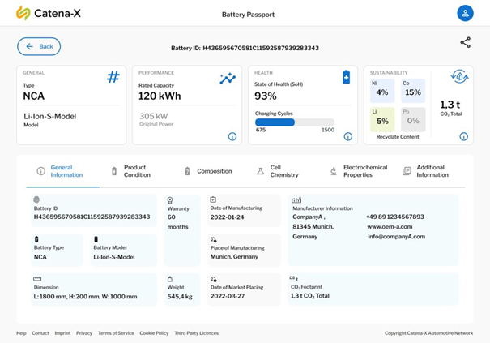
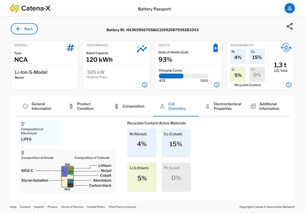
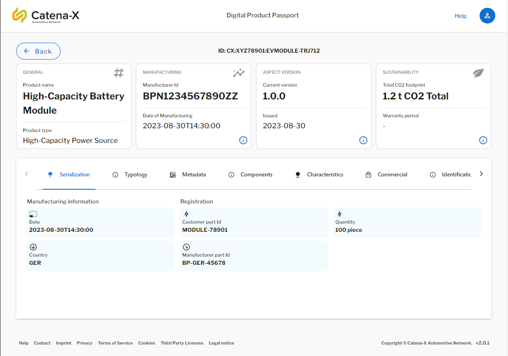
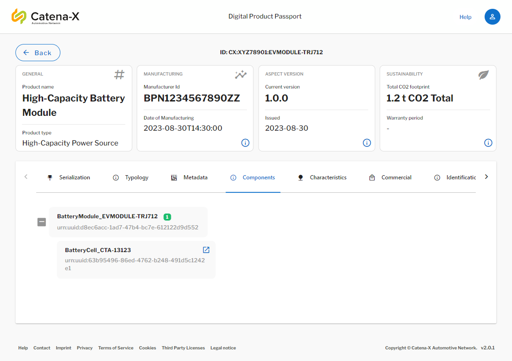

<!--
#################################################################################
# Tractus-X - EcoPass KIT
#
# Copyright (c) 2022, 2024 Contributors to the Eclipse Foundation
#
# See the NOTICE file(s) distributed with this work for additional
# information regarding copyright ownership.
#
# This program and the accompanying materials are made available under the
# terms of the Apache License, Version 2.0 which is available at
# https://www.apache.org/licenses/LICENSE-2.0.
#
# Unless required by applicable law or agreed to in writing, software
# distributed under the License is distributed on an "AS IS" BASIS
# WITHOUT WARRANTIES OR CONDITIONS OF ANY KIND,
# either express or implied. See the
# License for the specific language govern in permissions and limitations
# under the License.
#
# SPDX-License-Identifier: Apache-2.0
##################################################################################
-->

---
id: Battery Pass Application Success Story
title: Battery Pass Application Success Story
description: 'EcoPass KIT Success Stories'
sidebar_position: 1
---

# Battery Pass Application Success Story

 <strong style="font-size: 20px">Battery Pass Application </strong>

## Introduction to the Use Case

The battery pass viewer app is one of the first functional applications for visualizing product passports, developed within the Catena-X initiative. 
This app is set to shape the way access to and interaction with digital product passports is made, by consolidating relevant product information in one tool in the most convenient way as possible.
The battery pass viewer app offers a simple solution for accessing digital product passports. All it takes is scanning a product's QR code or entering its unique ID, and you are immediately taken to the product's digital passport. 
By harnessing the capabilities of the Catena-X principles and network, the app ensures secure authorizations and data retrieval as well as reliable data quality across an entire value chain. 
This way, the viewer app ultimately sets new standards for accessibility and usability of product information and enables further application scenarios for product data.
The advantages of the battery pass viewer app are numerous. It simplifies the process of getting product information, making the process easy and efficient and consolidating relevant information in one place. 
As such, the app provides valuable KPIs in four critical areas: General, Performance, Health, and Sustainability, offering relevant insights for an initial assessment of a product. Furthermore, six additional information categories, namely *General Information*, *Product Condition*, *Composition*, *Cell Chemistry*, *Electrochemical Properties*, and *Additional Information*, are included. 
These categories provide further detailed information about a product, such as its material composition or additional information, like certificates or disassembly instructions.

The battery pass viewer app is provided as a FOSS application so that I can be implemented by every interested party without additional cost. Moreover, it is fully compliant and compatible with the Catena-X principles and infrastructure, which makes it currently the only digital product passport application that can be used operationally on a large scale. 
Furthermore, compliance with Catena-X ensures appropriate data security and interoperability with various extant infrastructures in place, creating a low entry barrier.
The battery pass viewer app offers the consolidation of relevant battery information in one place and thus represents the first useable digital product passport application, however, currently limited to only batteries. 
Nevertheless, extension to further products and adding additional features are already planned, ultimately improving the user experience and overall value add of the application. 

The following screenshots and demo video serve as a preview of the app and it's functionalities:

## General Information Display

The application is able to visualize general information about the battery and its components in a user friendly way. Allowing the user to access valuable information about the physical battery located in front of him or inside of the vehicle he is maintaining.

## Cell Information Display

Other Important information is displayed like hazard materials and critial raw materials. This information allows the user to know and act acordently depending on the information he has available in the Application. Increasing the safety of the worker and

## Product Presentation Video

Here is a video presenting the Battery Pass Application. It was displayed at the Hannover Messe 2023 as part of the Demo Explanation of the Battery Pass Concept.

<video controls style={{width:'100%'}} controlsList="nodownload">
  <source src="https://github.com/eclipse-tractusx/eclipse-tractusx.github.io.largefiles/raw/main/ecopass-kit/20230404_Catena-X_Product_Demo_BatteryPass_App_HMI2023.mp4"/>
</video>

## Reference Implementation

The Battery Pass Viewer App is now available with extended options for Digital Product Passports and Transmission Passports. This are the other functionalities the [Digital Product Pass](https://github.com/eclipse-tractusx/digital-product-pass/) application has:

- Drill Down in Components of the Passports using the Item Relationship Service.

- Retrieve any Aspects from Catena-X through Eclipse DataSpace Connectors in the DPP Backend Reference implementation.
- Visualize additional product data in the Digital Product Pass Aspects.

Keep an eye out for [updates](https://github.com/eclipse-tractusx/digital-product-pass/blob/main/docs/RELEASE_USER.md) as we work diligently to bring the vision of a comprehensive digital product passport to life.

Here is the [link](https://github.com/eclipse-tractusx/digital-product-pass/) to the project repository in Tractus-X.

## NOTICE

This work is licensed under the [CC-BY-4.0](https://creativecommons.org/licenses/by/4.0/legalcode).

- SPDX-License-Identifier: CC-BY-4.0
- SPDX-FileCopyrightText: 2023, 2024 ZF Friedrichshafen AG
- SPDX-FileCopyrightText: 2023, 2024 Robert Bosch GmbH
- SPDX-FileCopyrightText: 2023, 2024 Bayerische Motoren Werke Aktiengesellschaft (BMW AG)
- SPDX-FileCopyrightText: 2023, 2024 T-Systems International GmbH
- SPDX-FileCopyrightText: 2023, 2024 SAP SE
- SPDX-FileCopyrightText: 2023, 2024 CGI Deutschland B.V. & Co. KG
- SPDX-FileCopyrightText: 2023, 2024 Fraunhofer-Gesellschaft zur Förderung der angewandten Forschung e.V. für ihre Institute IPK und IPK
- SPDX-FileCopyrightText: 2023, 2024 BASF SE
- SPDX-FileCopyrightText: 2023, 2024 Henkel AG & Co. KGaA
- SPDX-FileCopyrightText: 2023, 2024 Contributors to the Eclipse Foundation
- Source URL: https://github.com/eclipse-tractusx/eco-pass-kit
