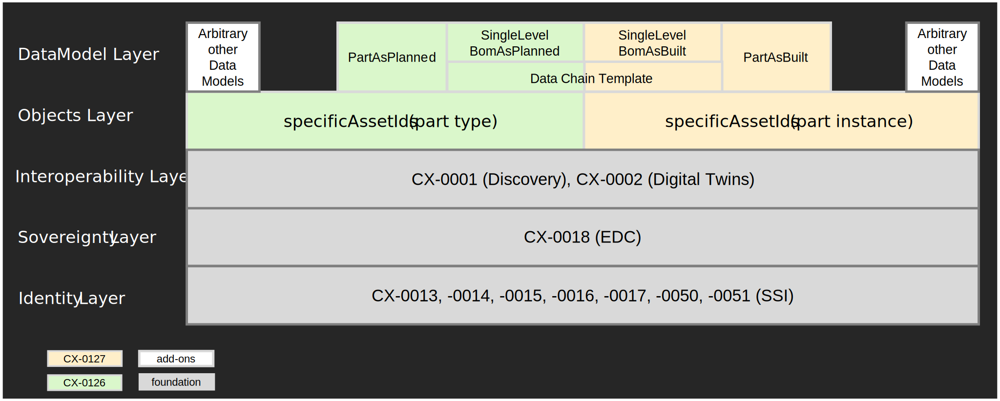

<!--
This work is licensed under the CC-BY-4.0 (https://creativecommons.org/licenses/by/4.0/legalcode).

- SPDX-License-Identifier: CC-BY-4.0
- SPDX-FileCopyrightText: 2023 BASF SE
- SPDX-FileCopyrightText: 2023 Bayerische Motoren Werke Aktiengesellschaft (BMW AG)
- SPDX-FileCopyrightText: 2023 Fraunhofer-Gesellschaft zur Foerderung der angewandten Forschung e.V. (represented by Fraunhofer ISST & Fraunhofer IML)
- SPDX-FileCopyrightText: 2023 German Edge Cloud GmbH & Co. KG
- SPDX-FileCopyrightText: 2023 Mercedes Benz AG
- SPDX-FileCopyrightText: 2023 Robert Bosch Manufacturing Solutions GmbH
- SPDX-FileCopyrightText: 2023 SAP SE
- SPDX-FileCopyrightText: 2023 Siemens AG
- SPDX-FileCopyrightText: 2023 T-Systems International GmbH
- SPDX-FileCopyrightText: 2023 ZF Friedrichshafen AG
- SPDX-FileCopyrightText: 2023 Contributors to the Eclipse Foundation
- Source URL: https://github.com/eclipse-tractusx/eclipse-tractusx.github.io/tree/main/docs-kits/kits/Industry%20Core%20Kit (latest version)
-->

import Notice from './part_notice.mdx'

The following page offers an architecture perspective including the main building blocks and information regarding
communication between different components, shown as sequence diagrams in a runtime view. In general, data access must
be provided in the Catena-X network using the Data Space Protocol (DSP). As standard for data-level interoperability,
the Asset Administration Shell (AAS) standard is used - this is relevant for registering data via the Digital Twin
Registry (short DTR), as well as for delivery of said data. SAMM is used as modelling language to model a Digital Twin's
aspects, yielding json-schema that defines the payloads and context for runtime data.

## Assumptions

This architecture is based on the following assumptions:

- There is a complete setup of the Catena-X Dataspace available with all Core Services as defined by the [Operating Model Whitepaper v2.1](https://catena-x.net/fileadmin/_online_media_/CX_Operating_Modelv2.1_final.pdf).
- All users have **completed onboarding** to the Catena-X network. This includes:
    - All participants hold a Verifiable Credential issued by an Operating Company (Core Service Provider B)
    - All participants have at least one Dataspace Connector deployed that's linked to their BPNL at the EDC Discovery
      Service.
    - All participants have an active network membership that is represented in their membership credential.
    - Data Providers operate a Digital Twin Registry according to
      the [Digital Twin Kit](../Digital%20Twin%20Kit/Adoption%20View%20Digital%20Twin%20Kit)
    - Data Providers expose their data via the Submodel API according to the Digital Twin Kit.
- The **customers of parts** (on catalog and instance level) must be known when creating a digital twin and registering
  its data. Registering data in EDC and DTR requires data providers to define appropriate access permissions to prevent
  exposing data to unauthorized parties. For Traceability, the customer of a part must have access to the digital twin
  in
  the DTR as well as to the digital twin's data in the EDC. If the customer is not known when a digital twin is created,
  additional processes must be set up by the data provider to add access permissions for the customer at a later time.

## Non-Functional Requirements

| Requirement | Description                                                                                                                                                                                                                                                                                                                                                                                                                                                                                                                                                                                                                                                                                                                                                                                                                                                                                                                                                                                                                                                                                         |
|:-----------:|:----------------------------------------------------------------------------------------------------------------------------------------------------------------------------------------------------------------------------------------------------------------------------------------------------------------------------------------------------------------------------------------------------------------------------------------------------------------------------------------------------------------------------------------------------------------------------------------------------------------------------------------------------------------------------------------------------------------------------------------------------------------------------------------------------------------------------------------------------------------------------------------------------------------------------------------------------------------------------------------------------------------------------------------------------------------------------------------------------|
| Lawfulness  | Automotive supply chains hold sensitive data. Not only can improper exposure lead to the loss of trade-secrets but it can also violate antitrust regulations - especially when gaining access to sensitive data of horizontal competitors. As this can jeopardize the business of a company, especially Data Providers (and by proxy Business Application Providers) must ensure that their solutions are not only secure by default but also provide ergonomic and reliable means for configuration.                                                                                                                                                                                                                                                                                                                                                                                                                                                                                                                                                                                               |
| Correctness | Data Chains are built up of the links to resources distributed among the supply chain. This is reflected in distributed data. Publishing incorrect or outdated data to the network will have ripple-on effects that may break the chain for all interested parties. To avoid this, implementation strictly according to standard, verified by rigorous certification, is critical for the success of the Industry Core and the network as a whole.                                                                                                                                                                                                                                                                                                                                                                                                                                                                                                                                                                                                                                                  |
| Resilience  | While processing data for publishing it to Catena-X, a data provider needs to access the digital twins of built-in parts from suppliers. These must be available in Catena-X at this point. If these digital twins are not found while the data provider is looking them up, the data provider will not be able to integrate these built-in parts into BoM aspect models (e.g., SingleLevelBomAsBuilt) as it is missing the built-in parts' Unique ID. Reasons for not finding a built-in part's digital twin can be:<ol><li>There is a network failure while the data provider's is looking for the digital twin.</li><li>The supplier did not yet create the digital twin, e.g., because its internal processes were delayed.</li><li>The supplier is not yet part of the Catena-X network.</li></ol>Resilience means that the data provider implements a pipeline that can cope with these issues. Digital twins are provided with the information that is available and are updated once more information is available (e.g., the supplier provides digital twins for built-in parts later on). |
| Backward Compatibility | 
Backward compatibility in Catena-X allows for interoperability with previous Catena-X releases and not just the most recent one. For Industry Core, this means that software, e.g., a Traceability app, that was built based on an older, but still valid, Industry Core KIT and Catena-X version, must still work in an environment that is running the most recent Catena-X release. A new release is not allowed to introduce a new or change an existing feature that prevents software (based on a still valid release) from no longer working.

Only major Catena-X releases may contain breaking changes and do not need to be backward compatible. Data providers and data consumers must take special care to prepare for such releases by planing necessary migrations in time.
<ul><li> **For digital twins and aspect models**, this means that data providers and data consumers MUST at least support the mandatory version of an aspect model. Support for newer versions is optional, but if supported, they must be provided or consumed additionally to the mandatory version. A data provider that wants to support several versions of aspect models must add a separate submodelDescriptor for every supported aspect model version to the digital twin. The submodelDescriptors will have different semanticIds and might also point to different EDC assets - depending on the asset structure used in the EDC for providing the digital twin's sumodel. A data consumer must part the submodelDescriptors for a digital twin for supported semanticIds and then select the most suitable one for further processing.</li><li>**For Notification APIs**, a separate EDC asset must be created for every minor API version, e.g., for versions v1.1 and v1.2 of the API separate EDC assets must be created. The API version (e.g., 1.1) must be documented in the `https://w3id.org/catenax/ontology/common#version` property of the EDC asset. It is not recommended to create a separate EDC asset for every patch version as a patch is always backward compatible. Adding the patch level to the EDC asset version forces data consumers to frequently to adapt to a new EDC asset. With that, a data consumer can select the correct API version that it supports.</li></ul>More details about the versioning of EDC assets (for submodels as well as for Notification assets) including examples, can also be found in the [Digital Twin KIT - Registration at EDC](https://eclipse-tractusx.github.io/docs-kits/kits/Digital%20Twin%20Kit/Software%20Development%20View/Specification%20Digital%20Twin%20KIT/#registration-at-edc). |

In general, data must be provided to the Catena-X network using the Data Space Protocol (DSP). As standard for digital twins the Asset Administration Shell (AAS) standard is used - this is relevant for registering digital twins (in the Digital Twin Registry) as well as for providing digital twin data. SAMM is used as modelling language to describe the data of digital twins as aspects models.

## Building Block View

## Runtime View

The runtime patterns represent a subset of the interactions specified in the Digital Twin Kit.
Its ["Discovery Sequence" section](../Digital%20Twin%20Kit/Software%20Development%20View/Specification%20Digital%20Twin%20KIT#discovery-sequence)
describes the interaction between a Data Provider and Data Consumer including the necessary configuration steps.
Since the Discovery Services according to CX-0053 are not part of the Industry Core, all calls going to the components
`DiscoveryFinder` and `BPN Discovery Service` can be omitted.

## Standards

A formal definition of the Industry Core's content is given in the standards CX-0126 and CX-0127 - first released in
CX R24-03. These two standards build on a common subset of technologies that are themselves described in Catena-X standards.

The two standards share a common set of base technologies. And while the Industry Core does provide Business-relevant
capabilities for Data Consumers, it can likewise serve as a launchpad for new use-cases.

The Interoperability Layer the Industry Core Standards build on, defines API structures of Data Providers and relevant
core services hosted centrally. They depend on the EDC Discovery Service defined in standard CX-0001 to discover a
participant's the EDC-endpoint. CX-0002 is the standard for the integration between assets and related data - leveraging
the Asset Administration Shell standard as adopted by Catena-X. Its correct deployment is especially critical as its
services (Digital Twin Registry and Submodel Endpoints) are operated by all Data Providers.

The Identity and Sovereignty Layers are defined in a variety of Catena-X standards that are assumed to be deployed and
integrated form the foundation for data exchange in Catena-X.

All relevant standards can be downloaded from the
official [Catena-X Standard Library](https://catena-x.net/de/standard-library):

- Industry Core specific
    - [CX - 0126 Industry Core Part Type 1.0.0](https://catena-x.net/de/standard-library)
    - [CX - 0127 Industry Core Part Instance 1.0.0](https://catena-x.net/de/standard-library)
- Interoperability Layer
    - [CX - 0001 EDC Discovery API 1.0.2](https://catena-x.net/de/standard-library)
    - [CX - 0002 Digital Twins in Catena-X 2.2.0](https://catena-x.net/de/standard-library)
    - [CX - 0003 SAMM Aspect Meta Model 1.1.0](https://catena-x.net/de/standard-library)
- Sovereignty Layer
    - [CX - 0018 Eclipse Data Space Connector (EDC) 2.1.0](https://catena-x.net/de/standard-library)
- Identity Layer
    - [CX - 0013 Identity of Member Companies 1.1.0](https://catena-x.net/de/standard-library)
    - [CX - 0014 Employees and Technical Users 1.0.1](https://catena-x.net/de/standard-library)
    - [CX - 0015 IAM & Access Control Paradigm 1.0.1](https://catena-x.net/de/standard-library)
    - [CX - 0016 Company Attribute Verification 1.1.0](https://catena-x.net/de/standard-library)
    - [CX - 0017 Company Role by the Connector 1.1.0](https://catena-x.net/de/standard-library)
    - [CX - 0050 Framework Agreement Credential 1.0.0](https://catena-x.net/de/standard-library)
    - [CX - 0051 Summary Credential 1.0.0](https://catena-x.net/de/standard-library)

_Sidenote: The following existing standards are incorporated into new standards. Please only refer to CX-0126 and CX-0127._

- [CX - 0126 Industry Core Part Type 1.0.0](https://catena-x.net/de/standard-library) is the new standard based on the following existing standards:
    - CX - 0042 Aspect Model SingleLevelBomAsPlanned
    - CX - 0043 Aspect Model PartAsPlanned
    - CX - 0094 Aspect Model PartSiteInformationAsPlanned
    - CX - 0061 Triangle Traceability Data Provisioning BomAsPlanned
- [CX - 0127 Industry Core Part Instance 1.0.0](https://catena-x.net/de/standard-library) is the new standard based on the following existing standards:
    - CX - 0019 Aspect Model SerialPart
    - CX - 0020 Aspect Model SingleLevelBomAsBuilt
    - CX - 0021 Aspect Model Batch
    - CX - 0060 Triangle Traceability - Digital Twin As-Built

<Notice components={props.components} />
