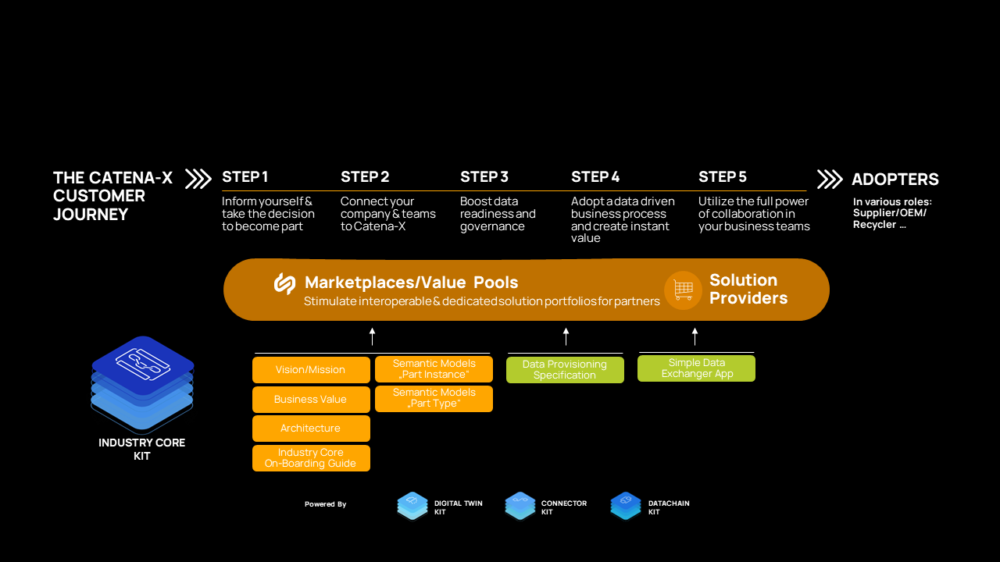

<!--
This work is licensed under the CC-BY-4.0 (https://creativecommons.org/licenses/by/4.0/legalcode).

- SPDX-License-Identifier: CC-BY-4.0
- SPDX-FileCopyrightText: 2023 BASF SE
- SPDX-FileCopyrightText: 2023 Bayerische Motoren Werke Aktiengesellschaft (BMW AG)
- SPDX-FileCopyrightText: 2023 Fraunhofer-Gesellschaft zur Foerderung der angewandten Forschung e.V. (represented by Fraunhofer ISST & Fraunhofer IML)
- SPDX-FileCopyrightText: 2023 German Edge Cloud GmbH & Co. KG
- SPDX-FileCopyrightText: 2023 Mercedes Benz AG
- SPDX-FileCopyrightText: 2023 Robert Bosch Manufacturing Solutions GmbH
- SPDX-FileCopyrightText: 2023 SAP SE
- SPDX-FileCopyrightText: 2023 Siemens AG
- SPDX-FileCopyrightText: 2023 T-Systems International GmbH
- SPDX-FileCopyrightText: 2023 ZF Friedrichshafen AG
- SPDX-FileCopyrightText: 2023 Contributors to the Eclipse Foundation
- Source URL: https://github.com/eclipse-tractusx/eclipse-tractusx.github.io/tree/main/docs-kits/kits/Industry%20Core%20Kit (latest version)
-->

import Notice from './part_notice.mdx'

The following page offers a high level business view on the Industry Core KIT with its vision, mission, benefits, business value, customer journey and examples in form of videos.

## Vision & Mission

### Vision

The goal of Catena-X is to empower data-driven use cases to address the current challenges of sustainability,
 resiliency, and quality. In the automotive industry, these challenges predominantly revolve around optimizing physical parts, 
 components, and materials. The Catena-X Industry Core describes how these parts and vehicles can be digitally represented and found in the Catena-X network.
 It serves as the foundation to enable the seamless integration of multiple use cases. 
 Reusing central components and standards (especially data provisioning of digital twins of parts) across different use cases promotes efficiency and interoperability. 
 The Industry Core enables a sovereign data exchange based on parts and vehicles and lays the foundation for compliance with supply chain regulations.
 Each partner in each Industry Core compliant use case expands the Catena-X network and the realization of seamless data chains. 
 As a result, cross-domain network effects and n-tier use cases become possible with each use case benefiting from all others.

### Mission

The Industry Core describes a physical part, component or material at type and/or instance level, makes it identifiable and discoverable in the network and enables traversing across several levels.

Thus, it acts as a fundamental framework that facilitates smooth integration of various use cases. The Industry Core KIT and standards will enable data- and application-providers to instantiate and make use of the Industry Core. 
It will provide a common set of tools and a foundational definition to ensure that interoperability standards extend beyond technical aspects. This includes guidance for setting up the core- and enablement-services to ensure easy onboarding like guidance on setting up the required participant infrastructure like a decentralised Digital Twin Registry and Submodel endpoints for discovery of digital twins. 
Once set up, Catena-X use cases like Traceability, Circular Economy, PCF and more can easily be built on top by adding further business logic and aspect models to the digital twins established.

In the current version, the KIT supports the creation of digital twins on a Type-level (part- / material-number, catalog part) and Instance-level (a specific vehicle, serialized part, batches etc.) as well as the logical linking to their sub-components (Bill of Material, BoM). The default visibility of digital twins and their respective semantic models follows the one-up/one-down principle. 

Parts and vehicles on the Instance-level can be provided and linked to their subparts, when the part or vehicle has been built. This is why it is often also refered to the lifecycle phase BoM as built.
Parts and vehicles at type level can be provided at the earliest when the part has been designed and is available for ordering as a catalog part. The linking of subcomponents at this point in time is often referred to as BoM as planned. However, the digital representation of the part at type level can also be initiated at a later point in time and remains in place until the part is dismantled.

The Industry Core KIT provides the necessary standards, aspect models, APIs, logics, and processes on how to implement the Industry Core. 
All described specifications in the KIT are based on Catena-X standards like Data Space Connector, Asset Administration Shell (AAS), and dezentralised Digital Twin Registry (DTR). They refer to other Catena-X KITs like the Connector KIT (EDC), Data Chain KIT (Item Relation Ship, IRS) and Business Partner KIT to ensure interoperability and data sovereignty according to IDSA and Gaia-X principles.

## Business Value & Benefits
### Business Value

The Industry Core enables a sovereign data exchange based on parts and vehicles and the realization of n-tier data chains.
It facilitates the implementation of part-related Catena-X use cases such as traceability, circular economy, PCF and many more. 

The reusing core- & enablement services and the uniform usage of digital twins
accelerates data providers and consumers to implement new use cases to the Catena-X ecosystem. 
This leads to a much faster time-to-market and scalability of new value-driven use cases.

### Todays Challenge
Catena-X use cases and solutions are based on the provision and utilisation of data. To this end, the use cases often define their own infrastructure and semantics for data exchange. This leads to redundancies at data level, resulting in additional effort and complexity in data provision.

The Catena-X network and the Industry Core create an industry-wide standard for data exchange by re-using central components and shared semantics.
To do so, once is enough: Once EDC, BPN, decentralized registry, and digital twins according to standardized semantics are established, numerous use cases can be enabled by extending the tech-stack with domain specific data aspects / models.
The goal is to facilitate simple onboarding and leverage network effects. Reusing central components and standards (especially in data provisioning) across different use cases promotes efficiency and interoperability. 

### Benefits for OEM, SME and Solution Provider
#### OEM
The Industry Core simplifies data provision. Once the Industry Core is set up, multiple use cases can be easily enabled through additional sub-models attached to the digital twin, promoting component reuse. 
This reduces infrastructure costs and time to value, lowering the barrier to entry for participation in new use cases.

The same applies as a data consumer. Easy and fast discovery of supplier components enables fast and component-related data exchange. 
The pattern for access and interaction with data from business partners becomes independent of the data’s content: After all, additional use-cases can be onboarded simply by accessing different submodels of a digital twin.

#### SME
Reduced complexity helps SMEs participating at more than one Catena-X use case. 
One example is the reduction in interfaces to shopfloor, PLM or MES systems, 
as this data only needs to be provided once and not individually for each use case.

#### Solution Provider
Fast and efficient scalability of new use cases through reusability of central components.
Solution providers will be able to implement and offer new Catena-X use cases easily and fast 
since they are built on top of each other.

## Customer Journey
With the Industry Core KIT, we support the Catena-X customer journey for our adopters and solutions providers.

<Notice components={props.components} />
