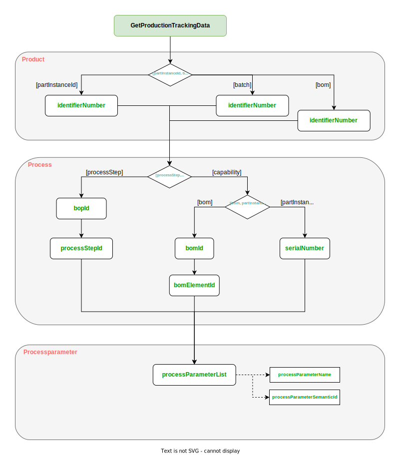
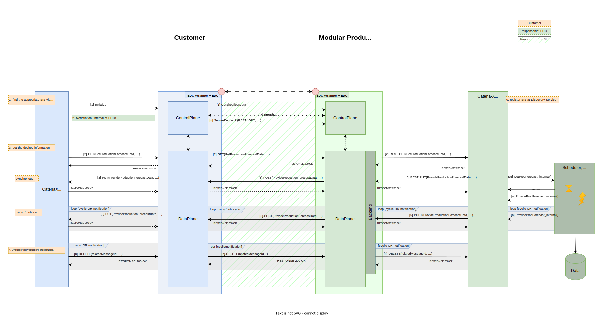
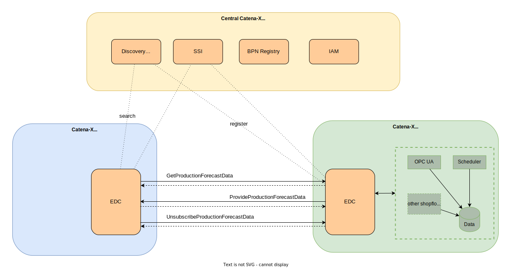
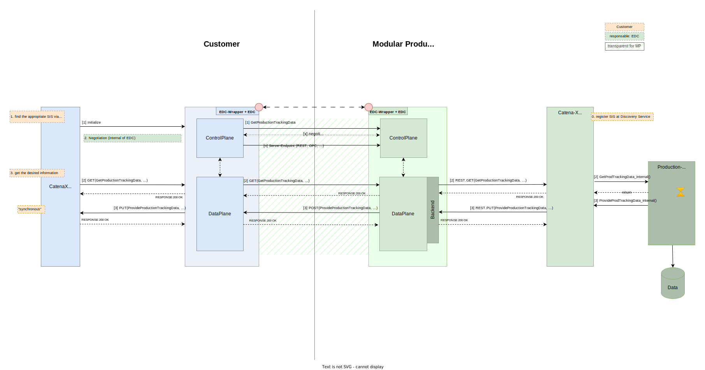
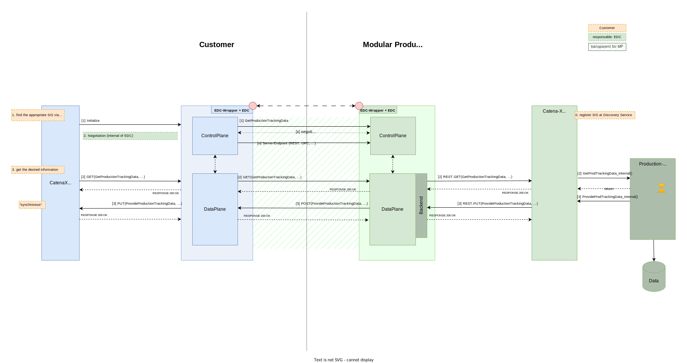

### Modular Production Kit

## Vision & Mission

### The missions of the KIT

The solution approaches developed in the Modular Production use case are environments to leverage existing business potentials. For this purpose, services, interface, and data model definitions based on industry standards are introduced with the goal of increasing the flexibility and reliability of industrial production.

Business Partners can deploy these developments by utilizing the Catena-X Network, where Modular Production offers services on the one hand to supply its partners with information about production planning and production parameters, as requested by other use cases. On the other hand, Modular production can also request services.

## Business Value

Existing business values can be increased by enabling customized production (batch size 1) without a significant increase of costs. Key factors for such a production environment are automated planning of production processes, flexible resource orchestration, as well as available product information during its manufacturing. Process parameters collected during the actual production as well as common data models for the production process can also be beneficial for other partners.  With new applications and exchanged information between the partners along the value chain, the OEM can increase the efficiency within its shop floor and thus, reduce planning times and costs by an automated reconfiguration of processes and resources in case of unplanned events. Consequently, the saved efforts can be utilized to launch new business models or increase the overall output.

## Business Process

Modular Production is part of the value chain. Therefore, it must guarantee flexibility and availability on the one hand and on the other hand it has to allow product flexibility in combination with small lot sizes. The effect of disturbances and decisions in this network are not limited to a local area, however, they have also a big impact to other partners in the value chain network. In consequence, it is necessary to directly communicate data from the shop floor to other members of the network, such as customers or third parties like logistic companies. This communication is realized with the Shop-Floor-Information-Service (SIS). The Shop-Floor-Information-Service consists of two modules: Production Forecasting and Production Tracking:

For example, if a customer wants to know the estimated production date for a product, he uses the Production Forecasting to get this information either with a direct request, via cyclic messages or notifications in case of a deviation from the initially scheduled production plan. The Shop-Floor-Information-Service uses the *GetProductionForecastData* and *ProvideProductionForecastData* data model to exchange the requested information.

The Production Tracking offers the opportunity for a customer to request certain data of the production process, e.g. the actual applied torque for a performed manufacturing step. This can either be done for a documentation of the overall product by collecting information of the individual subparts. The tracking data can also be used for traceability in case of error analysis, these parameters can be used to find the root of a failure resp.  to exclude certain failure roots. The Shop-Floor-Information-Service uses the *GetProductionTrackingData* and *ProvideProductionTrackingData* data model.

Common data models for products and their manufacturing steps are required for cross-company data exchange: Such a model is the Bill of Process (BoP) data model. It generally describes the best-practice approach for manufacturing a product, including detailed information about the overall processes, precedence relations between process steps and process parameters. Due to multiple forms of process representations, a standardized format for such an exchange of process information is required along the value chain.

The standardized BoP semantic model addresses these issues and allows the representation of any industrial process, regardless of the industrial sector. The data model contains  an extended precedence graph is specified to allow parameter flow between process steps. The model is a shared aspect that can be included in other semantic models. One such model is the Request for Quotation data model standardized in the [Manufacturing as a Service KIT](https://eclipse-tractusx.github.io/docs-kits/kits/Manufacturing%20as%20a%20Service%20Kit/Adoption%20View%20MaaS%20KIT/#request-for-quotationmodel). The Request for Quotation defines detailed requirements, deadlines, and evaluation criteria for obtaining quotations from potential manufacturers for specific products or services and serves as the starting point for the reconfiguration in a modular production, enabling integration into the value chain alongside the SIS.

## Whitepaper

- [Modular Production Onboarding](res/modular-production-onboarding.pdf)

## Semantic Model

In the following sub-chapters, we will make references to a specific example. This example will serve as a guiding thread, illustrating different concepts and providing continuity. By consistently referencing this example, we aim to create a cohesive narrative that enhances understanding and reinforces key ideas of our semantic models and components. The example object to be manufactured is a box with a lid. The box is cylindrical and has a lid that is securely fastened with three screws. As the box in our scenario is already being produced, a BoP is available. Data about the estimated production date and production process can be requested using the GetProductionForecastData and GetProductionTrackingData data models. All relevant sample data is available in JSON format in the [Software Development View](https://eclipse-tractusx.github.io/docs-kits/kits/Modular%20Production%20Kit/Software%20Development%20View/Sample%20Data%20Modular%20Production%20Kit/).

### Production Forecast

The Production Forecast aspect of the Shop Floor Information Service features one data exchange mechanism, which in turn consists of three semantic models, namely the *GetProductionForecastData* model and the *ProvideProductionForecastData* model, as well a *CommonDataModel* named *ShopFloorInformationTypes*.

All partners need the same semantic models for a common understanding of the information exchange. Customers or third parties specify within the *GetProductionForecastData* model the actual required information about an order or a position within an order. Modular Production interprets this request and reply with the *ProvideProductionForecastData* model. Depending on the customer’s request, Modular Production sends either a single or multiple responses. For the latter, customers need to notify Modular Production that no further forecasts are desired.

The *GetProductionForecastData* is sent from a partner to Modular Production with a HTTP request to receive a production forecast. The *ProvideProductionForecastData* model contains the orders, the estimated production date and a state describing whether the order is planned, in progress or done and the creation date of the information.

The semantic model can be found here:

- [io.catenax.shopfloor_information.get_production_forecast](https://github.com/eclipse-tractusx/sldt-semantic-models/tree/main/io.catenax.shopfloor_information.get_production_forecast)
- [io.catenax.shopfloor_information.provide_production_forecast](https://github.com/eclipse-tractusx/sldt-semantic-models/tree/main/io.catenax.shopfloor_information.provide_production_forecast)
- [io.catenax.shared.shopfloor_information_types](https://github.com/eclipse-tractusx/sldt-semantic-models/tree/main/io.catenax.shared.shopfloor_information_types)

The *GetProductionForecastData* model must be implemented by all participants who wish to use forecasting aspect of the Shop-Floor-Information-Service as a Modular Production, a customer or a participating third party. Companies, which use the Shop-Floor-Information-Service as a customer or third party must be able to send *GetProductionForecastData* request, whereas partners using the Shop-Floor-Information-Service as a Modular Production must be able to receive the *GetProductionForecastData* request. Besides, the *GetProductionForecastData* model enables a customer to select one of three communication modes. In general, the *communicationMode* describes different ways of communication between Modular Production and a consumer. In case of the synchronous mode, Modular Production immediately sends the requested information back to the consumer, whereas the other modes are addressing a continuous exchange.  The cyclic mode sends the information periodically (e.g. every day), whereas the notification mode informs if the forecast for the production has changed. Besides the communicationMode some mode specific parameters are also part of the data model.
The *ProvideProductionForecastData* model responses to the request. It contains a specific forecast for all orders and order positions. Consequently, the response consists of a list with forecast dates where each list element refers to an id for each of the orders/order positions.  The link to the request is accomplished with a related *messageId*, referring to the *messageId* of the initial request. *ProvideProductionForecastData* is containing the orders, the estimated production date and a state describing whether the order is planned, in progress or done as well as some protocol data like ids and date of creation of the information.
In the case of the overarching example, the *ProvideProductionForecastData* model provides new information via notifications, one of the three specified communicationModes, indicating that there has been a change in the estimated production date. The *positionId* specifies that the box is impacted. Along with the reason for the delay, a new estimated date is provided enabling the avoidance of useless commitment of production capacities and the optimization of production processes through more precise planning.

### Production Tracking

The Production Tracking aspect of the Shop Floor Information Service features again one data exchange mechanism, which in turn consists of two semantic models, namely the *GetProductionTrackingData* model and the *ProvideProductionTrackingData* model.

All partners need the same semantic models for a common understanding of the information exchange. Customers or third parties specify within the *GetProductionTrackingData* model the required information about a manufacturing step. This requires that both Modular Production as well as the customer have a common understanding about the product to be manufactured. This common knowledge is referenced for the request.  Modular Production interprets this request and replies with the *ProvideProductionTrackingData* model. Depending on the customer’s request, Modular Production sends the requested information.

The *GetProductionTrackingData* is sent from a partner to Modular Production with a HTTP request to receive production tracking information. The *ProvideProductionTrackingData* model is containing the relevant information like *processParameterName*, *processParameterValue* and *processParameterQuality*

The semantic model can be found here:

- [io.catenax.shopfloor_information.get_production_tracking](https://github.com/eclipse-tractusx/sldt-semantic-models/tree/main/io.catenax.shopfloor_information.get_production_tracking)
- [io.catenax.shopfloor_information.provide_production_tracking](https://github.com/eclipse-tractusx/sldt-semantic-models/tree/main/io.catenax.shopfloor_information.provide_production_tracking)

The *GetProductionTrackingData* model must be implemented by all participants who wish to use the production tracing aspect of the Shop-Floor-Information-Service as a Modular Production, a customer or a participating third party. Companies, which use the Shop-Floor-Information-Service as a customer or third party must be able to send *GetProductionTrackingData* request, whereas partners using the Shop-Floor-Information-Service as a Modular Production must be able to receive the *GetProductionTrackingData* request.

To exchange data between Modular Production and the customer it is necessary that both agree on a common understanding of the product and the production process. Therefore, for identifying the product it is necessary either to use the serial number *partInstanceId* in case of an individual component or the batch number batch to identify the product batch. The use of a defined bomID is also possible. In order to identify the production step, there are also several possibilities as well. In the case of a commonly known BoP the *BoPId* and the corresponding *processStep* can be used. As an alternative it is also possible to refer to a capability to identify a specific process step. For further identification the bomElementId of the bomId is used to refer to the manufactured part, or the serial number of the part if known. Finally, the required process parameters like “temperature”, or “torque” will be selected by a list of process pairs containing the ProcessParameterId and its processParameterSemantic.

The *ProvideProductionTrackingData* model responses to the request. It contains the results to the list of process pairs of the RequestProductionTrackingData. Besides the version and the optional CatenaXId, it contains in order to match the reply the *identifierType* and *identifierNumber*.  The actual answer is then in a list containing process parameter values. Each process parameter includes the *processParameterName* (the name), its *semanticId* (e.g. semantic identification like ECLASS), a *processParameterValue* (THE value) and a corresponding quality (enumeration: ok, inexact, noValue) assessing the value.

In the case of the overarching example, the requested process parameter for the box is the maximum torque during the screwing process of the first screw to fasten the lid. This information is provided via the *identifierNumber* of the type *partInstanceId* and the *processStepId*. Following the provided ECLASS *semanticId*, the definition of the parameter can be inferenced, leading to a shared understand of the provided process parameter value. With a torque of 10, the *processParameterQuality* indicates that the value is within limits. In a real-world example, the *processParameterValue*List would most likely contain several process parameters, but for the sake of clarity, only one is provided.

### Bill of Process

The BoP data model defines a set of mandatory properties to provide information about the product to be manufactured and enables the common understanding required for production tracking. To exchange the BoP semantic model, all partners must use the same model.

The BillOfProcess entity includes a version property that represents the data model version, a unique identifier for the bill of process, and a name for the product whose manufacturing process is specified. Additionally, a *productVersion* can be specified to differentiate between different product variants, such as the same product in different colors. The entity also contains a process property that includes a list of all process steps.

These steps can be provided in any order as the relation between them is handled internally within the *processStep* entity. However, it is necessary to model each *processStep* instance explicitly in the precedence graph. Each *processStep* must provide a unique identifier and refers to a manufacturing capability that must be performed on a product in order to accomplish the corresponding process step. The capabilityReference should refer to an instance of the [Manufacturing Capability semantic model](https://github.com/eclipse-tractusx/sldt-semantic-models/tree/main/io.catenax.manufacturing_capability) defined in the namespace *io.catenax.manufacturing_capability*. All partners must use the same version of the manufacturing capability semantic model. Optional input and output parameters can be associated with each process step. The precedenceRelation property can be used to specify dependencies to subsequent process steps. Additionally, a process step can be broken down into smaller process steps using *childProcessSteps*. The *processStepType* categorizes each process step into one of four classes, simplifying the creation of the precedence graph.

The *parameter* entity is utilized to specify *inputParameters* and *outputParameters* for a process step. Each parameter must be named. To ensure a shared understanding of the exchanged parameters, each parameter entity must have a *semanticReference* that contains a list with at least one element. This list element refers to a globally defined semantic that characterizes the parameter, such as a definition in the EClass Standard and provides meaning to the parameters, allowing partners to interpret them accurately. The list may contain multiple semantics that define the underlying parameter. The BoP data model offers four options for specifying parameters. The parameter expression depends on the value of the property parameterKey, which can be *HasNoValue*, *HasValue*, *HasValueRange*, or *HasTolerances*. In each case, certain optional properties of the Parameter entity become mandatory.
Precedence relations link process steps to create the precedence graph of the process. These relations always point to the direct successors of a process step. The precedenceRelation property consists of three nested lists that are used for conditions such as alternatives between successors, a set of successors, or successors that must be executed in parallel.

In order to further illustrate the use of the BoP semantic model, we have published a README file on github that details specific processStepTypes, precedenceRelations or parameterKeys and exemplifies their use with JSON examples.
The semantic model alongside the README file can be found here:

- [io.catenax.shared.bill_of_process](https://github.com/eclipse-tractusx/sldt-semantic-models/tree/main/io.catenax.shared.bill_of_process)

The BoP for the overarching example describes the production process for the box with a lid. In total, four process steps are specified. Each process step is uniquely identifiable and can therefore be referenced by the *ProvideProductionTrackingData* model. The first process step is the 3D printing of the lid. The capability for this process step is a sample value for the manufacturing capability aspect model, which is defined in the *io.catenax.manufacturing_capability* namespace. It is used to create a common understanding of the capability to be performed on a product in order to complete the respective process step. Once the cover has been 3D printed, any of the three screwing process steps can be performed, meaning the order in this case is arbitrary. This is achieved by listing all three process steps as successors of the first process step. Each screwing process step is marked as the last process step, indicating that there are no further successors. The defined *input*- and *outputParameters* provide a common understanding of the required parameters for the processes. In this case the maximum torque is defined for the screwing process steps. The *outputParameter* has the *parameterKey* “hasNoValue”, because this data is only available after the process step has been performed. This data can be requested via the *ProvideProductionTrackingData* model, which includes the name, value and semantic reference.

## Logic & Schema

### Production Forecast

#### Architecture

The *GetProductionForecastData* contains the request for the forecasting data which is sent from a Modular Production partner like a customer or a third party on the next lower tier to the Modular Production. All participants using the forecasting aspect of the Shop-Floor-Information-Service in the role of a customer, or third party must be able to send the *GetProductionForecastData*. All participants using the forecast aspect of the Shop-Floor-Information-Service in the role of a Modular Production must be able to receive and process the *GetProductionForecastData*.
The following diagram depicts all possible interactions between partners in case they apply the forecasting aspect of the Production Forecast Service. The communication between partners is accomplished by utilizing the Eclipse Data Space Connector (EDC) to ensure data sovereignty.) It takes place in different phases:

1. Negotiation between the EDC of the partners using the proposed policies.
2. *GetProductionForecastData*(...) - the call of the customer
3. get the desired information via *ProvideProductionForecastData*(...) - transferred by Modular Production (synchronous, cyclic, or notification-like)
4. Unsubscribe from the *GetProductionData* service to receive no further information

The left side shows the different request possibilities of customers. The right side shows Modular Production that features a scheduler to generate answers for requests. The two boxes in the middle represent the EDC of each partner. The communication between the respective EDC is transparent to the user (shaded). Data for the request and the response are transmitted in the payload of the messages. The synchronous response (http response) does not contain any technical information but provides information whether the exchange of information succeeded or not. The specific information is sent with one or multiple asynchronous responses, depending on the communication mode between the partners. The left side shows the different request possibilities of customers. The right side shows Modular Production that features a scheduler who generates answers for requests.

#### Components

##### Technical requirements for a CATENA-X compliant data transmission

Both partners, the customer and the Modular Production, must be members of the Catena X network to communicate with each other. By registering a Modular Production in advance with the Discovery Service, a customer can find it via a so-called Business Partner Number (BPN). With the help of SSI (Self Sovereign Identity) the correct identity is guaranteed. Customers are using the *GetProductionForecastData* call to request a production forecast, as specified in CX-0142. The Modular Production generates the required information by internal services like a scheduler and answers accordingly by calling *ProvideProductionForecastData* as specified in CX-0142. In case of a cyclic messages or notification mode, the customer has to unsubscribe from the service, if the service is not needed anymore.

The *GetProductionForecastData* as well as the *ProvideProductionForecastData* is using an Asset Administration Shell (AAS) serialized as a JSON string which is sent through EDC mechanism: Namely: *GetProductionForecastData* uses *GetProductionForecastData* data model and *ProvideProductionForecastData* uses *ProvideProductionForecastData* data model. The unsubscribe call has no corresponding data model, as it is a simple HTTP DELETE. The JSON string is standardized in document “CX-0142 ShopFloorInformationService v.1.0.0”. The standard only describes the sending and receiving of Shop-Floor-Information-data through EDC. The object is created and handled by applications of the companies involved, but these applications are not part of the standard.

### Production Tracking

#### Architecture

The *GetProductionForecastTrackingData* contains the request for the tracking data which is sent from a customer or a third party on the next lower tier to the modular production. All participants using the tracking aspect of the Shop-Floor-Information-Service in the role of a customer, or third party must be able to send the *GetProductionTrackingData*. All participants using the tracing aspect of the Shop-Floor-Information-Service in the role of a Modular Production must be able to receive and process the *GetProductionTrackingData.*
The following diagram depicts all possible interactions between partners in case they apply the tracking aspect of the Production Forecast Service. The communication between partners is accomplished by utilizing the Eclipse Data Space Connector (EDC) to ensure data sovereignty.) It takes place in different phases:

1. Negotiation between the EDC of the partners using the proposed policies.
2. *GetProductionTrackingData*(...) - the call of the customer
3. get the desired information via *ProvideProductionTrackingData*(...) - transferred by Modular Production

The left side shows the different request possibilities of customers. The right shows Modular Production that features a scheduler to generate answers for requests. The two boxes in the middle represent the EDC of each partner. The communication between the respective EDC is transparent to the user (shaded). Data for the request and the response are transmitted in the payload of the messages. The synchronous response (http response) does not contain any technical information but provides information whether the exchange of information succeeded or not. The actual information is sent with one response. The left side shows the different requests of customers. The right side shows Modular Production that features the data collected during the production.

### Components

#### Technical requirements for a CATENA-X

Both partners, the customer and the Modular Production, must be members of the Catena X network to communicate with each other. By registering a Modular Production in advance with the Discovery Service, a customer can find it via a so-called Business Partner Number (BPN). With the help of SSI (Self Sovereign Identity) the correct identity is guaranteed. Customers are using the *GetProductionTrackingData* call to request production tracking information, as specified in CX-0142. The Modular Production, which has collected this data during the production, fetches the data from the database and answers accordingly by calling *ProvideProductionTrackingData* as specified in CX-0142.

The *GetProductionTrackingData* as well as the *ProvideProductionTrackingData* is using an Asset Administration Shell (AAS) serialized as a JSON string which is sent through EDC mechanism: Namely: *GetProductionTrackingData* uses the *GetProductionTrackingData* data model and *ProvideProductionTracking Data* uses *ProvideProductionTrackingData* data model. The JSON string is standardized in document “CX-0142 Shop-Floor-Information-Service v.1.0.0”. The standard only describes the sending and receiving of Shop-Floor-Information-data through EDC. The object is created and handled by applications of the companies involved, but these applications are not part of the standard.

## Standards

The standards for release 3.2 will be published soon. Our relevant standards can be downloaded from the official [Catena-X Standard Library](https://catena-x.net/de/standard-library):

- CX-0142 Shop-Floor-Information-Service API v.1.0.0

## Notice

This work is licensed under the [CC-BY-4.0](https://creativecommons.org/licenses/by/4.0/legalcode).

- SPDX-License-Identifier: CC-BY-4.0
- SPDX-FileCopyrightText: 2023-2024 Fraunhofer-Gesellschaft zur Foerderung der angewandten Forschung e.V. (represented by Fraunhofer IWU & Fraunhofer IOSB & Fraunhofer IPA)
- SPDX-FileCopyrightText: 2023-2024 Siemens AG

**IMPORTANT - PLEASE READ CAREFULLY**:

This documentation describes how you can download and set up a test environment which consists of or contains third-party software. By following this documentation you agree that using such third-party software is done at your own discretion and risk. No advice or information, whether oral or written, obtained by you from us or from this documentation shall create any warranty for the third-party software. Additionally, by following these descriptions or using the contents of this documentation, you agree that you are responsible for complying with all third party licenses applicable to such third-party software. All product names, logos, and brands are property of their respective owners. All third-party company, product and service names used in this documentation are for identification purposes only. Use of these names, logos, and brands does not imply endorsement.
