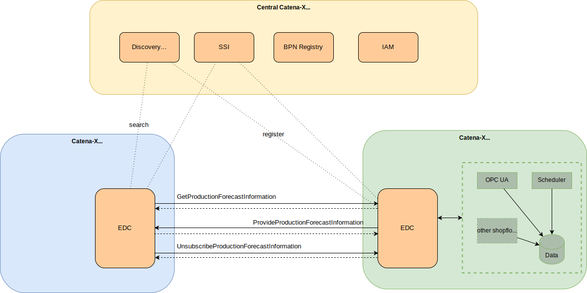

### Modular Production Kit

## Vision & Mission

### The missions of the KIT

The solution approaches developed in the Modular Production use case are environments to leverage existing business potentials. For this purpose, services, interface, and data model definitions based on industry standards are introduced with the goal of increasing the flexibility and reliability of industrial production.

Business Partners can deploy these developments by utilizing the Catena-X Network, where Modular Production offers Services to supply its partners with information about production planning and status, as requested by other use cases.

## Business Value

Existing Business Values can be increased by enabling customized production (batch size 1) without a significant increase of costs. Key factors for such a production environment are automated planning of production processes, flexible resource orchestration, as well as available product information during its manufacturing. With these applications, the OEM can increase the efficiency within its shop floor and thus, reduce planning times and costs by an automated reconfiguration of processes and resources in case of unplanned events. Consequently, the saved efforts can be utilized to launch new business models or increase the overall output.

## Business Process

Modular Production is part of the value chain. Therefore, it has to guarantee flexibility and availability on one hand and on the other hand it has to allow product flexibility in combination with small lot sizes. The effect of disturbances and decision in this network are not limited to a local area, but they have also a big impact to other partners in the value chain network. In Consequence, it is necessary to directly communicate data from the shop floor to other members of the network, such as customers or their substitutes like logistic companies. This communication is realized with the Shop-Floor-Information-Service (SIS). For example, if a customer wants to know the estimated production date for a product, he uses the Shop-Floor-Information-Service to get this information either with a direct request, via cyclic messages or notifications in case in case of a deviation from the initially scheduled production plan. The Shop-Floor-Information-Service uses the *GetProductionForecastInformation* model and the *ProvideProductionForecastInformation* model.

## Whitepaper

- [Modular Production Onboarding](res/modular-production-onboarding.pdf)

## Semantic Model

The Shop Floor Information Service features one model, the Production Forecast, which in turn consists of three semantic models, namely the *GetProductionForecastInformation* model and the *ProvideProductionForecastInformation* model.

All partners need the same semantic models for a common understanding of the information exchange. Customers or third parties specify within the *GetProductionForecastInformation* model the concrete required information about an order or a position within an order. Modular Production interprets this request and answers to it with the *ProvideProductionForecastInformation* data model. Depending on the customer’s request, Modular Production sends either a single or multiple responses. For the latter, customers need to notify Modular Production that no further forecasts are desired.

The *GetProductionForecastInformation* is sent from a partner to Modular Production with a HTTP request to receive a production forecast. The *ProvideProductionForecastInformation* model is containing the orders, the estimated production date and a state describing whether the order is planned, in progress or done and the creation date of the information. The semantic model can be found here:

- <https://github.com/eclipse-tractusx/sldt-semantic-models/tree/main/io.catenax.shared.shopfloor_information_types>
- <https://github.com/eclipse-tractusx/sldt-semantic-models/tree/main/io.catenax.shopfloor_information.get_production_forecast>
- <https://github.com/eclipse-tractusx/sldt-semantic-models/tree/main/io.catenax.shared.shopfloor_information_types>.

The *GetProductionForecastInformation* data model must be implemented by all participants who wish to use the Shop-Floor-Information-Service as a Modular Production, a customer or a participating third party. Companies, which use the Shop-Floor-Information-Service as a customer or third party must be able to send *GetProductionForecastInformation* request, whereas partners using the Shop-Floor-Information-Service as a Modular Production must be able to receive the *GetProductionForecastInformation* request. Besides, the *GetProductionForecastInformation* model enables a customer to select one of three communication modes. In general, the *communicationMode* describes different ways of communication between the Modular Production and a consumer. In case of the synchronous mode, the Modular Production immediately sends the requested information back to the consumer, whereas the other modes are addressing a continuous exchange.  The cyclic mode sends the information periodically (e.g. every day), whereas the notification mode informs if the forecast for the production has changed. Besides the *communicationMode* some mode specific parameters are also part of the data model.

The *ProvideProductionForecastInformation* model responses to the request. It contains the concrete forecast for all orders and order positions. Consequently, the response consists of a list with forecast dates where each list element refers an id for each of the orders/order positions.  The link to the request is accomplished with a related *messageId*, referring the *messageId* of the initial request. *ProvideProductionForecastInformation* is containing the orders, the estimated production date and a state describing whether the order is planned, in progress or done as well as some protocol data like ids and date of creation of the information.

## Logic & Schema

### Architecture

The *GetProductionForecastInformation* contains the request for the forecasting data which is sent from a Modular Production partner to a customer or a third party on the next lower level. All participants using the Shop-Floor-Information-Service in the role of a customer, or third party must be able to send the *GetProductionForecastInformation*. All participants using the Shop-Floor-Information-Service in the role of a Modular Production must be able to receive and process the *GetProductionForecastInformation*.
The following diagram depicts all possible interactions between partners, in case they apply the Production Forecast Service. The communication between partners is accomplished by utilizing the Eclipse Data Space Connector (EDC) to ensure data sovereignty.) It takes place in different phases:

1. Negotiation between the EDC of the partners using the proposed policies,
2. *GetProductionForecastInformation*(...) - the call of the customer,
3. get the desired information via *ProvideProductionForecastInformation*(...) - transferred by Modular Production (synchronous, cyclic, or notification-like),
4. Unsubscribe from the *GetProductionForecastInformation* service to receive no further information.

The left side shows the different request possibilities of customers. The right shows Modular Production that features a scheduler to generate answers for requests. The two boxes in the middle represent the EDC of each partner. The communication between the respective EDC is transparent to the user (shaded). Data for the request and the response are transmitted in the payload of the messages. The synchronous response (http response) does not contain any technical information but provides information whether the exchange of information succeeded or not. The concrete information is sent with one or multiple asynchronous responses, depending on the communication mode between the partners. The left side shows the different request possibilities of customers. The right shows Modular Production that features a scheduler to generates answers for requests.

### Components

#### Technical requirements for a CATENA-X compliant data transmission

Both partners, the customer and the Modular Production, must be members of the Catena X network to communicate with each other. By registering a Modular Production in advance with the Discovery Service, a customer can find it via a so-called Business Partner Number (BPN). With the help of SSI (Self Sovereign Identity) the correct identity is guaranteed. Customer are using the *GetProductionForecastInformation* call to request a production forecast, as specified in CX-0075. The Modular Production generates the required information by internal services like a schedulers and answers accordingly by calling *ProvideProductionForecastInformation* as specified in CX-0075. In case of a cyclic messages or notification mode, the customer has to unsubscribe from the service, if the service is not needed anymore.

The *GetProductionForecastInformation* as well as the *ProvideProductionForecastInformation* is using a Asset Administration Shell (AAS) serialized as a JSON string which is sent through EDC mechanism: Namely: *GetProductionForecastInformation* uses *GetProductionForecast* data model and *ProvideProductionForecastInformation* uses *ProvideProductionForecast* data model.  The unsubscribe call has no corresponding data model, as it is a simple HTTP DELETE. The JSON string is standardized in document (MP) CX - 0069 Shop-Floor-Information-Service Aspect Model v.1.0.0. The standard only describes the sending and receiving of Shop-Floor-Information-data through EDC. The object is created and handled by applications of the companies involved, but these applications are not part of the standard.

## Standards

The standards for release 3.2 will be published soon. Our relevant standards can be downloaded from the official [Catena-X Standard Library](https://catena-x.net/de/standard-library):

- CX-0068 Shop-Floor-Information-Service API v.1.0.0
- CX-0069 Shop-Floor-Information-Service Aspect Model v.1.0.0
- CX-0075 Shop-Floor-Information-Service Default / Process v.1.0.0

## Notice

This work is licensed under the [CC-BY-4.0](https://creativecommons.org/licenses/by/4.0/legalcode).

- SPDX-License-Identifier: CC-BY-4.0
- SPDX-FileCopyrightText: 2023 Fraunhofer-Gesellschaft zur Foerderung der angewandten Forschung e.V. (represented by Fraunhofer IWU & Fraunhofer IOSB & Fraunhofer IPA)
- SPDX-FileCopyrightText: 2023 Siemens AG
