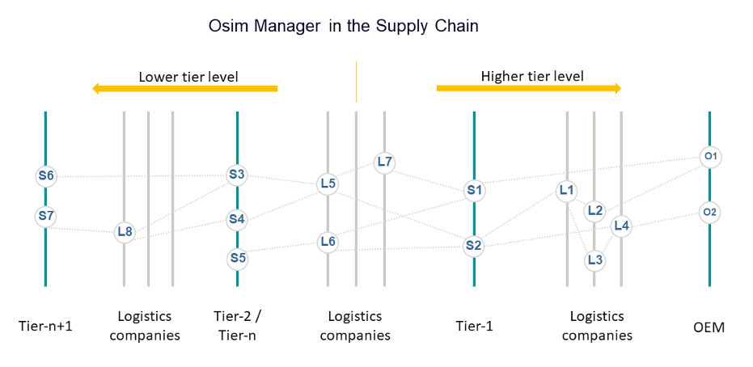
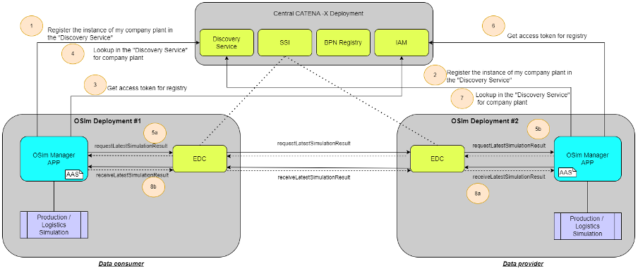

### OSim Kit

## Vision & Mission

<!--VISION of the Kit-->
**Gain increased supply chain transparency through collaborative simulation across all stakeholders**

**Combine simulations of plants internally with simulations of external logistics over multiple tiers**

Online control and simulation aims at linking production simulation with logistics simulation in order to identify delivery problems earlier and react in response to changing customer requirements or external disturbances/events
The online control and simulation (OSim) Kit defines the mechanisms and services needed to enable every Catena-X partner (producer as well as logisticians) to exchange simulation results in an open, interoperable and Catena-X compliant way.
An open architecture for integrating partners of all kinds together with standardized interfaces and semantics models are the fundamental basis of the OSim Kit.

**Integrate any supply chain partner**

Even partners that are not using any simulation tool can contribute to the overall transparency through the well-defined information requirements.

**Integrate any simulation tool**

Thanks to open architecture OSim is independent of the simulation tools that partners use.

## Business Value

Conventional planning and simulation tools use material flow simulations only on the plant level but they don't exchange simulation results with their respective partners in the supply chain. OSim goes beyond this by enabling every Catena-X partner (producers as well as logisticians) to integrate material flow simulation results of their partners into the simulation of their own processes. This is achieved by sharing the material flow simulation results on supply chain level.

The simulation results of the Catena-X partners on the supply chain's lower tier level and logistics, together with data of the company's own operations are fed into a simulation model as input. Considering both, plannable and unpredictable influencing factors, this simulation model is iterated as often as necessary until an optimal result has been found. Sharing of simulation results to the next tier level is the core capability of the collaborative simulation approach.

A central application takes over the tasks of monitoring and controlling the transmission of the simulation results, regardless of the level of digitalization of the partners. In addition, this application takes over the control of the simulation tools used.

Benefits for OEM, SME and Solution Provider

- Collaborative simulation over the supply chain
- Linking production simulation and logistics simulation
- Early detection and reaction to delivery problems
- Early response to changing customer requirements
- Take external disturbances/events into account early

## Business Process

The simulation results of the Catena-X partners on the lower tier level and logistics, together with data of the company's own operations are fed into the individual simulation model as input. Considering both, planable and unforeseeable influencing factors, this simulation model is iterated through as often as necessary until an optimal production schedule is reached and a simulation result is created. Sharing of simulation results to the next tier level is the base of the collaborative simulation approach in a short-term horizon, across the complete supply chain.

The following picture shows the fundamental network structure, consisting of suppliers, logisticians and OEMs who exchange simulation results with each other, considering the one-up and one-down principles. Every material flow simulation result includes information about delivery readiness of packaged material goods, like material identifier, amount, delivery time and destination.

## Semantic Model

### Materialflow Simulation Result (MaterialFlowSimulationResult)

The Semantic Model *MaterialFlowSimulationResult* summarizes simulation results of the individual partners and is used for data exchange along the supply chain.

The *MaterialFlowSimulationResult* object will be sent by OSim partner to another OSim partner on a higher tier level. OSim partner can be a producing company as well as a logistics company.

Every *MaterialFlowSimulationResult* includes information about delivery readiness of packaged material goods, like material identifier, amount, delivery time and destination.

#### Structure of the Material Flow Result

The MaterialFlowSimulationResult semantic model contains 4 hierarchical entities:

- MaterialFlowSimulationResult
- Shipment
- HandlingUnit
- MaterialBatch

One MaterialFlowSimulationResult refers to one or more Shipments.

**Shipment** describes a delivery approach with information about source, destination and delivery time. One Shipment refers to one or more HandlingUnits.

**HandlingUnit** describes the smallest shipment unit. One HandlingUnit refers to one or more MaterialBatches. The parameter Amount allows to define how many absolute identical (size and content) HandlingUnits are included in the shipment.

**MateriaBatch** describes the material and the quantity which the handling unit contains.

#### Aspect Model

Github Link to semantic data model: <https://github.com/eclipse-tractusx/sldt-semantic-models/blob/main/io.catenax.material_flow_simulation_result/1.0.0>

## Logic & Schema

### Architecture

#### Introduction

The Osim approach is based on a distributed simulation in which each participant simulates its role and additionally exchanges information with its suppliers and customers online via standardized interfaces. In the process, a strict 1-up / 1-down principle (i.e. data is only exchanged with the immediate predecessors and successors in the supply chain) guarantees compliance with antitrust regulations. The data exchange itself is carried out according to Gaia-X principles, which guarantee the data sovereignty of all partners involved.

All partners involved in the supply chain simulate their respective actions (production or logistical deliveries) on the basis of the latest information from the shop floor and its internal systems. They then pass this on to the successors in the supply chain according to the 1-up principle, where a new simulation is carried out on the basis of this possibly changed information. In OSim, a "horizontal" exchange of information across the supply chain is thus combined with a "vertical" exchange with the simulation tools and thus indirectly with the shop floor.

#### Components

The OSim solution is built of different components mixed by CATENA-X central services and specific OSim components. The main OSim-specific application is the OSim Manager, followed by Simulation tools for logistics and production.

The OSim Manager is a software application that exchanges all the information necessary for a local understanding of the supply chain with the partners and simulation tools, collects it and prepares it for the user.

The simulation tools are responsible for the processing of material flow simulations in both, production plants and logistics.

The following central services are needed for the communication along the supply chain:

- Business Partner Number (BPN) Registry = Management of business partner legal entities, sites and addresses used to identify the partners and their BPN-IDs for communication
- Identity and Access Management (IAM) = IdP used to login against Catena-X services
- Self Sovereign Identity (SSI) = Central service hosting the EDCs certificates (public keys). Used for mutual authentication between different EDC instances
- Discovery Service (DS) = as a central registry used to store/lookup the EDC endpoints for OSim requests/sending.
- Eclipse Data Connector (EDC) = Handling contract negotiation and initiates data transfer. The Eclipse Data Connector (EDC) interface enables data exchange between the OSim managers of the participating partners.

### Architecture and Dataflow

### Technical requirements for a CATENA-X compliant data transmission

The following appropriate configurations must be made in advance of the data exchange:

1. In the BPN registry, all partner instances (production sites) participating in the OSim use case must be listed with their respective site identification and address. The BPN IDs of the production sites (BPNS) are used for registration in the DS.
2. In the IAM, each OSim participating partner must apply for a "technical user", which is used for process communication with the central services.
3. Registration of OSim endpoints takes place in the Discovery Service.
4. The certificates required for SSI are issued on request.

At runtime the OSim Manager application must know the partner BPN-ID of the communication partner. With this BPN-ID, a look-up command is issued on the Discovery Service. The result is the endpoint link that the EDC connector needs to establish the connection.
