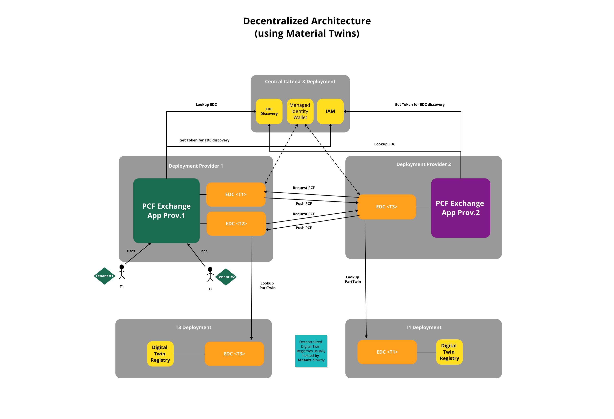
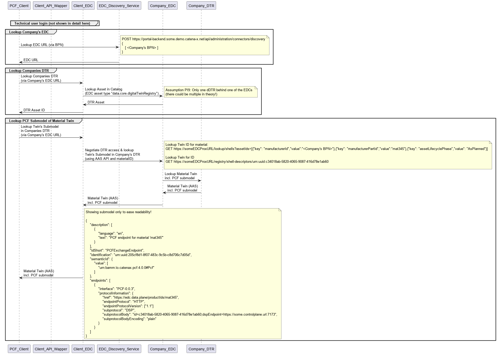
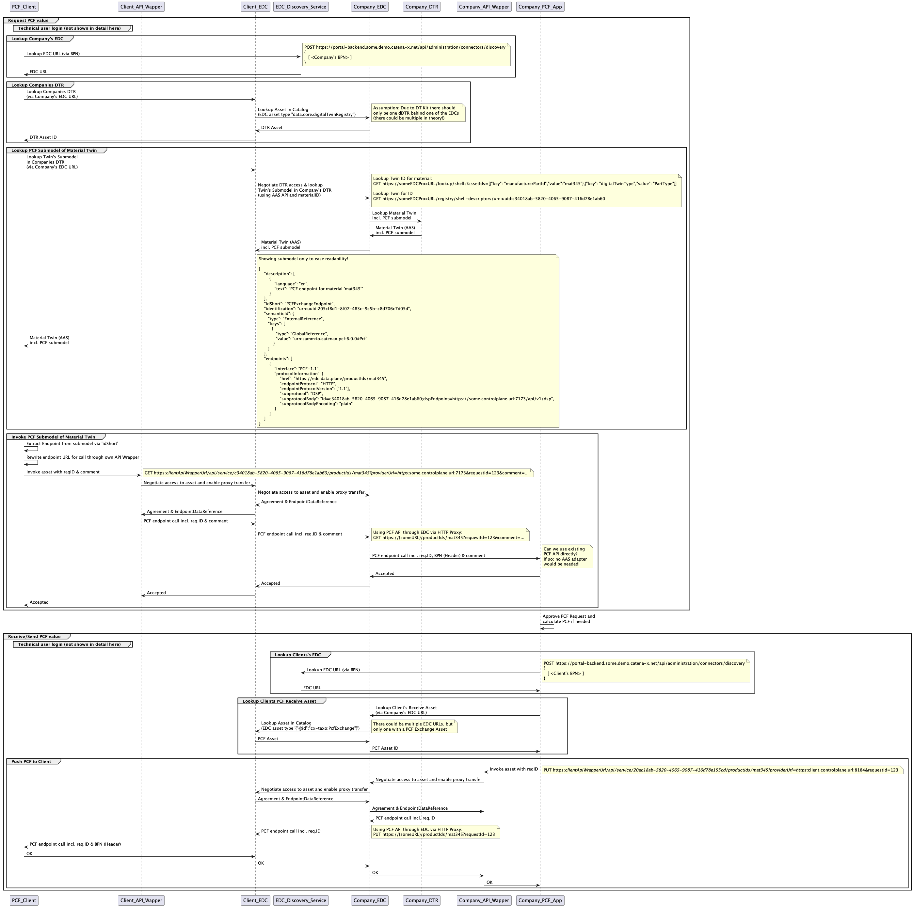
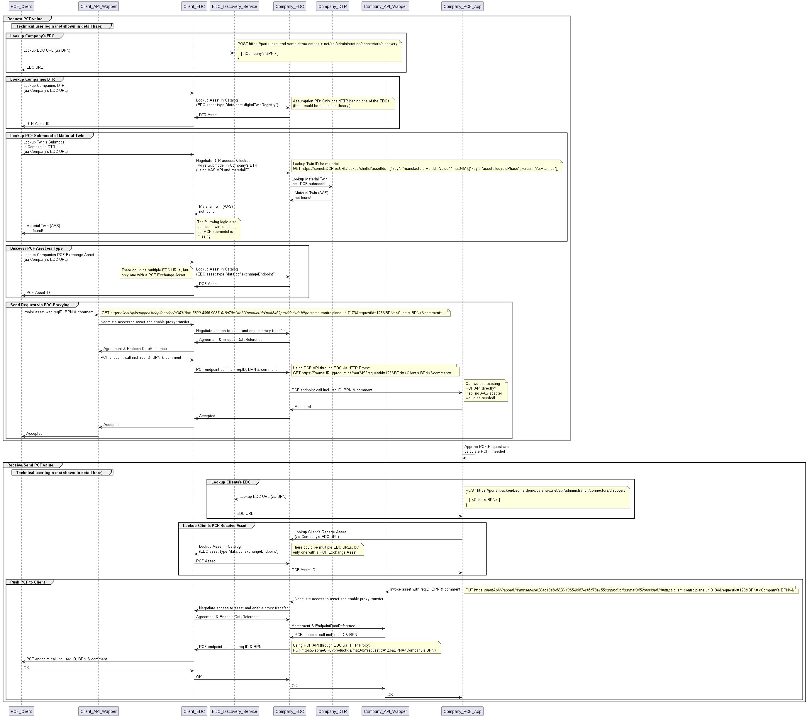
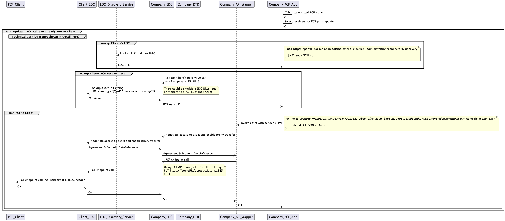
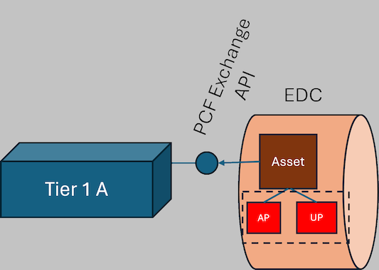
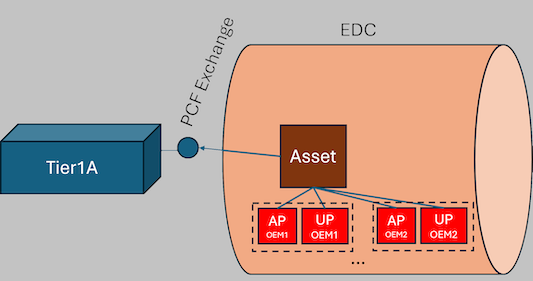
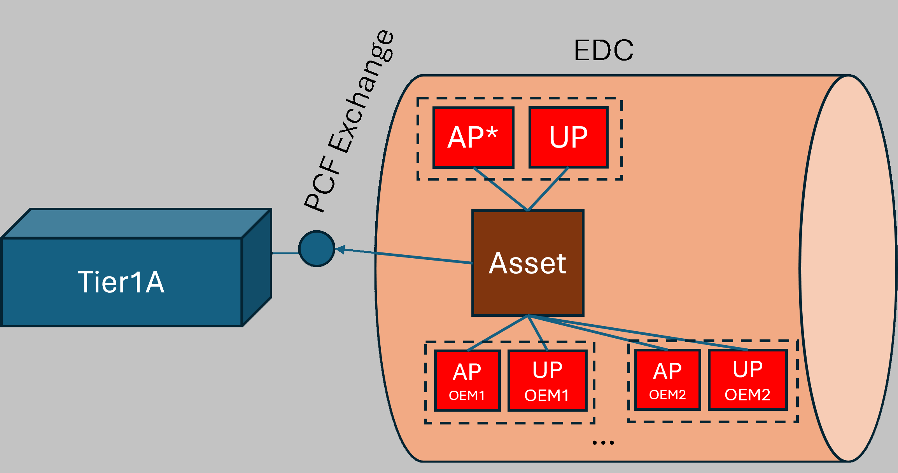

## Announcement

With the major CX-Saturn Release 25.09 the CX-0136 standard will be extended to offer synchronous data exchange according to the Industry Core, supporting both interfaces PCF 1.1 and AAS-Submodel 3.0 (CX-0125 & CX-0126). We recommend all solution and data providers to adapt, test and certify their solution accordingly to enable a smooth transition.
The second change to the standard will add customerPartId as an optional field in the PCF request thus enabling creation of a PCF requests with the customerPartId instead of manufacturerPartId.

[To the Industry Core KIT](https://eclipse-tractusx.github.io/docs-kits/kits/Industry%20Core%20Kit/Business%20View%20Industry%20Core%20Kit#todays-challenge)

## Introduction

The developer view provides a detailed guide on how to utilize the PCF exchange KIT effectively. Developers will learn how to integrate the KIT into their applications and make use of the feature of exchanging PCF values via the Catena-X network.
IT-administrators will learn how they need to provide PCF data and which components are required.

This KIT covers various aspects, starting from how to utilize the available API endpoints, the used data models and how to make them available to the Catena-X network.

## Building Block View

The following figure shows the current high level architecture of the PCF Exchange use case. It is build on an asynchronous data exchange.



## Sequence View

The following chapter illustrates the process from searching for an EDC point, to querying a PCF value, and finally transmitting the requested value.

### EDC Discovery and dDTR Access

In order to receive the EDC endpoints for a requested partner, the EDC Discovery Service is used, following the [CX-0001](https://catenax-ev.github.io/docs/next/standards/CX-0001-EDCDiscoveryAPI) EDC Discovery API standard. Therefore, at least the BPNL (Business Partner Number Legal) entity needs to be known. For more details please refer to the Catena-X standard above.



### PCF Request

In order to request PCF values via the PCF API endpoint first of all the EDC PCF asset needs to be identified. Therefore, the decentralized Digital Twin Registry (dDTR) is used. Data providers must register their dDTR(s) as EDC assets following the [CX-0002](https://catenax-ev.github.io/docs/next/standards/CX-0002-DigitalTwinsInCatenaX) Digital Twins in Catena-X standard. After identifying the dDTR, the digital twin with the related PCF submodel can be looked up (see [API calls [0003 +0004]](#api-calls)). An example is documented [here](#payload-for-requesting-pcf-sub-model).

After successfully locating the corresponding material twin containing a PCF submodel, the EDC asset containing the PCF request endpoint can be extracted (example payload can be found [here](#payload-for-edc-data-asset-pcf)) and the query for a PCF dataset can be initiated, as illustrated in the attached sequence diagram.



In case no matching material twin or PCF submodel exists, the flow falls back to a direct lookup of an EDC asset containing the PCF request endpoint provided within the offers of any EDC registered for the data provider's BPNL.



>**Note**
>The API wrapper shown in the sequence diagrams is optional. The management API of the EDC can also be used directly.

### PCF Update

The sequence diagram provided below presents an example of a PCF update flow. An update is feasible only for assets that have been previously requested at least once, as demonstrated in [PCF Request](#pcf-request). Proactive updates without a prior request are not achievable with the current version.



#### API Calls

| Call                                                                                                                                                                                                                                                                              | Method | Path                                                                                                 | Parameter                                                                                                             |
|-----------------------------------------------------------------------------------------------------------------------------------------------------------------------------------------------------------------------------------------------------------------------------------|--------|------------------------------------------------------------------------------------------------------|-------------------------------------------------------------------------------------------------------------------|
| Lookup EDC endpoints | POST   | /api/administration/Connectors/discovery/                                                            | `[<Company's BPNL>]`                                                                                              |
| Lookup dDTR                                                                                                                                         | POST   | /v2/catalog/request |  --> Lookup Asset in the EDC catalog (EDC asset type data.core.digitalTwinRegistry)                                                                                                                 |
| Lookup Twin ID                                                                           | GET    | /lookup/shells                                                                                       | `assetIds= [{"key": "manufacturerPartId", "value":"mat345",{"key":"digitalTwinType", "value": "PartType"}}]` |
| Lookup PCF submodel/EDC asset ID                                                             | GET    | /shell-descriptors                                                                                   | `{DIGITAL TWIN ID}`                                                                                               |
| Requesting PCF value                                                                                                                                                                                                                                                       | GET    | /productIds                                                                                          | {productId}                                                                                                       |
| Sending PCF value                                                                                                                                                                                                                                                            | PUT    | /productIds                                                                                          | {productId}                                                                                                       |

- The assetIds under *Lookup Twin ID* must be base64 encoded!
- When responding an PCF exchange request, the "requestID" is mandatory in the PUT call.
- When sharing a PCF update, the "requestID" is NOT allowed in the PUT call.
- The EDC asset used to receive a PCF is NOT looked up through AAS, but identified by type ("data.pcf.exchangeEndpoint").
- The Open API specification defining all mandatory PCF Exchange endpoints and the data structures transfered through those can be found [here](../resources/development-view/catena-x-pcf-endpoint-1_1_1.yaml)

##### Payload for Requesting PCF Sub Model

The following JSON shows the structure of a registered PCF submodel in the DTR. The subprotocolBody is used for asset bundling. For this, the [CX-0002](https://catenax-ev.github.io/docs/next/standards/CX-0002-DigitalTwinsInCatenaX) Digital Twins in Catena-X standard needs to be followed.

The digital twin id can be searched via the `manufacturerPartId` and the ``digitalTwinType:"PartType"``.

The PCF submodel must be registered with the ``idshort: PCFExchangeEndpoint``.
<details>
  <summary>PCFExchange Endpoint of a DigitalTwin (JSON)</summary>

```json
{
    "description": [
        {
            "language": "en",
            "text": "PCF endpoint for material 'mat345'"
        }
    ],
    "idShort": "PCFExchangeEndpoint",
    "identification": "urn:uuid:205cf8d1-8f07-483c-9c5b-c8d706c7d05d",
    "semanticId": {
       "type": "ExternalReference",
       "keys": [
          {
             "type": "GlobalReference",
             "value": "urn:samm:io.catenax.pcf:7.0.0#Pcf"
           }
       ]
    },
    "endpoints": [
        {
            "interface": "PCF-1.1",
            "protocolInformation": {
                "href": "https://edc.data.plane/productIds/mat345",
                "endpointProtocol": "HTTP",
                "endpointProtocolVersion": ["1.1"],
                "subprotocol": "DSP",
                "subprotocolBody": "id=c34018ab-5820-4065-9087-416d78e1ab60;dspEndpoint=https://some.controlplane.url:7173/api/v1/dsp",
                "subprotocolBodyEncoding": "plain"
            }
        }
    ]
}
```

</details>

#### Payloads for EDC Asset

##### Payload for EDC Data Asset PCF

The following JSON shows the EDC Asset for a PCF defined in the EDC using the asset bundling mentioned under [Payload for Requesting PCF Sub Model](#api-calls).
<details>
  <summary>PCFExchange Asset Definition (JSON)</summary>

```json
{
    "@context": {
        "edc": "https://w3id.org/edc/v0.0.1/ns/",
        "odrl": "http://www.w3.org/ ns/odrl/2/",
        "dcat": "http://www.w3.org/ns/dcat#",
        "dct": "http://purl.org/dc/terms/",
        "rdfs": "http://www.w3.org/2000/01/rdf-schema#",
        "cx-taxo": "https://w3id.org/catenax/taxonomy#",
        "cx-common": "https://w3id.org/catenax/ontology/common#",
        "aas-semantics": "https://admin-shell.io/aas/3/0/HasSemantics/"
    },
    "@id": "c34018ab-5820-4065-9087-416d78e1ab60",
    "@type": "edc:Asset",
    "edc:properties": {
        "rdfs:label": "PCF Data",
        "rdfs:comment": "Endpoint for PCF data",
        "cx-common:version": "1.1",
        "aas-semantics:semanticId": {"@id":"urn:samm:io.catenax.pcf:7.0.0#Pcf"},
        "edc:contentType": "application/json",
        "dct:type": {"@id":"cx-taxo:PcfExchange"}
    },
    "edc:dataAddress": {
        "edc:type": "HttpData",
        "edc:baseUrl": "https://some.url/service",
        "edc:proxyBody": "true",
        "edc:proxyPath": "true",
        "edc:proxyQueryParams": "true",
        "edc:proxyMethod": "true",
        "edc:contentType": "application/json"
    }
}
```

</details>

#### Payload for EDC Policy

The following JSON is a policy definition including the *mandatory* policy constraints for "active membership", "signed frameworkagreement" and "pcf base usage purpose". The [framework agreement document](https://catenax-ev.github.io/docs/next/regulatory-framework/20000ft/use-case-pcf-exchange) is published via the association and available via the Catena-X homepage. The membership credential is automatically created after successfully finishing the onboarding process.

In addition an *optional* constraint for an existing tenant-specific bilateral contract can be added. It should reference the contract number and is NOT backed up by verifiable credentials. Nevertheless it will be checked on a syntactical level during contract negotiation. If such a contract refererence should be used, a specific usage policy per tenant is needed, as constraint concatenation via OR is not recommended.

>**Note**
>More informations can be found in the official [ODRL Profile Definition](https://github.com/catenax-eV/cx-odrl-profile/blob/main/profile.md).

##### Payload to create a SSI based Policy

<details>
  <summary>SSI based Policy (JSON)</summary>

```json
{
    "@context": {
        "@vocab": "https://w3id.org/edc/v0.0.1/ns/"
    },
    "@id": "a343fcbf-99fc-4ce8-8e9b-148c97605aab",
    "policy": {
        "@context": [
            "https://www.w3.org/ns/odrl.jsonld",
            {
                "cx-policy": "https://w3id.org/catenax/policy/v1.0.0/"
            }
        ],
        "@type": "Policy",
        "profile": "cx-policy:profile2405",
        "permission": [
            {
                "action": "use",
                "constraint": {
                    "and": [
                        {
                            "leftOperand": "cx-policy:ContractReference",
                            "operator": "eq",
                            "rightOperand": "<OptionalBilateralContractReferenceNumber>"
                        },
                        {
                            "leftOperand": "cx-policy:FrameworkAgreement",
                            "operator": "eq",
                            "rightOperand": "DataExchangeGovernance:1.0"
                        },
                        {
                            "leftOperand": "cx-policy:Membership",
                            "operator": "eq",
                            "rightOperand": "active"
                        },
                        {
                            "leftOperand": "cx-policy:UsagePurpose",
                            "operator": "eq",
                            "rightOperand": "cx.pcf.base:1"
                        }
                    ]
                }
            }
        ]
    }
}
```

</details>

>**Note**
>Be aware that - due to an open issue in EDC version 0.7.x - all criterias must be added in fixed (alphabetical) order!

For more examples on how to define policies with SSI have a look [here](https://github.com/eclipse-tractusx/ssi-docu/blob/main/docs/architecture/cx-3-2/edc/policy.definitions.md).

#### Payload Contract Definition

<details>
  <summary>Sample Contract (JSON)</summary>

```json
{
    "@id": "54ef3326-42b2-4221-8c5a-3a6270d54db8",
    "edc:accessPolicyId": "7cb20eb1-08db-4532-bd74-ad480f551654",
    "edc:contractPolicyId": "a343fcbf-99fc-4ce8-8e9b-148c97605aab",
    "edc:assetsSelector":[
        {
            "@type": "Criterion",
            "edc:operandLeft": "@id",
            "edc:operator": "=",
            "edc:operandRight": "c34018ab-5820-4065-9087-416d78e1ab60"
        }
    ]
}
```

</details>

Inside the contract definition, an access policy and a usage policy must be referenced. A sample for a usage policy (incl. mandatory and optional criterias) is given in the [section above](#payload-to-create-a-ssi-based-policy).

The content of the access policy depends on the criterias used within the usage policy. The configuration MUST ensure that only one offer (per version) for a PCF Exchange asset is visible to a client when querying the catalog.

The following paragraphs give options how to achieve this. These options can always be replaced by corresponding (or even more restictive) policies, as long as the requirement of delivering only one offer per PCF Exchange asset version is met:
If *no bilateral contract* reference criteria are used *in any usage policy* attached to the PCF Exchange asset, an empty access policy can be used:<p></p>


<details>
    <summary>Empty Access Policy (JSON)</summary>

```json
{
    "@context": {
        "@vocab": "https://w3id.org/edc/v0.0.1/ns/"
    },
    "@id": "7cb20eb1-08db-4532-bd74-ad480f551654",
    "policy": {
        "@context": [
            "https://www.w3.org/ns/odrl.jsonld",
            {
                "cx-policy": "https://w3id.org/catenax/policy/v1.0.0/"
            }
        ],
        "@type": "Policy",
        "profile": "cx-policy:profile2405",
        "permission": []
    }
}
```

</details>

If a *bilateral contract* reference criteria is used *in a usage policy*, an access policy restricting access to the contract partners BPNL *MUST* be used for every usage policy holding a contract reference:<p></p>


<details>
    <summary>BPN restricted Access Policy to be used with a Usage Policy containing a contract reference (JSON)</summary>

```json
{
    "@context": {
        "@vocab": "https://w3id.org/edc/v0.0.1/ns/"
    },
    "@id": "7cb20eb1-08db-4532-bd74-ad480f551654",
    "policy": {
        "@context": [
            "https://www.w3.org/ns/odrl.jsonld",
            {
                "cx-policy": "https://w3id.org/catenax/policy/v1.0.0/"
            }
        ],
        "@type": "Policy",
        "profile": "cx-policy:profile2405",
        "permission": [
            {
                "action": "use",
                "constraint": {
                    "leftOperand": "BusinessPartnerNumber",
                    "operator": "eq",
                    "rightOperand": "BPNL00000000XXXX"
                }
            }
        ]
    }
}
```

</details>

If *bilateral contract reference* criterias are used *in usage policies* and *in addition* a usage policy *without bilateral contract references* should be provided, an access policy restricting access to all partners without a bilateral contract reference *MUST* be used for the usage policy holding no contract references.<p></p>

 <p> The following example uses BusinessPartnerGroups to achieve this:</p>

<details>
    <summary>BPN restricted Access Policy to be used with the "global" Usage Policy containing NO contract references (JSON)</summary>

```json
{
  "@context": {
    "@vocab": "https://w3id.org/edc/v0.0.1/ns/",
    "odrl": "http://www.w3.org/ns/odrl/2/"
  },
  "@type": "PolicyDefinitionRequestDto",
  "policy": {
    "@type": "odrl:Set",
    "odrl:permission": [
      {
        "odrl:action": "USE",
        "odrl:constraint": {
              "@type": "Constraint",
              "odrl:leftOperand": "https://w3id.org/tractusx/v0.0.1/ns/BusinessPartnerGroup",
              "odrl:operator": {
                "@id": "odrl:eq"
              },
              "odrl:rightOperand": "BusinessPartnerWithoutBilateralContract"
        }
      }
    ]
  }
}
```

</details>

## Error Handling

In case no material twin or no PCF submodel is found, EDC asset type has to be used to find the endpoint needed to perform the PCF request.

## Standards

### Used CX Standards

- [CX-0001 EDC Discovery API v1.0.2](https://catenax-ev.github.io/docs/next/standards/CX-0001-EDCDiscoveryAPI)
- [CX-0002 Digital Twins in Catena-X v2.2.0](https://catenax-ev.github.io/docs/next/standards/CX-0002-DigitalTwinsInCatenaX)
- [CX-0003 SAMMSemanticAspectMetaModel v1.1.0](https://catenax-ev.github.io/docs/next/standards/CX-0003-SAMMSemanticAspectMetaModel)
- [CX-0018 Dataspace Connectivity v3.1.0](https://catenax-ev.github.io/docs/next/standards/CX-0018-DataspaceConnectivity)
- [CX-0126 Industry Core: Part Type v2.0.0](https://catenax-ev.github.io/docs/next/standards/CX-0126-IndustryCorePartType)
- [CX-0136 PCF UseCase v2.0.0](https://catenax-ev.github.io/docs/next/standards/CX-0136-UseCasePCF)

## Other Standards

- [Pathfinder Framework - v2.0.0](https://wbcsd.github.io/tr/2023/data-exchange-protocol-20230221)

## NOTICE

This work is licensed under the [CC-BY-4.0](https://creativecommons.org/licenses/by/4.0/legalcode).

- SPDX-License-Identifier: CC-BY-4.0
- SPDX-FileCopyrightText: 2023, 2024 ZF Friedrichshafen AG
- SPDX-FileCopyrightText: 2023, 2024 Bayerische Motoren Werke Aktiengesellschaft (BMW AG)
- SPDX-FileCopyrightText: 2023, 2024 T-Systems International GmbH
- SPDX-FileCopyrightText: 2023, 2024 SAP SE
- SPDX-FileCopyrightText: 2023, 2024 SIEMENS AG
- SPDX-FileCopyrightText: 2023, 2024 SUPPLY ON AG
- SPDX-FileCopyrightText: 2023, 2024 Volkswagen AG
- SPDX-FileCopyrightText: 2023, 2024 Robert Bosch GmbH
- SPDX-FileCopyrightText: 2023, 2024 Mercedes Benz Group
- SPDX-FileCopyrightText: 2023, 2024 BASF SE
- SPDX-FileCopyrightText: 2023, 2024 CCT
- SPDX-FileCopyrightText: 2023, 2024 Gris Group
- SPDX-FileCopyrightText: 2023, 2024 Contributors to the Eclipse Foundation
- [Source URL](https://github.com/eclipse-tractusx/eclipse-tractusx.github.io/tree/main/docs-kits/kits/PCF%20Exchange%20Kit)
