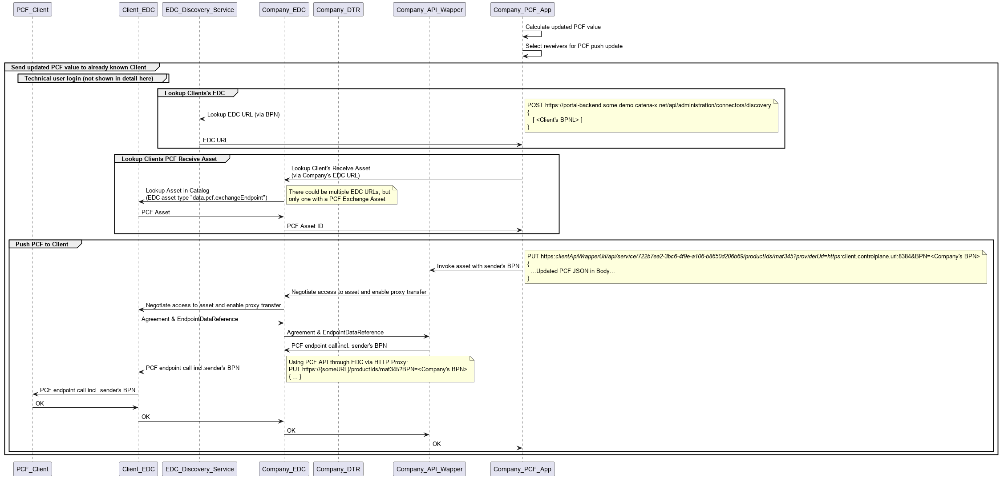

## Introduction

The developer view provides a detailed guide on how to utilize the PCF exchange KIT effectively. Developer will learn how to integrate the kit into there applications and make use of the feature of exchanging PCF values via the Catena-X network.
IT-Administrators will learn how they need to provide PCF data and which components are needed therefore.

This Kit covers various aspects, starting from how utilize the available API Endpoints, the used data models and how to make them available to the Catena-X network.

## Building Block View

The following figure shows the current high level architecture of the use case PCF exchange. It is build on an asynchronous data exchange.


## Sequence View

The following chapter illustrates the process from searching for an EDC point, to querying a PCF value, and finally transmitting the requested value.

### EDC Discovery and dDTR Access

For receiving the EDC Endpoints for a requested partner, the EDC Discovery Service is used, following the [CX-0001]([test](https://catena-x.net/de/standard-library)) Standard. For receiving endpoints, at least the BPN-L needs to be known to get the related endpoints. For more details the used Catena-X Standard is linked.



### PCF Request

To actual request PCF values via the PCF API endpoint first of all the EDC PCF asset needs to be identified. Therefore the decentralized Digital Twin Registry (dDTR) is used. Data provider must register their dDTR(s) as EDC assets following the CX-0002 standard. After identifying the dDTR the Digital Twin with the related PCF submodel can be searched (see [API calls [0003 +0004]](#api-calls)). An example are documented [here](#payload-for-requesting-pcf-sub-model).
After successfully locating the EDC asset containing the PCF request endpoint (Example Payload can be found [here](#payload-for-edc-data-asset-pcf)), the query for a PCF dataset can be initiated, as illustrated in the attached sequence diagram.


>**Note**
> The API Wrapper shown in the sequence diagrams is optional. The management API of the EDC can also be used directly.

### PCF Update

The sequence diagram provided below presents an example of a PCF update flow. An update is feasible only for assets that have been previously requested at least once, as demonstrated in [PCF Request](#sequence-view). Proactive updates without a prior request are not achievable with the current version.


#### API Calls

| Call                                                                                                                                                                                                                                                                                    | Method | Path                                                                                                 | Param                                                                                                             |
|-----------------------------------------------------------------------------------------------------------------------------------------------------------------------------------------------------------------------------------------------------------------------------------------|--------|------------------------------------------------------------------------------------------------------|-------------------------------------------------------------------------------------------------------------------|
| [001](https://eclipse-tractusx.github.io/docs-kits/next/kits/Digital%20Twin%20Kit/Software%20Development%20View/API%20EDC%20Discovery/post-list-of-bpns-or-an-empty-array-to-retrieve-available-company-connector-authorization-required-roles-view-connectors) (Look up EDC Endpoints) | POST   | /api/administration/Connectors/discovery/                                                            | `[<Company's BPNL>]`                                                                                              |
| [002](https://eclipse-tractusx.github.io/docs-kits/next/kits/tractusx-edc/docs/samples/management-api-v2-walkthrough/catalog) (Look up dDTR)                                                                                                                                            | POST   | /v2/catalog/request-->Lookup Asset in the EDC catalog (EDC asset type data.core.digitalTwinRegistry) |                                                                                                                   |
| [003](https://eclipse-tractusx.github.io/docs-kits/next/kits/Digital%20Twin%20Kit/Software%20Development%20View/API%20AAS%20Discovery/get-all-asset-administration-shell-ids-by-asset-link) (Lookup Twin ID)                                                                            | GET    | /lookup/shells                                                                                       | `assetIds= [{"key": "manufacturerPartId", "value":"mat345",{"key":"assetLifecyclePhase", "value": "AsPlanned"}}]` |
| [004](https://eclipse-tractusx.github.io/docs-kits/next/kits/Digital%20Twin%20Kit/Software%20Development%20View/API%20AAS%20Registry/get-all-asset-administration-shell-descriptors) (Look Up PCF Submodel/EDC Asset ID)                                                                | GET    | /shell-descriptors                                                                                   | `{DIGITAL TWIN ID}`                                                                                               |
| [005] (Requesting PCF Value)                                                                                                                                                                                                                                                            | GET    | /productIds                                                                                          | {productId}                                                                                                       |
| 006 (Sending PCF Value)                                                                                                                                                                                                                                                                 | PUT    | /productIds                                                                                          | {productId}                                                                                                       |

- The assetIds under [003] must be base64 encoded!
- When responding on PCF exchange request the "requestID" is mandatory in the PUT call.
- When sharing a PCF update the "requestID" is NOT allowed in the PUT call.
- The EDC asset used to receive PCF is NOT looked up through AAS, but identified by type ("data.pcf.exchangeEndpoint").

##### Payload for Requesting PCF Sub Model

The following JSON shows the structure of a registered PCF submodel in the DTR. The subprotocolBody is used for asset bundling. For this, the CX Standard [CX-0002](https://catena-x.net/de/standard-library) is to be followed.

The digital twin id can be searched via the, `manufacturerPartId` and the ``assetLifecyclePhase:"asPlanned"``
The sub-model PCF must be registered with the ``idshort: PCFExchangeEndpoint``.

```json
{
    "description": [
        {
            "language": "en",
            "text": "PCF endpoint for material 'mat345'"
        }
    ],
    "idShort": "PCFExchangeEndpoint",
    "identification": "urn:uuid:205cf8d1-8f07-483c-9c5b-c8d706c7d05d",
    "semanticId": {
        "value": [
            "urn:bamm:io.catenax.pcf:4.0.0#Pcf"
        ]
    },
    "endpoints": [
        {
            "interface": "PCF-0.0.3",
            "protocolInformation": {
                "href": "https://edc.data.plane/productIds/mat345",
                "endpointProtocol": "HTTP",
                "endpointProtocolVersion": ["1.1"]
                "subprotocol": "DSP",
                "subprotocolBody": "id=c34018ab-5820-4065-9087-416d78e1ab60;dspEndpoint=https://some.controlplane.url:7173",
                "subprotocolBodyEncoding": "plain"
            }
        }
    ]
}
```

#### Payloads for EDC Asset

##### Payload for EDC Data Asset PCF

The following JSON shows the the EDC Asset for PCF defined in the EDC using the asset bundling mentioned under [Payload for Requesting PCF Sub Model](#api-calls).

```json
  "@type": "edc:AssetEntryDto",
  "edc:asset": {
    "@id": "c34018ab-5820-4065-9087-416d78e1ab60",
    "edc:properties": {
      "rdfs:label": "PCF Data",
      "rdfs:comment": "Endpoint for PCF data",
      "dcat:version": "0.0.3",
      "aas-semantics:semanticId": "urn:bamm:io.catenax.pcf:4.0.0#Pcf",
      "edc:contentType": "application/json",
      "edc:type": "data.pcf.exchangeEndpoint"
    },
    "edc:privateProperties": null,
     
  "edc:dataAddress": {
    "edc:type": "edc:HttpData",
    "edc:baseUrl": https://some.url/service,
    "edc:proxyBody": "true",
    "edc:proxyPath": "true",
    "edc:proxyQueryParams": "true",
    "edc:proxyMethod": "true",
    "edc:contentType": "application/json"
  }
}

```

#### Payload for EDC Policy

The following JSON is an policy definition including the policy "frameworkagreement pcf" and membership. The [frameworkagreement document](https://catena-x.net/fileadmin/user_upload/04_Einfuehren_und_umsetzen/Governance_Framework/Catena-X_UseCasePCFExchange_Beta-Phase_DE.pdf) is published via the association and are available via the Catena-X homepage. The membership credential is automatically created after finishing successfully the onboarding process.

##### Payload to create a SSI based Policy

```json

{
    "@context": {
        "odrl": "http://www.w3.org/ns/odrl/2/"
    },
    "@type": "PolicyDefinitionRequestDto",
    "@id": "{{POLICY_ID}}",
    "policy": {
        "@type": "Policy",
        "odrl:permission": [
            {
                "odrl:action": "USE",
                "odrl:constraint": {
                    "@type": "LogicalConstraint",
                    "odrl:and": [
                        {
                            "@type": "Constraint",
                            "odrl:leftOperand": "activeMember",
                            "odrl:operator": {
                                "@id": "odrl:eq"
                            },
                            "odrl:rightOperand": "active"
                        },
                        {
                            "@type": "Constraint",
                            "odrl:leftOperand": "FrameworkAgreement.pcf",
                            "odrl:operator": {
                                "@id": "odrl:eq"
                            },
                            "odrl:rightOperand": "active"
                        }
                    ]
                }
            }
        ]
    }
}

```

For more examples how to define policies with SSI have a look [here](https://github.com/eclipse-tractusx/ssi-docu/blob/main/docs/architecture/cx-3-2/edc/policy.definitions.md).

#### Payload Contract Definition

```json
{
    "@id": "54ef3326-42b2-4221-8c5a-3a6270d54db8",
    "edc:accessPolicyId": "a343fcbf-99fc-4ce8-8e9b-148c97605aab",
    "edc:contractPolicyId": "a343fcbf-99fc-4ce8-8e9b-148c97605aab",
    "edc:assetsSelector": [
        {
            "@type": "Criterion",
            "edc:operandLeft": "@id",
            "edc:operator": "=",
            "edc:operandRight": "c34018ab-5820-4065-9087-416d78e1ab60"
        }
    ]
}
```

## Error Handling

As Release 3.2 only covers the "happy path" for exchange PCF data via the Catena-X network. Error handling is currently not covered.

## Standards

### Used CX Standards

- [CX-0001-EDCDiscoveryAPI](https://catena-x.net/de/standard-library)
- [CX-0002-DigitalTwinsInCX](https://catena-x.net/de/standard-library)
- [CX-0003-SAMMSemanticAspectMetaModel](https://catena-x.net/de/standard-library)
- [CX-0006-RegistrationAndInitialOnBoarding](https://catena-x.net/de/standard-library)
- [CX-0013 Identity of Member Companies](https://catena-x.net/de/standard-library)
- [CX-0014 Employees and Technical Users](https://catena-x.net/de/standard-library)
- [CX-0015 IAM & Access Control Paradigm](https://catena-x.net/de/standard-library)
- [CX-0016 Company Attribute Verification](https://catena-x.net/de/standard-library)
- [CX-0017 Company Role by the Connector](https://catena-x.net/de/standard-library)
- [CX-0018-SovereignDataExchange](https://catena-x.net/de/standard-library)
- [CX-0026 PCF Data Model](https://catena-x.net/de/standard-library)
- [CX-0029 Product Carbon Footprint Rulebook](https://catena-x.net/de/standard-library)
- [CX-0049-DID Document Schema](NeedtobeaddedbyAccociation)
- [CX-0050-Framework Agreement Credential](NeedtobeaddedbyAccociation)
- [CX-0051-Summary Credential](NeedtobeaddedbyAccociation)

## Other Standards

- [Pathfinder Framework](https://wbcsd.github.io/data-exchange-protocol/v2/)

## NOTICE

This work is licensed under the [CC-BY-4.0](https://creativecommons.org/licenses/by/4.0/legalcode).

- SPDX-License-Identifier: CC-BY-4.0
- SPDX-FileCopyrightText: 2023,2023 ZF Friedrichshafen AG
- SPDX-FileCopyrightText: 2023,2023 Bayerische Motoren Werke Aktiengesellschaft (BMW AG)
- SPDX-FileCopyrightText: 2023,2023 T-Systems International GmbH
- SPDX-FileCopyrightText: 2023,2023 SAP SE
- SPDX-FileCopyrightText: 2023,2023 SIEMENS AG
- SPDX-FileCopyrightText: 2023,2023 SUPPLY ON AG
- SPDX-FileCopyrightText: 2023,2023 Volkswagen AG
- SPDX-FileCopyrightText: 2023,2023 Robert Bosch GmbH
- SPDX-FileCopyrightText: 2023,2023 Mercedes Benz Group
- SPDX-FileCopyrightText: 2023,2023 BASF SE
- SPDX-FileCopyrightText: 2023,2023 CCT
- SPDX-FileCopyrightText: 2023,2023 Gris Group
- SPDX-FileCopyrightText: 2023,2023 Contributors to the Eclipse Foundation
- Source URL: https://github.com/eclipse-tractusx/pcf-exchange-kit
