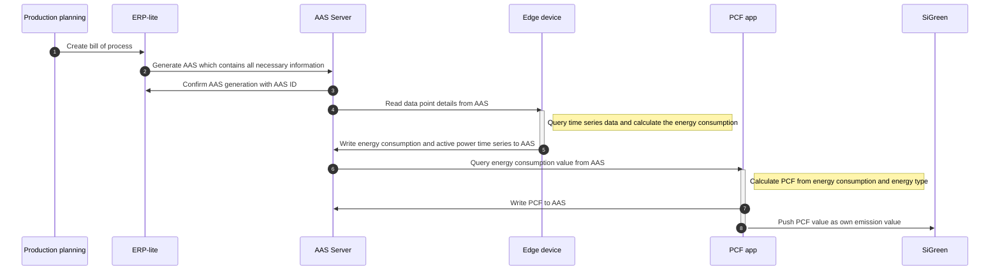

<!--
---
id: adoption-view
title: Adoption View
description: 'PCF data aquistion - Manufacturing - using AAS KIT'
sidebar_position: 2
---

Copyright(c) 2026 Contributors to the Eclipse Foundation

See the NOTICE file(s) distributed with this work for additional
information regarding copyright ownership.

This work is made available under the terms of the
Creative Commons Attribution 4.0 International (CC-BY-4.0) license,
which is available at
https://creativecommons.org/licenses/by/4.0/legalcode.

SPDX-License-Identifier: CC-BY-4.0
-->

<!-- 
KIT LOGO START - Generated automatically from the configuration done in Kit Master Data
Replace <kit-id> with the id from your kit referenced in `data/kitsData.js`.
Do not remove!
This logo is only visible when compiled with Docusarus (final version of the hosted KIT)
-->

import Kit3DLogo from '@site/src/components/2.0/Kit3DLogo';
<Kit3DLogo kitId="<kit-id>" />

<!--
KIT LOGO END
-->
# Adoption View - PCF data aquistion using AAS

## Introduction

Product carbon footprint (PCF) accounting requires comprehensive transparency across the entire value chain, including the energy consumption during manufacturing processes. The production carbon footprint is an essential component of the overall PCF, capturing the emissions generated from energy used in fabrication and assembly operations.

However, a fundamental challenge exists in many SME manufacturing environments: incomplete data capture at the shopfloor level and fragmented system connectivity result in an inadequate digital representation of production processes. Without precise visibility into energy consumption across different manufacturing steps, detailed PCF calculation becomes significantly more resource-intensive while accuracy decreases.

Improving digital process representation and system integration is a fundamental prerequisite for detailed PCF calculation. A dedicated PCF management system can bridge this gap by enabling SMEs to combine supplier-provided PCF data with shopfloor energy data to achieve precise, standardized emission calculation.

## Vision and Mission

## Vision

To establish a transparent manufacturing ecosystem where production carbon footprints are accurately calculated based on actual shopfloor data and production planning data as an integral part of product carbon footprint accounting. This vision enables SMEs to:

 - **Leverage primary data**: Utilize actual energy consumption measured at the process level rather than relying on generic industry averages
 - **Enable digital integration**: Facilitate seamless data exchange between production planning, shopfloor systems, PCF management platforms, and supply chain partners  
 - **Achieve standardization**: Apply consistent, internationally recognized emission calculation methodologies across manufacturing processes
 - **Support compliance**: Meet regulatory requirements for carbon accounting and reporting with verifiable, auditable production data

## Mission

Our mission is to develop a platform that enables SMEs to accurately calculate and manage production carbon footprints by bridging the gap between shopfloor operations and PCF accounting. We achieve this by:

 - **Digitizing production processes**: Capturing granular energy consumption data at the machine and process level to create a comprehensive digital representation of manufacturing operations 
 - **Integrating data sources**: Connecting production planning systems, shopfloor energy monitoring, and supplier PCF data into a unified PCF management platform
 - **Simplifying complexity**: Extracting process-related energy data from the existing data acquisition system, which is relevant for the PCF calculation
 - **Enabling actionable insights**: Transforming raw production data into clear carbon footprint metrics

By empowering SMEs with the digital infrastructure and tools needed for precise production PCF accounting, we help manufacturers meet sustainability requirements while maintaining operational efficiency and competitiveness.

## Business Context

- **Procurement and Suppliers** 
  - Role: Provision of PCF data for upstream products
  - Data delivery: Upstream emission data for purchased materials, components, and semi-finished products
  - Challenge: Standardized data formats and quality assurance of supplier PCF data
- **Engineering and Production Planning**
  - Role: Provision of Bill of Material (BOM) and Bill of Process (BOP) information
  - Data delivery: Product structure, material quantities, process sequences, and manufacturing parameters
  - Challenge: Integration of planning data into PCF calculation systems
- **Production and Shopfloor**
  - Role: Capture of all energy consumption data at shopfloor level
  - Data delivery: Machine- and process-specific energy measurements (electricity, gas, compressed air, etc.)
  - Challenge: Granular data capture and allocation to specific products/batches

## Business Value

**Regulatory Compliance**
- Meet emerging carbon accounting and reporting regulations 
- Avoid penalties, market exclusion, and reputational damage
- Prepare for third-party verification and certification

**Supply Chain Transparency**
- Enable all parties (suppliers, production, customers) to understand and optimize environmental impact
- Create end-to-end visibility of product carbon footprint across the value chain
- Drive sustainability improvements through supplier engagement
- Establish standardized data exchange with partners
  
**Data Accuracy**
- Replace estimates with primary data from suppliers, production systems, and shopfloor measurements
- Improve PCF quality and credibility through granular, machine-level energy data
- Build customer trust with data-driven, verifiable sustainability claims

**Cost Optimization**
- Identify energy-intensive processes and optimization opportunities 
- Make informed sourcing decisions based on supplier carbon performance
- Reduce manual effort through automated data collection
- Prioritize decarbonization investments with highest ROI

**Competitive Advantage**
- Demonstrate environmental commitment through transparent carbon accounting
- Access new customer segments prioritizing sustainable suppliers

## Data Flow

The demonstrator for PCF value calculation at an SME collects all information necessary for calculating the PCF value from all involved stakeholders and ultimately makes this data available. The following diagram describes this workflow.

## Standards

- Modeling and calculations are based on the Catena-X Rulebook
- No official AAS submodel template was used, as suitable templates were not available at the time the concept was developed
- Consequently, custom submodel templates were modeled and implemented for this use case (see documentation for details)

| Name | Description | Link to standard |
| ---- | ----------- | ---------------------- |
| `Catena-X PCF Rulebook version 4` | Standardized guidelines for PCF calculation within the Catena-X network | [Catena-X Rulebook](https://catena-x.net/wp-content/uploads/2025/10/Catena-X-Product-Carbon-Footprint-Rulebook_v4-with-line-numbers.pdf) |
| `AAS documentation for PCF calculation without MES` | Overview and detailed information about the used AAS submodel templates | [AAS documentation](https://factoryxorg.sharepoint.com/:t:/r/sites/TP2/Shared%20Documents/TP2.10/30_Results%20and%20Presentations/Securing-TP2.10/54_PCF%20Calculation%20without%20MES/AAS%20Sub-Model/AAS%20Documentation%20Use%20Case%20without%20MES.md?csf=1&web=1&e=qP1fpb) |

## NOTICE

This work is licensed under the [Apache-2.0].

- SPDX-License-Identifier: Apache-2.0
- SPDX-FileCopyrightText: [2026] [Siemens]
- SPDX-FileCopyrightText:[2026] Contributors to the Eclipse Foundation
- Source URL: [https://github.com/eclipse-tractusx/eclipse-tractusx.github.io](https://github.com/eclipse-tractusx/eclipse-tractusx.github.io)
