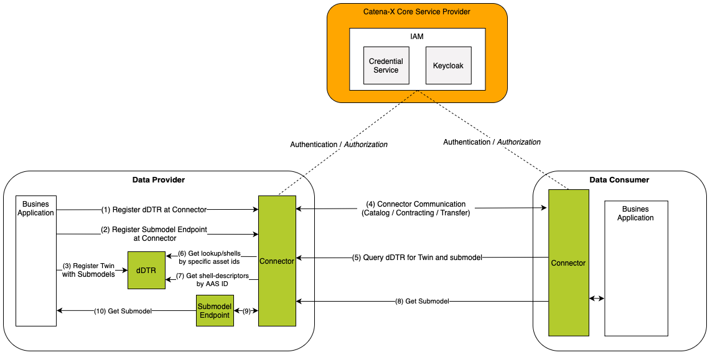
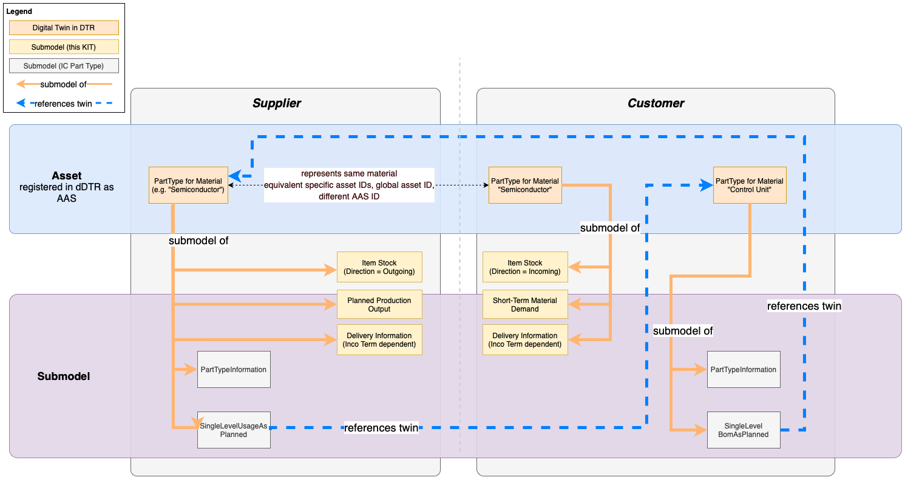

<!--  -->

## Introduction

This page gives an overview that is relevant for implementing PURIS standards. The Architecture chapter describes the interactions of all components in the PURIS context as well as the shared aspect approach. The Policies chapter describe the access policies, usage policies, contract definitions and include information about the framework agreement. The Protocol chapter gives examples how the connector data asset is registered and how shell descriptors are created. In the chapter Sample Data the PURIS submodels are defined with a reference to the turtle file and an example JSON payload. A ready PURIS implementation and quick installation guides are referenced in the last chapter.

## Architecture

Shown in this chapter are the interactions of all components required to fulfil the PURIS standard.
Also the standards' transferred data objects are shown in the Catena-X context of registered assets.

### Component Architecture

Figure 1 shows the high-level architecture of the Submodel exchange in the Catena-X dataspace and the services that are involved. Both the data provider and the data consumer must be members of the Catena-X network in order to communicate with each other. With the help of Credential Service and the Identity Access Management (IAM) each participant can authenticate itself, verify the identity of the requesting party and decide whether to authorize the request. The data is provisioned in accordance with the [Digital Twin KIT](https://eclipse-tractusx.github.io/docs-kits/next/kits/Digital%20Twin%20Kit/Software%20Development%20View/dt-kit-interaction-patterns) in Catena-X. The architecture in this figure only applies to standards that are based on the Digital Twins in Catena-X ([Digital Twin KIT](https://eclipse-tractusx.github.io/docs-kits/next/kits/Digital%20Twin%20Kit/Software%20Development%20View/dt-kit-interaction-patterns)).


*Figure 1: high-level architecture of the submodel exchange in the Catena-X*

### Distribution of aspects in shared asset approach

Figure 2 shows how the shared asset approach is realized. The orange lines show which submodels belong to the respective AAS. All specific submodels are bound to the specific Part Type's context e.g., meaning that each aspect is described for the specific catalog item on supplier and customer side represented by the AASs. See [Digital Twin KIT](https://eclipse-tractusx.github.io/docs-kits/category/digital-twin-kit) for more information on the shared asset approach.
The orange submodels are the submodels used within this standard's context.

The grey submodels are used within the [Industry Core KIT](https://eclipse-tractusx.github.io/docs-kits/next/category/industry-core-kit) (PartTypeInformation, SingleLevelBomAsPlanned, SingleLevelUsageAsPlanned). Besides PartTypeInformation on supplier-side, no other models are mandatory. The Bill Of Material (BOM) and usage models can be used to build data chains, if the partners align to (see [Industry Core KIT](https://eclipse-tractusx.github.io/docs-kits/next/category/industry-core-kit)). This KIT relies on the "Part Type" life cycle of the Industry Core representing catalog items after sourcing.

The blue dashed lines show the references between DTs based on Catena-X UUIDs and BPNL information that may be resolved by the Item Relationship Service (see [Industry Core KIT](https://eclipse-tractusx.github.io/docs-kits/next/category/industry-core-kit), [Data Chain KIT](https://eclipse-tractusx.github.io/docs-kits/category/data-chain-kit) and [Traceability KIT](https://eclipse-tractusx.github.io/docs-kits/category/traceability-kit)).

The shared asset approach shown in figure 2 is one of the patterns described in the Digital Twin KIT. It preserves the sovereignty by provisioning the aspect on on the owning partner's side creating a common view on the asset. A shared asset approach is needed whenever the customer provides data for a part type digital twin. The following implications apply:

- The supplier generates the Catena-X ID and provides the aspect model PartTypeInformation while the customer reuses the generated Catena-X ID for his digital twin representation (see Industry Core KIT).
- If only the supplier would provide the Planned Production Output, no digital twin representation would be needed on the customer-side.
- Also if only the customer provides information (e.g. Short-Term Material Demand), the supplier needs to create the digital twin first so that the customer can create his representation.
- While one supplier side twin can be created to handle multiple customers, a customer must create the representation of the specific twin per supplier - also if it's the same part type from customer point of view.

Note: from business point of view a quid-pro-quo principle of exchanged information is recommended (stock for stock, production for demand, delivery information as needed based inco term).


*Figure 2: Conceptual levels of provisioning digital twins in the shared asset approach.*

## Policies​

### Access Policies​

To enable data sovereignty, access and usage policies are important to protect the data assets of a data provider in the connector, as described in the [Connector KIT](https://eclipse-tractusx.github.io/docs-kits/next/category/connector-kit).
To decide which company has access to the data assets, access policy should be used. Note that without protecting data assets with access policies, they become publicly available in the Catena-X network which is not recommended.

Therefore, every asset should be protected and only be made available through specified BPNL policy groups or specific BPNL policies. For a detailed description, see [Business Partner Validation Extension, Release 0.6.0](https://github.com/eclipse-tractusx/tractusx-edc/tree/f07dc2bcfab393774f796de3560508f300061b62/edc-extensions/bpn-validation).

### BPNL Access Policy​

This policy allows limiting access to a data offer based on a list of specific BPNLs. This translates to the following functionality:

- The data offer creator will be able to create a policy listing all the BPN that can access the data offer.
- This means that only the connectors registered in the Catena-X network with the BPNL listed in the policy can see the data offer and accept it (for the creation of data contracts and subsequent data exchange).

**Implementation Hint**:

Examples including a JSON payload for a BPNL group access policy are described in the [tractus-x EDC repository, Release 0.6.0](https://github.com/eclipse-tractusx/tractusx-edc/tree/f07dc2bcfab393774f796de3560508f300061b62/edc-extensions/bpn-validation).
This reference implementation also provides an extension to add the BPNL of the requesting party to the header of a proxied request. As a result, during implementation one can use this bpnl to design the internal submodel api design.

### Usage Policies​

To decide which company can use the data asset under specific conditions, usage policies (also referred to  as contract policies) are used. Therefore, they are more specific than access policies and only used just after access is granted. Currently, the usage policies aren't technically enforced but based on a legal framework agreements. Signing of framework agreements can be enforced during negotiation depending on the connector implementation.

Policies are defined based on the [W3C ODRL format](https://www.w3.org/TR/odrl-model/). This allows a standardized way of formulating policy payloads. It further allows to stack different constraints with the odrl:and operator. Therefore, every data provider can decide on his or her own under which conditions their data assets are shared in the network. It is recommended to restrict the data usage for all exchanged data standards. An example of one usage policy containing three different constraints is shown and described in the following:

```json
{
  "@context": {
    "odrl": http://www.w3.org/ns/odrl/2/
  },
  "@type": "PolicyDefinitionRequestDto",
  "@id": "<POLICY-ID>", // Important for the contract definition
  "policy": {
    "@type": "Policy",
    "odrl:permission": [
      {
        "odrl:action": "USE",
        "odrl:constraint": {
          "@type": "LogicalConstraint",
          "odrl:and": [ // All of the following three constraints have to be fullfilled (and, not or)
            // First constraint to verify the the Catena-X membership
            {
              "@type": "Constraint",
              "odrl:leftOperand": "Membership",
              "odrl:operator": {
                "@id": "odrl:eq"
              },
              "odrl:rightOperand": "active"
            },
            // Second constraint to verify if the framework agreement for PURIS
            {
              "@type": "Constraint",
              "odrl:leftOperand": "FrameworkAgreement.puris",
              "odrl:operator": {
                "@id": "odrl:eq"
              },
              "odrl:rightOperand": "active"
            }
          ]
        }
      }
    ]
  }
}
```

#### Membership Policy​

To verify the participants Catena-X membership, the Membership verifiable credential can be used. In case of a policy, the data can only be used from verified Catena-X members. The payload is shown in the first constraint-part of the example above and described in detail in the [connector part of the SSI documentation](https://github.com/eclipse-tractusx/ssi-docu/blob/main/docs/architecture/cx-3-2/edc/policy.definitions.md#1-membership-constraint).

```json
{
  "@type": "Constraint",
  "odrl:leftOperand": "Membership",
  "odrl:operator": {
    "@id": "odrl:eq"
  },
  "odrl:rightOperand": "active"
}
```

#### Framework Agreement Policy​

To verify if a participant accepted the framework agreement of a specific use case created by the [Catena-X association](https://catena-x.net/en/catena-x-introduce-implement/governance-framework-for-data-space-operations), the `FrameworkAgreement.puris` verifiable credential can be used for the PURIS framework agreement. In case of a policy, the data can only be used from accepted and verified PURIS framework agreement members. This is shown in the second constraint-part of the example above.

```json
{
  "@type": "Constraint",
  "odrl:leftOperand": "FrameworkAgreement.puris",
  "odrl:operator": {
    "@id": "odrl:eq"
  },
  "odrl:rightOperand": "active"
}
```

### Contract Definitions​

In the connector, every policy is associated with a contract. Thus, a contract definition is needed, detailing what policies are required when contracting assets.
When using an above mentioned Access Policy, their `ACCESS_POLICY_ID` needs to be included as a value of the accessPolicyId key in the contract definition.
When using an above mentioned Usage Policy, their `CONTRACT_POLICY_ID` needs to be included as a value of the contractPolicyId key in the contract definition.

```json
{
    "id": "{{CONTRACT_DEFINITION_ID}}",
    "criteria": [
        {
            "operandLeft": "asset:prop:id",
            "operator": "=",
            "operandRight": "{{ASSET_ID}}"
        }
    ],
    "accessPolicyId": "{{ACCESS_POLICY_ID}}",
    "contractPolicyId": "{{CONTRACT_POLICY_ID}}"
}
```

For a more detailed tutorial on creating contracts for assets, see in [Chapter 3 of the End-to-End Adopter Journey](https://eclipse-tractusx.github.io/docs/tutorials/e2e/boost/provideData).

## Protocol

This chapter contains data structures that are designed for providing data in the PURIS standards.
The PURIS KIT does not define its own protocol, as it is using the communication pattern described in the [Digital Twin KIT](https://eclipse-tractusx.github.io/docs-kits/next/kits/Digital%20Twin%20Kit/Software%20Development%20View/dt-kit-interaction-patterns) and relies on the [Part Type Twin definitions of the Industry Core KIT](https://eclipse-tractusx.github.io/docs-kits/kits/Industry%20Core%20Kit/Software%20Development%20View/Digital%20Twins%20Development%20View%20Industry%20Core%20Kit).

Examples of how the required data structures for that pattern may look like for PURIS are described in this chapter.

### Connector Data Asset Structure

To allow partners to find data regarding a specific Industry Core Part Type Twin, the provider has to register a connector data asset (see [Connector KIT](https://eclipse-tractusx.github.io/docs-kits/next/category/connector-kit)) specifying the address of the Digital Twin Registry of the provider (see [Digital Twin KIT](https://eclipse-tractusx.github.io/docs-kits/next/kits/Digital%20Twin%20Kit/Software%20Development%20View/dt-kit-interaction-patterns)).
The structure is as follows:

```json
{
  "@context": {
    "@vocab": "https://w3id.org/edc/v0.0.1/ns/",
    "cx-common": "https://w3id.org/catenax/ontology/common#",
    "cx-taxo": "https://w3id.org/catenax/taxonomy#",
    "dct": "http://purl.org/dc/terms/"
  },
  "@id": "{{CONNECTOR_ASSET_ID}}", // defined by yourself
  "properties": {
    "dct:type": {"@id": "cx-taxo:DigitalTwinRegistry"},
    "cx-common:version": "3.0"
  },
  "privateProperties": {
  },
  "dataAddress": {
    "@type": "DataAddress",
    "type": "HttpData",
    "baseUrl": "{{ DIGITAL_TWIN_REGISTRY_ENDPOINT }}",
    "proxyQueryParams": "true",
    "proxyBody": "false",
    "proxyPath": "true",
    "proxyMethod": "false",
  }
}
```

The property `@id` must uniquely identify the connector data asset.
Other fields are predetermined by the used standard and protocol.

### Connector Data Asset Structure for "Submodel"

In order to allow partners to receive the actual "Item Stock" data as defined in chapter 3, the provider has to register a connector data asset (see [Connector KIT](https://eclipse-tractusx.github.io/docs-kits/next/category/connector-kit)) specifying the address of the submodel endpoint (see [Digital Twin KIT](https://eclipse-tractusx.github.io/docs-kits/next/category/digital-twin-kit)) providing the actual data.

```json
{
  "@context": {
    "@vocab": "https://w3id.org/edc/v0.0.1/ns/",
    "cx-common": "https://w3id.org/catenax/ontology/common#",
    "cx-taxo": "https://w3id.org/catenax/taxonomy#",
    "dct": "http://purl.org/dc/terms/",
    "aas-semantics": "https://admin-shell.io/aas/3/0/HasSemantics/"
   },
  "@id": "{{CONNECTOR_ASSET_ID}}", // defined by yourself
  "properties": {
    "dct:type": {"@id": "cx-taxo:Submodel"},
    "cx-common:version": "3.0",
    "aas-semantics:semanticId": {"@id":  "urn:samm:io.catenax.item_stock:2.0.0#ItemStock"}
   },
  "privateProperties": {
  },
  "dataAddress": {
    "@type": "DataAddress",
    "type": "HttpData",
    "baseUrl": "{{ SUBMODEL_ENDPOINT }}",
    "proxyQueryParams": "false",
    "proxyBody": "false",
    "proxyPath": "true",
    "proxyMethod": "false",
  }
}
```

The property `@id` must uniquely identify the connector data asset.

Other fields are predetermined by the used standard and protocol.

Especially the semantic ID can be found in the Sample Data chapter and has to match the aspect model to be transferred.

### Shell Descriptors

The Shell Descriptor defines the metadata of the Industry Core Part Type Twin. The following example Shell Descriptor represents a the Shell Descriptor of a supplier who provides access to an "Item Stock" submodel (see [GitHub](https://github.com/eclipse-tractusx/sldt-semantic-models)) for two customers using the legacy access control in the digital twin registry reference implementation. For further information on the creation of Part Type Twins, refer to the [Digital Twin KIT](https://eclipse-tractusx.github.io/docs-kits/next/kits/Digital%20Twin%20Kit/Software%20Development%20View/dt-kit-software-development-view) and the [Industry Core KIT](https://eclipse-tractusx.github.io/docs-kits/next/category/industry-core-kit).

When searching the data assets catalog of a data provider, a data consumer uses the assetId determined via subprotocolBody of the Submodel Descriptor's endpoint definition of subprotocol type "DSP" of the Submodel Descriptor of interest.

The relevant Submodel can be identified based on the semantic Id (see Sample Data chapter).

```json
{
  "id": "{{TECHNIAL_TWIN_ID}}",
  "globalAssetId": "{{MATERIAL_NUMBER_CX}}",
  "idShort": "Semiconductor",
  "specificAssetIds": [
    {
      "name": "digitalTwinType",
      "value": "PartType",
      "externalSubjectId": {
        "type": "ExternalReference",
        "keys": [
          {
            "type": "GlobalReference",
            "value": "{{SUPPLIER_BPNL}}"
          },
          {
            "type":"GlobalReference",
            "value":"{{CUSTOMER_BPNL}}"
          },
          {
             "type":"GlobalReference",
             "value":"{{OTHER_CUSTOMER_BPNL}}"
          }
          ]
      }
    },
    {
      "name": "manufacturerPartId",
      "value": "{{MATERIAL_NUMBER_SUPPLIER}}",
      "externalSubjectId": {
        "type": "ExternalReference",
        "keys": [
          {
              "type": "GlobalReference",
              "value": "{{SUPPLIER_BPNL}}"
          },
          {
              "type":"GlobalReference",
              "value":"{{CUSTOMER_BPNL}}"
          },
          {
             "type":"GlobalReference",
             "value":"{{OTHER_CUSTOMER_BPNL}}"
          }
        ]
      }
    },
    {
      "name": "manufacturerId",
      "value": "{{SUPPLIER_BPNL}}",
      "externalSubjectId": {
        "type": "ExternalReference",
        "keys": [
          {
            "type": "GlobalReference",
            "value": "{{SUPPLIER_BPNL}}"
          },
          {
            "type":"GlobalReference",
            "value":"{{CUSTOMER_BPNL}}"
          },
          {
            "type":"GlobalReference",
            "value":"{{OTHER_CUSTOMER_BPNL}}"
          }
        ]
      }
    },
    {
      "name": "customerPartId",
      "value": "{{MATERIAL_NUMBER_CUSTOMER}}",
      "externalSubjectId": {
        "type": "ExternalReference",
        "keys": [
          {
            "type": "GlobalReference",
            "value": "{{SUPPLIER_BPNL}}"
          },
          {
            "type":"GlobalReference",
            "value":"{{CUSTOMER_BPNL}}"
          }
        ]
      }
    },
    {
      "name": "customerPartId",
      "value": "{{MATERIAL_NUMBER_OTHER_CUSTOMER}}",
      "externalSubjectId": {
        "type": "ExternalReference",
        "keys": [
          {
            "type": "GlobalReference",
            "value": "{{SUPPLIER_BPNL}}"
          },
          {
            "type":"GlobalReference",
            "value":"{{OTHER_CUSTOMER_BPNL}}"
          }
        ]
      }
    }
  ],
  "submodelDescriptors": [
    {
      "id": "e5c96ab5-896a-482c-8761-efd74777ca97",
      "semanticId": {
        "type": "ExternalReference",
        "keys": [
          {
            "type": "GlobalReference",
            "value": "urn:samm:io.catenax.item_stock:2.0.0#ItemStock"
          }
        ]
      },
      "endpoints": [
        {
          "interface": "SUBMODEL-3.0",
          "protocolInformation": {
            "href": "{{SUPPLIER_CONNECTOR_DATAPLANE_PUBLIC_API}}/{{PATH_IF_NEEDED}}",
            "endpointProtocol": "HTTP",
            "endpointProtocolVersion": [
              "1.1"
            ],
            "subprotocol": "DSP",
            "subprotocolBody": "id={{CONNECTOR_ASSET_ID}};dspEndpoint={{SUPPLIER_CONNECTOR_DSP_ENDPOINT}}",
            "subprotocolBodyEncoding": "plain",
            "securityAttributes": [
              {
                "type": "NONE",
                "key": "NONE",
                "value": "NONE"
              }
            ]
          }
        }
      ]
    },
    {
      "id": "a6c96ab5-896a-482c-8761-efd74777ca99",
      "semanticId": {
        "type": "ExternalReference",
        "keys": [
          {
            "type": "GlobalReference",
            "value": "urn:samm:io.catenax.item_stock:2.0.0#ItemStock"
          }
        ]
      },
      "endpoints": [
        {
          "interface": "SUBMODEL-3.0",
          "protocolInformation": {
            "href": "{{SUPPLIER_CONNECTOR_DATAPLANE_PUBLIC_API}}/{{PATH_IF_NEEDED}}",
            "endpointProtocol": "HTTP",
            "endpointProtocolVersion": [
              "1.1"
            ],
            "subprotocol": "DSP",
            "subprotocolBody": "id={{CONNECTOR_ASSET_ID}};dspEndpoint={{SUPPLIER_CONNECTOR_DSP_ENDPOINT}}",
            "subprotocolBodyEncoding": "plain",
            "securityAttributes": [
              {
                "type": "NONE",
                "key": "NONE",
                "value": "NONE"
              }
            ]
          }
        }
      ]
    }
  ]
}
```

## Sample Data

The semantic models in the business context are defined in the PURIS Adoption View. This chapter gives additional information for each aspect model by providing the example data objects in JSON format, link to the RDF turtle file on GitHub and unique semantic id of the aspect model.

### 1. Item Stock v.2.0.0

GitHub link to semantic data model in RDF turtle format: <https://github.com/eclipse-tractusx/sldt-semantic-models/blob/main/io.catenax.item_stock/2.0.0/ItemStock.ttl>
This aspect model has the following semantic id:

`urn:samm:io.catenax.item_stock:2.0.0#ItemStock`

**Example**: Item stock of 20 pieces for an order position of a given material with the Catena-X ID "urn:uuid:48878d48-6f1d-47f5-8ded-a441d0d879df". This data object is created by the customer for its supplier, therefore with a direction "INBOUND".

```json
{
  "materialGlobalAssetId": "urn:uuid:48878d48-6f1d-47f5-8ded-a441d0d879df",
  "positions": [ {
    "orderPositionReference": {
      "supplierOrderId": "M-Nbr-4711",
      "customerOrderId": "C-Nbr-4711",
      "customerOrderPositionId": "PositionId-01"
    },
    "allocatedStocks": [ {
      "isBlocked": false,
      "stockLocationBPNA": "BPNA1234567890ZZ",
      "lastUpdatedOnDateTime": "2023-04-28T14:23:00.123456+14:00",
      "quantityOnAllocatedStock": {
        "value": 20.0,
        "unit": "unit:piece"
      },
      "stockLocationBPNS": "BPNS1234567890ZZ"
    } ]
  } ],
  "direction": "INBOUND"
}
```

### 2. Short-Term Material Demand v1.0.0

GitHub link to semantic data model in RDF turtle format: <https://github.com/eclipse-tractusx/sldt-semantic-models/blob/main/io.catenax.short_term_material_demand/1.0.0/ShortTermMaterialDemand.ttl>
This aspect model has the following semantic id:

`urn:samm:io.catenax.short_term_material_demand:1.0.0#ShortTermMaterialDemand`

**Example 1**: A demand quantity of 180 pieces with a demand category "series" and a demand quantity of 100 pieces with demand category "after-sales" for a material with Catena-X ID "urn:uuid:48878d48-6f1d-47f5-8ded-a441d0d879df". The customer location varies for the different demand series. This Short-Term Material Demand is the demand that a supplier received from a customer.

```json
{
  "materialGlobalAssetId": "urn:uuid:48878d48-6f1d-47f5-8ded-a441d0d879df",
  "demandSeries": [
    {
      "lastUpdatedOnDateTime": "2023-11-05T08:15:30.123-05:00",
      "expectedSupplierLocation": "BPNS8888888888XX",
      "demands": [
        {
          "demand": {
            "value": 180.0,
            "unit": "unit:piece"
          },
          "day": "2023-10-09"
        }
      ],
      "customerLocation": "BPNS8888888888XX",
      "demandCategory": {
        "demandCategoryCode": "SR99"
      }
    },
    {
      "expectedSupplierLocation": "BPNS8888888888XX",
      "lastUpdatedOnDateTime": "2023-11-05T08:15:30.123-05:00",
      "demands": [
        {
          "demand": {
            "value": 100.0,
            "unit": "unit:piece"
          },
          "day": "2023-10-09"
        }
      ],
      "customerLocation": "BPNS5555555555XX",
      "demandCategory": {
        "demandCategoryCode": "A1S1"
      }
    }
  ]
}
```

### 3. Delivery Information v2.0.0

GitHub link to semantic data model in RDF turtle format: <https://github.com/eclipse-tractusx/sldt-semantic-models/blob/main/io.catenax.delivery_information/2.0.0/DeliveryInformation.ttl>
This aspect model has the following semantic id:

`urn:samm:io.catenax.delivery_information:2.0.0#DeliveryInformation`

The JSONs snippets below provide an example of the value-only serialization of the "DeliveryInformation" aspect model for three different delivery situations:

1. A not yet departed delivery - estimated departure and arrival dates
2. A delivery in transit - actual departure and estimated arrival dates
3. A delivery with actual arrival times - actual departure and arrival dates

**Example 1**: The order has not yet departed from its origin, as is indicated by the estimated values for both departure and arrival (see transitEvents property). This is an example of estimated delivery.

```json
{
  "materialGlobalAssetId": "urn:uuid:48878d48-6f1d-47f5-8ded-a441d0d879df",
  "positions": [ {
    "orderPositionReference": {
      "supplierOrderId": "M-Nbr-4711",
      "customerOrderId": "C-Nbr-4711",
      "customerOrderPositionId": "PositionId-01"
    },
    "deliveries": [ {
      "lastUpdatedOnDateTime": "2023-04-28T14:23:00.123456+14:00",
      "deliveryQuantity": {
        "value": 20.0,
        "unit": "unit:piece"
      },
      "transitEvents": [ {
          "dateTimeOfEvent": "2023-04-01T14:23:00+01:00",
          "eventType": "estimated-departure"
        },
        {
          "dateTimeOfEvent": "2023-04-05T14:23:00+01:00",
          "eventType": "estimated-arrival"
        } ],
      "trackingNumber": "1Z9829WDE02128",
      "incoterm": "EXW",
      "transitLocations": {
        "destination": {
          "bpnsProperty": "BPNS0000000410ZZ",
          "bpnaProperty": "BPNA0000002082ZZ"
        },
        "origin": {
          "bpnsProperty": "BPNS0000000185ZZ",
          "bpnaProperty": "BPNA0000001982ZZ"
        }
      }
    } ]
  } ]
}
```

**Example 2**: The status of this delivery is currently in transit, denoted by the actual departure and estimated arrival values (see transitEvents property).

```json
{
  "materialGlobalAssetId": "urn:uuid:48878d48-6f1d-47f5-8ded-a441d0d879df",
  "positions": [ {
    "orderPositionReference": {
      "supplierOrderId": "M-Nbr-4711",
      "customerOrderId": "C-Nbr-4711",
      "customerOrderPositionId": "PositionId-01"
    },
    "deliveries": [ {
      "lastUpdatedOnDateTime": "2023-04-28T14:23:00.123456+14:00",
      "deliveryQuantity": {
        "value": 20.0,
        "unit": "unit:piece"
      },
      "transitEvents": [ {
          "dateTimeOfEvent": "2023-04-01T14:23:00+01:00",
          "eventType": "actual-departure"
        },
        {
          "dateTimeOfEvent": "2023-04-05T14:23:00+01:00",
          "eventType": "estimated-arrival"
        } ],
      "trackingNumber": "1Z9829WDE02128",
      "incoterm": "EXW",
      "transitLocations": {
        "destination": {
          "bpnsProperty": "BPNS0000000410ZZ",
          "bpnaProperty": "BPNA0000002082ZZ"
        },
        "origin": {
          "bpnsProperty": "BPNS0000000185ZZ",
          "bpnaProperty": "BPNA0000001982ZZ"
        }
      }
    } ]
  } ]
}
```

**Example 3**: As seen from the actual departure and actual arrival values (see transitEvents property), this is an example of a completed delivery.

```json
{
  "materialGlobalAssetId": "urn:uuid:48878d48-6f1d-47f5-8ded-a441d0d879df",
  "positions": [ {
    "orderPositionReference": {
      "supplierOrderId": "M-Nbr-4711",
      "customerOrderId": "C-Nbr-4711",
      "customerOrderPositionId": "PositionId-01"
    },
    "deliveries": [ {
      "lastUpdatedOnDateTime": "2023-04-28T14:23:00.123456+14:00",
      "deliveryQuantity": {
        "value": 20.0,
        "unit": "unit:piece"
      },
      "transitEvents": [ {
           "dateTimeOfEvent": "2023-04-01T14:23:00+01:00",
           "eventType": "actual-departure"
        },
        {
          "dateTimeOfEvent": "2023-04-05T14:23:00+01:00",
          "eventType": "actual-arrival"
      } ],
      "trackingNumber": "1Z9829WDE02128",
      "incoterm": "EXW",
      "transitLocations": {
        "destination": {
          "bpnsProperty": "BPNS0000000410ZZ",
          "bpnaProperty": "BPNA0000002082ZZ"
        },
        "origin": {
          "bpnsProperty": "BPNS0000000185ZZ",
          "bpnaProperty": "BPNA0000001982ZZ"
        }
      }
    } ]
  } ]
}
```

### 4. Planned Production Output Exchange v2.0.0

GitHub link to semantic data model in RDF turtle format: <https://github.com/eclipse-tractusx/sldt-semantic-models/blob/main/io.catenax.planned_production_output/2.0.0/PlannedProductionOutput.ttl>
This aspect model has the following semantic id:

`urn:samm:io.catenax.planned_production_output:2.0.0#PlannedProductionOutput`

Example: The *Planned Production Output* quantities for three consecutive days in two different sites (BPNS) for a material with Catena-X ID "urn:uuid:48878d48-6f1d-47f5-8ded-a441d0d879df".

```json
{
  "materialGlobalAssetId": "urn:uuid:48878d48-6f1d-47f5-8ded-a441d0d879df",
  "positions": [
    {
      "lastUpdatedOnDateTime": "2023-04-01T14:23:00+01:00",
      "orderPositionReference": {
        "supplierOrderId": "M-Nbr-4711",
        "customerOrderId": "C-Nbr-4711",
        "customerOrderPositionId": "PositionId-01"
      },
      "allocatedPlannedProductionOutputs": [
        {
          "plannedProductionQuantity": {
            "value": 10.0,
            "unit": "unit:piece"
          },
          "productionSiteBpns": "BPNS0123456789ZZ",
          "estimatedTimeOfCompletion": "2023-04-01T14:23:00+01:00"
        },
        {
          "plannedProductionQuantity": {
            "value": 20.0,
            "unit": "unit:piece"
          },
          "productionSiteBpns": "BPNS0123456789YZ",
          "estimatedTimeOfCompletion": "2023-04-02T14:23:00+01:00"
        },
        {
          "plannedProductionQuantity": {
            "value": 10.0,
            "unit": "unit:piece"
          },
          "productionSiteBpns": "BPNS0123456789ZZ",
          "estimatedTimeOfCompletion": "2023-04-03T14:23:00+01:00"
        }
      ]
    }
  ]
}
```

## Reference Implementation

The [PURIS demonstrator and its documentation](https://github.com/eclipse-tractusx/puris/tree/29a20f9ea38e1eb54a9d9c938b94b57dfc898c32/docs) are available at the Eclipse-TractusX GitHub.
The application serves as a reference implementation for the item stock, allowing to

- request item stocks from partners
- provide item stocks to partners
- import item stock data for provision

Arc42 of PURIS is found [here](https://github.com/eclipse-tractusx/puris/blob/main/docs/arc42/Index.md).

### Setup

The PURIS demonstrator can be deployed by following the [Project Installation](https://github.com/eclipse-tractusx/puris/blob/29a20f9ea38e1eb54a9d9c938b94b57dfc898c32/INSTALL.md) guide.
To run a test scenario locally, follow the [local testing and development guide](https://github.com/eclipse-tractusx/puris/blob/29a20f9ea38e1eb54a9d9c938b94b57dfc898c32/local/INSTALL.md).
A guide to run the integration tests is found [here](https://github.com/eclipse-tractusx/puris/blob/29a20f9ea38e1eb54a9d9c938b94b57dfc898c32/local/postman/README.md).
