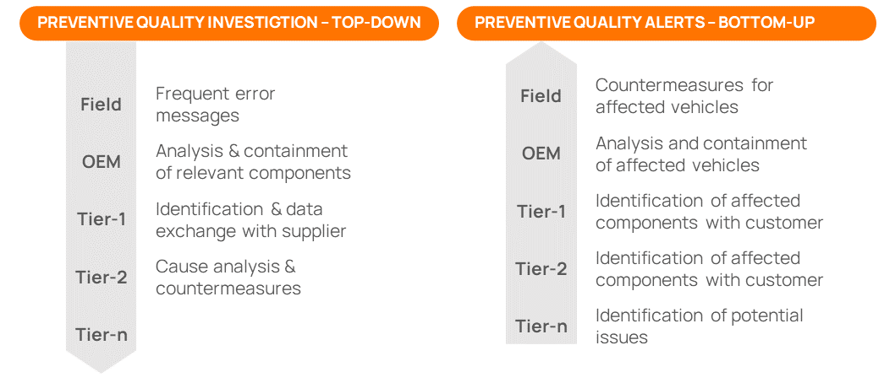
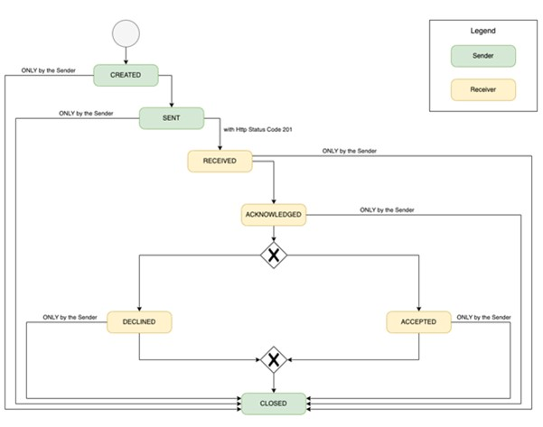

<!---
This work is licensed under the CC-BY-4.0 (https://creativecommons.org/licenses/by/4.0/legalcode).

- SPDX-License-Identifier: CC-BY-4.0
- SPDX-FileCopyrightText: 2023 - 2024 BASF SE
- SPDX-FileCopyrightText: 2023 - 2024 Bayerische Motoren Werke Aktiengesellschaft (BMW AG)
- SPDX-FileCopyrightText: 2023 - 2024 Fraunhofer-Gesellschaft zur Foerderung der angewandten Forschung e.V. (represented by Fraunhofer ISST & Fraunhofer IML)
- SPDX-FileCopyrightText: 2023 - 2024 German Edge Cloud GmbH & Co. KG
- SPDX-FileCopyrightText: 2023 - 2024 Mercedes Benz AG
- SPDX-FileCopyrightText: 2023 - 2024 Robert Bosch Manufacturing Solutions GmbH
- SPDX-FileCopyrightText: 2023 - 2024 SAP SE
- SPDX-FileCopyrightText: 2023 - 2024 Siemens AG
- SPDX-FileCopyrightText: 2023 - 2024 T-Systems International GmbH
- SPDX-FileCopyrightText: 2023 - 2024 ZF Friedrichshafen AG
- SPDX-FileCopyrightText: 2023 - 2024 Contributors to the Eclipse Foundation
- Source URL: https://github.com/eclipse-tractusx/eclipse-tractusx.github.io/tree/main/docs-kits/kits/Traceability%20Kit (latest version)
--->

import Notice from '../part_notice.mdx'


The following page offers specific developer resources, including payloads and API endpoints for data consumer and app provider. It is important to read the business and architecture view first to understand everything.

## Quality Incidents and Notifications
The traceability app providers are supposed to implement the capabilities to enable the standardized exchange of information on quality incidents in Catena-X network (Quality Alert and Quality Investigation).
**Quality investigations** refer to sending standardized notifications to direct suppliers (top-down) while **Quality Alerts** refer to sending notifications to direct customers (bottom-up). This allows supply chain stakeholders to promptly transmit quality notifications to their immediate business partners, in instances where quality issues pertain to supplied products or impact already manufactured items incorporating the defective component, until the root of the problem or affected end-products are determined.
This feature will enable the whole industry to exchange and act upon quality issues in a more standardized, integrated, accelerated and precise manner in order to streamline claim management, avoid general and inaccurate recalls as well as reduce cost and safeguard brand reputation.

In order to uniquely reference the affected parts across the network in the context of a quality incident, the exchange of quality notifications uses Catena-X Unique ID, which are the network-wide unique identifiers for a serialized part or batch, for which a digital twin has been created. Therefore, an app provider should also deliver capabilities for standardized creation of digital twins of vehicles, parts and materials as described in the [Industry Core KIT](../../../category/industry-core-kit) and [Digital Twin KIT](../../../category/digital-twin-kit).


### Quality Notification Process
The notification process takes place between traceability applications or application stacks, and the focus is on minimal interaction, which must be supported by all applications participating in a quality notification or quality investigation scenario. This minimal interaction includes sending and receiving of quality notification as well as updating of the notification state.  Application internals like user journeys, process steps or workflows for notification creation and management in an application are not standardized within Catena-X, and therefore omitted.

The notification states and their cycle are described in the following figure.


### Quality Notification API
A standardized set of APIs and payloads are specified to enable partners to send quality notifications in a standardized way while already knowing which parts (i.e., serialized parts or batches) and which direct customers or suppliers are affected. Notifications are - in contrast to classical data offers in Catena-X which is created for consumption by external stakeholders - a way to push notification related data from a sender to a receiver. For now, this notification API is limited to the sending and receiving of quality notifications as well as the update of the notification status following a state model.
It is important to mention that the notification API shall be implemented into each participant's traceability solution or solution stack in order to be able to receive information related to quality issues. The implemented endpoints shall be able to process the defined request body and respond with the HTTP status codes and - if required - reply with the defined response body.
Meanwhile, this notification API shall only be accessible after successful contract negotiation via Connector based on [Dataspace Protocol (DSP)](https://docs.internationaldataspaces.org/dataspace-protocol/), since the API is made available as part of an EDC data asset with usage policy attached. Please refer to the Notification API ([v1.2.1](../openapi/notifications_1-2-1.yaml), [v2.0.0](../openapi/notifications_2-0-0.yaml)) for more details.

## Asset Registration via Connector
Since the notification APIs are published towards the network using a data asset/contract definition in terms of the dataspace protocol (DSP), there are general guidelines defined for registering a notification receiving endpoint within a data asset. The traceability solutions are supposed to implement a similar data asset with the same structure and provisioning towards Catena-X.
It is important to mention that it could be possible that more than one notification endpoint needs to be made available in parallel towards the network in order to support the versioning and compatibility strategy in the Catena-X ecosystem.

### Asset Creation
The notification endpoint providers must set properties `dct:type` and `cx-common:version` which are used to classify the asset so that partner app providers are able to filter the right assets.

In general, during EDC asset creation, the notification API version needs to provided for `cx-common:version` as specified in OpenAPI documentation. For `dct:type` the following asset typizations should be used during implementation:
- ReceiveQualityInvestigationNotification
- ReceiveQualityAlertNotification
- ReceiveQualityAlertNotification
- UpdateQualityInvestigationNotification

Please refer to the [Digital Twin KIT](../../../category/digital-twin-kit) for more details.

**Example Payload for Asset Creation:**
```json
{
  "@context": {
    "edc": "https://w3id.org/edc/v0.0.1/ns/",
    "cx-common": "https://w3id.org/catenax/ontology/common#",
    "cx-taxo": "https://w3id.org/catenax/taxonomy#",
    "dct": "https://purl.org/dc/terms/"
  },
  "@id": "{{ _.edcAssetId }}",
  "properties": {
    "dct:type": {
      "@id": "cx-taxo:ReceiveQualityInvestigationNotification"
    },
    "cx-common:version": "1.2",
  },
  "privateProperties": {
  },
  "dataAddress": {
    "@type": "DataAddress",
    "type": "HttpData",
    "baseUrl": "{{ _.url_backend }}",
    "proxyQueryParams": "true",
    "proxyPath": "true",
    "proxyMethod": "false",
    "oauth2:tokenUrl": "{{ _.url_keycl_backend }}",
    "oauth2:clientId": "{{ _.client_id_backend }}",
    "oauth2:clientSecretKey": "{{ _.sec_name_vault }}"
  }
}
```

### Policy Creation
For general guidelines for policy creation, please refer to [Industry Core KIT](../../../category/industry-core-kit) and [Connector KIT](../../../category/connector-kit).
It is possible to restrict visibility of data offer for notification API with access policy either for members of Catena-X (“Membership”) and one or several Data Consumers identified by a specific business partner number ("BusinessPartnerNumber").
As for usage policy, participants and related services must restrict the data usage for notification endpoints by using the following policy rules:
- Use Case Framework (“FrameworkAgreement”) – The official agreement is published on [Catena-X website](https://catena-x.net/en/catena-x-introduce-implement/governance-framework-for-data-space-operations)
- at least one use case purpose (“UsagePurpose”) from the [ODRL policy repository](https://github.com/catenax-eV/cx-odrl-profile).

Additionally, respective usage policies MAY include the following policy rule:
- Reference Contract (“ContractReference”).

**Example Payloads for Policy Creation:**
```json
{
  "@context": {
    "@vocab": " https://w3id.org/edc/v0.0.1/ns/"
   },
   "@id": "<POLICY-ID>",
   "policy": {
     "@context": [
       "https://www.w3.org/ns/odrl.jsonld",
         {
           "cx-policy": " https://w3id.org/catenax/policy/v1.0.0/"
         }
      ],
        "@type": "Policy",
        "profile": "cx-policy:profile2405",
        "permission": [
      {
      "action": "use",
        "constraint": {
          "and": [
            {
              "leftOperand": "cx-policy:FrameworkAgreement",
              "operator": "eq",
              "rightOperand": "traceability:1.0"
            },
            {
              "leftOperand": "cx-policy:UsagePurpose",
              "operator": "eq",
              "rightOperand": "qualityNotifications:1"
            }
          ]
        }
      }
    ]
  }
}
```

## Asset Consumption via Connector

### Versioning
The notification sender as well as a requestor of an asset must be able to handle multiple assets for this endpoint, being differentiated only by the version (`cx-common:version`) and should choose the asset with the highest compatible version number implemented by themselves. If the requestor cannot find a compatible version with their own, the requestor must not initiate contract negotiation.

### Policy Check
Meanwhile, the requesting application must be able to validate whether the attached policy constraints (see section _Policy Creation_ above) in the data assets follow company-defined rules and regulations, while selecting the appropriate offer. If no data offer is compliant with company rules for a queried data asset, the requestor must terminate the data transfer.

<Notice components={props.components} />
