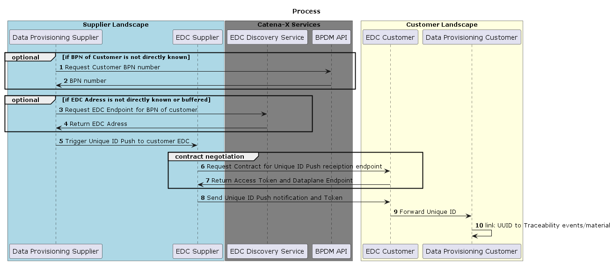

The following page offers specific developer resources, including payloads and API endpoints for data providers. It is important to read the business and architecture view first to understand everything.

<!-- Recommended -->
## Bill of Material (BoM)

A bill of material resembles the structure of an end product. It is a list of all raw materials, sub-assemblies and sub-components that are needed to manufacture the end procuct.
At Catena-X Traceability we consider more than one single BoM. The BoM changes during the lifecyle and therefore, we are talking about different BoMs in different lifecycles.

### BoM Representations

#### Single-Level BOM

A single-level BOM represents one level of an assembly and does not include any lower-level subassemblies.

#### Multi-Level BOM

A Multi-Level Bill of Materials (BOM) is a [bill of materials (BOM)](https://www.bterrell.com/sage-accpac-erp/manufacturing/definition-multi-level-bom/definition-bom/) that lists the components, assemblies, and materials required to make a part. It provides a display of all components that are directly or indirectly used in a parent item. When an item is a subcomponent, blend, intermediate, etc., all of its components, including purchased parts and [raw materials](https://www.bterrell.com/sage-accpac-erp/manufacturing/definition-multi-level-bom/definition-bom/definition-raw-materials/), are also exhibited. A multilevel structure can be illustrated by a tree with several levels. A multi-level BOM is created by connecting a series of individual single level BOMs together.

#### Flattened BOM

Flattening BOM means the intermediate levels in the BOM are removed and the lowest level is directly connected to the highest level.

### BoM Lifecycle Stages

BoM LifeCycleStage concept based on STEP AP242 with slight adoptions in layout & wording:

- Each instance can be identified by unique (within the organization) serial number (SN).
- The ‘multi-SN’ (multi Serial number) describes product defined with a generic part or item
- The ‘one per SN’ (one per Serial number) describes product defined with an individual part or item

| Name |Identifier Step |Implemented CX |Identifier CX| Description |Purpose |Creating time of BoM | BoM Ausprägungen | one/more fix suppliers |
| :--- | :----:|:----: |:----: |:----: | :----: |:----: |:----: |:----: |
| **AsDesigned (AsDeveloped)** | multi-SN | Currently Not Implemented |Part number* <br />may not be the specific part number but a code that describes a part<br />(technische Produktbeschreibung)  |BoM asDesigned is generated in the design phase of a new product including alternative parts. |Build up the initial BoM in design phase of a new automotive product including alternative parts<br />Expected to have research & development part descriptions instead of specific part numbers |starting 2 years before SoP (for e.g. of a new vehicle project) |150% incl. variants which will not be used later |partly known<br />can be open at this point of time |
| **AsPlanned** | multi-SN | **Implemented** |Part number|BoM AsPlanned is used to plan the manufacturing process including alternative parts. |BoM AsPlanned is used to plan manufacturing including alternative parts.<br />Sourcing will most likely be based on this (besides key parts which start earlier) |starting 1,5 years before building the first component |120% of all variants are covered, incl. possibly multiple suppliers for the same component |fixed suppliers, could be more than one supplier per part|
| **AsOrdered** | one per SN | Currently Not Implemented |Part number | BoM AsOrdered is used for manufacturing realization. | BoM that is used for manufacturing realization.<br /> This is the list of parts & components currently used for manufactoring after start of production (SOP) or shortly before.| fixed order<br />(production order or custom order)|100% exact order is known |fixed suppliers, could be more than one supplier per part|
| **AsBuilt** | one per SN | **Implemented**|Serial number / batch number | BoM AsBuilt describes a product as manufactured. | BoM as a component is built or manufactured.<br />During manufactoring of for e.g. a vehicle the serial numbers & batch numbers are documented (German: Verbaudokumentation).<br />This leads to one BoM per built car|during building process or directly after finishing|100% |one specific supplier|
| **AsSupported / AsFlying / AsMaintained / AsOperated** | one per SN | Currently Not Implemented |Serial number / batch number | BoM AsMaintained describes the product after purchasing by a customer and updates by maintenance. | BoM after for e.g. a vehicle was picked up by the customer. Changes to live cycle before may apply due to maintenance or repair work e.g. exchange of parts, liquids, ...|Starts when customer has picked up the product, updating if any change is done|100% inkl. replaced parts, incl. history of exchanged parts |one specific supplier|
| **AsRecycled** | - |Currently Not Implemented| Serial number / batch number | BoM AsRecycled describes the BoM after the recycling of the product. | Requirement for Batteries.||100% ||

Two of the considered BoMs are already implemented in the use case Traceability and will be described as follows.

## Aspect Models

### AsPlanned

#### Short Introduction: What is a BoM AsPlanned?

The BoM AsPlanned is the generic list of all possible catalogue parts & materials for a specific vehical project and the supply chain from OEM to raw material suppliers. The BoM is also called 120% which means that it includes alternative parts / materials (e.g. LED headlights and XENON headlights) and parts for certain markets. It will be set up way before Start of Production (SOP) and be updated if the contents are updated. It is used for Sourcing / Production Planning and always reflects the current state of parts / materials build into this specific vehicle project.

The BoM AsPlanned also includes all versions of parts like changed parts. It has to enable parts/materials provided from multiple manufacturers or the same manufacturer at different production sites. Additionally it must be possible to map relations of the same part/material to different customers.

The complexity of generic is much higher than BoM AsBuilt. It is used for technical topics, e.g., Supply Chain Act, DCM.

#### Definition Status of the BoM AsPlanned

Defined

- Digital Twins
    - Digtial Twin "PartType"

- Traceability data aspect models
    - Aspect model "PartAsPlanned"
    - Aspect model "SingleLevelBoMAsPlanned"
    - Aspect model "SingelLevelUsageAsPlanned"
    - Aspect model "PartSiteInformationAsPlanned"

#### 1. PartAsPlanned

A Part as Planned represents an item in the Catena-X Bill of Material (BOM) in As-Planned lifecycle status in a specific version.

Github Link to semantic data model: [https://github.com/eclipse-tractusx/sldt-semantic-models/tree/main/io.catenax.part_as_planned/1.0.1](https://github.com/eclipse-tractusx/sldt-semantic-models/tree/main/io.catenax.part_as_planned/1.0.1)

##### Example: Submodel `PartAsPlanned` for a Catalog Part

```json
{
  "partTypeInformation": {
    "classification": "component",
    "manufacturerPartId": "123-0.740-3434-A",
    "nameAtManufacturer": "Mirror left"
  },
  "validityPeriod": {
    "validFrom": "2021-06-14T06:55:29.935Z",
    "validTo": "2022-06-14T06:55:29.935Z"
  },
  "catenaXId": "urn:uuid:580d3adf-1981-44a0-a214-13d6ceed9379"
}
```

#### 2. SingelLevelBomAsPlanned

The single-level Bill of Material represents one sub-level of an assembly and does not include any lower-level subassemblies. In as planned lifecycle state all variants are covered (\"120% BoM\"). If multiple versions of child parts exist that can be assembled into the same parent part, all versions of the child part are included in the BoM. If there are multiple suppliers for the same child part, each supplier has an entry for their child part in the BoM.

Github Link to semantic data model: [https://github.com/eclipse-tractusx/sldt-semantic-models/tree/main/io.catenax.single_level_bom_as_planned/2.0.0](https://github.com/eclipse-tractusx/sldt-semantic-models/blob/main/io.catenax.single_level_bom_as_planned/2.0.0)

##### Example: Submodel `SingleLevelBomAsPlanned` for a Catalog Part

```json
{
  "catenaXId": "urn:uuid:055c1128-0375-47c8-98de-7cf802c3241d",
  "childItems": [
    {
      "catenaXId": "urn:uuid:5daB938E-Cafa-92B3-7ca1-9aD7885e9dC8"
      "quantity": {
        "quantityNumber": 2.5,
        "measurementUnit": "unit:litre"
      },
      "createdOn": "2022-02-03T14:48:54.709Z",
      "businessPartner": "BPNL50096894aNXY",
      "lastModifiedOn": "2022-02-03T14:48:54.709Z"
  ]
}
```

#### 3. SingelLevelUsageAsPlanned

The aspect provides the information in which parent part(s)/product(s) the given item is assembled in. This could be a 1:1 relationship in terms of a e.g. a brake component or 1:n for e.g. coatings. The given item as well as the parent item must refer to an object from as planned lifecycle phase. If multiple versions of parent parts exist that the child part can be assembled into, all versions of the parent part are included in the usage list.

Github Link to semantic data model: [https://github.com/eclipse-tractusx/sldt-semantic-models/tree/main/io.catenax.single_level_usage_as_planned/1.1.0](https://github.com/eclipse-tractusx/sldt-semantic-models/tree/main/io.catenax.single_level_usage_as_planned/1.1.0)

##### Example: Submodel `SingleLevelUsageAsPlanned` for a Catalog Part

```json
{
  "parentParts": [
    {
      "parentCatenaXId": "urn:uuid:c8B01D5A-ce0B-6Dd4-5bA0-A3e3fcE9cA93",
      "quantity": {
        "quantityNumber": 2.5,
        "measurementUnit": "unit:litre"
      },
      "createdOn": "2022-02-03T14:48:54.709Z",
      "lastModifiedOn": "2022-02-03T14:48:54.709Z"
    }
  ],
  "catenaXId": "urn:uuid:055c1128-0375-47c8-98de-7cf802c3241d"
}
```

#### 4. PartSiteInformationAsPlanned

The aspect provides site related information for a given as planned item (i.e. a part type or part instance that is uniquely identifiable within Catena-X via its Catena-X ID). A site is a delimited geographical area where a legal entity does business. In the \"as planned\" lifecycle context all potentially related sites are listed including all sites where e.g. production of this part (type) is planned.

Github Link to semantic data model: [https://github.com/eclipse-tractusx/sldt-semantic-models/tree/main/io.catenax.part_site_information_as_planned/1.0.0](https://github.com/eclipse-tractusx/sldt-semantic-models/tree/main/io.catenax.part_site_information_as_planned/1.0.0)

##### Example: Submodel `PartSiteInformationAsPlanned` for a Component that is Produced at the Given Site

```json
{
  "catenaXId": "urn:uuid:580d3adf-1981-44a0-a214-13d6ceed9379",
  "sites": [
    {
      "catenaXSiteId": "BPNS1234567890ZZ",
      "functionValidUntil": "2025-11-21T11:14:30.825+01:00",
      "function": "production",
      "functionValidFrom": "2022-11-21T11:14:30.825+01:00"
    }
  ]
}
```

### AsBuilt

#### Short Introduction: What is a BoM AsBuilt?

A BoM AsBuilt resembles a single vehicle, which means that each vehicle built has its own individual BoM asBuilt. The BoM includes all part/components which either have a serial number, batch number, JIS number (sequence number) or a combination out of these. This means, that there is a direct and specific connection between a parent and a child part/component so that an accurate and exact traceability is possible.

Also, the BoM is called 100%, as there are no alternative parts included but only built parts. Therefore, it will be set up when a part is produced and can be connected to its parent and child parts.

In Catena-X the BoM asBuilt is used for technical topics, e.g., Quality, Battery Passport (CE).

#### Definition Status of the BoM AsBuilt

Defined

- Digital Twins
    - Digital Twin Serialized Part
    - Digital Twin Batch
    - Digital Twin Vehicle
- Build up the basic chain
    - Aspect model "SerialPart"
    - Aspect model "AssemblyPartRelation"
    - Aspect model "Batch"
    - Aspect model "JustInSequencePart"
    - Aspect model "TractionBatteryCode"

#### 1. SerialPart

A serialized part is an instantiation of a (design-) part, where the particular instantiation can be uniquely identified by means of a serial numbers or a similar identifier (e.g. VAN) or a combination of multiple identifiers (e.g. combination of manufacturer, date and number)

Github Link to semantic data model: [https://github.com/eclipse-tractusx/sldt-semantic-models/tree/main/io.catenax.serial_part/1.0.1](https://github.com/eclipse-tractusx/sldt-semantic-models/tree/main/io.catenax.serial_part/1.0.1)

##### Example: Submodel `SerialPart` for a Vehicle

```json
{
  "localIdentifiers": [
    {
      "key": "manufacturerId",
      "value": "BPNL7588787849VQ"
    },
    {
      "key": "manufacturerPartId",
      "value": "95657362-83"
    },
    {
      "key": "partInstanceId",
      "value": "OEM-A-F8LM95T92WJ9KNDD3HA5P"
    },
    {
      "key": "van",
      "value": "OEM-A-F8LM95T92WJ9KNDD3HA5P"
    }
  ],
  "manufacturingInformation": {
    "date": "2022-02-04T14:48:54",
    "country": "DEU"
  },
  "catenaXId": "urn:uuid:580d3adf-1981-44a0-a214-13d6ceed9379",
  "partTypeInformation": {
    "manufacturerPartID": "QX-39",
    "classification": "product",
    "nameAtManufacturer": "Vehicle Model A"
  }
}
```

##### Example: Submodel `SerialPart` for a Serialized Part (Non-Vehicle)

```json
{
  "localIdentifiers": [
    {
      "key": "manufacturerId",
      "value": "BPNL7588787849VQ"
    },
    {
      "key": "manufacturerPartId",
      "value": "95657362-83"
    },
    {
      "key": "partInstanceId",
      "value": "NO-574868639429552535768526"
    }
  ],
  "manufacturingInformation": {
    "date": "2022-02-04T14:48:54",
    "country": "DEU"
  },
  "catenaXId": "urn:uuid:d60b99b0-f269-42f5-94d0-64fe0946ed04",
  "partTypeInformation": {
    "manufacturerPartID": "95657362-83",
    "customerPartId": "798-515297795-A",
    "classification": "component",
    "nameAtManufacturer": "High Voltage Battery",
    "nameAtCustomer": "High Voltage Battery"
  }
}
```

#### 2. SingleLevelBomAsBuilt

The aspect provides the child parts (one structural level down) which the given object assembles.

Github Link to semantic data model: [https://github.com/eclipse-tractusx/sldt-semantic-models/tree/main/io.catenax.single_level_bom_as_built/2.0.0](https://github.com/eclipse-tractusx/sldt-semantic-models/tree/main/io.catenax.single_level_bom_as_built/2.0.0)

##### Example: Submodel `SingleLevelBomAsBuilt` for a Serialized Part

```json
{
  "catenaXId": "urn:uuid:580d3adf-1981-44a0-a214-13d6ceed9379",
  "childItems": [
    {
      "quantity": {
        "quantityNumber": 1.0,
        "measurementUnit": "unit:piece"
      },
      "hasAlternatives": false,
      "createdOn": "2022-02-03T14:48:54.709Z",
      "lastModifiedOn": "2022-02-03T14:48:54.709Z",
      "catenaXId": "urn:uuid:d60b99b0-f269-42f5-94d0-64fe0946ed04",
      "businessPartner": "BPNL50096894aNXY"
    }
  ]
}
```

##### Submodel `SingleLevelBomAsBuilt` for a Batch

```json
{
  "catenaXId": "urn:uuid:580d3adf-1981-44a0-a214-13d6ceed9379",
  "childItems": [
    {
      "quantity": {
        "quantityNumber": 25.0,
        "measurementUnit": "unit:kilogram"
      },
      "hasAlternatives": false,
      "createdOn": "2022-02-03T14:48:54.709Z",
      "lastModifiedOn": "2022-02-03T14:48:54.709Z",
      "catenaXId": "urn:uuid:d60b99b0-f269-42f5-94d0-64fe0946ed04",
      "businessPartner": "BPNL50096894aNXY"
    }
  ]
}
```

#### 3. Batch

A batch is a quantity of (semi-) finished products or (raw) material product that have been produced under the same circumstances (e.g. same production location), as specified groups or amounts, within a certain time frame. Every batch can differ in the number or amount of products. Different batches can have varied specifications, e.g., different colors. A batch is identified via a Batch ID.

Github Link to semantic data model: [https://github.com/eclipse-tractusx/sldt-semantic-models/tree/main/io.catenax.batch/2.0.0](https://github.com/eclipse-tractusx/sldt-semantic-models/tree/main/io.catenax.batch/2.0.0)

##### Example: Submodel `Batch` for a Batch of Raw Material

```json
{
  "localIdentifiers": [
    {
      "value": "BID12345678",
      "key": "batchId"
    }
  ],
  "manufacturingInformation": {
    "date": "2022-02-04T14:48:54",
    "country": "HUR"
  },
  "catenaXId": "urn:uuid:580d3adf-1981-44a0-a214-13d6ceed9379",
  "partTypeInformation": {
    "manufacturerPartId": "123-0.740-3434-A",
    "classification": "product",
    "nameAtManufacturer": "PA66-GF30",
  }
}
```

#### 4. JustInSequencePart

A just-in-sequence part is an instantiation of a (design-) part, where the particular instantiation can be uniquely identified by means of a combination of several IDs related to a just-in-sequence process.

Github Link to semantic data model: [https://github.com/eclipse-tractusx/sldt-semantic-models/tree/main/io.catenax.just_in_sequence_part/1.0.0](https://github.com/eclipse-tractusx/sldt-semantic-models/tree/main/io.catenax.just_in_sequence_part/1.0.0)

##### Example: Submodel `JustInSequencePart` for a non-serialized component

```json
{
  "localIdentifiers": [
    {
      "key": "manufacturerId",
      "value": "BPNL7588787849VQ"
    },
    {
      "key": "jisNumber",
      "value": "894651684"
    },
    {
      "key": "parentOrderNumber",
      "value": "OEM-A-F8LM95T92WJ9KNDD3HA5P"
    },
    {
      "key": "jisCallDate",
      "value": "2022-01-24T09:13:34"
    }
  ],
  "manufacturingInformation": {
    "date": "2022-02-04T14:48:54",
    "country": "DEU"
  },
  "catenaXId": "urn:uuid:580d3adf-1981-44a0-a214-13d6ceed9379",
  "partTypeInformation": {
    "manufacturerPartID": "84816168424",
    "classification": "product",
    "nameAtManufacturer": "Black Leather Front Row Seat for Vehicle Model B"
  }
}
```

> Please note that if a just-in-sequence part is also a serialized part, SerialPart should be used instead.

#### 5. TractionBatteryCode

The aspect provides the information of the Traction battery code of a battery cell, a battery module or a battery pack according to the chinese standard GB/T 34014-2017. Furthermore, it provides the traction battery codes for the assembled sub parts of the component, e.g.  Traction battery code of a battery module plus all the traction battery codes of the assembled battery cells of this battery module.

Github Link to semantic data model: [https://github.com/eclipse-tractusx/sldt-semantic-models/tree/main/io.catenax.traction_battery_code/1.0.0](https://github.com/eclipse-tractusx/sldt-semantic-models/tree/main/io.catenax.traction_battery_code/1.0.0)

##### Example: Submodel `TractionBatteryCode` for a Battery Cell

```json
{
  "productType": "cell",
  "tractionBatteryCode": "X12CCPM27KLPCLE662382320"
}
```

##### Example: Submodel `TractionBatteryCode` for a Battery Module

```json
{
  "productType": "module",
  "tractionBatteryCode": "B54MCPM27KLPCLE6A7519857",
  "subcomponents": [
    {
      "productType": "cell",
      "tractionBatteryCode": "X12CCPM27KLPCLE662382320"
    },
    {
      "productType": "cell",
      "tractionBatteryCode": "X12CCPM27KLPCLE662382321"
    }
  ]
}
```

##### Example: Submodel `TractionBatteryCode` for a Battery Pack

```json
{
  "productType": "pack",
  "tractionBatteryCode": "4A6PCPM27KLPCLE742946319",
  "subcomponents": [
    {
      "productType": "module",
      "tractionBatteryCode": "B54MCPM27KLPCLE6A7519857",
      "subcomponents": [
        {
          "productType": "cell",
          "tractionBatteryCode": "X12CCPM27KLPCLE662382320"
        },
        {
          "productType": "cell",
          "tractionBatteryCode": "X12CCPM27KLPCLE662382321"
        }
      ]
    },
    {
      "productType": "module",
      "tractionBatteryCode": "B54MCPM27KLPCLE6A7519858",
      "subcomponents": [
        {
          "productType": "cell",
          "tractionBatteryCode": "X12CCPM27KLPCLE662382322"
        },
        {
          "productType": "cell",
          "tractionBatteryCode": "X12CCPM27KLPCLE662382323"
        }
      ]
    }
  ]
}
```

## Digital Twin

### Register Digital Twins

In Traceability, digital twins for different types of parts are registered at a Digital Twin Registry, e. g. serialized parts, batches, JIS parts or catalog parts. Basic information about how to register digital twins in Catana-X are described in the standard [CX-0002 Digital Twins in Catena-X](https://catena-x.net/de/standard-library).

> :raised_hand: **Unique ID Push**
> Once a digital twin was created, optionally a Unique ID Push notification can be send to the customer of the part of batch to inform them that a new digital twin is available.

The following general conventions apply for all these digital twins:

- id: The AAS ID must be a UUIDv4 in URN format: `urn:uuid:<UUIDv4>`;
- globalAssetId: the Unique ID of the real-world part for which a digital twin is created.

> :warning: The AAS ID is not the same id as the Catena-X Unique ID, although they have the same format (UUID) and therefore look the same. A Unique ID identifies real-world parts, whereas a AAS ID identifies a digital twin of such a part. So, don't use the same value for Unique ID and AAS ID.

##### Property specificAssetIds

For Traceability, we define some specific asset IDs as mandatory. Mandatory specific asset IDs are used to lookup or search for digital twins. This is a required step by a customer of a part to connect the digital twins of their parts with the digital twins of the suppliers' child parts. To a customer, only the information printed on a real-world part is available and can be used for the lookup. Mandatory specific asset IDs ensure that at least this information is available for the digital twin.

The following conventions for specific asset IDs apply to all digital twins:

<table>
  <tr>
    <th> Key </th> <th> Availability </th> <th> Description </th> <th> Type </th>
  </tr>
  <tr>
    <td> manufacturerId </td>
    <td> Mandatory </td>
    <td> The Business Partner Number (BPNL) of the manufacturer of the part. </td>
    <td> BPNL </td>
  </tr>
  <tr>
    <td> manufacturerPartId </td>
    <td> Mandatory </td>
    <td> The ID of the type/catalog part from the <em>manufacturer</em>. </td>
    <td> String </td>
  </tr>
  <tr>
    <td> customerPartId </td>
    <td> Optional </td>
    <td> The ID of the type/catalog part from the <em>customer</em>.<br/>The main reason why this propertiy is optional is that it cannot be guaranteed that every manufacturer knows the customerPartId for their parts. In case the manufacturer knows the customer and the corresponding CustomerPartID of its part though, it is <em>required</em> to add this information for easier lookup and to enable further processes.<br/>

  </td>
    <td> String </td>
  </tr>
  <tr>
    <td> assetLifecyclePhase </td>
    <td> Optional (for DT As-Built)<br/>Mandatory (for DT As-Planned) </td>
    <td>
      The lifecycle phase of the asset:
      <ul><li>For serialized parts, batches, and JIS parts, use the value "AsBuilt".</li><li>For catalog parts, use the value "AsPlanned".</li></ul>
      assetLifecyclePhase was added to allow data consumers to search only for catalog parts by using <code>assetLifecyclePhase="AsPlanned"</code> as filter. Without this filter, a search for a particular  manufacturer part ID would not only return the digital twin of the catalog part, but also all digital twins of instances of this catalog part, i.e., of the corresponding serial parts.
    </td>
    <td> Enum </td>
  </tr>
</table>

**For serialized parts, additionally the following conventions apply:**

| Key            | Availability | Description                                                                                  | Type   |
| :------------- | :----------- | :------------------------------------------------------------------------------------------- | :----- |
| partInstanceId | Mandatory    | The serial number of the part from the manufacturer.                                         | String |
| van            | Optional     | **Only for vehicles:** The pseudonymized vehicle identification number (VIN) of the vehicle. | String |

**For batches, additionally the following conventions apply:**

| Key            | Availability | Description                                                                                                                                                                                                                                                                                                                                                                                                                                                                                      | Type   |
| :------------- | :----------- | :----------------------------------------------------------------------------------------------------------------------------------------------------------------------------------------------------------------------------------------------------------------------------------------------------------------------------------------------------------------------------------------------------------------------------------------------------------------------------------------------- | :----- |
| batchId        | Optional     | The number of the batch from the manufacturer.                                                                                                                                                                                                                                                                                                                                                                                                                                                   | String |
| partInstanceId | Mandatory    | Also the number of the batch from the manufacturer.<br/><br/>Currently, we also use the batch number as partInstanceId. This makes looking up digital twins for serialized parts and batches easier as a data consumer only has to specify the partInstanceId no matter if they are looking up a serialized part or a batch. Otherwise, the data consumer would need to know for what type of digital twin it is looking for or it would have to look for both until a match is found. | String |

**For just-in-sequence (JIS) parts, additionally the following conventions apply:**

| Key               | Availability | Description                                                                                                                                                                                                                             | Type   |
| :---------------- | :----------- | :-------------------------------------------------------------------------------------------------------------------------------------------------------------------------------------------------------------------------------------- | :----- |
| parentOrderNumber | Optional     | A number identifying the just-in-sequence- part's destination parent part. The parent part is typically known upfront to the supplier for just-in-sequence parts.                                                                       | String |
| jisNumber         | Mandatory    | A number that is used to identify the call-off that can be assumed unique within the specific just-in-sequence process. This is typically not the sequence number, but the call-off number.                                             | String |
| jisCallDate       | Optional     | The date of the just-in-sequence call-off as stated on the call-off document itself. <br/>The value must be compliant to ISO 8601: `YYYY-MM-DD` or `YYYY-MM-DDThh:mm:ss` or `YYYY-MM-DDThh:mm:ss±hh:mm`                                 | Date   |
| partInstanceId    | Mandatory    | A composition of `jisNumber`, `parentOrderNumber` (if available), `jisCallDate` (ifavailable). This information is typically known upfront to the supplier `jisNumber`, `partOrderNumber` and `jisCallDate` for just-in-sequence parts. | String |

> :raised_hand: **Lookup of Digital Twins**
> The lookup for parts can use the customerPartId or the manufacturerPartId. Both, manufacturer and customer must agree upon what part id will be used for the lookup. Otherwise, when the customer would use the customerPartId for the lookup, but the manufacturer would only provide the manufacturerPartId in its digital twins, the lookup would fail every time. **This is decision that a customer must agree upon with each of their suppliers individually.**

##### Authorization: Visbility of Specific Asset IDs in the DTR

To enforce a strict need-to-know (and prevent data from being exposed to non-authorized parties), the visibility of entries in the attribute `specificAssetIds` must be protected, i.e.,their visibility must be restricted to authorized parties only. For that, the attribute `externalSubjectId` must be used. Detailed information about this can be found in the [Digital Twin KIT](https://eclipse-tractusx.github.io/docs-kits/category/digital-twin-kit).

##### Submodel Descriptors

General conventions for submodel descriptors can be found in the standard [CX-0002 Digital Twins in Catena-X](https://catena-x.net/de/standard-library). This section is based on it and it is recommended to read it first. In this KIT, we extend this standard with some additional conventions.

Submodel descriptors MUST be compliant to the following additional conventions:

- `id`: The submodel ID must be a UUIDv4 in URN format: "urn:uuid:&lt;UUIDv4&gt;";
- `idShort`: the name of the aspect model in camel case, e.g. for aspect SerialPart: "serialPart".

The actual access information for the EDC is part of the endpoint attribute in the submodel descriptor.

```json
{
    "interface": "SUBMODEL-3.0",
    "protocolInformation": {
        "href": "https://edc.data.plane/{path}/submodel",
        "endpointProtocol": "HTTP",
        "endpointProtocolVersion": ["1.1"],
        "subprotocol": "DSP",
        "subprotocolBody": "id=123;dspEndpoint=http://edc.control.plane/",
        "subprotocolBodyEncoding": "plain",
        "securityAttributes": [ 
          { "type": "NONE", "key": "NONE", "value": "NONE" }
        ]
    }
}
```

The following conventions apply for the endpoint:

- `interface`, `endpointProtocol`, `endpointProtocolVersion`, `subprotocol`, `subprotocolBodyEncoding`, and `securityAttributes` are set as defined in the CX-0002 standard.
- `href`: The endpoint address for the logical operation GetSubmodel that is invoked by a data consumer to get the submodel. It must have the following format:
  - `edc.data.plane`: Server and port of the EDC data plane that is providing the submodel.
  - `{path}`: This `{path}` string is forwarded to the backend data service by the EDC data plane. Together with the EDC asset information (see below) it must contain all information for the backend data service to return the requested submodel. The actual path depends on the type of backend data service that the data provider uses to handle the request. More details follow below.
  - `/submodel`: This `/submodel` string is also forwarded to the backend data service. As AAS Profile SSP-003 of the Submodel Service Specification is mandatory for release 3.2, `href` must have the suffix "/submodel" representing the invokation of the GetSubmodel operation.
- `subprotocolBody`: a semicolon-separated list of parameters used to negotiate the required contract agreement.
  - `id=123`: The ID of the EDC asset for which a contract negitiation should be intiated. This ID is also called dataset ID as it is stored as `https://www.w3.org/ns/dcat/dataset.@id` in a catalog entry. This ID must be set by the data provider when creating the asset. Do not confuse this EDC asset ID (dataset ID) with other IDs that might be defined additionally for an EDC asset, e.g., `https://w3id.org/edc/v0.0.1/ns/id` (often refered to as `edc:id`).
  - `dspEndpoint`: Server and port of the EDC control plane used for contract negotiation.

> :raised_hand: **Backend Data Service for Submodels**
According to CX-0002, the backend data service identified via `href`and the filter criteria in `subprotocolBody` MUST be conformant to the Asset Administration Shell Profile SSP-003 of the Submodel Service Specification and must at least support the logical operation GetSubmodel. In release 3.2, only the logical parameter Content=Value must be supported via path suffix "/submodel/$value". This might change in later Catena-X releases.

With this approach, the EDC asset structure must no longer follow the "one EDC asset per submodel" rule (as in Release 3.1 and before), but gives data providers more flexibility how to create EDC assets for their digital twins and submodels based on how they use `{path}`.

###### Option 1: Same EDC Asset Structure as in Release 3.1

Submodels of digital twins are registered in the EDC the same way as for release 3.1: One EDC asset is created for every submodel of a digital twin.

- `href` must have the following format: `http://edc.data.plane/submodel`
- `subprotocolBody` must have the following format: `id={edcAssetId};dspEndpoint=http://edc.control.plane`
- edcAssetId is the id of the EDC asset for the submodel. It must have the following format "{aasIdentifier}-{submodelIdentifier}" with
  - aasIdentifier: the id of the digital twin (id property in the AAS descriptor)
  - submodelIdentifier: the id of the submodel (id property in the submodel descriptor)

Here's an example how such a submodel descriptor could look like:

```json
"submodelDescriptors": [
  {
    "idShort": "serialPart",
    "id": "urn:uuid:7effd7f4-6353-4401-9547-c54b420a22a0",
    "semanticId": {
      "type": "ExternalReference", 
      "keys": [
        {
          "type": "GlobalReference", 
          "value": "urn:samm:io.catenax.serial_part:1.0.1#SerialPart"
        }
      ]
    },
    "endpoints": [
      {
        "interface": "SUBMODEL-3.0",
        "protocolInformation": {
          "href": "https://edc.data.plane/submodel",
        "endpointProtocol": "HTTP",
        "endpointProtocolVersion": ["1.1"],
          "subprotocol": "DSP",
          "subprotocolBody": "id=urn:uuid:75e98d67-e09e-4388-b2f6-ea0a0a642bfe-urn:uuid:7effd7f4-6353-4401-9547-c54b420a22a0;dspEndpoint=http://edc.control.plane/",
          "subprotocolBodyEncoding": "plain",
          "securityAttributes": [ 
            { "type": "NONE", "key": "NONE", "value": "NONE" }
          ]
        }
      }
    ]
  }
]
```

In this example, the `path` part in the `href` is empty, as the EDC asset referenced in `subprotocolBody` directly points to a service returning the correct submodel (set up correctly with its dataAddress in the data provider's EDC).

###### Option 2: EDC Asset Structure on Catalog Part Level

A data provider can link several submodel endpoints to the same EDC asset (referenced by its id). This allows to create only one EDC asset (per aspect model) for a catalog part and link all submodels (of the same aspect model) for serialized parts of the catalog part to the same EDC asset. The data provider would still need to create separate EDC assets per aspect model as in most cases different usage policies are used for aspect models.

If a data provider no longer creates EDC assets on the level of submodels, the EDC can no longer authorize a request on a submodel-level. For example: If EDC assets are created per catalog part, the EDC can only authorize if the requestor is allowed to see parts of these type in general; if the requestor is allowed to see a actual serialized part, must be authorized by the backend data service executing the request.

Here's an example how such a submodel descriptor could look like:

```json
"submodelDescriptors": [
  {
    "idShort": "serialPart",
    "id": "urn:uuid:7effd7f4-6353-4401-9547-c54b420a22a0",
    "semanticId": {
      "type": "ExternalReference", 
      "keys": [
        {
          "type": "GlobalReference", 
          "value": "urn:samm:io.catenax.serial_part:1.0.1#SerialPart"
        }
      ]
    },
    "endpoints": [
      {
        "interface": "SUBMODEL-3.0",
        "protocolInformation": {
          "href": "https://edc.data.plane/urn%3Auuid%3A75e98d67-e09e-4388-b2f6-ea0a0a642bfe-urn%3Auuid%3A7effd7f4-6353-4401-9547-c54b420a22a0/submodel",
          "endpointProtocol": "HTTP",
          "endpointProtocolVersion": ["1.1"],
          "subprotocol": "DSP",
          "subprotocolBody": "id=urn:uuid:1475f313-0a83-4e2b-b705-a100eebcb7d7;dspEndpoint=http://control-plane.edc.catena-x.net/",
          "subprotocolBodyEncoding": "plain",
          "securityAttributes": [ 
            { "type": "NONE", "key": "NONE", "value": "NONE" }
          ]
        }
      }
    ]
  }
]
```

The path part of the `href` property contains the information for the backend data service which digital twin's submodel to return while the EDC asset ID is used for several endpoints. The path part here is just an example as it depends on the type of backend data service the data provider uses.

The above options are only two examples how a submodel's endpoint can be created. As long as it's compliant with the above conventions (including CX-0002) a data provider can also use any other EDC asset structure.

###### Data Consumption with AAS Submodel Descriptor Endpoints

The endpoint `href` in the submodel descriptor cannot be used directly to contact an EDC and access the data in Catena-X.

- A data consumer must first identify the protocol that must be used to retrieve the submodel data based on the `subprotocol`. For data transfers in Catena-X, this is "DSP"
- With `href`, the data consumer calls the local operation GetSubmodel as specified by the suffix "/submodel". As only the logical parameter "Content" must be supported in release 3.2, "/$value" must be appended to `href` by the data consumer.
  If the `href` endpoint is called with operations or parameter values not yet supported, the error response 501 "Not Implemented" must be returned according to CX-0002.
- Then, the data consumer must use the information in the `subprotocolBody` to perform a contract negotiation for the EDC asset referenced by `id` with the EDC control plane of the data provider specified by `dspEndpoint`.
- Finally, using the id from the contract agreement with the control plane, the data consumer initiates the data transfer with the EDC data plane of the data provider referenced in the `href`. The enriched path part of the `href` (see bullet point 2) is passed to data provider data plane by the data consumer as a parameter for the backend data service that actually executes the request and returns the submodel.

All these steps must be handled by the data consumer that want to retrieve the submodel data of a digital twin.

### Lookup in the Digital Twin Registry

For a data provider, there are currently the following steps where they have to lookup digital twins of other partners in the Catena-X network.

- The data provider must use the local IDs for a serialized part or batch (manufacturer, part number, serial or batch number) and for a just-in-sequence part (manufacturer, parentOrderNumber, jisNumber, jisCallDate) to lookup the AAS ID of the digital twin of this serialized part, batch or just-in-sequence part. The AAS descriptor with this ID contains the Unique ID of the serialized part, batch or just-in-sequence (as globalAssetId) that is used to create SingleLevelBomAsBuilt submodel.

- The data provider must use the local IDs for a catalog part (manufacturer, part number) to lookup the AAS ID of the digital twin of this catalog part. The AAS descriptor with this ID contains the Unique ID of the catalog part (as globalAssetId) that is used to create the SingleLevelBoMAsPlanned submodel.

For a data consumer, there are currently the following steps where they have to lookup digital twins of other partners in the Catena-X network.

- The data consumer in the Traceability use case in most cases will use the Unique ID of a part to lookup the digital twin (more precisely, its AAS ID) of this part.
- The data consumer from another use case (e.g., Circular Economy), might either use the Unique ID of a part (if known) or the local IDs of a part to lookup the part's digital twin (AAS ID) depending on what is available in the use case.

##### Lookup up a Digital Twin with Local IDs

The local IDs of a serialized part (manufacturer, part number, serial number) are stored as specific asset IDs in the AAS descriptor of the digital twin. From the Digital Twin Registry API, the following function can be used for this lookup `GET /lookup/shells`.

All Asset identifier key-value-pairs used as parameter to this lookup function are combined using AND. An example query would look like this: `https://URL/registry/lookup/shells?assetIds=%5B%7B%22key%22%3A%20%22manufacturerId%22,%22value%22%3A%20%22BPNL7588787849VQ%22%7D,%7B%22key%22%3A%20%22manufacturerPartId%22,%22value%22%3A%20%2295657362-83%22%7D,%7B%22key%22%3A%20%22partInstanceId%22,%22value%22%3A%20%22NO-574868639429552535768526%22%7D%5D`

**The assetIds value looks like this unencoded (but with additional spaces and linebreaks):**

```json
[
  {
    "key": "manufacturerId",
    "value": "BPNL7588787849VQ"
  },
  {
    "key": "manufacturerPartId",
    "value": "95657362-83"
  },
  {
    "key": "partInstanceId",
    "value": "NO-574868639429552535768526"
  }
]
```

The lookup (for serialized parts/batches as well as catalog parts) can use the customer or the manufacturer part id (manufacturerPartId or manufacturerPartId).

- For a digital twin, adding the customer part id to the specific asset IDs is optional. The main reason for this is that it cannot be guaranteed that every manufacturer knows the customer part id for their parts. But, if they know it, it is recommended to always add the customer part id to the specifiAssetId property for easier lookup (by customers).
- A customer that wants to do a lookup for a supplier's digital twin, must first decide what id they want to use for the lookup. This depends on the information that is available to them.
  - If the customer knows the manufacturer part id, they should use the manufacturer part id for the lookup as the manufacturer part id is guaranteed to be available in the digital twin (as the manufacturer part id is a mandatory property).
  - If the customer does not know the manufacturer part id, they must use the customer part id (i.e., their own part id). In that case they must make sure that their suppliers register their digital twins with this information (as the customer part id is optional) as part of the specific asset IDs. This is decision that a customer must agree upon with each of their suppliers individually.

As a result, the AAS ID of the digital twin with this local IDs is returned. The AAS ID can then be used to retrieve details about the digital twin, i.e. the digital twin's AAS descriptor including submodel descriptors.

**Example result for looking up a digital twin with local IDs:**

```json
["urn:uuid:c227a880-b82b-40f7-846c-3942ddf26c29"]
```

Note that this query can return more than one AAS ID depending on the local IDs uniquely identifying a digital twin or not.

Currently, even if more than one digital twin is returned in a lookup, these digital twins should have different submodels assigned to them. These submodels should be disjunct and not overlap. This means that you can use the submodel to filter out the correct digital twin.

- If there are returned more than one digital twin with the same submodel (based on their semanticId), this is considered an error. Processing should be canceled and an error message should be reported.

The next section describes to modify the lookup to additionally restrict the results to digital twins with a specific submodel type based on it's semanticId.

### Unique ID Push Notifications

Unique ID Push notifications are a way for a manufacturer to notify a customer as soon as possible when a new digital twin for a part is available.

The solution is based on notification assets in the EDC (which is the same approach that is used for quality alerts & investigations). The customer creates a notification asset in the EDC and the customer's suppliers send their notifications (with the Unique Id) to this notification asset. As this notification asset is a general EDC asset - as for all EDC assets - access policies, usage policies and contract definitions must be created.

> :raised_hand: It is important to understand that the customer (receiver) creates EDC asset and policies, and thus, the supplier (sender) of the Unique ID push notification must check during the EDC negotiation process if the conditions the receiver offers are acceptable for the sender.

##### Prerequisites and Constraints

In order to be able to push Unique ID(s) of part(s) to the correct partner, it is required that the data provider (manufacturer) pushing the Unique IDs is aware of the BPN of the actual receiver of the part (i.e., the customer) or has enough data in its context to use BPDM functions to determine the BPN Number of the receiver.

For actively pushing Unique IDs, an EDC is required and the data provider needs to be enabled to execute the complete process including EDC communication and HTTP Push (i.e., HTTP POST) of the payload.

Secondly, EDCs are being used for the exchange and it is currently required to offer a HTTP POST API to receive the Unique IDs push at the receiver's side. This API needs to be registered in the EDC Catalog as a data offer and requires specific properties to be set to standardized values, as this allows discover-ability. Details still tbd.

##### Unique ID Push Process Overview

How the actual process is triggered is application specific. It is recommended to trigger the push of Unique IDs towards the customer after the Goods Issue has been booked, since commonly at that point the serial numbers/batch numbers of the parts being delivered are fixed in the logistics process and shall be contained in delivery documents, EDI Messages and/or any internal representation of the received items (non-Catena-X communication).

The Unique ID push is initiated by the supplier (acting as sender) towards their customer (acting as receiver). Since the Unique ID of the asset (i.e., serial unit / batch) is unknown in the logistics process, the message needs to include local identifiers to be matched towards the information from the delivery documents and furthermore the internal data of the recipient's traceability solution.

Upon receipt of the message, the customer needs to match the local identifiers with its internal traceability records and attach each Unique ID to the respective data set. How this is done is depending on the customer's internal systems:

- If there is an object for incoming deliveries, this event could be updated.
  Alternatively, if only production events are tracked, the data could be integrated at this point into the data provisioning pipeline's data structure for consumed materials.
- In the end this enables the customer to integrate the child parts into the SingleLevelBomAsBuilt aspect.



<!--
The following PlantUML code is used to generate the image shown:

@startuml
autonumber

box "Supplier Landscape" #Lightblue
participant "Data Provisioning Supplier" as TraceSup order 1
participant "EDC Supplier" as EDCSup order 2
end box

box "Catena-X Services" #grey
participant "EDC Discovery Service" as EDCDisc order 3
participant "BPDM API" as BPM order 4
end box

box "Customer Landscape" #lightyellow
participant "EDC Customer" as EDCCust order 5
participant "Data Provisioning Customer" as TraceCust order 6
end box

group optional [if BPN of Customer is not directly known]
TraceSup -> BPM: Request Customer BPN number
BPM -> TraceSup: BPN number
end

group optional [if EDC Adress is not directly known or buffered]
TraceSup -> EDCDisc: Request EDC Endpoint for BPN of customer
EDCDisc -> TraceSup: Return EDC Adress
end

TraceSup -> EDCSup: Trigger Unique ID Push to customer EDC

group contract negotiation
EDCSup -> EDCCust: Request Contract for Unique ID Push receiption endpoint
EDCCust -> EDCSup: Return Access Token and Dataplane Endpoint
end

EDCSup -> EDCCust: Send Unique ID Push notification and Token
EDCCust -> TraceCust: Forward Unique ID
TraceCust -> TraceCust: link UUID to Traceability events/material

@enduml
-->

##### Schema of Unique ID Push Notifications

The notifications send to inform a customer about the creating of a new digital twin for one of the parts they received have a standardized format.

All endpoints as well as the schema of the notification below are described in detail in the [Unique ID Push API documentation](Unique%20ID%20Push%20API/unique-id-push-notification-api).

> Adding the customer part id to the notification is optional. The main reason for this is that it cannot be guaranteed that every manufacturer knows the customer part id for their parts. But, in case the manufacturer knows the customer and the corresponding customer part id of its part though, it is required to always add the customer part id to the notification.

##### Notification Receiver (Customer)

Here is a short overview what the receiver has to do when they want to support Unique Id Push notifications. This is an optional feature.

- The receiver in this scenario is the customer of a part.
- The receiver must create a EDC asset in their EDC that works as the endpoint for receiving notifications. Also, access & usage policies as described below must be configured.
- The EDC in which the notification EDC asset was created must be registered at the Discovery Service (so that the sender can find the partner's EDC which should receive notifications)
- When the Receiver receives a Unique Id Push notification, it must process this notification after it was received by the EDC (in a Backend Data Service)
- How the Receiver processes the notification is up to them, but the following steps are recommended:
  - Verify the correctness of the data in the notification (i.e., the receiver is actually the customer of this part).
  - Store the notification data for later.
  - Use this data when the digital twin for the part into which the delivered part is built into is created instead of doing a lookup to a supplier's Digital Twin Registry.

###### EDC Asset

The EDC asset can be created using the EDC Data Management API. The following conventions apply for the properties of this asset:

```apacheconf
"asset:prop:id": "uniqueidpushnnotification-receipt"
"asset:prop:type": "notification.trace.uniqueidpush"
"asset:prop:notificationtype": "uniqueidpush"
"asset:prop:notificationmethod": "receive"
```

###### EDC Policies

_More information about the Policies with detailed descriptions, payloads etc. are described on the [Adoption View](../page_adoption-view.md) page._

**Access Policies**
A data provider can decide on its own what access policies they want to define for their notification asset. Based on the purpose of the asset, all suppliers of the data provider should in general be allowed to send notifications to this asset. Therefore, either a public access policy or a BPN-based access policy (allowing all suppliers) should be used.

**Usage Policies**
In general, a data provider is free to decide which usage policies to define for its assets. For notifications, though, the data provider is actually the receiver of notifications, i.e., the usage policy here has the purpose to define what the data provider does or is allowed to do with the notifications. It's something the sender of the notification has to rely on and accept when sending its notification.

Keep in mind that usage policies currently aren't technically enforced by the EDC or other components.

> :raised_hand: **Usage Policy for Unique ID Push**
> The Unique ID push notification endpoints are protected with a purpose-based usage policy and "R3-1_UniqueIDPush" as purpose.

###### Backend Data Service to Process Unique ID Push Notifications

The receiver must setup a backend data service that provides an HTTP Endpoint for notifications. All endpoints as well as the schema of the notification below are described in detail in the [Unique ID Push API documentation](Unique%20ID%20Push%20API/unique-id-push-notification-api).

##### Notification Sender (Manufacturer, Supplier)

Here is a short overview what the sender has to do when they want to support Unique Id Push notifications. This is an optional feature.

- The Sender in this scenario is the manufacturer or supplier of a part.
- When a new digital twin for a part was created, the manufacturer is responsible to send a Unique Id Push notification for this twin to the customer of this part.
- It is recommended to send this notification as soon as possible, i.e., directly after the digital twin was created.

###### Mapping BPN to EDC URL with Discovery Service API

The sender must first find the EDC of the customer to which the notification should be sent to. For this, the BPN of the customer is required. With this, the Discovery Service can be used to query for all EDCs of the customer. After that, the data catalog of each of these EDCs must be queried for the notification EDC asset as described above. If this notification EDC asset is found in one of these EDCs, the notification can be sent.

There should only be one EDC which provides the notification EDC asset for Unique Id Push. If more than one EDC (for the same BPN/partner) are found, this is considered a misconfiguration of the corresponding partner.

### Creating Submodels

Submodels for Traceability are mostly easy to create by transforming a company's internal data into the target aspect model, i.e. SerialPart or Batch. Transformations are mostly straightforward in these cases.

The only special step in creating these two submodels is the initial creation of the Unique ID for the corresponding serialized parts or batches.

##### Creation of Submodel SingleLevelBomAsBuilt

The creation of the submodel SingleLevelBomAsBuilt is more complicated. This submodel contains the Unique ID of the manufacturer's part (attribute catenaXId) which is created - as described above - when the part's SerialPart or Batch submodel is created. But it also contains the Unique IDs of the built-in parts (attributes childItems.catenaXId), as shown in the following example:

```json
{
  "catenaXId": "urn:uuid:d261e0fa-36f5-4128-875e-0f5735f5a535",
  "childItems": [
    {
      "quantity": {
        "quantityNumber": 1,
        "measurementUnit": "unit:piece"
      },
      "hasAlternatives": false,
      "createdOn": "2022-02-03T14:48:54.709Z",
      "lastModifiedOn": "2022-02-03T14:48:54.709Z",
      "catenaXId": "urn:uuid:9dc1b6fb-94e7-4911-9e39-abf06c4941d2",
      "businessPartner": "BPNL50096894aNXY"
    },
    {
      "quantity": {
        "quantityNumber": 1,
        "measurementUnit": "unit:piece"
      },
      "hasAlternatives": false,
      "createdOn": "2022-02-03T14:48:54.709Z",
      "lastModifiedOn": "2022-02-03T14:48:54.709Z",
      "catenaXId": "urn:uuid:d17bbf68-6cb7-4045-b3ae-67f41403d098",
      "businessPartner": "BPNL50097894aNXA"
    }
  ]
}
```

For the build-in parts (child items), their Unique ID is not known to the manufacturer initially. Only know are the local ids that are printed on the physical part (serialized part or batch), i.e., manufacturer (BPN), manufacturer part id and serial or batch number. To get the Unique ID of a built-in part, a data provider therefore has to do the following:

- Get all necessary local ids for the built-in part:
  - manufacturer (BPN), manufacturer part id and serial number for serialized parts
  - manufacturer (BPN), manufacturer part id and batch number for batches
- The next step is about getting the Unique ID of all built-in parts. There are two ways:
  - Unique IDs might for built-in parts might already be available locally if Unique ID Push is supported by the data provider and the suppliers of the built-in parts.
  - Query a supplier's Digital Twin Registry to find the digital twin for this built-in part

###### Unique ID Push

Once the digital twin was created, optionally a Unique ID Push notification can be send by the manufacturer of the part to the customer of the serialized part of batch to inform the customer that information about a serialized part or batch is available as a digital twin. This is an optional process and both, the manufacturer of a part as well as the customer of the part must support Unique ID Push notifications.

For more information, see [Unique ID Push Notifications](#unique-id-push-notifications)

###### Query a Digital Twin Registry to find the digital twin for this built-in part

- Querying digital twins is described in [Lookup for Digital Twins in the Digital Twin Registry](#lookup-for-digital-twins-in-the-digital-twin-registry)
  - Note that the query parameters differ depending on what type of digital twin is looked up.
    - Currently though, no matter if you want to lookup serialized parts or batches, you can use partInstanceId (using the serial number or the batch number as search parameter value).
    - For Batch digital twins, the key batchId might be provided optionally. As this key is not mandatory currently, you cannot rely on this key being available when looking for Batch digital twins.
  - To understand why, take a look at how these digital twins are created, especially their specific asset IDs: [Creating Submodels for Digital Twins](#creating-submodels-for-digital-twins)
  - The result of this query will be the AAS ID of the digital twin.
- Use this AAS ID to get the AAS Descriptor including all Submodel Descriptors of this digital twin. The AAS Descriptor contains the Submodel Descriptor SerialPart or Batch (depending on the digital twin type).
- Fetch the submodel SerialPart or Batch (depending on the digital twin type) from the EDC that is referenced in the corresponding Submodel Descriptor.
- The submodel then contains the Unique ID of the built-in part in its catenaXId attribute.

These steps have to be repeated for all built-in parts by the manufacturer. After that, the manufacturer has all information to create the SingleLevelBomAsBuilt.

#### Publish Traceability Data Offers at EDC

With the changes of Release 3.2 regarding the submodel endpoints in the DTR, the actual EDC asset structure for submodels is no longer restricted by use case conventions and can be decided by the data provider.

##### Data Provider Tasks

Basically, as a data provider you have to do the following

- Implement a Backend Data Service (BDS) for every asset that is provided via the EDC. It does not have to be a different BDS for each asset - you can use the same BDS for several assets (to be verified).
- The BDS must support the Asset Administration Shell Profile SSP-003 of the Submodel Service Specification (see standard CX-0002 for more details).
- The BDS must use the REST API data plan for data transmission.
- The BDS must verify that it only returns data to the data consumer that is compliant to the EDC asset and data offer for which data is queried and authorize the request accordingly.

## Policies

### Access Policies
To enable data sovereignty, access and usage policies are important to protect the data assets of a data provider in the EDC, described in the following. Further details are described in the [CX - 0018 Sovereign Data Exchange](#standards) standard.

To decide which company has access to the data assets, access policy should be used. Note that without protecting data assets with access policies, they become publicly available in the Catena-X network which is not recommended. Therefore, every asset should be protected and only be made available for specific companies, identified through their business partner number (BPN).

#### BPN Access Policy

This policy allows limiting access to a data offer based on a list of specific BPNs. This translates to the following functionality:

- The data offer creator will be able to create a policy listing all the BPN that can access the data offer
- This means that only the connectors registered in the Catena-X network with the BPN listed in the policy can see the data offer and accept it (for the creation of data contracts and subsequent data exchange)
<!-- - To fulfill the requirements of the **Supply Chain Act**, a NGO Trustee is introduced that is trusted by the complete supply chain to evaluate if an inquiring company is impacted by a specific ESS incident.
Every Trustee is represented in the Catena-X network as a general participant with a unique BPN. Further, the Trustee is allowed to use supplier relationships and BoM data beyond the one-up/one-down principle due to the legal regulations.
In order to grant access to the BoM as planned data assets, the Trustee's BPN must be mentioned in the policy. -->

Examples including a JSON payload for single and multiple BPN are described on [this page in the tractus-x EDC repository](https://github.com/eclipse-tractusx/tractusx-edc/tree/main/edc-extensions/business-partner-validation) or in the [Business Partner Validation Extension part of the Connector Kit](../tractusx-edc/edc-extensions/business-partner-validation/).

### Usage Policies
To decide which company can use the data asset under specific conditions, usage policies (or contract policies) are used. Therefore, they are more specific than access policies and only used just after access is granted. Currently, the usage policies aren't technically enforced but based on a legal framework (keep this in mind when publishing data assets).

Policies are defined based on the [W3C ODRL format](https://www.w3.org/TR/odrl-model/). This allows a standardized way of formulating policy payloads. It further allows to stack different constraints with the `odrl:and` operator. Therefore, every data provider can decide on his or her own under which conditions their data assets are shared in the network. It is recommended to restrict the data usage for all traceability aspects. An example of one usage policy containing three different constraints is shown and described in the following:

```json
{
  "@context": {
    "odrl": http://www.w3.org/ns/odrl/2/
  },
  "@type": "PolicyDefinitionRequestDto",
  "@id": "<POLICY-ID>", // Important for the contract definition
  "policy": {
    "@type": "Policy",
    "odrl:permission": [
      {
        "odrl:action": "USE",
        "odrl:constraint": {
          "@type": "LogicalConstraint",
          "odrl:and": [ // All of the following three constraints have to be fullfilled (and, not or)
            // First constraint to verify the the Catena-X membership
            {
              "@type": "Constraint",
              "odrl:leftOperand": "Membership",
              "odrl:operator": {
                "@id": "odrl:eq"
              },
              "odrl:rightOperand": "active"
            },
            // Second constraint to verify if the framework agreement for the traceability use case is accepted
            {
              "@type": "Constraint",
              "odrl:leftOperand": "FrameworkAgreement.traceability",
              "odrl:operator": {
                "@id": "odrl:eq"
              },
              "odrl:rightOperand": "active"
            },
            // Third constraint to define the specific purpose, further detailed in the framework agreement
            {
              "@type": "Constraint",
              "odrl:leftOperand": "PURPOSE",
              "odrl:operator": {
                "@id": "odrl:eq"
              },
              "odrl:rightOperand": "<POSSIBLE-PURPOSE-STRING>" // See list in the framework agreement
            }
          ]
        }
      }
    ]
  }
}
```
#### Membership Policy

To verify the participants Catena-X membership, the `Membership` verifiable credential can be used. In case of a policy, the data can only be used from verified Catena-X members. The payload is shown in the first constraint-part of the example above and described in detail in the [EDC part of the SSI documentation](https://github.com/eclipse-tractusx/ssi-docu/blob/main/docs/architecture/cx-3-2/edc/policy.definitions.md#1-membership-constraint).

```json
{
  "@type": "Constraint",
  "odrl:leftOperand": "Membership",
  "odrl:operator": {
    "@id": "odrl:eq"
  },
  "odrl:rightOperand": "active"
}
```

#### Framework Agreement Policy

To verify if a participant accepted the framework agreement of a specific use case created by the [Catena-X association](https://catena-x.net/en/about-us/the-association), the `FrameworkAgreement.traceability` verifiable credential can be used for the traceability framework agreement. In case of a policy, the data can only be used from accepted and verified traceability framework agreement members. This is shown in the second constraint-part of the example above and described in detail in the [EDC part of the SSI documentation](https://github.com/eclipse-tractusx/ssi-docu/blob/main/docs/architecture/cx-3-2/edc/policy.definitions.md#35-traceability).

```json
{
  "@type": "Constraint",
  "odrl:leftOperand": "FrameworkAgreement.traceability",
  "odrl:operator": {
    "@id": "odrl:eq"
  },
  "odrl:rightOperand": "active"
}
```

#### Purpose-based Policy

To further restrict the data usage, a purpose-based policy can be used. If, for example, the purpose mentions a quality investigation, this means that the data usage is only allowed for handling and working on the quality investigation. All possible purposes and their meanings are defined in the traceability framework agreement. This allows to create a uniform understanding and a standardized set of payloads in the network by connecting technical strings to legal agreements.

It is highly recommended to only use this purpose-based policy together with the [Framework Agreement Policy](#framework-agreement-policy). Only with both together it can be ensured that the payload of the purpose policy is agreed by the other part and is based on the same set.

Details about the endpoint and payload can be found in the [Transfer Data sample in the tractus-x EDC repository](https://github.com/eclipse-tractusx/tractusx-edc/blob/main/docs/samples/Transfer%20Data.md#2-setup-data-offer) or in the [Connector Kit API documentation of the policy definition API](tractusx-edc/docs/kit/development-view/openAPI/management-api/policy-definition-api/create-policy-definition).

```json
{
  "@type": "Constraint",
  "odrl:leftOperand": "PURPOSE",
  "odrl:operator": {
    "@id": "odrl:eq"
  },
  "odrl:rightOperand": "<POSSIBLE-PURPOSE-STRING>"
}
```

The `<POSSIBLE-PURPOSE-STRING>` have to be replaced with one purpose string defined in the framework agreement.

### Contract Definitions

In the EDC, every policy is associated with a contract. Thus, a contract definition is needed. Details about the endpoint and payload can be found in the [Transfer Data sample in the tractus-x EDC repository](https://github.com/eclipse-tractusx/tractusx-edc/blob/main/docs/samples/Transfer%20Data.md#2-setup-data-offer) or in the [Connector Kit API documentation of the contract definition API](../tractusx-edc/docs/kit/development-view/openAPI/management-api/contract-definition-api/edc-contract-definition-api).

When using an above mentioned [Access Policy](#access-policies), their `id` needs to be included as a value of the `accessPolicyId` key in the contract definition. When using an above mentioned [Usage Policy](#usage-policies), their `id` needs to be included as a value of the `contractPolicyId` key in the contract definition.

### Verifiable Credentials

Verifiable Credentials (VC) are part of the Self-Sovereign Identity (SSI) standard by the W3C. Details about Catena-X specific VCs can be found in the [CX - 0016 Company Attribute Verification](#standards) standard. As mentioned there, it offers a `UseCaseFrameworkConditionCX` type allowing a data provider to check if specific conditions, like a signed use case contract as introduced in the [Purpose-base Usage Policy section](#purpose-based-policy), are agreed. Further technical documentation are presented in the [SSI Docu](https://github.com/eclipse-tractusx/ssi-docu/tree/main/docs/architecture) repository.
