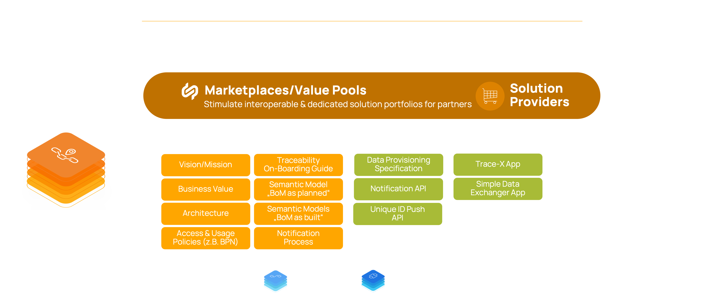

### Traceability KIT
<!--
Adoption View of the Kit.
-->

<!-- !Mandatory! -->
## Vision & Mission

### Vision

The aim of the Traceability KIT is to trace parts and materials across the entire value chain to enable data driven use cases over all n-tier levels without compromising data sovereignty. This KIT enables data and app providers to deliver solutions for building data chains and to send quality notifications on all levels and industries.

### Mission

The Traceability KIT provides the necessary standards, aspect models, APIs, logics, and processes on how to build a data sovereign data chain and send quality notifications. This is done via the standardized creation of digital twins of components and vehicles as well as the logical linking to their sub-components (Bill of Material, BoM). The default visibility of digital twins and their respective semantic models follows the one-up/one-down principle. This enables businesses to track and trace products, components, material, and software along the value chain for all product lifecycle stages.

All described specifications in the KIT are based on Catena-X standards like Data Space Connector, Asset Administration Shell (AAS), and Digital Twin Registry (DTR). They refer to other Catena-X KITs like the Connector KIT (EDC), Data Chain KIT (Item Relation Ship, IRS) and Business Partner KIT to ensure interoperability and data sovereignty according to IDSA and Gaia-X principles.

Furthermore, APIs and data models enable partners to send quality notifications in a standardized way while already knowing which parts of their direct customer and suppliers are affected and which are not. Moreover, the KIT is compatible with the data chain KIT to allow apps and business to traverse through the data chains over n-tier levels to enable further use cases like Circular Economy.

In the current version, the KIT supports the creation of data chains for the life cycle contexts “as built” and “as planned”. Further lifecycle contexts, e.g., as maintained will be supported in the future. Overall, the KIT represents the backbone to build data chains for use cases based on vehicles and parts. It empowers app providers to develop a Catena-X Traceability application and data provider to implement their digital twins and the connection to their subcomponents themselves.

### Customer Journey

With the Traceability KIT, we support the Catena-X customer journey for our adopters and solutions providers.



<!-- !Mandatory! -->
## Business Value

Through the standardized specifications described in the “Traceability-KIT” – for example the semantic models and APIs – application and service providers can reduce investment and implementation costs to integrate new Catena-X services. Furthermore, application and service providers can enter potential new markets within the PLM & Quality domain. Data Provider and Businesses are able to build data sovereign data chains to enable data driven use – also for other domains like sustainability.

<!-- !Mandatory! -->
## Use Case

### Status Quo / Today’s challenge

From Traceability's perspective, the main challenge within the automotive industry is to define and implement inter-organizational end-to-end data chains across the whole automotive supply chain to empower data driven use cases. Details regarding the challenges are:

- Missing standards to trace serialized and non-serialized hardware and software components. This includes the datatype, data format and data description (semantics) as well as the data exchange. The existing regulatory requirements that every company within the industry faces today are being solved with individual, proprietary solutions.

- The digital maturity is diverging within the automotive industry. For bigger companies it is a challenge to receive overall structured data from multiple different suppliers on a broad scale. Smaller companies struggle to generate and provide those data in a fully digitized way.

- Current solutions are either costly due to expensive distributed ledgers or cannot guarantee trust and data sovereignty based on the GAIA-X and IDSA principles including the regulation of access and usage policies regarding data chains. Therefore, no end-to-end data exchange and cooperation has been achieved as of today.

### Benefits

#### OEM and large automotive suppliers

For OEM and large automotive suppliers: The Traceability solution from Catena-X enables companies to identify products affected by a defect faster and more precisely and thus avoiding general and inaccurate recalls. Through this targeted containment, companies can save both time and money with fewer actions for their customers. Moreover, the Traceability solution enables businesses to rapidly identify the affected part and the corresponding supplier after receiving an alert from the customer. This leads to faster and, therefore, cheaper problem-solving for all parties and less complicated claim management. Furthermore, suppliers can prove compliance of their supply chain to upcoming regulations such as the Supply Chain Act.

#### SME

The developed and simple-to-use Traceability solutions support SMEs in their mission to digitize the shop floor and communication with customers and suppliers. Today, in order to provide data to their customers and suppliers, SMEs are obligated to use several, proprietary B2B-interfaces from their customers. With Catena-X aiming to have only one digital interface for all customers and suppliers, it increases the ease of data exchange and saves IT resources. Furthermore, due to the Catena-X data sovereignty principles, all participants know what happens with their data. This increases trust in the data exchange.

#### Solution Provider

Solution providers have the potential to scale customer groups and access new market potentials via marketplace and shared service network.

### Example - Industry Problem

The KIT enables business to start Quality Investigations and send Quality Alerts in a standardized way while already knowing which parts of your direct customer and suppliers are affected and which are not.

Through the introduction of unique Catena-X IDs, companies can register digital twins for vehicles, products, components, and raw materials and uniquely identify them within the whole Catena-X ecosystem. Building on that, it is possible to interconnect the registered digital twins of different companies to create a coherent automotive data chain from end-to-end. Furthermore, those twins can easily be complemented with further data like material information to enable further use cases like Circular Economy.

<!-- Recommended -->
## Tutorials

The following video gives an overview of the presented Traceability Use Case.

<video controls style={{width:'100%'}} controlsList="nodownload">
  <source src="/video/traceability-video-9min-UT.mp4"/>
</video>

<!-- Optional -->
<!-- ## Whitepaper -->

<!-- Recommended -->
## Semantic Models

### Bill of Material (BoM)

A bill of material resembles the structure of an end product. It is a list of all raw materials, sub-assemblies and sub-components that are needed to manufacture the end procuct.
At Catena-X Traceability we consider more than one single BoM. The BoM changes during the lifecyle and therefore, we are talking about different BoMs in different lifecycles.

#### BoM Representations

##### Single-Level BOM

A single-level BOM represents one level of an assembly and does not include any lower-level subassemblies.

##### Multi-Level BOM

A Multi-Level Bill of Materials (BOM) is a [bill of materials (BOM)](https://www.bterrell.com/sage-accpac-erp/manufacturing/definition-multi-level-bom/definition-bom/) that lists the components, assemblies, and materials required to make a part. It provides a display of all components that are directly or indirectly used in a parent item. When an item is a subcomponent, blend, intermediate, etc., all of its components, including purchased parts and [raw materials](https://www.bterrell.com/sage-accpac-erp/manufacturing/definition-multi-level-bom/definition-bom/definition-raw-materials/), are also exhibited. A multilevel structure can be illustrated by a tree with several levels. A multi-level BOM is created by connecting a series of individual single level BOMs together.

##### Flattened BOM

Flattening BOM means the intermediate levels in the BOM are removed and the lowest level is directly connected to the highest level.

#### BoM Lifecycle Stages

BoM LifeCycleStage concept based on STEP AP242 with slight adoptions in layout & wording:

- Each instance can be identified by unique (within the organization) serial number (SN).
- The ‘multi-SN’ (multi Serial number) describes product defined with a generic part or item
- The ‘one per SN’ (one per Serial number) describes product defined with an individual part or item

| Name |Identifier Step |Implemented CX |Identifier CX| Description |Purpose |Creating time of BoM | BoM Ausprägungen | one/more fix suppliers |
| :--- | :----:|:----: |:----: |:----: | :----: |:----: |:----: |:----: |
| **AsDesigned (AsDeveloped)** | multi-SN | Currently Not Implemented |Part number* <br />may not be the specific part number but a code that describes a part<br />(technische Produktbeschreibung)  |BoM asDesigned is generated in the design phase of a new product including alternative parts. |Build up the initial BoM in design phase of a new automotive product including alternative parts<br />Expected to have research & development part descriptions instead of specific part numbers |starting 2 years before SoP (for e.g. of a new vehicle project) |150% incl. variants which will not be used later |partly known<br />can be open at this point of time |
| **AsPlanned** | multi-SN | **Implemented** |Part number|BoM AsPlanned is used to plan the manufacturing process including alternative parts. |BoM AsPlanned is used to plan manufacturing including alternative parts.<br />Sourcing will most likely be based on this (besides key parts which start earlier) |starting 1,5 years before building the first component |120% of all variants are covered, incl. possibly multiple suppliers for the same component |fixed suppliers, could be more than one supplier per part|
| **AsOrdered** | one per SN | Currently Not Implemented |Part number | BoM AsOrdered is used for manufacturing realization. | BoM that is used for manufacturing realization.<br /> This is the list of parts & components currently used for manufactoring after start of production (SOP) or shortly before.| fixed order<br />(production order or custom order)|100% exact order is known |fixed suppliers, could be more than one supplier per part|
| **AsBuilt** | one per SN | **Implemented**|Serial number / batch number | BoM AsBuilt describes a product as manufactured. | BoM as a component is built or manufactured.<br />During manufactoring of for e.g. a vehicle the serial numbers & batch numbers are documented (German: Verbaudokumentation).<br />This leads to one BoM per built car|during building process or directly after finishing|100% |one specific supplier|
| **AsSupported / AsFlying / AsMaintained / AsOperated** | one per SN | Currently Not Implemented |Serial number / batch number | BoM AsMaintained describes the product after purchasing by a customer and updates by maintenance. | BoM after for e.g. a vehicle was picked up by the customer. Changes to live cycle before may apply due to maintenance or repair work e.g. exchange of parts, liquids, ...|Starts when customer has picked up the product, updating if any change is done|100% inkl. replaced parts, incl. history of exchanged parts |one specific supplier|
| **AsRecycled** | - |Currently Not Implemented| Serial number / batch number | BoM AsRecycled describes the BoM after the recycling of the product. | Requirement for Batteries.||100% ||

Two of the considered BoMs are already implemented in the use case Traceability and will be described as follows.

### Overview "AsPlanned"

#### Short introduction: what is a BoM AsPlanned?

The BoM AsPlanned is the generic list of all possible catalogue parts & materials for a specific vehical project and the supply chain from OEM to raw material suppliers. The BoM is also called 120% which means that it includes alternative parts / materials (e.g. LED headlights and XENON headlights) and parts for certain markets. It will be set up way before Start of Production (SOP) and be updated if the contents are updated. It is used for Sourcing / Production Planning and always reflects the current state of parts / materials build into this specific vehicle project.

The BoM AsPlanned also includes all versions of parts like changed parts. It has to enable parts/materials provided from multiple manufacturers or the same manufacturer at different production sites. Additionally it must be possible to map relations of the same part/material to different customers.

The complexity of generic is much higher than BoM AsBuilt. It is used for technical topics, e.g., Supply Chain Act, DCM.

#### Definition Status of the BoM AsPlanned

Defined

- Digital Twins
  - Digtial Twin "PartType"

- Traceability data aspect models
  - Aspect model "PartAsPlanned"
  - Aspect model "SingleLevelBoMAsPlanned"
  - Aspect model "SingelLevelUsageAsPlanned"
  - Aspect model "PartSiteInformationAsPlanned"

### AsPlanned Aspect Models

#### 1. PartAsPlanned

A Part as Planned represents an item in the Catena-X Bill of Material (BOM) in As-Planned lifecycle status in a specific version.

Github Link to semantic data model: [https://github.com/eclipse-tractusx/sldt-semantic-models/tree/main/io.catenax.part_as_planned/1.0.1](https://github.com/eclipse-tractusx/sldt-semantic-models/tree/main/io.catenax.part_as_planned/1.0.1)

#### 2. SingelLevelBomAsPlanned

The single-level Bill of Material represents one sub-level of an assembly and does not include any lower-level subassemblies. In as planned lifecycle state all variants are covered (\"120% BoM\"). If multiple versions of child parts exist that can be assembled into the same parent part, all versions of the child part are included in the BoM. If there are multiple suppliers for the same child part, each supplier has an entry for their child part in the BoM.

Github Link to semantic data model: [https://github.com/eclipse-tractusx/sldt-semantic-models/tree/main/io.catenax.single_level_bom_as_planned/1.1.0](https://github.com/eclipse-tractusx/sldt-semantic-models/tree/main/io.catenax.single_level_bom_as_planned/1.1.0)

#### 3. SingelLevelUsageAsPlanned

The aspect provides the information in which parent part(s)/product(s) the given item is assembled in. This could be a 1:1 relationship in terms of a e.g. a brake component or 1:n for e.g. coatings. The given item as well as the parent item must refer to an object from as planned lifecycle phase. If multiple versions of parent parts exist that the child part can be assembled into, all versions of the parent part are included in the usage list.

Github Link to semantic data model: [https://github.com/eclipse-tractusx/sldt-semantic-models/tree/main/io.catenax.single_level_usage_as_planned/1.1.0](https://github.com/eclipse-tractusx/sldt-semantic-models/tree/main/io.catenax.single_level_usage_as_planned/1.1.0)

#### 4. PartSiteInformationAsPlanned

The aspect provides site related information for a given as planned item (i.e. a part type or part instance that is uniquely identifiable within Catena-X via its Catena-X ID). A site is a delimited geographical area where a legal entity does business. In the \"as planned\" lifecycle context all potentially related sites are listed including all sites where e.g. production of this part (type) is planned.

Github Link to semantic data model: [https://github.com/eclipse-tractusx/sldt-semantic-models/tree/main/io.catenax.part_site_information_as_planned/1.0.0](https://github.com/eclipse-tractusx/sldt-semantic-models/tree/main/io.catenax.part_site_information_as_planned/1.0.0)

### Overview "AsBuilt"

#### Short introduction: what is a BoM AsBuilt?

A BoM AsBuilt resembles a single vehicle, which means that each vehicle built has its own individual BoM asBuilt. The BoM includes all part/components which either have a serial number, batch number, JIS number (sequence number) or a combination out of these. This means, that there is a direct and specific connection between a parent and a child part/component so that an accurate and exact traceability is possible.

Also, the BoM is called 100%, as there are no alternative parts included but only built parts. Therefore, it will be set up when a part is produced and can be connected to its parent and child parts.

In Catena-X the BoM asBuilt is used for technical topics, e.g., Quality, Battery Passport (CE).

#### Definition Status of the BoM AsBuilt

Defined

- Digital Twins
  - Digital Twin Serialized Part
  - Digital Twin Batch
  - Digital Twin Vehicle
- Build up the basic chain
  - Aspect model "SerialPart"
  - Aspect model "AssemblyPartRelation"
  - Aspect model "Batch"
  - Aspect model "JustInSequencePart"
  - Aspect model "TractionBatteryCode"

### AsBuilt Aspect Models

#### 1. SerialPart

A serialized part is an instantiation of a (design-) part, where the particular instantiation can be uniquely identified by means of a serial numbers or a similar identifier (e.g. VAN) or a combination of multiple identifiers (e.g. combination of manufacturer, date and number)

Github Link to semantic data model: [https://github.com/eclipse-tractusx/sldt-semantic-models/tree/main/io.catenax.serial_part/1.0.1](https://github.com/eclipse-tractusx/sldt-semantic-models/tree/main/io.catenax.serial_part/1.0.1)

#### 2. SingleLevelBomAsBuilt

The aspect provides the child parts (one structural level down) which the given object assembles.

Github Link to semantic data model: [https://github.com/eclipse-tractusx/sldt-semantic-models/tree/main/io.catenax.single_level_bom_as_built/1.0.0](https://github.com/eclipse-tractusx/sldt-semantic-models/tree/main/io.catenax.single_level_bom_as_built/1.0.0)

#### 3. Batch

A batch is a quantity of (semi-) finished products or (raw) material product that have been produced under the same circumstances (e.g. same production location), as specified groups or amounts, within a certain time frame. Every batch can differ in the number or amount of products. Different batches can have varied specifications, e.g., different colors. A batch is identified via a Batch ID.

Github Link to semantic data model: [https://github.com/eclipse-tractusx/sldt-semantic-models/tree/main/io.catenax.batch/1.0.2](https://github.com/eclipse-tractusx/sldt-semantic-models/tree/main/io.catenax.batch/1.0.2)

#### 4. JustInSequencePart

A just-in-sequence part is an instantiation of a (design-) part, where the particular instantiation can be uniquely identified by means of a combination of several IDs related to a just-in-sequence process.

Github Link to semantic data model: [https://github.com/eclipse-tractusx/sldt-semantic-models/tree/main/io.catenax.just_in_sequence_part/1.0.0](https://github.com/eclipse-tractusx/sldt-semantic-models/tree/main/io.catenax.just_in_sequence_part/1.0.0)

#### 5. TractionBatteryCode

The aspect provides the information of the Traction battery code of a battery cell, a battery module or a battery pack according to the chinese standard GB/T 34014-2017. Furthermore, it provides the traction battery codes for the assembled sub parts of the component, e.g.  Traction battery code of a battery module plus all the traction battery codes of the assembled battery cells of this battery module.

Github Link to semantic data model: [https://github.com/eclipse-tractusx/sldt-semantic-models/tree/main/io.catenax.traction_battery_code/1.0.0](https://github.com/eclipse-tractusx/sldt-semantic-models/tree/main/io.catenax.traction_battery_code/1.0.0)

<!-- Recommended -->
## Logic & Schema

### Building Block Architecture Overview

This architecture overview only shows Catena-X Core Services that are directly accessed by Traceability components, e.g. the EDC is shown, but not the DAPS which is accessed by the EDC, but not directly by the Data Provisioning component.


#### Traceability Components

| Subsystem         | Description                                                                                                                                                                                                                                                                                                                                                                                                                                                                                                                                                                                                                                                                                                                                                                                                                            |
|:------------------|:---------------------------------------------------------------------------------------------------------------------------------------------------------------------------------------------------------------------------------------------------------------------------------------------------------------------------------------------------------------------------------------------------------------------------------------------------------------------------------------------------------------------------------------------------------------------------------------------------------------------------------------------------------------------------------------------------------------------------------------------------------------------------------------------------------------------------------------|
| Data Provisioning | This component provides a company's data to the Catena-X network by transforming it into the Catena-X format and publishing it. In Catena-X, data must be provided to the network based on existing standards from the other Kits. One example that can be used is the Connector Kit that builds a component based on the DSP protocol, e.g. the Connector of the Eclipse Dataspace Components (EDC). As standard for digital twins, the Asset Administration Shell standard is used - this is relevant for registering digital twins (in the Digital Twin Registry) as well as for providing digital twin data. The data format used for Traceability data is based on the BAMM aspects models published in the Semantic Hub.                                                                                                   |
| Traceability App  | Enables traceability functionalities like quality alerts or notifications. When a Traceability App fetches data for digital twins (submodels), there are two options:<ul><li>Directly access the partner's EDC and DTR to connect to other partner's EDC and retrieve the data from ther</li><li>Use a local IRS service to get the data and let the IRS handle the EDC and DTR communication.</li></ul>                                                                                                                                                                                                                                                                                                                                                                                     |
| Internal Systems  | Existing internal systems of a Catena-X partner which provide data to Traceability components.<ul><li>For Data Provisioning: The data provided to Catena-X via the EDC should be fetched from a partner's internal PLM and parts master data systems.</li><li>For Traceability Apps: A Traceability App may show more data to a user than just the data that is provided to Catena-X (and fetched via the Data Provisioning component). The business scope of COTS software is bigger than just Traceability and they have existing interfaces to fetch all data they need for their business functionality (and not only Traceability data).</li></ul>Both components can also send data back to internal systems. That's at the discretion of the Catena-X partner and neither required nor prohibited by the Traceability use case. |

#### Catena-X Core Services

| Subsystem                          | Description                                                                                                                                                                                                                                                                                                                                                                                                                                                                                                                                                                     |
|:-----------------------------------|:--------------------------------------------------------------------------------------------------------------------------------------------------------------------------------------------------------------------------------------------------------------------------------------------------------------------------------------------------------------------------------------------------------------------------------------------------------------------------------------------------------------------------------------------------------------------------------|
| Digital Twin Registry              | The Digital Twin Registry acts as an address book for Digital Twins. Data Providers register their Digital Twins in their own Digital Twin Registry. Data consumers query the Digital Twin Registries to find Digital Twins and interact with them further. A Digital Twin contains endpoint references to Submodel endpoints. Calling a Submodel endpoint returns data compliant to a semantic model. A semantic model describes the data that a Submodel endpoint returns.<br/><br/>[Repository of the Digital Twin Registry](https://github.com/eclipse-tractusx/sldt-digital-twin-registry). |
| Item Relationship Service (IRS)    | The IRS is providing a technical API Endpoint in the Catena-X Network, which builds an item tree representation of given digital twins stored across the industry. Therefore it is a key component for the Network to provide data chains along the value chain in the industry.<br/><br/>[Repository of the IRS](https://github.com/eclipse-tractusx/item-relationship-service).                                                                                                                                                                                                        |
| Eclipse Dataspace Components (EDC) | The Connector of the Eclipse Dataspace Components provides a framework for sovereign, inter-organizational data exchange. It will implement the International Data Spaces standard as well as relevant protocols associated with GAIA-X. The connector is designed in an extensible way in order to support alternative protocols and integrate in various ecosystems.<br/><br/>[Repository of the Catena-X specific EDC](https://github.com/eclipse-tractusx/tractusx-edc).                                                                                                       |
| Discovery Service                  | The EDC / dataspace discovery interface is a CX network public available endpoint which can get used to retrieve EDC endpoints and the related BPNs, as well as search for endpoints via the BPN.                                                                                                                                                                                                                                                                                                                                                                               |

<!-- Recommended -->
## Business Process

To enable data sovereignty, access and usage policies are important to protect the data assets of a data provider in the EDC, described in the following. Further details are described in the [CX - 0018 Sovereign Data Exchange](#standards) standard.

### Access Policies

To decide which company has access to the data assets, access policy should be used. Note that without protecting data assets with access policies, they become publicly available in the Catena-X network which is not recommended. Therefore, every asset should be protected and only be made available for specific companies, identified through their business partner number (BPN).

#### BPN Access Policy

This policy allows limiting access to a data offer based on a list of specific BPNs. This translates to the following functionality:

- The data offer creator will be able to create a policy listing all the BPN that can access the data offer
- This means that only the connectors registered in the Catena-X network with the BPN listed in the policy can see the data offer and accept it (for the creation of data contracts and subsequent data exchange)
<!-- - To fulfill the requirements of the **Supply Chain Act**, a NGO Trustee is introduced that is trusted by the complete supply chain to evaluate if an inquiring company is impacted by a specific ESS incident.
Every Trustee is represented in the Catena-X network as a general participant with a unique BPN. Further, the Trustee is allowed to use supplier relationships and BoM data beyond the one-up/one-down principle due to the legal regulations.
In order to grant access to the BoM as planned data assets, the Trustee's BPN must be mentioned in the policy. -->

Examples including a JSON payload for single and multiple BPN are described on [this page in the tractus-x EDC repository](https://github.com/eclipse-tractusx/tractusx-edc/tree/main/edc-extensions/bpn-validation) or in the [Business Partner Validation Extension part of the Connector Kit](../tractusx-edc/edc-extensions/business-partner-validation/).

### Usage Policies

To decide which company can use the data asset under specific conditions, usage policies (or contract policies) are used. Therefore, they are more specific than access policies and only used just after access is granted. Currently, the usage policies aren't technically enforced but based on a legal framework (keep this in mind when publishing data assets).

Policies are defined based on the [W3C ODRL format](https://www.w3.org/TR/odrl-model/). This allows a standardized way of formulating policy payloads. It further allows to stack different constraints with the `odrl:and` operator. Therefore, every data provider can decide on his or her own under which conditions their data assets are shared in the network. It is recommended to restrict the data usage for all traceability aspects. An example of one usage policy containing three different constraints is shown and described in the following:

```json
{
  "@context": {
    "odrl": http://www.w3.org/ns/odrl/2/
  },
  "@type": "PolicyDefinitionRequestDto",
  "@id": "<POLICY-ID>", // Important for the contract definition
  "policy": {
    "@type": "Policy",
    "odrl:permission": [
      {
        "odrl:action": "USE",
        "odrl:constraint": {
          "@type": "LogicalConstraint",
          "odrl:and": [ // All of the following three constraints have to be fullfilled (and, not or)
            // First constraint to verify the the Catena-X membership
            {
              "@type": "Constraint",
              "odrl:leftOperand": "Membership",
              "odrl:operator": {
                "@id": "odrl:eq"
              },
              "odrl:rightOperand": "active"
            },
            // Second constraint to verify if the framework agreement for the traceability use case is accepted
            {
              "@type": "Constraint",
              "odrl:leftOperand": "FrameworkAgreement.traceability",
              "odrl:operator": {
                "@id": "odrl:eq"
              },
              "odrl:rightOperand": "active"
            },
            // Third constraint to define the specific purpose, further detailed in the framework agreement
            {
              "@type": "Constraint",
              "odrl:leftOperand": "PURPOSE",
              "odrl:operator": {
                "@id": "odrl:eq"
              },
              "odrl:rightOperand": "<POSSIBLE-PURPOSE-STRING>" // See list in the framework agreement
            }
          ]
        }
      }
    ]
  }
}
```

#### Membership Policy

To verify the participants Catena-X membership, the `Membership` verifiable credential can be used. In case of a policy, the data can only be used from verified Catena-X members. The payload is shown in the first constraint-part of the example above and described in detail in the [EDC part of the SSI documentation](https://github.com/eclipse-tractusx/ssi-docu/blob/main/docs/architecture/cx-3-2/edc/policy.definitions.md#1-membership-constraint).

```json
{
  "@type": "Constraint",
  "odrl:leftOperand": "Membership",
  "odrl:operator": {
    "@id": "odrl:eq"
  },
  "odrl:rightOperand": "active"
}
```

#### Framework Agreement Policy

To verify if a participant accepted the framework agreement of a specific use case created by the [Catena-X association](https://catena-x.net/en/about-us/the-association), the `FrameworkAgreement.traceability` verifiable credential can be used for the traceability framework agreement. In case of a policy, the data can only be used from accepted and verified traceability framework agreement members. This is shown in the second constraint-part of the example above and described in detail in the [EDC part of the SSI documentation](https://github.com/eclipse-tractusx/ssi-docu/blob/main/docs/architecture/cx-3-2/edc/policy.definitions.md#35-traceability).

```json
{
  "@type": "Constraint",
  "odrl:leftOperand": "FrameworkAgreement.traceability",
  "odrl:operator": {
    "@id": "odrl:eq"
  },
  "odrl:rightOperand": "active"
}
```

#### Purpose-based Policy

To further restrict the data usage, a purpose-based policy can be used. If, for example, the purpose mentions a quality investigation, this means that the data usage is only allowed for handling and working on the quality investigation. All possible purposes and their meanings are defined in the traceability framework agreement. This allows to create a uniform understanding and a standardized set of payloads in the network by connecting technical strings to legal agreements.

It is highly recommended to only use this purpose-based policy together with the [Framework Agreement Policy](#framework-agreement-policy). Only with both together it can be ensured that the payload of the purpose policy is agreed by the other part and is based on the same set.

Details about the endpoint and payload can be found in the [Transfer Data sample in the tractus-x EDC repository](https://github.com/eclipse-tractusx/tractusx-edc/blob/main/docs/samples/Transfer%20Data.md#2-setup-data-offer) or in the [Connector Kit API documentation of the policy definition API](tractusx-edc/docs/kit/development-view/openAPI/management-api/policy-definition-api/create-policy-definition).

```json
{
  "@type": "Constraint",
  "odrl:leftOperand": "PURPOSE",
  "odrl:operator": {
    "@id": "odrl:eq"
  },
  "odrl:rightOperand": "<POSSIBLE-PURPOSE-STRING>"
}
```

The `<POSSIBLE-PURPOSE-STRING>` have to be replaced with one purpose string defined in the framework agreement.

### Contract Definitions

In the EDC, every policy is associated with a contract. Thus, a contract definition is needed. Details about the endpoint and payload can be found in the [Transfer Data sample in the tractus-x EDC repository](https://github.com/eclipse-tractusx/tractusx-edc/blob/main/docs/samples/Transfer%20Data.md#2-setup-data-offer) or in the [Connector Kit API documentation of the contract definition API](../tractusx-edc/docs/kit/development-view/openAPI/management-api/contract-definition-api/edc-contract-definition-api).

When using an above mentioned [Access Policy](#access-policies), their `id` needs to be included as a value of the `accessPolicyId` key in the contract definition. When using an above mentioned [Usage Policy](#usage-policies), their `id` needs to be included as a value of the `contractPolicyId` key in the contract definition.

### Verifiable Credentials

Verifiable Credentials (VC) are part of the Self-Sovereign Identity (SSI) standard by the W3C. Details about Catena-X specific VCs can be found in the [CX - 0016 Company Attribute Verification](#standards) standard. As mentioned there, it offers a `UseCaseFrameworkConditionCX` type allowing a data provider to check if specific conditions, like a signed use case contract as introduced in the [Purpose-base Usage Policy section](#purpose-based-policy), are agreed. Further technical documentation are presented in the [SSI Docu](https://github.com/eclipse-tractusx/ssi-docu/tree/main/docs/architecture) repository.

<!-- !Mandatory! -->
## Standards

Our relevant standards can be downloaded from the official [Catena-X Standard Library](https://catena-x.net/de/standard-library):

- [CX - 0018 Sovereign Data Exchange](https://catena-x.net/de/standard-library)
- [CX - 0019 Aspect Model: Serial Part](https://catena-x.net/de/standard-library)
- [CX - 0020 Aspect Model: Single Level BoMAsBuilt](https://catena-x.net/de/standard-library)
- [CX - 0021 Aspect Model: Batch](https://catena-x.net/de/standard-library)
- [CX - 0022 Notification Process](https://catena-x.net/de/standard-library)
- [CX - 0023 Notification API](https://catena-x.net/de/standard-library)
- [CX - 0042 Aspect Model: Single Level BomAsPlanned](https://catena-x.net/de/standard-library)
- [CX - 0043 Semantic Model: Part AsPlanned](https://catena-x.net/de/standard-library)
- [CX - 0093 Aspect Model TractionBatteryCode](https://catena-x.net/de/standard-library)
- [CX - 0094 Aspect Model Part Site Information AsPlanned](https://catena-x.net/de/standard-library)
