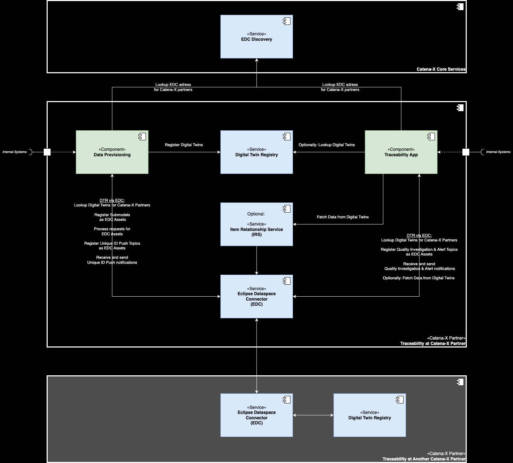
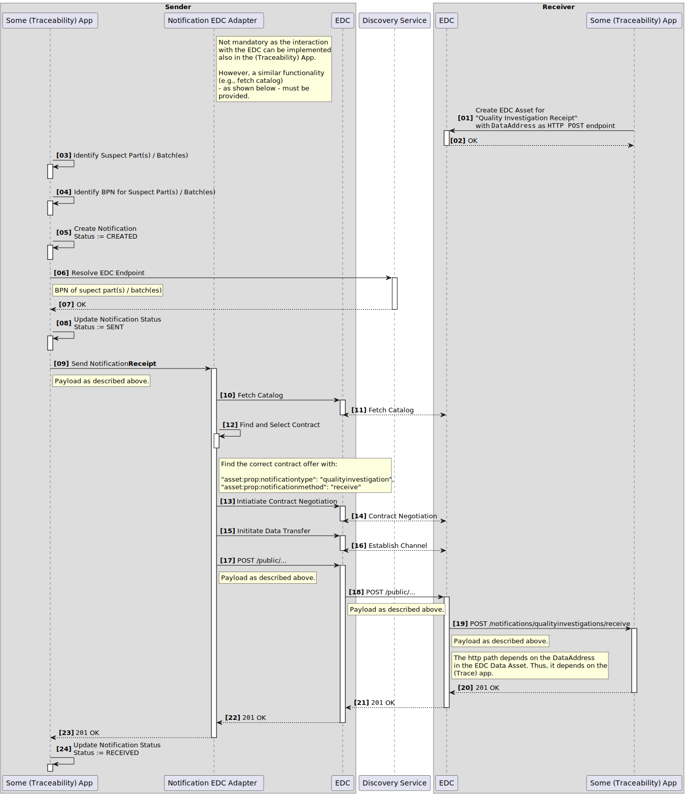
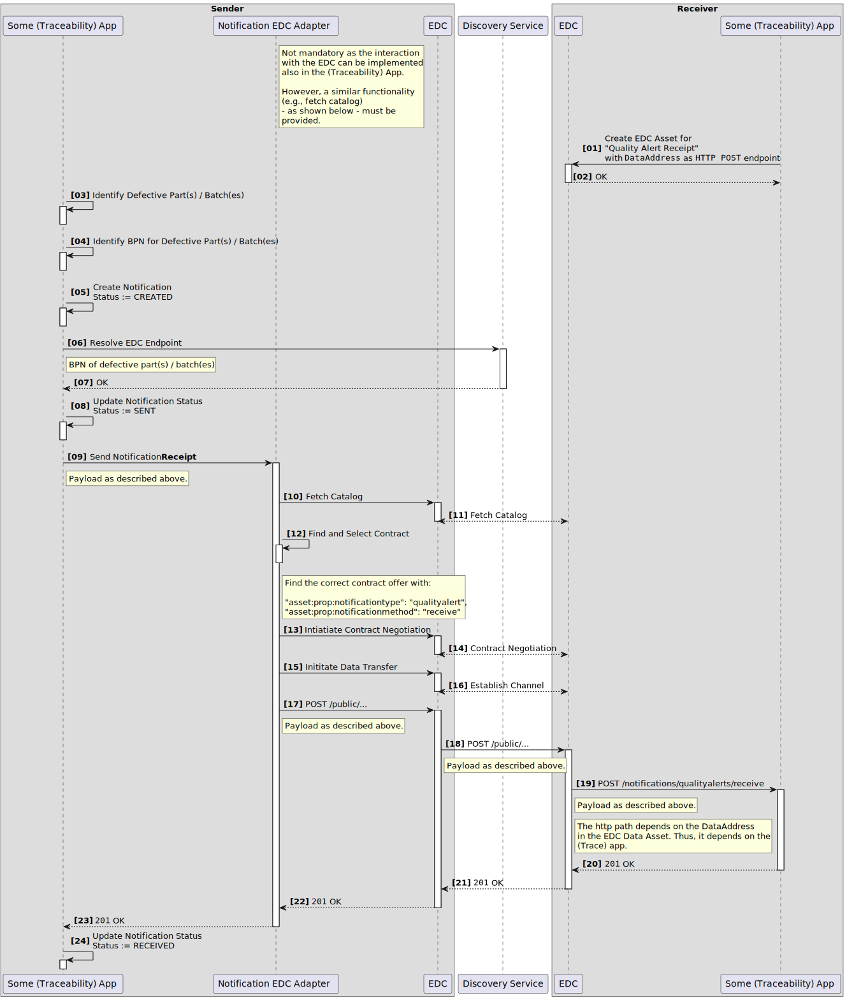
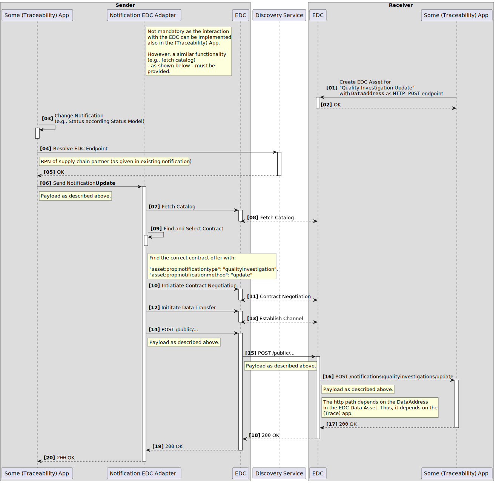
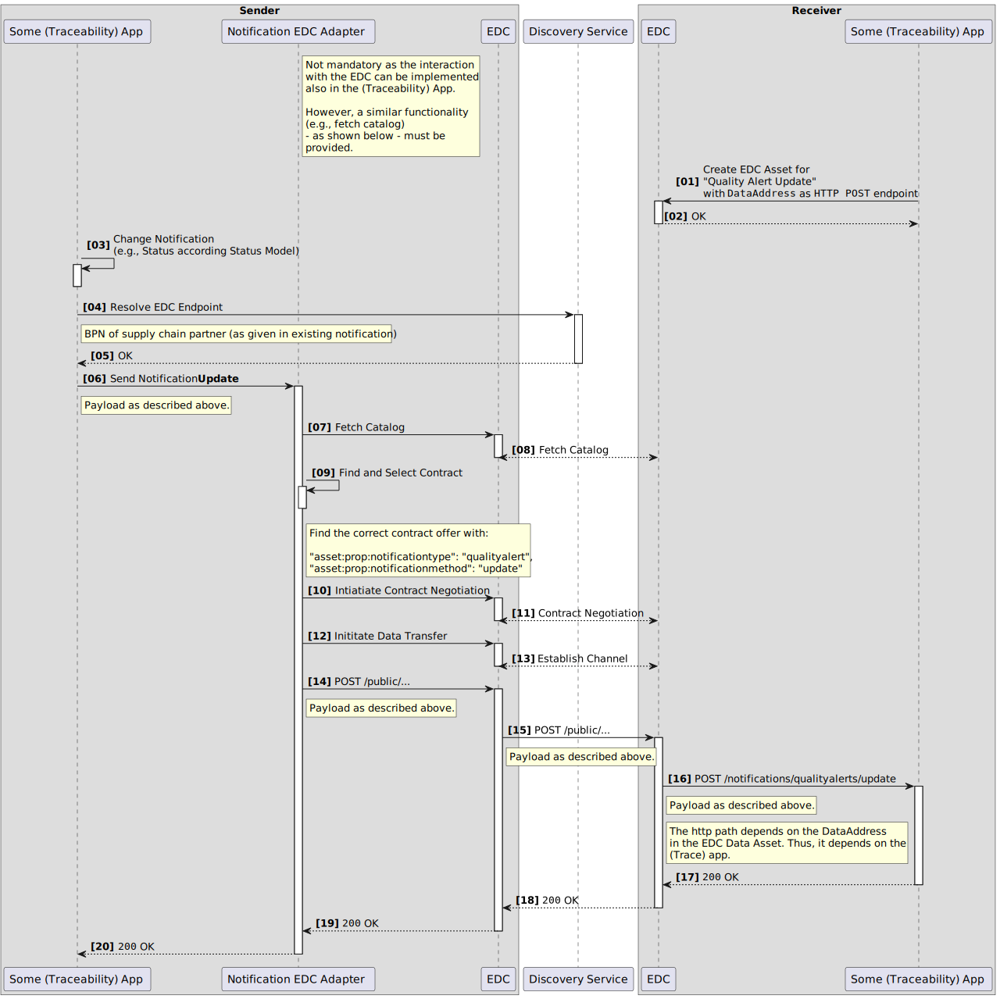

<!---
This work is licensed under the CC-BY-4.0 (https://creativecommons.org/licenses/by/4.0/legalcode).

- SPDX-License-Identifier: CC-BY-4.0
- SPDX-FileCopyrightText: 2023 - 2024 BASF SE
- SPDX-FileCopyrightText: 2023 - 2024 Bayerische Motoren Werke Aktiengesellschaft (BMW AG)
- SPDX-FileCopyrightText: 2023 - 2024 Fraunhofer-Gesellschaft zur Foerderung der angewandten Forschung e.V. (represented by Fraunhofer ISST & Fraunhofer IML)
- SPDX-FileCopyrightText: 2023 - 2024 German Edge Cloud GmbH & Co. KG
- SPDX-FileCopyrightText: 2023 - 2024 Mercedes Benz AG
- SPDX-FileCopyrightText: 2023 - 2024 Robert Bosch Manufacturing Solutions GmbH
- SPDX-FileCopyrightText: 2023 - 2024 SAP SE
- SPDX-FileCopyrightText: 2023 - 2024 Siemens AG
- SPDX-FileCopyrightText: 2023 - 2024 T-Systems International GmbH
- SPDX-FileCopyrightText: 2023 - 2024 ZF Friedrichshafen AG
- SPDX-FileCopyrightText: 2023 - 2024 Contributors to the Eclipse Foundation
- Source URL: https://github.com/eclipse-tractusx/eclipse-tractusx.github.io/tree/main/docs-kits/kits/Traceability%20Kit (latest version)
--->

import Notice from './part_notice.mdx'

The following page offers an architecture perspective including the main building blocks and information regarding communication between different components, shown as sequence diagrams in a runtime view.

The architecture of Traceability is built upon several other components of Catena-X. You need to be familiar with these components to understand the Traceability architecture:

- Industry Core for a basic understanding of digital twins and aspect models,
- Asset Administration Shell (AAS) as the underlying standard for digital twins,
- Digital Twin Registry (DTR) as the main service to store, publish, and search digital twins, and
- Eclipse Dataspace Connector (EDC) as the central data exchange infrastructure of Catena-X.

Additionally you might make yourself familiar with
- Item Relationship Service for traversing digital twin data chains based on the Data Chain Template,
- EDC Discovery for finding the EDC of a Catena-X partner, and
- SAMM as the modelling standard for aspect models.

## Scope and Context

This KIT describes two core capabilties of Traceability: 
- Data Provisioning: This capability focusses on how data providers must prepare and publish their data (from their internal systems) to participate in the Traceability use case (and other use cases that want to use Traceability data).
- Traceability App: This capability defines what mandatory features a Traceability app must provide and how to implement them to be interoperable with other Traceability apps. Additionally, optional features of Traceability apps are also included. This information is used by software vendors to develop Traceability-compliant apps for Catena-X.

## Building Block View

This overview shows the two core capabilities of Traceabilty and the Catena-X Core Services onto which Traceability is built and which are required by the Traceability architecture.

### Traceability Components

| Subsystem         | Description                                                                                                                                                                                                                                                                                                                                                                                                                                                                                                                                                                                                                                                                                                                                                                                                                            |
|:------------------|:---------------------------------------------------------------------------------------------------------------------------------------------------------------------------------------------------------------------------------------------------------------------------------------------------------------------------------------------------------------------------------------------------------------------------------------------------------------------------------------------------------------------------------------------------------------------------------------------------------------------------------------------------------------------------------------------------------------------------------------------------------------------------------------------------------------------------------------|
| Data Provisioning | This component extracts data from a company's internal systems,  transforms it into digital twins, and publishes these digital twins in the DTR and their data in the EDC (as submodels, based on aspect models). The published data is used by Traceability apps as well as other use cases that require Traceabiilty data. |
| Traceability App  | A Traceability app has two core functionalities:<ul><li>providing an UI to show the parts manufactured by a company and published as digital twins</li><li>create and process quality alerts and quality investigations for quality actions</li></ul>|
| Internal Systems  | These are existing internal systems of a Catena-X partner which provides data to Traceability components, e.g.,<ul><li>for data provisioning: The data provided to Catena-X is fetched from a partner's internal PLM and parts master data systems.</li><li>for Traceability apps: A Traceability app may show more data to a user than just the data that is provided to Catena-X. Generally, the business scope of COTS software is bigger than just Traceability and they have existing interfaces to fetch all data they need for their business functionality (and not only Traceability data).</li></ul>Both components can also send data back to internal systems. That's at the discretion of the Catena-X partner and neither required nor prohibited by the Traceability use case. |

### Catena-X Core Services

| Subsystem                          | Description                                                                                                                                                                                                                                                                                                                                                                                                                                                                                                                                                                     |
|:-----------------------------------|:--------------------------------------------------------------------------------------------------------------------------------------------------------------------------------------------------------------------------------------------------------------------------------------------------------------------------------------------------------------------------------------------------------------------------------------------------------------------------------------------------------------------------------------------------------------------------------|
| [Digital Twin Registry (DTR)](https://eclipse-tractusx.github.io/docs-kits/category/digital-twin-kit) | The Digital Twin Registry acts as an address book for digital twins. Data Providers register their digital twins in their own DTR. Data consumers query a DTR to find digital twins and interact with them further, i.e., fetch data for a digtil twin. |
| [Item Relationship Service (IRS)](https://eclipse-tractusx.github.io/docs-kits/category/data-chain-kit/)    | The IRS builds a digital representation of a product (digital twin) and the relationships of items the product consists of in a hierarchical structure. The result is an item graph in which each node represents a digital item of the product - this graph is called "Item Graph".|
| [Eclipse Dataspace Components (EDC)](https://eclipse-tractusx.github.io/docs-kits/category/connector-kit) | The EDC as a connector implements a framework agreement for sovereign, cross-organizational data exchange. The International Data Spaces Standard (IDS) and relevant principles in connection with GAIA-X were implemented. The connector is designed to be extensible to support alternative protocols and to be integrated into different ecosystems.|
| [Discovery Service](https://eclipse-tractusx.github.io/docs-kits/kits/Digital%20Twin%20Kit/Software%20Development%20View/Specification%20Digital%20Twin%20KIT#discovery-sequence)| The EDC / dataspace discovery interface is a CX network public available endpoint which can get used to retrieve EDC endpoints and the related BPNs, as well as search for endpoints via the BPN.    |

## Data Provisioning

This capability focusses on how data providers must prepare and publish their data (from their internal systems) to participate in the Traceability use case (and other use cases that want to use Traceability data).

### Basic Data Processing Flow

The following diagram shows a basic data processing flow how a company's internal data can be transformed into a Traceability-compliant format. Implementations of data providers can deviate from this basic flow as it's just one way to do it. But it should give a basic idea what the essential steps are.

### Digital Twins and Aspect Models

Data provisioning of Traceabilty is built on the data provisioning of the [Industry Core KIT](../Industry%20Core%20Kit/Architecture%20View%20Industry%20Core%20Kit), i.e., Traceability extends the digital twins PartType and PartInstance with additional aspect models:

- Digital Twin "PartType"

- Digital Twin "PartInstance"
  - Aspect model ["TractionBatteryCode"](../Traceability%20Kit/Software%20Development%20View/Data%20Provider%20Development%20View%20Traceability%20Kit#tractionbatterycode)

Details about these aspect models, i.e., the SAMM data model as well as example data, can be found in the [Developer View](../Traceability%20Kit/Software%20Development%20View/Data%20Provider%20Development%20View%20Traceability%20Kit).

### Policies

To enable data sovereignty, access and usage policies are important to protect the data assets of a data provider in the EDC, described in the following. Further details are described in the [CX - 0018 Sovereign Data Exchange](#standards) standard.

### Access Policies

To decide which company has access to the data assets, access policy should be used. Note that without protecting data assets with access policies, they become publicly available in the Catena-X network which is not recommended. Therefore, every asset should be protected and only be made available for specific companies, identified through their business partner number (BPN).

Implementation details and examples can be found [here](../Traceability%20Kit/Software%20Development%20View/Data%20Provider%20Development%20View%20Traceability%20Kit#access-policies).

### Usage Policies
To decide which company can use the data asset under specific conditions, usage policies (or contract policies) are used. Therefore, they are more specific than access policies and only used just after access is granted. Currently, the usage policies aren't technically enforced but based on a legal framework (keep this in mind when publishing data assets).

Implementation details and examples can be found [here](./Traceability%20Kit/Software%20Development%20View/Data%20Provider%20Development%20View%20Traceability%20Kit#usage-policies--contract-policies).

## Traceability App

This capability defines what mandatory features a Traceability app must provide and how to implement them to be interoperable with other Traceability apps. Additionally, optional features of Traceability apps are also included. This information is used by software vendors to develop Traceability-compliant apps for Catena-X.

### Functional Requirements

| Requirement | Mandatory | Description |
| :-- | :--: |:-- |
| Visualize Digital Twin Data	| Yes | A Traceability app must be able to visualize data from PartInstance digital twins. This data will also be used by quality investigations & alerts, so it's essential for a Traceability app. The data for the manufacturer's parts is retrieved from the manufacturer's internal systems; the data for built-in parts from suppliers must be retrieved from the supplier's EDC as this is a cross-company data transfer (if necessary). The data for the manufacturer's parts can be retrieved from a company's internal systems:<ul><li>via a dedicated interface for the Traceability app</li><li>via the EDC using the data also provided to other partner's in the Catena-X ecosystem</li></ul>It is not mandatory to use EDC to retrieve this data as this is not a cross-company data transfer, but a data transfer from one application of the company to another application of the company.  |
| Data Exchange via EDC	| Yes | The data exchange with other Catena-X partners (for Traceability partners, these are their customers and suppliers mostly) must be done via EDC. |
| Data Sovereignty | Yes | The usage of data in the Traceability app is compliant with the Access and Usage Policies as defined in this KIT.
| Quality Alerts | Yes | In the event of an incident the partner's value chain, the partner would like to be informed promptly and in a structured manner by the triggering partners (e.g., manufacturing problem, field problems) so that the partner can respond as quickly as possible (Supplier/Customer). In the same way, the partner wants to inform their value chain partners easily and specifically in the event of relevant incidents. The traceability apps are able to exchange the alerts in the same interoperable way. |
| Quality Investigations | Yes | For a given incident in a partner's supply chain, the partner would like to be able to narrow down the affected products as sharply as possible in order to carry out suitable actions in a targeted manner. The partners in the value chain use interoperable Traceability apps for this purpose.|

### Non-Functional Requirements

There are no non-functional requirements defined for this release.

### Quality Investigations & Quality Alerts

Notifications are - in contrast to classical data offers - a way to push data from a sender to a receiver. In the below paragraphs, the implementation is described to realize quality notifications. In that sense, the below specification has not the scope and intention to be a general solution pattern for notifications across various use cases. For now, it is limited to the sending and receiving of quality notifications as well as the update of the notification status (following a predefined status model).

> :raised_hand: Detailed Open API specifications for Quality Alerts & Investigations are available in the Software Development View. For the current release, [version 1.2.1](./openapi/notifications_1-2-1.yaml) is mandatory and must be supported by every App provider. The newer [version 2.0.0](./openapi/notifications_2-0-0.yaml) can be supported optionally.

#### Notification State Model

The notification itself has various states. The states and their cycle are described in the following figure:

## Runtime View

### Processes for Sending, Updating and Resolving Notifications

Below the sequence for sending, updating and resolving of notifications between (traceability) applications is shown with UML sequence diagrams. In all cases, Http POST requests are used. Those Http endpoints are described in the section (TRS) Quality Notification Endpoints and EDC Contract Offerings.

To read the UML sequence diagrams correctly, some remarks:

- The shown Notification EDC Adapter is not mandatory. It is just one option to send a notification via the EDC control and data plane. Important is that a similar functionality must be provided/implemented by the (traceability) application vendor. The Notification EDC Adapter or a similar component / functionality will not be provided as a central service from Catena-X.
- To know where a notification must be send to, the (traceability) application must resolve the BPN of the receiver. This can either be happen because the (traceability) application has this information in its data model or it could - alternatively - also be resolved e.g. via a lookup of the digital twin in the central asset administration shell (AAS) registry.

  :raised_hand: The (traceability) applications that fully rely on the AAS registry and the corresponding AAS submodels can only support quality investigations. With the release of the AAS submodel SingleLevelUsageAsBuilt or a similar AAS submodel that contains the information, which supply chain partner purchased/assembled a part / batch, it is possible to also support quality alerts for those (traceability) applications. (Warnung)
- The resolution of the EDC URL for a given BPN is done via the Discovery Service API. The entry for each EDC into this Discovery Service is done via the CX Portal.
- In each UML sequence diagram the step [01] describes the publishing of the notification endpoints as described in the above sections
- Similarly, the Http POST request and response bodies are described in the above sections

#### Sending and Receiving of a Quality Investigation

Below, the UML sequence diagram to send and receive a quality investigation is depicted. In addition to the above mentioned general remarks, the following remark:

#### Sending and Receiving of a Quality Alert

Below, the UML sequence diagram to send and receive a quality alert is depicted. In addition to the above mentioned general remarks, the following remark:

- The status transition from SENT to RECEIVED has to be done by the sender once it received the Http status code 201 from the receiver

#### Update of a Quality Investigation

Below, the UML sequence diagram to update a quality investigation is depicted.

#### Update of a Quality Alert

Below, the UML sequence diagram to update a quality alert is depicted.

## Standards

Our relevant standards can be downloaded from the official [Catena-X Standard Library](https://catena-x.net/de/standard-library):

- [CX - 0018 Sovereign Data Exchange](https://catena-x.net/fileadmin/user_upload/Standard-Bibliothek/Update_September23/CX-0018-EclipseDataConnector_EDC_-v.2.0.1.pdf)
- [CX - 0019 Aspect Model: Serial Part](https://catena-x.net/fileadmin/user_upload/Standard-Bibliothek/Update_September23/CX-0019-AspectModelSerialPart-v2.0.0.pdf)
- [CX - 0020 Aspect Model: Single Level BoMAsBuilt](https://catena-x.net/fileadmin/user_upload/Standard-Bibliothek/Update_September23/CX-0020-AspectModelSingleLevelBoMAsBuilt-v.2.0.0.pdf)
- [CX - 0021 Aspect Model: Batch](https://catena-x.net/fileadmin/user_upload/Standard-Bibliothek/Update_PDF_Maerz/PLM_Quality_Use_Case_Traceability/CX_-_0021__Batch_UseCaseTraceability_v_1.0.1.pdf)
- [CX - 0042 Aspect Model: Single Level BomAsPlanned](https://catena-x.net/fileadmin/user_upload/Standard-Bibliothek/Update_September23/CX-0042-AspectModelSingleLevelBomAsPlanned-v1.1.2.pdf)
- [CX - 0043 Semantic Model: PartAsPlanned](https://catena-x.net/fileadmin/user_upload/Standard-Bibliothek/Update_PDF_Maerz/PLM_Quality_Use_Case_Traceability/CX_-_0043_Semantic_Model_PartAsPlanned_v_1.0.1.pdf)
- [CX - 0093 Aspect Model Traction Battery Code](https://catena-x.net/fileadmin/user_upload/Standard-Bibliothek/Update_September23/CX-0093-AspectModelTractionBatteryCode-v1.0.0.pdf)
- [CX - 0094 Aspect Model PartSiteInformationAsPlanned](https://catena-x.net/fileadmin/user_upload/Standard-Bibliothek/Update_September23/CX-0094-AspectModelPartSiteInformationAsPlanned-v1.0.0.pdf)
- [CX - 0125 Traceability Use Case](https://catena-x.net/de/standard-library)
- [CX - 0127 Industry Core: Part Instance](https://catena-x.net/de/standard-library)

<Notice components={props.components} />
