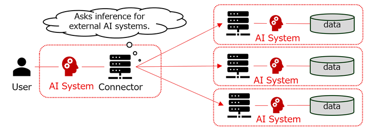

import Kit3DLogo from '@site/src/components/2.0/Kit3DLogo';

<Kit3DLogo kitId="ai-service" />

## Vision & Mission

### Vision

The AI Service KIT envisions a future where business processes are optimized through the collaboration of diversely specialized AI systems across various inter-company collaborations.
For achieving this vision, an ecosystem is needed where AI systems can collaborate while trusting each other.

The purpose of this KIT is to seamlessly integrate AI systems with Catena-X, a globally trusted collaborative data ecosystem.
This KIT provides a unified approach for publishing AI systems while maintaining data sovereignty and trust among participants, and ensuring compliance with legal and regulatory requirements.

### Mission

The mission of this KIT is to make the AI system bundled with participants' *EDC Connector* (Based on [Connector KIT](https://eclipse-tractusx.github.io/docs-kits/next/kits/connector-kit/adoption-view/)) discoverable and usable within the Catena-X ecosystem.

The AI service in this document is defined as a service that provides users with functionalities and/or value through the use of AI systems.

While there are a variety of ways to use AI systems in conjunction with dataspace, we discuss "AI agents", "Agentic System" that are connected **directly** to the EDC Connector.

AI systems, a part of AI service, directly connected to EDC Connectors can offer capabilities both **within** and **outside** automotive Use cases.

In either way, AI systems will be connected and be accessible via EDC Connectors.

AI systems exist in diverse forms, including LLMs (public and local), RAG applications that interact with LLMs, and AI agents that oversee them.
For enabling participants to recognize AI systems with such diverse forms, a unified notation method to express AI systems as *Assets* is necessary.
This KIT provides notation rules and vocabulary to serve as guidelines for participants when registering their AI systems as *Assets*.
This is similar to concepts found in existing AI frameworks, such as the A2A agent card and MCP registry. In fact, the KIT adopts these concepts and incorporates them into the dataspace framework.

Furthermore, AI systems involve numerous considerations for use due to their nature, such as AI-specific legal regulations and liability for damages resulting from judgment errors.
This KIT provides comprehensive notation rules and semantics for expressing these considerations as *Usage Policy*.

These contributions bring interoperability and governance to participants' AI systems in inter-company collaboration.

## Business Value

### Trust

The integration of Catena-X, a globally trusted collaborative data ecosystem, with AI systems brings trust to AI systems.
*EDC Connectors* robust participant identity verification mechanism makes it difficult for malicious actors to engage with the ecosystem surrounding the AI system.
It reduces the cost for business as well as academic organizations to verify the trustworthiness of AI system providers when considering the use of external AI systems.
It also reduces the security measures costs for business as well as academic organizations when exposing AI systems externally.

### Interoperability

*EDC Connectors* *Asset* representation capabilities possess sufficient flexibility to express AI systems with diverse forms.
While this flexibility enables acceptance of various systems, it also permits multiple representations for AI systems of the same form. This can sometimes make it difficult for business as well as academic organizations searching for external AI systems to correctly identify them.
Standardizing the notation of AI systems enables interoperability, allowing business as well as academic organizations to quickly discover suitable AI systems from the vast and diverse array of external AI systems.

### Risk Avoidance

Business as well as academic organizations considering AI system adoption must address AI-specific considerations, including compliance with AI-related laws, regulations, and guidelines such as the EU AI Act.
While thoroughly researching all relevant laws and guidelines is essential for risk mitigation, it represents a significant cost for business as well as academic organizations.
Standardizing *Usage policy* for AI systems reduces the cost for each business as well as academic organizations to research AI-specific considerations and facilitates the adoption of AI systems in business use cases involving multiple companies, such as supply chains.

## Notice

This work is licensed under the [CC-BY-4.0](https://creativecommons.org/licenses/by/4.0/legalcode).

- SPDX-License-Identifier: CC-BY-4.0
- SPDX-FileCopyrightText: 2026 FUJITSU LIMITED
- SPDX-FileCopyrightText: 2026 Contributors to the Eclipse Foundation
