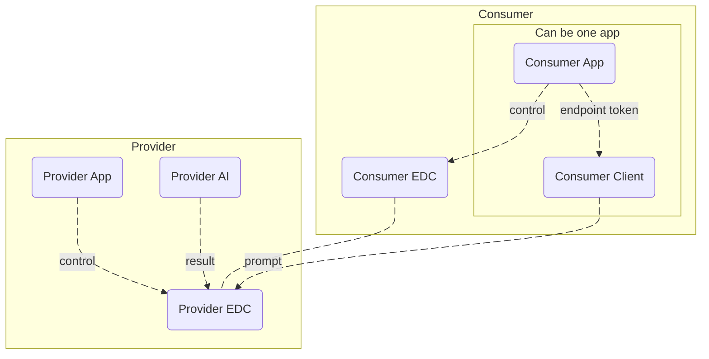
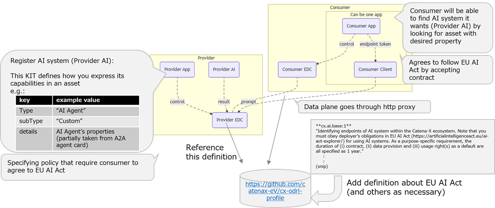

import Kit3DLogo from '@site/src/components/2.0/Kit3DLogo';

<Kit3DLogo kitId="ai-service" />

<!--
Development View of the Kit.
-->

## Introduction

Note: this development view is still a draft.

This KIT defines a standardized method for dataspace member organizations to expose their AI systems as APIs on the dataspace.
Users of these APIs exposed on the dataspace can discover the AI system's API using the EDC Connector API, then access it via HTTP after completing the access procedure.

While the existing EDC Connector could expose APIs accessible via HTTP, two challenges existed:

- There was no standardized format for the information that helps consumers find the desired AI system, making it difficult for applications to search automatically.

- Using an AI system required writing a contract to comply with each country's regulations and rules, but these rules were not defined.

The following two sections describe the proposed methods to address these challenges.

The configuration assumed in the following description is as follows:



The roles of each element in this diagram are as follows:

|||
|---|---|
|Provider App|Registers information to EDC Connector to expose the AI system. This may be integrated with the Provider AI.|
|Provider AI|Provides the AI system's functionality via an API|
|Provider EDC|The EDC Connector of the organization publishing the AI system|
|Consumer App|An application from another organization, which wants to use the exposed AI system|
|Consumer Client|The client connecting to the Provider AI. This may be integrated with the Consumer App|
|Consumer EDC|The EDC Connector of the organization, which wants to use the AI system|

For the `Consumer App` to use `Provider AI` in this configuration, the `Provider App` needs to publish `Provider AI` to the dataspace, and the `Consumer App` needs to follow the steps to discover and gain access to it.
Refer to the [Management API Overview](https://github.com/eclipse-tractusx/tractusx-edc/blob/main/docs/usage/management-api-walkthrough/README.md) for general procedures and the functionality of individual API calls.

The parts of this procedure relevant to this KIT are as follows:

- `create asset` step: The `Provider App` registers clues for the `Client App` to find `Provider AI` with EDC. See the [Creating an Asset of AI System](#creating-an-asset-of-ai-system) section for details.

- `create contract` step: The `Provider App` registers a contract with EDC that references AI-specific rules. For details, see [Creating a Usage Policy for AI System](#creating-a-usage-policy-for-ai-system).

By adding these properties and definition, consumer will be able to find AI system it wants, and then to agree to the Provider's request that it should follow the [EU AI Act](https://eur-lex.europa.eu/legal-content/EN/TXT/?uri=CELEX%3A32024R1689), for example.

[](../resources/img/concept-ai.png)

The figure shown above shows how the Provider and Consumer can use the definitions discussed in this KIT.

Note: data plane in the figure goes through http proxy, but this is not a requirement.

## Sample Data

### Creating an Asset of AI System

To register an AI system to EDC Connector, `Provider App` needs to `POST` a JSON object to `/v3/assets`. The JSON object needs the following property added to `properties` section:

```json
    "serviceOffering":{
      "type": "AI Agent",
      "subType": "Custom",
      "details": {
        "provider": "Company A",
        "agentSkill": "provide product data of Company A",
        "description": "Answer infromation regarding all products"
      }
```

Example of making a `POST` request to `/v3/assets`.

The [management-api-walkthrough](https://github.com/eclipse-tractusx/tractusx-edc/blob/main/docs/usage/management-api-walkthrough/01_assets.md#http-data-plane) page shows an example of registering an HTTP dataplane. Add the `serviceOffering` shown above to this properties section:

```json
{
  "@context": {
    "@vocab": "https://w3id.org/edc/v0.0.1/ns/",
    "cx-common": "https://w3id.org/catenax/ontology/common#",
    "cx-taxo": "https://w3id.org/catenax/taxonomy#",
    "dct": "http://purl.org/dc/terms/"
  },
  "@type": "Asset",
  "@id": "",
  "properties": {
    "dct:type": {
      "@id": "{{ _.asset_type }}"
    },
    "cx-common:version": "{{ _.asset_version }}",
    "serviceOffering":{
      "type": "AI Agent",
      "subType": "Custom",
      "details": {
        "provider": "Company A",
        "agentSkill": "provide product data of Company A",
        "description": "Answer infromation regarding all products"
      }
    }
  },
  "dataAddress": {
    "@type": "DataAddress",
    "type": "HttpData",
    "baseUrl": "https://mycorp.org/api",
    "oauth2:tokenUrl": "{{ _.url_keycl_backend }}",
    "oauth2:clientId": "{{ _.client_id_backend }}",
    "oauth2:clientSecretKey": "{{ _.sec_name_vault }}",
    "proxyQueryParams": "true",
    "proxyPath": "false",
    "proxyMethod": "true",
    "header:customHeaderKey": "custom-header-value"
  }
}
```

When a Consumer App [requests a catalog](https://github.com/eclipse-tractusx/tractusx-edc/blob/main/docs/usage/management-api-walkthrough/04_catalog.md), it receives a catalog containing AI assets. The asset includes the following information, which can be used by the application to find the AI application:

```json
    "serviceOffering": {
      "type": "AI Agent",
      "subType": "Custom",
      "details": {
        "provider": "Company A",
        "agentSkill": "provide product data of Company A",
        "description": "Answer infromation regarding all products"
      }
    }
```

The keywords used for this `serviceOffering` should utilize the [W3C Data Catalog Vocabulary (DCAT) - Version 3](https://www.w3.org/TR/vocab-dcat-3/) as much as possible.

The `serviceOffering` property includes these properties:

|key|JSON data types of its value|possible values|
|---|---|---|
|`type`|string|“AI Agent” in case of AI Agent. Future can be “Fed Learning”|
|`subType`|string|“Custom”, “MCP”, “A2A”, etc.|
|`details`|object||

The `type` property can have one of the following values:

|value|purpose|
|---|---|
|`AI Agent`|AI Agent|
|`Fed Learning`|Federated Learning|

The `subType` property can have one of the following values:

|value|purpose|
|---|---|
|`Custom`|for a custom protocol|
|`MCP`|[Model Context Protocol (MCP)](https://modelcontextprotocol.io/docs/getting-started/intro)|
|`A2A`|[Agent2Agent (A2A) Protocol](https://a2a-protocol.org/latest/)|

`details` property may have an object containing any kinds of properties.

## Creating a Usage Policy for AI System

When utilizing AI, aspects such as safety, transparency, ethics, and privacy protection are of critical importance, and AI regulations addressing these concerns are established across different regions and countries. These regulations must be observed by all parties involved, including data providers, data users (AI system developers and AI users). Therefore, compliance with AI regulations is essential when using the AI Service KIT. Below is an explanation of how AI regulations are applied within EDC.

### *List of AI-related Laws and Regulations by Country/Region

| Region/Country | Law / Policy Name |
|----------------|-------------------|
| EU | [Artificial Intelligence Act (AI Act)](https://artificialintelligenceact.eu/ai-act-explorer/)|
| US | [AI Bill of Rights (2022)](https://bidenwhitehouse.archives.gov/ostp/ai-bill-of-rights/)|
| CN | [Cyberspace Administration of China (CAC): Interim Measures (2023)](https://www.cac.gov.cn/2023-07/13/c_1690898327029107.htm)|
| JP | [Social Principles of Human-Centric AI](https://www.cas.go.jp/jp/seisaku/jinkouchinou/pdf/humancentricai.pdf) |
| GB | [Pro-innovation AI Regulation Framework](https://www.gov.uk/government/publications/ai-regulation-a-pro-innovation-approach) |

### Registration in EDC Connector

When offering AI-related services through EDC Connector, it is necessary to define and register the application of AI regulations from various countries within the Usage Policies section of the EDC Connector contract. Below is an example of how such Usage Policies can be defined.

### Usage Policies

The following is a sample policy using the EU AI Regulation (AI Act) as an example. This policy does not detail the specific contents of the AI regulations, but rather indicates compliance with them. The detailed requirements must be defined by system developers and other stakeholders in accordance with the regulations of each respective country.

Here's an example

```json
{
  "@context": [
    "http://www.w3.org/ns/odrl.jsonld",
    "https://w3id.org/catenax/2025/9/policy/context.jsonld",
    {
      "@vocab": "https://w3id.org/edc/v0.0.1/ns/"
    }
  ],
  "@type": "PolicyDefinition",
  "@id": "CHANGE-ME",
  "policy": {
    "@type": "Set",
    "permission": [
      {
        "action": "use",
        "constraint": [
          {
            "and": [
              {
                "leftOperand": "Membership",
                "operator": "eq",
                "rightOperand": "active"
              },
              {
                "leftOperand": "UsagePurpose",
                "operator": "isAnyOf",
                "rightOperand": "cx.ai.base:1"
                
              },
              {
                "leftOperand": "FrameworkAgreement",
                "operator": "eq",
                "rightOperand": "DataExchangeGovernance:1.0"
              }
            ]
          }
        ]
      }
    ],
    "obligation": [],
    "prohibition": []
  }
}
```

The expression rightOperand: "cx.ai.base:1" indicates that data usage is permitted only when it aligns with the purpose defined as "cx.ai.base:1". This purpose requires the data consumer to comply with the obligations of ["deployer"](https://artificialintelligenceact.eu/article/3/) as stipulated in the AI Act.

Note: the "cx.ai.base:1" mentioned in the example and the description above is under discussion and not defined yet. Please be reminded that you may not use this value at the moment.

## Notice

This work is licensed under the [CC-BY-4.0](https://creativecommons.org/licenses/by/4.0/legalcode).

- SPDX-License-Identifier: CC-BY-4.0
- SPDX-FileCopyrightText: 2026 FUJITSU LIMITED
- SPDX-FileCopyrightText: 2026 Contributors to the Eclipse Foundation
