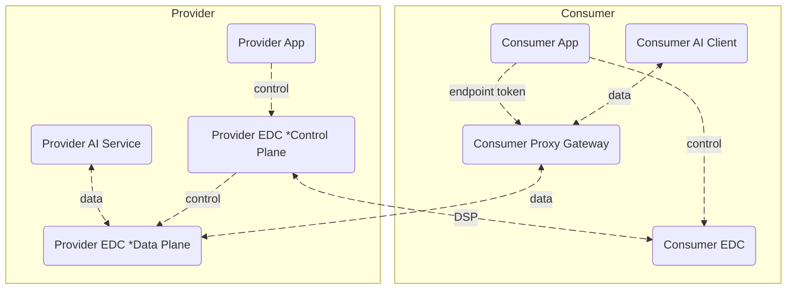

import Kit3DLogo from '@site/src/components/2.0/Kit3DLogo';

<Kit3DLogo kitId="ai-service" />

<!--
Development View of the Kit.
-->

## Introduction

AI Service KIT definition currently includes the following:

1. Asset Property definition for AI Service (extension to DCAT)

2. Usage Policy definition for AI Service

You can use and implement each one together or separately, depending on the requirement.

## 1. Asset property definition for AI Service

AI Service KIT defines a standardized method for dataspace participants to expose their AI systems as AI Services (Web APIs) in the dataspace ecosystem. [Data Spaces Protocol](https://eclipse-dataspace-protocol-base.github.io/DataspaceProtocol) exposes data as Asset/Catalog using DCAT as the base format. Since DCAT does not natively include AI Services, we need to extend it. This includes two parts:

- 1.1. Common data part. Strongly recommended to maintain interoperability.

- 1.2. Technology-dependent part. Based on the technology used, leverage the available format or a custom format.

### 1.1. Common Data Part

This part distinguishes AI Service KIT from other implementations and indicates which technology is implemented in the asset/catalog.

We define the following:

|key|JSON data types|Description and/or possible values|
|---|---|---|
|`serviceOffering`|-|This is the root object in the data asset property|

The `serviceOffering` property includes the following:

|key|JSON data types|Description and/or possible values|
|---|---|---|
|`type`|string|“AI Agent” in case of an AI Agent. Future can be “Federated Learning”|
|`subType`|string|Implemented technology. “Custom”, “MCP”, “A2A”, etc.|
|`version` | string | Contains the version of subType (optional)|
|`details`|object|This contain Technology Dependent Part. See below|

### 1.2. Technology Dependent Part

This part depends on the technology being used. At this time of writing, several available technologies are:

|Name (link)|Description|
|---|---|
|[A2A AgentCard](https://docs.agntcy.org/oasf/open-agentic-schema-framework/)|A2A Protocol |
|[AI Catalog](https://ai-catalog.io/)|AI Catalog, also used in [ARD, Agentic Resource Directory](https://ardregistry.org/)|
|[OASF](https://docs.agntcy.org/oasf/open-agentic-schema-framework/)|Part of AGNTCY project. |
|[AICat](https://delaramglp.github.io/aicat/)|Proposed Draft for AI Catalogue Application Profile(AICAT), mentioned in this [paper](https://arxiv.org/html/2501.04014v1)|

Note: The above syntax is in JSON format, so you can incorporate it into DCAT, which is also JSON. (AICat is indeed a special extension to DCAT). For non-JSON formats, you can encode it into BASE64.

### Example

The following examples are the parts that define serviceOffering below. You can include this in the property when registering an Asset on the provider.

1. Click to show example for A2A

<pre>
"serviceOffering": {
  "type": "AI Agent",
  "subtype": "A2A",
  "details": {
    {
  "name": "Carrier Delivery Coordination Agent",
  "description": "Negotiates delivery schedule adjustments with shipper-side agents under demand fluctuations, exchanging only proposal-level information to preserve data sovereignty.",
  "version": "1.2.0",
  "provider": {
    "name": "Acme Logistics KK",
    "url": "https://acme-logistics.example.com",
    "contact": "agents-support@acme-logistics.example.com"
  },
  "supportedInterfaces": [
    {
      "url": "https://agents.acme-logistics.example.com/a2a/v1",
      "protocolBinding": "HTTP+JSON",
      "protocolVersion": "0.3"
    }
  ],
  "capabilities": {
    "streaming": true,
    "pushNotifications": true,
    "extensions": [
      {
        "uri": "https://dataspace.example.org/extensions/incomplete-info-negotiation/v1",
        "description": "Supports proposal–response negotiation under incomplete information",
        "required": false
      }
    ]
  },
  "defaultInputModes": ["application/json", "text/plain"],
  "defaultOutputModes": ["application/json", "text/plain"],
  "skills": [
    {
      "id": "delivery-plan-negotiation",
      "name": "Delivery Plan Negotiation",
      "description": "Proposes and evaluates re-adjusted delivery schedules in response to demand surges, returning only acceptance/satisfaction signals rather than internal cost or capacity data.",
      "tags": ["logistics", "negotiation", "supply-chain"],
      "examples": [
        "Can you accommodate a 30% volume increase on route JP-OSK-TKY starting next Monday?",
        "Propose an alternative delivery window given a 2-day carrier capacity shortfall."
      ],
      "inputModes": ["application/json"],
      "outputModes": ["application/json"]
    },
    {
      "id": "capacity-status-query",
      "name": "Capacity Status Query",
      "description": "Reports abstracted capacity availability (e.g. available/constrained/unavailable) without disclosing underlying fleet or cost data.",
      "tags": ["logistics", "status"],
      "examples": ["What is your capacity status for cold-chain shipments this week?"],
      "inputModes": ["text/plain"],
      "outputModes": ["application/json"]
    }
  ],
  "securitySchemes": {
    "oauth2": {
      "type": "oauth2",
      "flows": {
        "clientCredentials": {
          "tokenUrl": "https://auth.acme-logistics.example.com/oauth/token",
          "scopes": {
            "negotiate": "Initiate and respond to delivery negotiations",
            "status:read": "Read capacity status"
          }
        }
      }
    }
  },
  "security": [{ "oauth2": ["negotiate", "status:read"] }]
}
  }
}
</pre>

2. Click to show example for AI Catalog

<pre>
"serviceOffering": {
  "type": "AI Agent",
  "subtype": "AI Catalog",
  "version": "1.0",
  "details": {
    {
      "specVersion": "1.0",
      "host": {
        "displayName": "Acme Corp",
        "identifier": "did:web:acme-corp.com"
      },
      "entries": [
        {
          "identifier": "urn:air:acme-corp.com:mcp:weather",
          "type": "application/mcp-server-card+json",
          "url": "https://api.acme-corp.com/mcp/server-card"
        },
        {
          "identifier": "urn:air:acme-corp.com:a2a:research",
          "type": "application/a2a-agent-card+json",
          "url": "https://agents.acme-corp.com/research"
        },
        {
          "identifier": "urn:air:acme-corp.com:catalog:finance",
          "displayName": "Finance Suite",
          "type": "application/ai-catalog+json",
          "url": "https://acme-corp.com/catalogs/finance.json"
        }
      ]
    }
  }
}
</pre>

3. Click to show example for OASF (A2A AI Agent)

<pre>
"serviceOffering": {
  "type": "AI Agent",
  "subtype": "OASF",
  "details": {
    {
      "name": "example-agent",
      "description": "An agent that performs web searches and extracts information.",
      "version": "1.0.0",
      "schema_version": "0.8.0",
      "authors": ["Acme Research Team <research@acme-corp.com>"],
      "created_at": "2026-08-20T00:00:00Z",
      "domains": [
        {"name": "technology/information_retrieval", "id": 1041}
      ],
      "skills": [
        {
          "id": "browser",
          "name": "browser automation",
          "description": "Performs web searches to retrieve information."
        }
      ],
      "locators": [
        {"type": "source_code", "urls": ["https://github.com/acme-corp/example-agent"]}
      ],
      "modules": [
        {
          "name": "integration/a2a",
          "data": {
            "url": "http://localhost:8000",
            "capabilities": {
              "streaming": true,
              "pushNotifications": false
            },
            "defaultInputModes": ["text"],
            "defaultOutputModes": ["text"]
          }
        }
      ]
    }
  }
}
</pre>

## 2. Usage Policy definition for AI Service

When using AI, safety, transparency, ethics, and privacy protection are critical, and AI regulations addressing these concerns vary by region and country. All parties involved must comply with these regulations, including data providers and data users (AI system developers and AI users). Therefore, compliance with AI regulations is essential when using the AI Service KIT. Below is an explanation of how EDC applies AI regulations.

### *List of AI-related Laws and Regulations by Country/Region

| Region/Country | Law / Policy Name |
|----------------|-------------------|
| EU | [Artificial Intelligence Act (AI Act)](https://artificialintelligenceact.eu/ai-act-explorer/), [Digital Omnibus on AI](https://artificialintelligenceact.eu/ai-act-explorer/digital-omnibus/)|
| US | [AI Bill of Rights (2022)](https://bidenwhitehouse.archives.gov/ostp/ai-bill-of-rights/)|
| CN | [Cyberspace Administration of China (CAC): Interim Measures (2023)](https://www.cac.gov.cn/2023-07/13/c_1690898327029107.htm)|
| JP | [Social Principles of Human-Centric AI](https://www.cas.go.jp/jp/seisaku/jinkouchinou/pdf/humancentricai.pdf) |
| GB | [Pro-innovation AI Regulation Framework](https://www.gov.uk/government/publications/ai-regulation-a-pro-innovation-approach) |

### Registration in EDC Connector

When offering AI-related services through EDC Connector, you must define and register the application of AI regulations from various countries in the Usage Policies section of the EDC Connector contract. Below is an example of how to define such Usage Policies.

### 2. Defining AI-Related Usage Policies

The following is a sample policy using the EU AI Regulation (AI Act) as an example. This policy does not detail the specific contents of the AI regulations; it indicates compliance. System developers and other stakeholders must define the detailed requirements in accordance with each country's regulations.

### 3. Example

Click to show the example

<pre>
{
  "@context": [
    "http://www.w3.org/ns/odrl.jsonld",
    "https://w3id.org/catenax/2025/9/policy/context.jsonld",
    {
      "@vocab": "https://w3id.org/edc/v0.0.1/ns/"
    }
  ],
  "@type": "PolicyDefinition",
  "@id": "CHANGE-ME",
  "policy": {
    "@type": "Set",
    "permission": [
      {
        "action": "use",
        "constraint": [
          {
            "and": [
              {
                "leftOperand": "Membership",
                "operator": "eq",
                "rightOperand": "active"
              },
              {
                "leftOperand": "UsagePurpose",
                "operator": "isAnyOf",
                "rightOperand": "cx.euaiact.base:1"
              },
              {
                "leftOperand": "FrameworkAgreement",
                "operator": "eq",
                "rightOperand": "DataExchangeGovernance:1.0"
              }
            ]
          }
        ]
      }
    ],
    "obligation": [],
    "prohibition": []
  }
}

The expression rightOperand: "cx.euaiact.base:1" indicates that data usage is permitted only when it aligns with the purpose defined as "cx.euaiact.base:1". This purpose requires the data consumer to comply with the obligations of ["deployer"](https://artificialintelligenceact.eu/article/3/) as stipulated in the AI Act.

Note: the "cx.euaiact.base:1" mentioned in the example and the description above is under discussion in Catena-X and not defined yet. You can also define your policy value when it is agreed between the participants.
</pre>

## System architecture

This KIT defines a standardized method for Data Spaces participant to expose their AI systems as APIs on the data space.
Understanding of how EDC works is required. The AI Service KIT is currently implemented using the HTTP Pull method, where the AI Service (Web API) is the HTTP Pull.

When HTTP Pull negotiation is complete, EDC returns the endpoint and access token so that the consumer can access the AI Service. Usually, you need to modify the current AI Service client to add this access token to the HTTP header. To make it easier for developers, we use API Gateway and its features to redirect to the endpoint and add the access token. This means the AI Service Client Application requires no changes.

The overall architecture is shown in the following diagram:

```mermaid
flowchart TD
  subgraph Consumer

  CApp(Consumer App)
  CAIClient(Consumer AI Client)
  CEDC(Consumer EDC)
  CProxy(Consumer Proxy Gateway)  
  end

  CApp lc1@-- control --> CEDC
  lc1@{ animate: true }
  CApp lc2@-- endpoint token --> CProxy
  lc2@{ animate: true }
  CAIClient lc3@<-- data --> CProxy
  lc3@{ animate: true }

  subgraph Provider
  PApp(Provider App)
  PAIService(Provider AI Service)
  PEDCCP(Provider EDC *Control Plane)
  PEDCDP(Provider EDC *Data Plane)
  end

  PApp lp1@-- control --> PEDCCP
  lp1@{ animate: true }
  PAIService lp2@<-- data --> PEDCDP
  lp2@{ animate: true }
  PEDCCP lp3@-- control --> PEDCDP
  lp3@{ animate: true } 

  PEDCCP l1@<-- DSP --> CEDC
  l1@{ animate: true}

  CProxy l0@<-- data --> PEDCDP
  l0@{ animate: true }
```

The roles of each element in this diagram are as follows:

|||
|---|---|
|Provider App|An Application on the provider that registers information with the EDC Connector to expose the AI Service.|
|Provider AI Service|Provides the AI Service functionality via a Web API|
|Provider EDC *Control Plane|The EDC Connector that feature all the management|
|Provider EDC *Data Plane|The EDC Connector that provide HTTP Pull method|
|Consumer App|An application on the consumer to control the consumer EDC|
|Consumer AI Client|The client connecting to the Provider AI|
|Consumer EDC|The EDC Connector of the organization that wants to use the AI system|
|Consumer Proxy Gateway|The EDC Connector of the organization, which wants to use the AI system|

The Provider AI Service can also connect to a backend database to provide product information to the consumer, add security guardrails, add monitoring, a payment gateway, etc. The diagram is simplified for easy understanding.
Refer to the [Management API Overview](https://github.com/eclipse-tractusx/tractusx-edc/blob/main/docs/usage/management-api-walkthrough/README.md) for general procedures and the functionality of individual API calls.

## Notice

This work is licensed under the [CC-BY-4.0](https://creativecommons.org/licenses/by/4.0/legalcode).

- SPDX-License-Identifier: CC-BY-4.0
- SPDX-FileCopyrightText: 2026 FUJITSU LIMITED
- SPDX-FileCopyrightText: 2026 Contributors to the Eclipse Foundation
