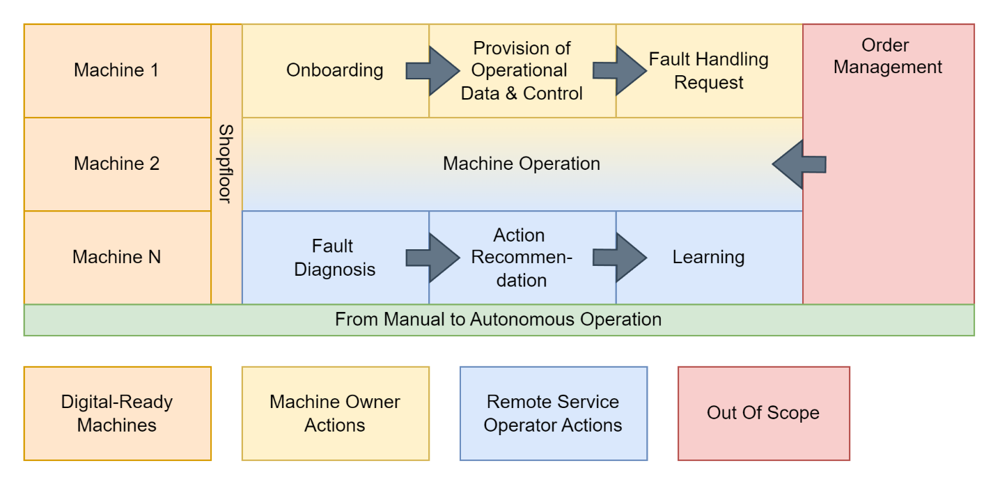

<!--
Copyright(c) 2026 Contributors to the Eclipse Foundation

See the NOTICE file(s) distributed with this work for additional
information regarding copyright ownership.

This work is made available under the terms of the
Creative Commons Attribution 4.0 International (CC-BY-4.0) license,
which is available at
https://creativecommons.org/licenses/by/4.0/legalcode.

SPDX-License-Identifier: CC-BY-4.0
-->

import Kit3DLogo from '@site/src/components/2.0/Kit3DLogo';

<Kit3DLogo kitId="autonomous-operation" />

## System Overview

Autonomous Operation and Remote Services (AORS) aims at keeping machine downtime minimal by accelerating the process to solve a faulty situation using knowledge of prior events as well as human ingenuity. One of the main "fault-to-solution" paths within AORS involves a Machine Operator diagnosing faulty situations remotely while only using machine data and video information.
The main chain of thought here is:

- Something goes wrong, the situation is transmitted to a remote operator
- The remote operator might gather further information and fault descriptions from vendors and suppliers
- The remote operator uses this information to deduct possible corrections and documents them
- The corrections are recommended/executed

The provided machine data as well as the basic procedure need to be presented in a standardized format, which is defined in this document.

The solution is structured along three operational phases and is supported by a set of modular applications that ensure continuity from setup to continuous improvement.

During **Onboarding**, the focus is on establishing a technical and informational foundation as well as a trusted communication layer to enable a remote operator to access and monitor a machine. This includes an information provision system (e.g., digital documentation, asset descriptions, configuration data), and integrated sensor technology for real-time telemetry and machine-state visibility. The establishment of trust ensures secure, policy-driven data exchange across different vendors, fostering interoperability, compliance, and confidence in the integrity of shared information. Together, these measures enable reliable machine operation and safe, remote access within a dataspace.

**Error Handling** provides the capabilities needed to diagnose, coordinate, and resolve incidents quickly. It combines AI-driven support, ERP-linked service processing (e.g., ticketing, spare parts, scheduling), structured knowledge sharing/provision, and—where permitted—remote control functionality to reduce downtime and dependency on onsite experts.

During the **Learning** phase, the system captures outcomes and decisions to improve future performance. A knowledge-capture application documents actions taken, alternatives considered, and effective remediation steps, building an organizational memory that continuously enhances operational processes and AI recommendations.

## Roles

This process leads to multiple different roles that exchange information via dataspace.

| Role | Description | Data-space relevance |
| ---- | ----------- | ---------------------|
| Machine Builder | Designs and delivers the machine, publishes the Type Asset Administration Shell (AAS), exposes interoperable interfaces and provides machine knowledge required for remote and autonomous operation. | Machine semantics, asset models, capabilities, baseline documentation and access to standardized interfaces. |
| Machine Owner | Purchases machines from the manufacturer and commissions machine operators to maintain and operate them, often due to skilled labor shortages. Grants machine operators permission to share service-relevant data with third parties for maintenance purposes. Machine operator identification and onboarding is conducted through physical processes. May commission a machine operator immediately after purchase or later to remotely manage and maintain the machine. Provides on-site technicians for tasks such as part replacements that do not require manufacturer service. | Policy definition, contract approval, production objectives, on-site safety oversight and escalation decisions. |
| Machine Operator | It is a company that provides services to the machine owner as well as Remote Service Operators to troubleshoot the machine remotely.  Receives the mandate from the machine owner to remotely manage the machine. Utilizes an operator panel that provides a consolidated overview of all critical machine information and operational parameters. Achieves scalability by integrating service providers through the data space ecosystem. These service providers systematically store data to enable progressive automation of operations and offer troubleshooting recommendations based on standardized formats. They also provide standardized interfaces to ERP systems that trigger service case creation. Collaborates with component suppliers, machine manufacturers, and sensor manufacturers to establish a comprehensive digital twin of the machine. Orchestrates services from service providers and component suppliers. Matches existing services at the machine owner's site with required services. | Asset publication, runtime monitoring, remote service orchestration and lifecycle management. |
| Remote Service Operator | Performs remote diagnostics, guided troubleshooting and – where permitted – remote intervention using standardized operator panels and contextual knowledge. | Fault triage, corrective action selection, session-based remote control and execution feedback. |
| Service Provider | Service Providers can be connected modularly. They are optional for the remote operation of a machine but mandatory for the autonomous operation of a machine. Due to standardized semantics, they are interoperable and flexible to use. The identified service providers for the autonomous operation of a machine are Knowledge Management Providers, Data Providers, e.g. from an ERP/MES System, and AI-Providers. Provides specialized services orchestrated by the machine operator to support remote and autonomous machine operations. | Model execution, ranking of options, diagnostic support and optimization services. |
| Knowledge Management Provider | Enables the capture, storage, and sharing of knowledge  Supports the documentation and retrieval of problem-solving knowledge across the system. | Knowledge artifacts,  indexed cases, feedback integration, recommendations and documentation. |
| Component Supplier | Supplies components (e.g., gearboxes, sensors) and related services that are integrated into the overall machine operation and maintenance process. Collaborates with machine operators to establish comprehensive digital twins. | Component interfaces, health indicators, diagnostics, calibration metadata and subsystem support. |
| ERP/MES Provider | Supports production-order, spare-parts and service workflows and synchronizes execution status with enterprise planning systems. | Production orders, availability, material data, service tickets, rescheduling and administrative processing. |
| On-Site Technician | Provided by the machine owner to perform physical tasks such as part replacements that do not require manufacturer service. | Safety-critical actions, replacement tasks, inspections and confirmation of field outcomes. |

## NOTICE

This work is licensed under the [CC-BY-4.0](https://creativecommons.org/licenses/by/4.0/legalcode).

- SPDX-License-Identifier: CC-BY-4.0
- SPDX-FileCopyrightText: 2026 DMG MORI AG
- SPDX-FileCopyrightText: 2026 Empolis Information Management GmbH
- SPDX-FileCopyrightText: 2026 IFW Leibniz Universität Hannover
- SPDX-FileCopyrightText: 2026 inovex GmbH
- SPDX-FileCopyrightText: 2026 prenode GmbH
- SPDX-FileCopyrightText: 2026 proALPHA GmbH
- SPDX-FileCopyrightText: 2026 Siemens AG
- SPDX-FileCopyrightText: 2026 Technologie-Initiative SmartFactory KL e. V.
- SPDX-FileCopyrightText: 2026 TRUMPF Werkzeugmaschinen SE + Co. KG
- SPDX-FileCopyrightText: 2026 VDMA e. V.
- SPDX-FileCopyrightText: 2026 WITTENSTEIN SE
- SPDX-FileCopyrightText: 2026 Contributors to the Eclipse Foundation
- Source URL: [https://github.com/eclipse-tractusx/eclipse-tractusx.github.io](https://github.com/eclipse-tractusx/eclipse-tractusx.github.io)
