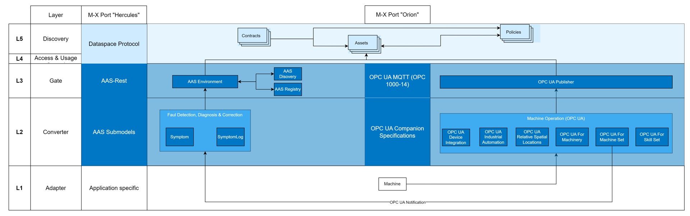
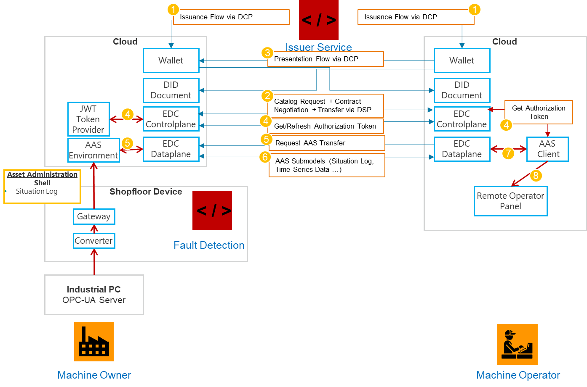
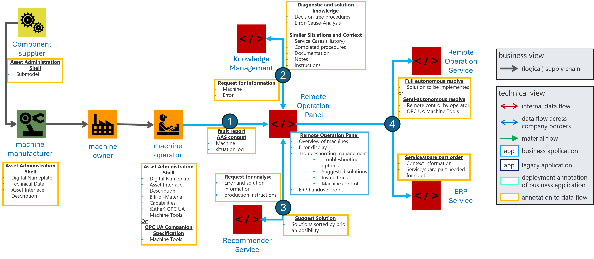

<!--
Copyright(c) 2026 Contributors to the Eclipse Foundation

See the NOTICE file(s) distributed with this work for additional
information regarding copyright ownership.

This work is made available under the terms of the
Creative Commons Attribution 4.0 International (CC-BY-4.0) license,
which is available at
https://creativecommons.org/licenses/by/4.0/legalcode.

SPDX-License-Identifier: CC-BY-4.0
-->

import Kit3DLogo from '@site/src/components/2.0/Kit3DLogo';

<Kit3DLogo kitId="autonomous-operation" />

## Overall Description

Autonomous Operation and Remote Services aims to maximize machine utilization by ensuring continuous operation through remote control, remote maintenance, and remote troubleshooting. A **Remote Service Operator** monitors machine and fault data from a **Machine Owner** and uses applications of **Service Provider** to derive corrective actions. These actions are provided to the **Machine Owner**, either as recommendations or as executable task. The base for machine monitoring and fault analysis are machine status, process and operational data and an associated fault situation shared using MX-Port Hercules and Orion. Corrective Actions are triggered by AAS Operations and resolved by the Machine Owner through OPC UA based skills that enable parameterization and execution of production processes.

## Role Description

| Role | Description | Relevant dataspace activities in this phase |
| ---- | ----------- | -------------------------------------------- |
| Machine Owner | Provide machine and fault data. Receives resolution strategies as recommendation or executable tasks, if it’s not possible by the machine operator to troubleshoot the machine fault.| Provides machine and production context |
| Machine Operator | Receives the mandate from the machine owner to remotely manage the machine. Orchestrates services from service providers and component suppliers. Compares existing services at the machine owner's site with required services. Provides remote service operators to troubleshoot the machine remotely.| Interacting with service providers   Coordinates troubleshooting activities and assigns remote service operators |
| Remote Service Operator | Employed by the machine operator to remotely troubleshoot and resolve machine issues without being physically on-site. Possesses the necessary machine expertise and know-how. Can be from the machine builder or external sources (for example, technicians withlong-term on-site experience with the machine). | Receives fault resolution strategies from service provider by using data and services of machine owner, component supplier andservice provider.   Performs remote analysis and executes order supervises corrective actions. |
| Service Provider | Provide specialized services orchestrated by the machine operator to support remote and autonomous machine operation. | AI-driven troubleshooting through secure data-space exchange with external AI service providers |
| Component Supplier | Supplies components and related services that are integrated into the overall machine operation and maintenance process. | Provides additional sensor data related to the machine owner’s asset. |
| On-Site Technician | Provided by the machine owner to perform physical tasks such as part replacements that do not require manufacturer service. | Evaluates corrective recommendations. Takes care of execution safety relevant actions. Enables safety relevant actions through on-site monitoring. |
| Knowledge Management Provider (Service Provider) | Enables the capture, storage, and sharing of knowledge related to fault situations.   The role provides diagnostic procedures and solution instructions to support fault analysis and resolution.    Contextual knowledge and situation-specific documentation MAY also be provided.| Shares knowledge artifacts related to fault situations with authorized data space participants. This includes diagnostic procedures,  solution instructions, and contextual knowledge relevant to the situation. Knowledge is made available in compliance with defined access rights, contracts, and applicable business models. Access to knowledge artifacts is granted or restricted based on the roles and permissions of participating data space members. |

## Semantic Models

| Semantic models used in this phase | Roles publishing the model | Roles consuming the model | Purpose |
| ---- | ---- | ---- | ---- |
| Situation Log | Machine Owner | Remote Service Operator | **SituationLog** is provided by the machine owner and contains a set of all occurred symptoms in a specific context that is related to a monitored error. It represents a semantically described bundle about a current situation that needs to be resolved. It is generated after a potential fault occurs during a production processs, detected by the integrated fault detection component of the machine/component. |
| Similarity Analysis | Service Provider, Remote Service Operator | Remote Service Operator | **Similarity Analysis** is provided by service providers that compare the current situation with previous correction cases, helping to identify potential candidates for similar fault correction strategies.  The observed symptoms are systematically evaluated against historical fault datasets to identify correlations and determine the most probable failure mode. |
| Symptom Description | Machine Builder, Component Supplier | Remote Service Operator | **Symptom Description** is provided by the machine builder/ component supplier to describe the observed symptoms of faults that have already occurred and allows them to be modeled independently, as they may appear multiple times in different constellations, situations, or across various hardware components. Symptoms may appear on different hardware components and can thus be modeled and represented directly at their respective locations. |
| Fault Description | Machine Builder, Component Supplier | Remote Service Operator | **Fault Description** is provided by machine builder/ component supplier and contains the detailed description of the fault itself, including its contextual information, and references the associated symptoms without duplicating their data. Elements of Situation Log are grouped as historical values and represent the input for the similarity analysis. |
| Fault Correction Set | Machine Owner, Machine Builder, Component Supplier | Remote Service Operator | **Fault Correction** Set is provided by machine builder/ component supplier and contains a set of possible corrective actions. The fault correction strategy model defines a structured approach for handling machine-level errors within an automated system. These strategies are linked to the faults they can resolve through fault references and are described in detail with a title, a human-readable description, and several critical properties. |
| Capabilities | Machine Builder, Component Supplier | Remote Service Operator | **Capabilities** are provided by the machine builder/ component supplier to describe, in an abstract manner, what the machine is capable of performing. This information enables the machine owner to derive appropriate operational strategies or actions, supporting flexible and autonomous operation. Is referenced by the chosen fault correction strategy to indicate a resolution in an implementation independent manner. |
| Skills | Machine Builder, Component Supplier | Remote Service Operator | **Skills** are provided by the machine builder/ component supplier to implement and realize a capability. Can be used by a remote service operator to execute a correction strategy manually or autonomously. |
| Time Series Data | Machine Owner | Remote Service Operator | **Time Series Data** is provided by the machine owner to provide historical machine data used to resolve a current fault. Contains access to the machine’s sensor data. |
| Technical Data | Machine Builder, Component Supplier | Remote Service Operator | Technical Data is provided by the machine builder/ component supplier that contains machine configuration, parameters, and technical specifications used for diagnostics, validation, and parameter verification. Can be used to implement a chosen capability by providing a set of values. |
| Handover Documentation | Machine Builder, Component Supplier | Remote Service Operator | **Handover Documentation** is provided by the machine builder/ component supplier contains commissioning data, setup information, and operational instructions. It is used to understand system configuration and operational constraints. Can be used to find a manual fault resolution strategy. |
| Material Data | Machine Builder, Component Supplier | Remote Service Operator | **Material Data** is provided by the machine machine builder/ component supplier contains information about the material of the part to be manufactured (e.g., type, properties, batch). May be used for fault analysis and corrective action decisions. |
| Availability | Machine Owner | ERP/MES Provider | **Availability** is provided by the machine owner to the ERP/MES Provider to represent machine calendars, downtime windows and usable capacity for planning to enable Error-Handling on a shopfloor level. |
| OPC UA Machinery | Machine Builder | Machine operator | **OPC UA Machinery** is provided by the machine builder and represents standardized machine state information based on the OPC UA Machinery Companion Specification. It enables the structured exchange of machine status data, including operational states such as running, idle, or error conditions. This information serves as a fundamental input for monitoring and error detection within the Autonomouns Operation and Remote Services context and allows the machine operator to continuously assess the current condition of the machine. It can be provided directly via MX-Port Orion or can be integrated into a submodel, described above. |
| OPC UA Machine Tools | Machine Builder | Machine operator | **OPC UA Machine Tools** is provided by the machine builder and enables the standardized representation of machine tool-specific information, particularly related to monitoring, job execution, and alarm handling. It includes AlertTypes defined in the OPC UA Machine Tools Companion Specification, which provide detailed information about warnings, alarms, and fault conditions. These alerts support precise fault identification and are used by the machine operator and remote service operator to initiate and execute appropriate corrective actions. They can also be provided directly or indirectly trough submodels. |
| Intelligent Information for Use | Service Provider -Knowledge Management | Machine operator, service providers, remote operator panel | **Intelligent Information for Use** is provided by the Knowledge Management Provider to the machine operator to contextual knowledge such as operating conditions, potential fault situations, and recommended corrective actions so that both humans and digital applications can efficiently access and use this information for assistance systems, diagnostics, and knowledge-based services. |
| Asset Interface Description | Machine Builder | Machine operator | **Asset Interface Description** is provided by the machine builder and defines how to access data interfaces of a specific asset (e.g., streaming devices) via standardized endpoints. It enables the discovery of available data services such as live streams and recorded videos, including required access information and dataspace references (e.g., DSP endpoint and dataset ID). This allows machine operators and service providers to securely identify, negotiate, and access asset-related data within the dataspace. |

## Process

### Making failure related data available in the dataspace

To detect symptoms and faults, it is expected to have machine information available according to OPC UA for Machinery. On the machine owner’s site, the data associated with a production process is preprocessed so it can be shared with clear contextual metadata. OPC UA notifications are logged in a SituationLog and routed through the MX‑Port Hercules; when needed, raw OPC UA values can also be read directly via MX‑Port Orion. One of the main "fault-to-solution" paths within Autonomous Operation and Remote Services involves a Machine Operator diagnosing faulty situations remotely while only using machine data and video information. How to provide video streaming and event-videos is described at  [Decision Records for Factory-X Network Architecture: ADR 104 – Video Streaming](https://github.com/factory-x-contributions/architecture-decisions/tree/main/docs/hercules_use_case_adr/adr104-aoaas-video).

If the system detects a potential fault during production, the machine’s built‑in fault detection module generates a SituationLog entry describing the event. Triggers can include anomalies or a machine stop, for example indicated by OPC UA MachineState or the AAS AssetStatus. The derived situation is linked with the machine’s AAS and indicates the starting point of the fault resolution.

The logged situation is shared with a designated remote service operator that assesses whether the issue can be resolved on site, remotely, semi‑autonomously, or fully autonomously, and the response path is chosen accordingly.

#### Functional Requirements

Remote Monitoring:

- The system SHALL provide access to historical operational data.
- The system SHALL expose current machine state (e.g., mode, status, active process).
- The system SHALL support low-latency transmission of live camera and sensor streams to authorized recipients.
- The system SHALL display active alarms, warnings, and fault conditions.
- The system SHALL provide visibility into subsystem-level health information.
- The system SHALL provide remote access to real-time machine telemetry.
- The system SHALL log operational events and state changes.

Remote Diagnostics:

- The system SHALL allow a remote operator to inspect logs and diagnostic data.
- The system SHALL provide access to configuration parameters relevant for troubleshooting.
- The system SHALL allow comparison of current vs. expected system states.
- The system SHALL support retrieval of error codes and detailed fault descriptions.
- The system SHALL enable exporting diagnostic data for further analysis.

### Autonomous Fault Correction via AI-supported Troubleshooting

When a fault occurs, relevant operational data—including machine status, situation logs (1), time series data (8), and technical data (9)—is collected from the machine environment and made available via the data space. This data originates from the machine operator and the production environment and is structured using standardized asset representations such as the Asset Administration Shell.

**(1) Fault Detection and Data Provisioning:**  
The process is initiated when a fault is detected and reported by the machine operator. The machine owner provides access to relevant operational and asset-related data, particularly the situation log **(1)**, which represents a structured aggregation of observed symptoms. Additional contextual information such as time series data **(8)** and technical data **(9)** may further support the analysis. This data is aggregated and transferred to the remote operation environment, forming the basis for further analysis.

**(2) Knowledge Enrichment and Contextualization:**  
Within the remote operation environment, the fault situation is enriched with contextual knowledge retrieved from the knowledge management service. This includes historical fault cases defined through fault descriptions **(4)**, associated symptom descriptions **(3)**, and corresponding documentation such as handover documentation **(10)** or material data **(11)** where relevant.
To enable a deeper understanding of the situation, similarity analysis **(2)** is applied. Both current fault symptoms and historical cases are transformed into vector embeddings, allowing the system to identify semantically similar situations even when the observable symptoms differ at a surface level. This approach enables context-aware reasoning beyond simple data matching.

**(3) AI-Based Analysis and Recommendation:**  
Based on the enriched data, AI-supported services—particularly recommender systems—analyze the fault situation to identify potential root causes. The system retrieves related historical cases, including corrective strategies defined in the fault correction model **(5), along with effectiveness indicators and contextual parameters.

Using this information, a set of ranked corrective action recommendations is generated. A multi-criteria evaluation is applied to assess factors such as effectiveness, cost, and execution time, ensuring that the most suitable solution options are prioritized. Additionally, language models can support the parametrization of corrective strategies.

The troubleshooting process follows a structured framework that separates decision-making from execution, enabling different levels of automation:

| Mode | Description |
| --- | --- |
| Recommendation (Human-in-the-Loop) | The system proposes corrective actions. The operator evaluates and confirms execution. |
| Assisted Decision (Human-in-the-Loop) | The system ranks and evaluates actions. The operator supervises and may intervene. |
| Autonomous Decision (Human-out-the-Loop) | The system selects and initiates actions automatically based on validated knowledge and policies. |

**(4) Execution and Operational Integration:**  
Once a corrective action is selected, it is executed via the remote operation service. Depending on the level of automation, execution may involve manual intervention, remote control of machine functions, or fully autonomous system responses.
The execution of corrective strategies is enabled through machine capabilities **(6)**, which describe what the machine can perform, and corresponding skills **(7)**, which implement these capabilities at an operational level. These can be invoked either manually by a remote service operator or automatically by the system.
The remote operation panel enables monitoring, control, and feedback throughout the execution process. In addition to direct fault correction, enterprise systems such as ERP services can be integrated to support follow-up processes.

#### Functional Requirements

Remote Control & Corrective Actions

- The system SHALL allow authorized remote operators to provide corrective recommendation actions.
- The system SHALL allow authorized remote operators to initiate predefined corrective actions.
- The system SHALL support remote execution of commands (e.g., reset, restart, reinitialize subsystem).
- The system SHALL validate command eligibility before execution.
- The system SHALL provide execution status and feedback for each command.
- The system SHALL prevent simultaneous conflicting control actions.
- The system SHALL allow remote parameter adjustments within defined limits.
- The system SHALL support rollback or recovery mechanisms where applicable.

Access & Session Management

- The system SHALL authenticate remote operators before granting access.
- The system SHALL authorize actions based on assigned roles or permissions.
- The system SHALL establish a secure remote session for operator interaction.
- The system SHALL log session start, end, and performed actions.
- The system SHALL support concurrent access control rules (e.g., single active controller).

Operational Coordination

- The system SHALL indicate whether control authority is local or remote.
- The system SHALL allow transfer of control between local and remote operators.
- The system SHALL notify relevant stakeholders when remote control is activated.
- The system SHALL provide acknowledgment mechanisms for critical remote actions.

### Production Order and Material Management during error handling

The ERP system supports the administrative execution of AI-driven service processes within the troubleshooting workflow. Rather than separating different process stages, operational decision-making is directly embedded into the error handling process, enabling a seamless transition from fault detection to corrective execution and production adaptation.

When a fault is identified, the ERP system receives fault and service-related requests generated during the troubleshooting process. Based on the diagnosed fault situation and the selected corrective strategies **(5)**, the system enables the retrieval of relevant material and resource information. This includes checking the availability of spare parts, evaluating inventory levels, and identifying alternative components or suppliers. At the same time, the ERP system initiates and manages procurement-related processes, ensuring that required materials are available for executing corrective actions.

In parallel, the ERP system provides production planning and machine availability data **(12)** to support operational decision-making within the error handling workflow. Since machine faults directly impact production capacity, the system enables dynamic rescheduling of production orders based on current machine availability and operational constraints. Production orders can be reassigned to alternative machines, and available time windows can be adjusted to maintain production continuity. In this way, production planning becomes an integral part of the error handling process, ensuring that fault resolution is aligned with overall production objectives.

By combining service-related decision-making with production planning, the ERP system enables a holistic approach to fault handling. Corrective actions are not only selected based on technical feasibility but also evaluated in terms of material availability, production impact, and operational constraints. This tight integration supports more robust and efficient system behavior and forms a key enabler for autonomous operation.

#### Layered Architecture Integration*

The integration of ERP data into the troubleshooting process is realized through a layered architecture **(L1–L5)**, ensuring interoperability, scalability, and secure data exchange.

At Layer 1 **(L1 – Adapter)**, ERP-specific production and service data are extracted and transformed from internal data structures into a standardized format.

At Layer 2 **(L2 – Converter / Submodels)**, the transformed data are represented using AAS submodels, enabling semantic interoperability and linking ERP data with troubleshooting-relevant information such as situation logs **(1)** and fault descriptions **(4)**.

At Layer 3 **(L3 – AAS Hosting)**, the AAS instances and their submodels are hosted and exposed via standardized REST interfaces using middleware such as BaSyx.

At Layer 4 **(L4 – Access & Usage Control)** and Layer 5 **(L5 – Data Space Integration)**, secure data exchange is enabled through the Eclipse Dataspace Connector **(EDC)**, ensuring controlled access, data sovereignty, and cross-organizational collaboration.

This layered structure ensures that ERP data can be seamlessly integrated into the AI-supported troubleshooting process while maintaining compliance with interoperability and governance requirements.

#### Functional Requirements

To enable the described integration of error handling and embedded operational decision-making, the system must fulfill the following requirements:

- The system SHALL integrate ERP data via standardized interfaces (e.g., MX-Port) and provide it in an AAS-compliant format.
- The system SHALL support access to material availability, inventory levels, and supplier information to enable informed corrective action selection.
- The system SHALL enable the initiation and management of spare part procurement and service-related processes within the troubleshooting workflow.
- The system SHALL provide production planning and machine availability data to support dynamic rescheduling as part of the error handling process.
- The system SHALL allow the reassignment of production orders to alternative machines based on availability and operational constraints.
- The system SHALL maintain consistency between troubleshooting decisions and production planning processes.
- The system SHALL support interoperability between ERP systems.

## NOTICE

This work is licensed under the [CC-BY-4.0](https://creativecommons.org/licenses/by/4.0/legalcode).

- SPDX-License-Identifier: CC-BY-4.0
- SPDX-FileCopyrightText: 2026 DMG MORI AG
- SPDX-FileCopyrightText: 2026 Empolis Information Management GmbH
- SPDX-FileCopyrightText: 2026 IFW Leibniz Universität Hannover
- SPDX-FileCopyrightText: 2026 inovex GmbH
- SPDX-FileCopyrightText: 2026 prenode GmbH
- SPDX-FileCopyrightText: 2026 proALPHA GmbH
- SPDX-FileCopyrightText: 2026 Siemens AG
- SPDX-FileCopyrightText: 2026 Technologie-Initiative SmartFactory KL e. V.
- SPDX-FileCopyrightText: 2026 TRUMPF Werkzeugmaschinen SE + Co. KG
- SPDX-FileCopyrightText: 2026 VDMA e. V.
- SPDX-FileCopyrightText: 2026 WITTENSTEIN SE
- SPDX-FileCopyrightText: 2026 Contributors to the Eclipse Foundation
- Source URL: [https://github.com/eclipse-tractusx/eclipse-tractusx.github.io](https://github.com/eclipse-tractusx/eclipse-tractusx.github.io)
