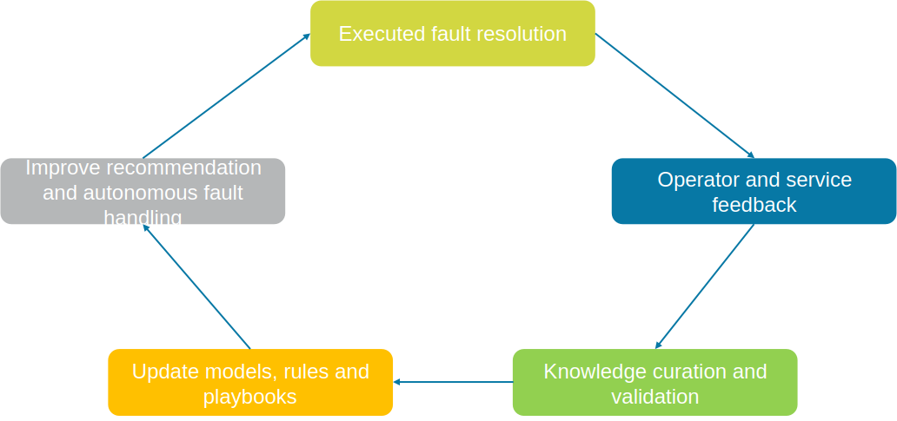

<!--
Copyright(c) 2026 Contributors to the Eclipse Foundation

See the NOTICE file(s) distributed with this work for additional
information regarding copyright ownership.

This work is made available under the terms of the
Creative Commons Attribution 4.0 International (CC-BY-4.0) license,
which is available at
https://creativecommons.org/licenses/by/4.0/legalcode.

SPDX-License-Identifier: CC-BY-4.0
-->

import Kit3DLogo from '@site/src/components/2.0/Kit3DLogo';

<Kit3DLogo kitId="autonomous-operation" />

## Overall Description

The goal of the learning phase, following error handling, is to systematically capture and store situation-related information to enrich data with metadata and contextual knowledge. Standardized descriptions of fault correction strategies are created to enable automated recovery in a consistent manner. These strategies are shared via the MX-Port concept and form a knowledge base for deriving required actions and parameters. The Asset Administration Shell is used as the standardized model, while historical execution data is recorded in CorrectionLogs to document past strategies, outcomes, and execution details, supporting continuous learning and improvement of future fault handling.

## Role Description

| Role | Description |
| ---- | ----------- |
| Machine Operator | The **Machine Operator** acts as the central coordinating entity within the production environment. In addition to operating the machine,  the machine operator is responsible for deploying and managing the Remote Operation Service and providing the Remote Service Operators (RSOs). In this role, the machine operator ensures that all relevant data sources—such as situation logs (1), operational data, and execution feedback—are properly collected, aggregated, and made available within the data space. Furthermore, the machine operator contributes feedback on the effectiveness of corrective actions from an operational perspective, ensuring that real production conditions are reflected in the learning process.|
| Remote Service Operator | The **Remote Service Operator (RSO)** is responsible for documenting and validating the troubleshooting process. Based on their expertise  and system interaction, the RSO refines and evaluates the applied corrective strategy (5), including its parametrization and execution behavior. The RSO provides structured feedback on decision-making, execution outcomes, and potential improvements, contributing directly to the formalization and standardization of fault correction strategies.|
| On-Site Technician | The **On-Site Technician**, if involved, complements the remote troubleshooting process by documenting manual interventions required for  fault resolution. This includes hardware-related issues, physical repair steps, and environmental conditions that may not be captured digitally. These insights are particularly relevant for identifying limitations of remote or automated strategies and improving their robustness.|
| AI Service Provider | The **AI Service Provider** contributes analytical feedback based on the system’s performance during the troubleshooting process. This  includes evaluation of recommendation quality, ranking effectiveness, and potential inaccuracies in similarity analysis (2). The insights are used to improve model performance and enhance future recommendations.|
| Knowledge Management Provider | The **Knowledge Management Provider** serves as the central entity for integrating and managing all collected knowledge artifacts. It  consolidates feedback from operators, AI services, and system data into structured representations, including refined symptom descriptions (3), updated fault descriptions (4), and improved correction strategies (5). Additionally, it ensures proper indexing, versioning, and availability of knowledge within the data space to support reuse and continuous system learning.|
| ERP/MES Provider | The **ERP/MES Provider** contributes operational outcome data related to executed corrective actions. This includes information on spare  part procurement, service execution, production rescheduling, and overall recovery performance. By linking these outcomes to specific fault cases and correction strategies, the ERP/MES system enables a comprehensive evaluation of effectiveness and supports data-driven optimization of future fault handling processes.

## Semantic Models

Same as in [Error Handling](error-handling-phase.md).

## Processes

### System for acquiring feedback from machine fault handling trough dataspace components

Every troubleshooting event should end with a feedback capture step. The operator records which recommendation was chosen, what was executed, how long it took, whether follow-up actions were necessary and whether the outcome solved the problem. Enterprise systems and on-site technicians add factual outcome data such as replacement confirmation or restored order flow.

#### Functional Requirements

Documentation

- The solution SHALL capture selected action, execution path, outcome, duration and follow-up measures for each resolved case.
- The solution SHALL allow structured operator comments and reason codes rather than relying only on free text.
- The solution SHALL support delayed updates when field outcomes become known after the initial recovery.

Data quality

- The solution SHALL separate raw feedback capture from curated reusable knowledge.
- The solution SHALL preserve the provenance of each contribution.

## NOTICE

This work is licensed under the [CC-BY-4.0](https://creativecommons.org/licenses/by/4.0/legalcode).

- SPDX-License-Identifier: CC-BY-4.0
- SPDX-FileCopyrightText: 2026 DMG MORI AG
- SPDX-FileCopyrightText: 2026 Empolis Information Management GmbH
- SPDX-FileCopyrightText: 2026 IFW Leibniz Universität Hannover
- SPDX-FileCopyrightText: 2026 inovex GmbH
- SPDX-FileCopyrightText: 2026 prenode GmbH
- SPDX-FileCopyrightText: 2026 proALPHA GmbH
- SPDX-FileCopyrightText: 2026 Siemens AG
- SPDX-FileCopyrightText: 2026 Technologie-Initiative SmartFactory KL e. V.
- SPDX-FileCopyrightText: 2026 TRUMPF Werkzeugmaschinen SE + Co. KG
- SPDX-FileCopyrightText: 2026 VDMA e. V.
- SPDX-FileCopyrightText: 2026 WITTENSTEIN SE
- SPDX-FileCopyrightText: 2026 Contributors to the Eclipse Foundation
- Source URL: [https://github.com/eclipse-tractusx/eclipse-tractusx.github.io](https://github.com/eclipse-tractusx/eclipse-tractusx.github.io)
