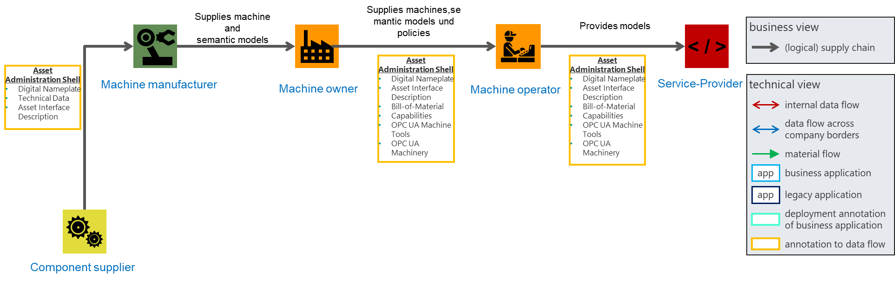
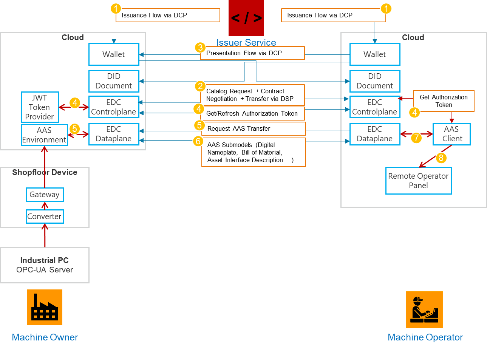

<!--
Copyright(c) 2026 Contributors to the Eclipse Foundation

See the NOTICE file(s) distributed with this work for additional
information regarding copyright ownership.

This work is made available under the terms of the
Creative Commons Attribution 4.0 International (CC-BY-4.0) license,
which is available at
https://creativecommons.org/licenses/by/4.0/legalcode.

SPDX-License-Identifier: CC-BY-4.0
-->

import Kit3DLogo from '@site/src/components/2.0/Kit3DLogo';

<Kit3DLogo kitId="autonomous-operation" />

## Overall Description

During onboarding, the **Machine Builder** delivers the machine to the **Machine Owner**, provides a **Type Asset Administration Shell (AAS)**, and enables the transmission of **OPC UA signals according to Companion Specification** as well as the publishing of faulty situations according to AAS events while ensuring the machine is prepared for remote controllability and managed operation of required software components. The **Machine Owner** purchases the machine and may commission a **Machine Operator** to remotely manage and maintain it, keeping **On-Site Technicians** available for physical interventions (e.g., part replacements) that do not require manufacturer service. The **Machine Operator** sets up the managed system for running software components, coordinates **AI Service Providers, Component Suppliers**, and **Remote Service Operators** (declared as Service-Provider in Figure) for remote troubleshooting and service orchestration, while a **Knowledge Management Provider** captures and stores existing machine knowledge about fault situations for reuse and sharing.

## Role Description

| Role | Description | Relevant dataspace activities in this phase |
| ---- | ----------- | -------------------------------------------- |
| Machine Builder| Delivers the machine to the machine owner. Provides a Type Asset Administration Shell (AAS) and enables transmission of Companion Specification OPC UA signals from the machine.| Modelling data space relevant assets in an interoperable way|
| Machine Owner| Purchases the machine from the machine builder. May commission a machine operator immediately after purchase or later to remotely manage and maintain the machine. Provides on-site technicians for tasks such as part replacements that do not require manufacturer service.| Define usage and access policies for data that is needed for the service|
| Machine Operator| Receives the mandate from the machine owner to remotely manage the machine. Orchestrates services from service providers and component suppliers. Compares existing services at the machine owner's site with required services. Provides remote service operators to troubleshoot the machine remotely.| Discovery of Services, Modelling troubleshooting knowledge from the Remote Service Operator in an interoperable way, Making data available for the service in the dataspace|
| Component Supplier| Supplies components and related services that are integrated into the overall machine operation and maintenance process.| Modelling data space relevant assets in an interoperable way|
| Remote Service Operator| Employed by the machine operator to remotely troubleshoot and resolve machine issues without being physically on-site. Possesses the necessary machine expertise and know-how. Can be from the machine builder or external sources (for example, technicians with long-term on-site experience with the machine).| |
| On-Site Technician| Provided by the machine owner to perform physical tasks such as part replacements that do not require manufacturer service.| |
| Knowledge Management Provider| Enables the capture, storage, and sharing of knowledge  for relevant data space participants.| Locate, index, and utilize knowledge |

## Semantic Models

| Semantic models used in this phase | Necessity | Roles publishing the model | Roles consuming the model | Purpose |
| ---- | ---- | ---- | ---- | ---- |
| **Digital Nameplate** | Reqiured | Machine Builder   Component Supplier | Machine Owner   Machine Operator| Digital Nameplate (v3.0.1 - IDTA 02006 Digital Nameplate for Industrial Equipment) is provided by the machine builder/ component supplier to supply identifying, descriptive and indicating information about an asset. |
| **Bill-of-Material** | Reqiured | MachineBuilder   ComponentSupplier| MachineOwner   MachineOperator| Hierarchical Structures enabling Bills of Material (v1.1.1 - IDTA 02011 Hierarchical Structures enabling Bills of Material) is provided by the machine builder/ component supplier. Industrial equipment may be provided by partners in the value chain and can be composed of subsystems. These subsystems may provide own monitoring data that is necessary to ensure autonomous operation. Bill-of-Material is used to discover self-managed entities of a top-level device. For example, a partner may provide cameras for a machine. Bill-of-Material allows to discover these devices and to retrieve additional data from.|
| **Asset Interfaces Description** | Reqiured | Machine Builder   Component Supplier| Machine Owner   Machine Operator| Asset Interfaces Description (v1.0 - IDTA 02017-1-0 Asset Interfaces Description) is provided by the machine builder to allow readable information about the interface belonging to the asset. Based on this information it is possible to initiate a connection and start to request, subscribe or perform operations. Such information contains metadata and respective endpoints. For example, a machine owner/ machine operator can use this information to connect to a server (e.g. OPC UA) and interpret the data as well as establish a connection to a service provider. |
| **Symptoms** | _Optional_ | Machine Builder   Component Supplier| Machine Owner   Machine Operator| Symptom Description is provided by the machine builder/ component supplier to describe the observed symptoms of faults that have already occurred and allows them to be modeled independently, as they may appear multiple times in different constellations, situations, or across various hardware components. |
| **Fault Descriptions** | _Optional_ | Machine Builder   Component Supplier| Machine Owner   Machine Operator| Fault Description is provided by the machine builder/ component supplier that contains the detailed description of the fault itself, including its contextual information, and references the associated symptoms without duplicating their data. |
| **Capabilities** | _Optional_ | Machine Builder   Component Supplier| Machine Owner   Machine Operator| Capabilities are provided by the machine builder/ component supplier to describe, in an abstract manner, what the machine is capable of performing. This information enables the machine owner to derive appropriate operational strategies or actions, supporting flexible and autonomous operation. |
| **Technical Data** | _Optional_ | Machine Builder   Component Supplier| Machine Owner   Machine Operator| Technical Data is provided by the machine builder/ component supplier that contains machine configuration, parameters, and technical specifications used for diagnostics, validation, and parameter verification. |
| **Handover Documentation** | _Optional_ | Machine Builder   Component Supplier| Machine Owner   Machine Operator| Handover Documentation is provided by the machine builder/ component supplier contains commissioning data, setup information, and operational instructions. It is used to understand system configuration and operational constraints. |
| **Material Data** | _Optional_ | Machine Builder   Component supplier| Machine Owner   Machine Operator| Material Data is provided by the machine builder/ component supplier contains information about the material of the part to be manufactured (e.g., type, properties, batch). |

The required semantic models are utilized by the Machine Operator to establish a connection to machine data as well as third-party Component Suppliers. The optional semantic models may provide additional information for the machine and the machine context depending on how much knowledge the Machine Operator has.

## Processes

### Modelling data space relevant assets in an interoperable way

#### Machine Builder (OEM)

The machine builder is responsible for defining and maintaining the semantic model of machine-level data required by:
    - the machine operator (e.g., production control, status monitoring, OEE-relevant signals), and
    - service providers (e.g., remote diagnostics, predictive maintenance, troubleshooting).

This includes:
    - identifying which signals, events, and contextual metadata are needed (e.g., machine state, alarms, energy consumption, job context),
    - structuring them using interoperable standards such as OPC UA Information Models and/or Asset Administration Shell (AAS) submodels,
    - ensuring consistent naming, units, timestamps, and reference semantics,
    - documenting access patterns (e.g., topics, endpoints, available fields) so that external parties can consume the data reliably.

The OEM is responsible to translate “internal machine data” into a standardized, reusable digital contract of meaning.

#### Component manufacturer (including sensor suppliers)

Component and sensor suppliers must provide component-level data models that can be integrated into the machine-level view. Their responsibility is to model the data needed for:

- the machine operator (e.g., calibration state, health indicators, status codes), and
- service providers (e.g., sensor drift detection, condition monitoring, error signatures).

This requires:

- delivering companion-spec compliant or otherwise standardized semantic descriptions of sensor signals,
- defining interfaces and metadata such as sampling rate, accuracy, operating limits, and failure modes,
- enabling traceability from component signals to machine functions (so downstream services can interpret the data correctly).

Without this, the machine builder would need to “reverse engineer” component semantics, which prevents scalable interoperability.

#### Enabling dataspace access via MX-Port Hercules and Orion

With MX-Port Hercules and Orion, data originating from OPC UA and AAS can be made available to external parties through the dataspace in a controlled way. Since a lot of machine owners are currently using OPC UA, the MX-Port Orion enables an easy to implement extension based on the existing tech-stack.

Concretely, the solution enables:

- extraction/forwarding of machine data from the shopfloor layer,
- optional transformation into interoperable representations (e.g., Companion Specifications, AAS submodels),
- publication of data as dataspace assets via a connector, so consumers can discover and request access through the standard dataspace workflow (catalog → negotiation → transfer).

This bridges the typical gap between highly protected shopfloor networks and cross-company data sharing.

#### Machine operator as data provider to service providers

The machine operator (or machine owner, depending on governance) must ensure that the relevant data becomes accessible for authorized service providers in the dataspace.

This includes:

- connecting the available machine data sources to the dataspace connector,
- publishing the data as assets with clear metadata (what it is, which topics/fields exist, which semantics apply),
- enabling the standard dataspace processes (discovery, contract negotiation, transfer),
- ensuring operational stability (availability, monitoring, lifecycle management).

In practice, the operator becomes the “publisher” who makes the data consumable for maintenance, optimization, and service use cases.

#### Policy integration and governance (machine owner requirements)

A key requirement is that the operator must integrate and enforce the policies defined by the machine owner (or the party owning the data rights).

This typically includes:

- usage restrictions (e.g., “use only for maintenance”, “no redistribution”, “limited time window”),
- role- and certification-based access control (e.g., only certified service providers),
- constraints on topics/fields (data minimization),
- auditability requirements (logging, traceability).

These rules are embedded into the dataspace workflow through policy definitions and contract agreements, ensuring that service providers can only access data under agreed conditions.

#### Prerequisite: interoperable data from suppliers and manufacturers

Before the operator can share data effectively in a dataspace, the upstream stakeholders must ensure that their data is provided in an interoperable and semantically well-defined form.

This means:

- component suppliers provide standardized component semantics,
- the machine builder integrates these into a consistent machine model,
- the result is published via OPC UA and/or AAS with reliable interpretation across organizations.

Only then can service providers build scalable solutions without custom integration per machine, supplier, or site.

### Controlled Access to Shopfloor Data in Dataspaces

To share data between different stakeholders, shopfloor data relies on strict IT security mechanisms. For many machine operators, it is therefore not possible to access the shop floor network directly from outside their own company network. For this reason, it is necessary to transfer the relevant machine data to a middle way layer that can be accessed by authorized participants. For different purposes either MX-Port Hercules or MX-Port Orion may provide a more suitable solution for different Use Cases. While MX-Port Orion focuses on raw shop-floor data, MX-Port Hercules is more suitable to analyze fault data. The following figures explain how to share shop-floor data according to the MX-Configurations Orion and Hercules.

#### MX-Port Hercules

MX-Port Hercules serves as the foundation for asset discovery. It provides nameplate information, bills of materials, and formal asset interfaces descriptions that enable a clear understanding of the machine and the component relationships. In addition to structural and semantic data, MX-Port Hercules also supplies known fault information, which forms the basis for defining robust fault detection and recovery strategies. By combining asset structure with historical and predefined fault knowledge, it supports systematic troubleshooting and resilience planning. for fetching fault relevant data and third party services associated with the machine.

Building on this structured asset layer, Asset Interfaces Description allows to discover additional machine information, like camera streams or real-time machine data accessible with MX-Port Orion. While MX-Port Hercules focuses on asset discovery and contextual knowledge, MX-Port Orion complements this by providing operational data.

#### MX-Port Orion

To ensure semantic interoperability of the provided data, it must be transformed into a standardized format. In the context of OPC UA, this is achieved through so-called Companion Specifications, which provide a domain-specific semantic description of machine data. The corresponding data transformation can, for example, be performed via a central shopfloor device that acts as a gateway between the machine level and the cloud. The process is illustrated in the following figure.

#### Functional Requirements

Access & Session Management:

- The system SHALL authenticate remote operators before granting access.
- The system SHALL establish a secure remote session for operator interaction.

Required System Interactions:

- The system SHALL allow remote operators to access machine data (real-time and historical).
- The system SHALL allow remote operators to access relevant remote services (e.g., erp,mes, machine programming tools, video-streams, knowledge management).

Remote Monitoring:

- The system SHALL provide remote access to real-time machine telemetry.
- The system SHALL provide access to historical operational data.
- The system SHALL expose current machine state (e.g., mode, status, active process).
- The system SHALL display active alarms, warnings, and fault conditions.
- The system SHALL provide visibility into subsystem-level health information.
- The system SHALL allow filtering and querying of machine data.
- The system SHALL log operational events and state changes.

Remote Diagnosis:

- The system SHALL allow a remote operator to inspect logs and diagnostic data.
- The system SHALL provide access to configuration parameters relevant for troubleshooting.
- The system SHALL allow comparison of current vs. expected system states.
- The system SHALL support retrieval of error codes and detailed fault descriptions.

## NOTICE

This work is licensed under the [CC-BY-4.0](https://creativecommons.org/licenses/by/4.0/legalcode).

- SPDX-License-Identifier: CC-BY-4.0
- SPDX-FileCopyrightText: 2026 DMG MORI AG
- SPDX-FileCopyrightText: 2026 Empolis Information Management GmbH
- SPDX-FileCopyrightText: 2026 IFW Leibniz Universität Hannover
- SPDX-FileCopyrightText: 2026 inovex GmbH
- SPDX-FileCopyrightText: 2026 prenode GmbH
- SPDX-FileCopyrightText: 2026 proALPHA GmbH
- SPDX-FileCopyrightText: 2026 Siemens AG
- SPDX-FileCopyrightText: 2026 Technologie-Initiative SmartFactory KL e. V.
- SPDX-FileCopyrightText: 2026 TRUMPF Werkzeugmaschinen SE + Co. KG
- SPDX-FileCopyrightText: 2026 VDMA e. V.
- SPDX-FileCopyrightText: 2026 WITTENSTEIN SE
- SPDX-FileCopyrightText: 2026 Contributors to the Eclipse Foundation
- Source URL: [https://github.com/eclipse-tractusx/eclipse-tractusx.github.io](https://github.com/eclipse-tractusx/eclipse-tractusx.github.io)
