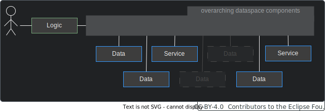

  

  

  

Behaviour Twin KIT
  

## BASIC ARCHITECTURE

### OVERVIEW

A use case consists of data and calculation services. In addition, a logic is required, that defines how data and services must interact to produce the desired result. This logic is called "skill". It must be invoked directly or indirectly by the consumer.

Data and services are federated over the dataspace:

A use case may consist of multiple data source and calculation service:

### ROLES

Each participant in a Behaviour Twin use cases applies to one or more of the following roles:

- **consumer** (result requester)
- **skill provider** (provider of the use case logic)
- **data provider** (provider of usage data, likely an OEM)
- **delegator** (delegates data to calculation services, likely a supplier of a component that
  is assembled of subcomponents which are providing calculation services)
- **calculation service provider** (likely a supplier of a part or component)

## DETAILED ARCHITECTURE

### BUSINESS PROCESS

In Behaviour Twin use cases, the fist step into the federated logic is usually the data provider. There, dependencies of the targeted vehicle or component are known. Therefore, registring predefined skills at the data provider is preferred. Such skills then can be initiated by external partners as well as internally.

0. **0.1 Register skill asset, 0.2 sync federated catalog:**   The predefined skill is registered as an asset at the data provider's EDC connector. The federated catalogs are synchronized periodically.

1. **Invoke skill asset:**   The consumer invokes the skill by calling the agents API at its own EDC connector. The partner's EDC connector 
address must be known. To resolve this address is up to the use case. A prognosis function result type and a component or vehicle id (e.g. VIN) is set as parameter for the skill.

2. **Request skill asset:**   The skill is invoked by requesting the skill asset at the data provider via EDC connectors.

3. **Resolve prognosis function assets by requested result type:**   The Knowledge Agent resolves all prognosis function assets from the federated catalog that matches the desired result type.

4. **Resolve prognosis data assets by function parameter types:**   The Knowledge Agent resolves all data assets by the parameter types of the previously matched prognosis function(s).

5. **Fetch data:**   The data (parameter for prognosis functions) are fetched from the data provider's bound data source. They are transferred into graph representation by a provisioning agent (data binding agent).

6. **Transfer data and deploy sub-skill:**   The fetched data and a sub-skill (logic for calling the calculation service) are transferred to the calculation service provider's Knowledge Agent via EDC connectors.

7. **Calls service and fetch result:**   The calculation service (prognosis functions) is called. The data (parameter for the prognosis function) are translated into the format the service requires. This is automatically done by an remoting agent (service binding agent), which is statically configured by service bindings. The result of the service then is translated back into graph format by the remoting agent.

8. **Return result:**   The result is transferred to the invoker of the sub-skill (here, it is the data provider) via EDC connectors.

9. **Delegate result:**   The result is delegated to the consumer via EDC connectors.

To have a common understanding of how to interpret and translate elements in the graph, common ontologies and taxonomies must be used. These are also needed for the interpretation of skills and sub-skills as there is e.g. inheritance in ontologies which must be known by the Knowledge Agent to resolve relations.

### BUILDING BLOCK COMPONENTS

#### USE CASE SPECIFIC COMPONENTS

|Subsystem|Description|
|---------|-----------|
|Data Consuming App|This component is the app that is hosted at the *consumer* and provides the end user interface.|
|Usage Data|A data source at the *data provider* that provides usage data that are required for prognosis services.   It can be accessed by the Knowledge Agent via data bindings.|
|Calculation Service|A calculation service at the *service provider*. It accepts input data from federated data sources, calculates the result values and returns them.|

#### KNOWLEDGE AGENT COMPONENTS

|Subsystem|Description|
|---------|-----------|
|Matchmaking Agent|This component supports SparQL (skills/sub-skills) to traverse the federated data space as a large data structure. It interacts with the EDC connector.   A **provider's Matchmaking Agent** will be activated by its EDC connector. Therefore, the EDC must offer a Graph Asset (variant of ordinary data assets in the related Catena-X standards).   A **consumer's Matchmaking Agent** interacts with its EDC to negotiate and perform the transfer of sub-skills to other dataspace participants.   The Matchmaking Agents are matching the (sub-)graphs and negotiate appropriated graph assets with the partner EDCs.|
|Binding Agent|The Binding Agent is a restricted version of the Matchmaking Agent (subset of OWL/SparQL, e.g., without federation) which is just focused on translating Sub-Skills of a particular business domain (Bill-Of-Material, Chemical Materials, Production Sites, etc.) into proper SQL- or REST based backend system calls.  Binding agents for data bindings are called **Provisioning Agent**.  Binding agents for service bindings are called **Remoting Agent**. |
|Binding|A Binding is part of the configuration of a Binding Agent. It defines the binding (translation form/into graph representation) for specific data/service instances.|
|Ontology|The ontology is a formal representation of knowledge that captures concepts, relationships, and properties. It allows a shared understanding and reasoning about the respective domain.   It must be hosted in a way that all participants can access it.|
|Skill/Sub-Skill|The Skill describes, what to do (which data have to be connected, transferred, processed ...).|

#### CATENA-X CORE SERVICES (EXCEPT KNOWLEDGE AGENT COMPONENTS)

|Subsystem|Description|
|---------|-----------|
|EDC connector|The Connector of the Eclipse Dataspace Components (EDC) provides a framework for sovereign, inter-organizational data exchange. It implements the International Data Spaces standard (IDS) as well as relevant protocols associated with GAIA-X. The connector is designed in an extensible way in order to support alternative protocols and integrate in various ecosystems.|

A more detailed a more detailed view of how the Knowledge Agent works is given in the section [Knowledge Agent](./knowledge-agent) (which comes next to this section).

## USE CASE TYPES

In general view, use cases can be categorized dependent on specific criteria:

- general use case type
- origin of query
- origin of data-processing logic

Depending on these criteria, the use case architecture, graph assets and skills must be adapted. Detailed information about how to write dedicated skills can be found in the [Agents KIT](../../knowledge-agents/adoption-view/intro).

### GENERAL USE CASE TYPES

- The *data provider* is also *consumer*. It must implement and invoke the logic (skill).
- An *external consumer* wants to invoke the logic (skill). It can – if granted by a *framework agreement* – implement and invoke its own logic (skill) on foreign data and services.
- A *third part*y implements the logic (skill) and offers it to a *consumer*. A *framework agreement* must exist that allows the execution of such a skill.

### ORIGIN OF QUERY

- *Usage data provider* (like OEMs) query calculation services of IP owners (like suppliers) along the supplier chain.
- *Third party providers of an end-user service* (like automobile clubs) gather data or insights along the supplier chain in behalf of their customers.

### ORIGIN OF DATA-PROCESSING LOGIC

- The querying party utilizes its own processing logic (calculation service). It wants to query input data from a *data provider*.
- The querying party wants to process its own data with a calculation service at a *calculation service provider*.
- The querying party has no (or not all) data and calculation services. It wants to utilize data and services form *data* and *calculation service providers*.
