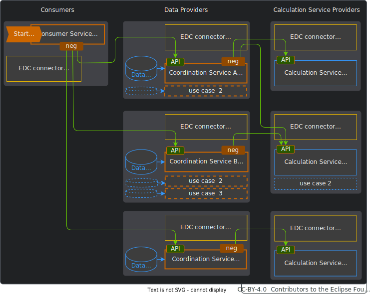
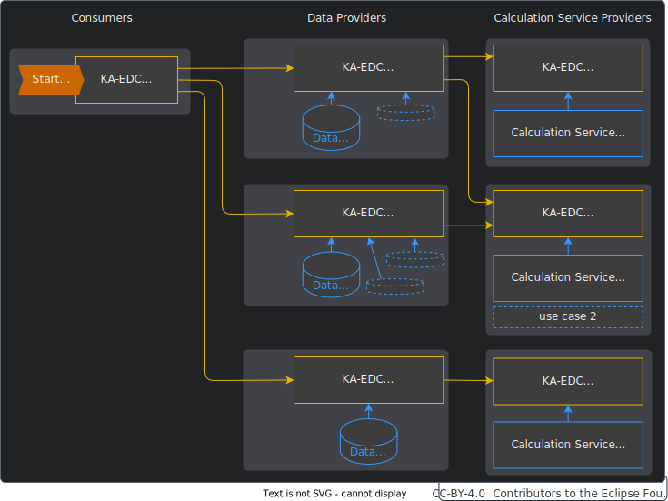

---
id: introduction
title: Introduction
description: Behaviour Twin KIT
---

  

  

  

Behaviour Twin KIT
  

*This section provides a quick overview over the KIT's scope, its direction and how you can benefit from using it for your own applications and use cases.*

## VISION & MISSION

### VISION

Aggregating real-world usage data of technical products is state-of-the-art. But only by combining this data with digital twins, simulation models and specialized calculation services, new business opportunities and operational efficiencies become possible across the entire product lifecycle. The key to successfully enabling these opportunities is the efficient scalability of digital solutions, their extension across business boundaries and handling data protection and governance.

### MISSION

The Behaviour Twin KIT aims to facilitate the development of scalable and interoperable solutions for connecting service customers, data providers and service providers across organizational boundaries in a generic way. The KIT allows a Behaviour-Twin-oriented entry to state-of-the-art Knowledge Agent technology. It guides business and software developers by explaining key concepts and by directing them to relevant technical resources and examples.

## STATUS QUO & CHALLENGE

### STATUS QUO

Within company limits, the aggregation of usage data, monitoring them, e.g. by calculation of health indicators or component damage based on internally available data and models, is already state of the art. However, across company boundaries, there are only individual, complex and not generally available solutions. Often, additional use cases or  participants require repetitive efforts to implement instances for connecting data and calculation services.

### TODAY'S CHALLENGE

Thus, the following challenges must be addressed:

- correctly allocating component data and calculation service across organizational boundaries
- ensuring data compliance across complex supply chains
- enabling secure data sharing while respecting IP and governance
- fulfill high data sovereignty standards
- facilitating flexible customization for diverse use cases
- reduce effort for additional use cases and participants

## USE CASE EXAMPLES

Typical scenarios comprise stakeholders acting during a certain phase in the product lifecycle:

- **OEM, TIER-X @ Early product development phase:** Components can be optimally designed using digital prototypes and simulations based on usage data and models.

- **OEM, TIER-X @ Offer phase:** Suppliers can enhance their products with value-added services like health monitoring and remaining useful life calculation making them more attractive for their customers.

- **OEM, TIER-X @ Usage phase:** Precise monitoring of product health and residuals value helps enable predictive maintenance, optimized operations and end-of-life decision making.

- **Car dealers and automotive clubs @ usage phase:** Further interpreting the Remaining Useful Life calculation for a vehicle evaluation and offer it as vehicle-related services for their end customers and fleet operators.

- **Car dealers and automotive clubs @ Recycling phase:** An accurate residual value analysis allows optimal dismantling, reuse and recycling.

## BENEFITS

In summary, building a use case upon the Behavior Twin KIT accelerates development, ensures compliance, facilitates collaboration, unlocks business value, and creates business benefits across the product lifecycle.

### BENEFITS IN MORE DETAILS

- Enables scalable and interoperable solutions for connecting different stakeholders like service customers, data providers, and service providers across organizational boundaries. This allows for collaboration and data sharing.

- Enables stakeholders to optimize components, enhance products with value-added services, enable predictive maintenance, and make better end-of-life decisions. This leads to cost savings and sustainability.

- Facilitates the development of solutions for aggregating real-world usage data of technical products and combining it with digital twins, simulation models, and specialized calculation services. This unlocks new business opportunities and operational efficiencies.

- Supports handling data protection, governance, IP rights, and high data sovereignty standards when enabling secure data sharing across complex supply chains. This ensures compliance and builds trust.

- Offers guidance to Knowledge Agent technology. This enables efficient scalability for additional use cases and participants.

- Guides business and software developers by explaining key concepts and directing them to relevant technical resources and examples. This speeds up understanding and development.

### REDUCING AND SHIFTING COMPLEXITY

#### APPROACH WITHOUT KNOWLEDGE AGENT

Many Behaviour Twin use cases start with collecting usage data and send them to a calculation service. Without generalized components, there would be a huge effort:

**For each use case at each participating *data provider***, a dedicated and complex *Coordination Service* must be developed, deployed and maintained. This service contains the overarching logic (how to link usage data and calculation services to produce the desired results), fetches usage data, negotiates contracts over EDC and calls (different) APIs of calculation services at the the *Service Providers*. For this process, negotiation of contracts over EDC must also be handled by the Coordination Services. Because of different input parameters of different calculation services, for every link there must be a dedicated implementation.

There are a big varey of compinations. For small use cases, the efford wourd be to high to establisch those complex Coordination Services.

Even more complexity comes in when there are more use cases, more than one data source for one calculation or more than one calculation services to get one result (for one request).

#### APPROACH WITH KNOWLEDGE AGENT

A generalization with the help of the *Knowledge Agent* technology leads to a lower complexity:

This approach shifts complexity to the Knowledge Agent (KA-EDC), which is a well developed set of components and deployed only once for a set of use cases. All the Coordination Services, API calls and explicit negotiations can be omitted. Instead, data and calculation services are bound to the *Knowledge Graph* and formal described in *graph assets* at the EDCs. By defining usage policies for those graph assets, the *Knowledge Agent* negotioates contracts and organizes data exchange automatically. This has not to be implemented by a separate services any more.

#### COMPARISON

| without Knowledge Agent | with Knowledge Agent |
| --- | --- |
| *Consumers* must negotiate contracts with the *data providers*. | Negotiation is done by the *Knowledge Agent*. |
| *Consumers* call the logic at data provider through APIs of the *Coordination Services*. *Data providers* define/implement the logic per use case. | *Consumer* define the logic (*skills*) and invoke it. |
| *Data providers* maintain *Coordination Services* to dispatch the consumers' requests. This services are fetching data, negotiationg constracts with the *service providers*, calling the service providers' APIs and delegating the results back to the requesting *consumers*. | *Data providers* bind their data to the *knowledge graph* through static configuration files. The rest is done by the *Knowledge Agent*. |
| *Service providers* expose their services' APIs. | *Service providers* dont expose their services' APIs, but bind the services  to the *knowledge graph* through static configuration fils. The input and output parameters are formally described, so that the *Knowledge Agent* can do the rest. |
